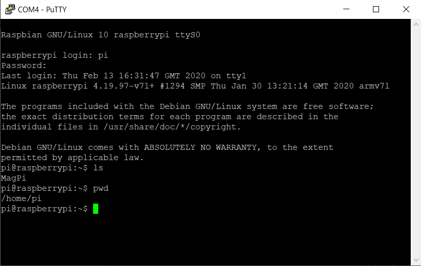

*Chapter Top* [Chapters[0]: Introduction](chapter0.md)  |  *Next Chapter* [Chapters[1]: Hello, Cheesecake!](../chapter01/chapter1.md)  
*Previous Page* [Prerequisites](prerequisites.md)  |  *Next Page* [Chapters[1]: Hello, Cheesecake!](../chapter01/chapter1.md)

## Getting Started

In this section, we will hold hands as we stroll through the initial setup for CheesecakeOS following these steps:

1. [Launch an AWS EC2 instance](#launch-an-aw2-ec2-instance)
2. [Fork/clone the CheesecakeOS repo](#forkclone-the-cheesecakeos-repo)
3. [Setup docker](#setup-docker)
4. [Image SD card with Raspberry Pi OS](#image-sd-card-with-raspberry-pi-os)
5. [Replace Raspberry Pi binary boot files](#replace-raspberry-pi-binary-boot-files)
6. [Enable the Mini UART in Raspberry Pi config.txt](enable-the-mini-uart-in-raspberry-pi-configtxt)
7. [Install USB to UART Drivers](#install-usb-to-uart-drivers)
8. [Connect Raspberry Pi Mini UART to computer through USB](#connect-raspberry-pi-mini-uart-to-computer-through-usb)
9. [Login to your Raspberry Pi through the console](#login-to-your-raspberry-pi-through-the-console)

#### Launch an AWS EC2 instance

This step is not required, especially if you have Debian Linux already. Otherwise, this can help sort out the environment. Head over to the [AWS EC2 Get Started Tutorial](https://docs.aws.amazon.com/AWSEC2/latest/UserGuide/EC2_GetStarted.html). If you decide to launch an instance, I recommend you choose from the free tier eligible 64-bit x86 Ubuntu options. Afterwards, connect to your instance, setup your ssh key from the host in github, and continue to step [2](#forkclone-the-cheesecakeos-repo).

#### Fork/Clone the CheesecakeOS Repo

Since you are reading this, you already know where the [CheesecakeOS](https://github.com/jmielkeway/ccos4rbpi_volume0) repo is located, so go ahead and clone it (or your fork of it):

```bash
ccos4rbpi:~$ git clone git@github.com:jmielkeway/ccos4rbpi_volume0.git
Cloning into 'ccos4rbpi_volume1'...
remote: Enumerating objects: 109, done.
remote: Counting objects: 100% (109/109), done.
remote: Compressing objects: 100% (76/76), done.
remote: Total 109 (delta 37), reused 74 (delta 18), pack-reused 0
Receiving objects: 100% (109/109), 39.18 KiB | 7.84 MiB/s, done.
Resolving deltas: 100% (37/37), done.
```

#### Setup Docker

If you want to use the `build.sh` scripts included in each code directory, which use a docker container to manage the build environment, run the `setup-docker-aws.sh` script from the top level of the repository. This *_will_* install docker! It will also setup the ubuntu user as a member of the docker group. Root privileges are required.

```bash
ccos4rbpi:~$ ./setup-docker-aws.sh
```
\*\*\*  
\*\*\*  
\*\*\*  
```bash
Hello from Docker!
This message shows that your installation appears to be working correctly.

To generate this message, Docker took the following steps:
 1. The Docker client contacted the Docker daemon.
 2. The Docker daemon pulled the "hello-world" image from the Docker Hub.
    (amd64)
 3. The Docker daemon created a new container from that image which runs the
    executable that produces the output you are currently reading.
 4. The Docker daemon streamed that output to the Docker client, which sent it
    to your terminal.

To try something more ambitious, you can run an Ubuntu container with:
 $ docker run -it ubuntu bash

Share images, automate workflows, and more with a free Docker ID:
 https://hub.docker.com/

For more examples and ideas, visit:
 https://docs.docker.com/get-started/
```

After the script completes and prints out the docker hello-world message, log out, and then log back in for the docker group setting to take effect. Finally, build the ccos4rbpi image:

```bash
ccos4rbpi:~$ docker build -t ccos4rbpi -f Dockerfile .
```

After the image is built, the `build.sh` scripts can be used to build the project(s).

#### Image SD Card with Raspberry Pi OS

Insert microSD card into computer. Open the Raspberry Pi Imager software. Select the RASPBERRY PI OS (32-BIT) option for the Operating System. Select the microSD card as the SD card. Click the WRITE button. This will write the OS to the card. At the same time, it will create the boot partition where we will ultimately place our own CheesecakeOS.

#### Replace Raspberry Pi Binary Boot Files

Unfortunately, different versions of the Raspberry Pi Bootloader have different start up side effects for the mini UART device (at least). So we will want to use a specific version of the Raspberry Pi boot files, not necessarily those that come with the latest image. Head on over to the Raspberry Pi Firmware GitHub repository, [with tag 1.20200512](https://github.com/raspberrypi/firmware/tree/1.20200512), and either clone or download a ZIP file. Copy the contents of the `boot` directory to the boot partition of the SD card, overwriting files with the same names. This will ensure we are working with a consistent, tested version of the bootloader, device tree, and startup files.

> Note: would like to remove the requirement for a specific version of the bootloader. See issue [#337](https://github.com/jmielkeway/ccos4rbpi_volume0/issues/337).

#### Enable the Mini UART in Raspberry Pi config.txt

After the image has been written to the SD card, open the config.txt file from the boot partition and set the `enable_uart=1` config as described in the [Raspberry Pi UART config documentation](https://www.raspberrypi.org/documentation/configuration/uart.md). When this step is complete, place the SD into the Raspberry Pi.

#### Install USB to UART Drivers

[Download and install the USB to UART drivers](https://www.silabs.com/developers/usb-to-uart-bridge-vcp-drivers). This assumes your serial cable has a CP210x chip. Other drivers for other chips can likely be found through [Google](https://www.google.com).

#### Connect Raspberry Pi Mini UART to Computer Through USB

Follow instructions from the [Connect the Lead section of this document](https://cdn-learn.adafruit.com/downloads/pdf/adafruits-raspberry-pi-lesson-5-using-a-console-cable.pdf). If you have issues, note that I personally have purchased cables with the TXD and RXD wires reversed (with TXD green and RXD white). The TXD wire should go next to the GND wire on the Pi's GPIO pins. Hopefully your wires are colored as in the guide. Personally, I have always powered the Raspberry Pi through USB, not the console lead. Note if you can see the `CP210x` chip's labels, the TXD and RXD represent the chip's point of view, and the opposite of the Raspberry Pi's labeling:

```
┌──────────────────────┐
│ RPI4 GPIO PINS       │
├───────────┬──────────┤
│  1 (3.3V) │  2 (5V)  │
├───────────┼──────────┤            ┌─────────────┐
│  3        │  4 (5V)  │            │ CP210x PINS │
├───────────┼──────────┤            ├─────────────┤
│  5        │  6 (GND) │◄──────────►│ GND         │
├───────────┼──────────┤            ├─────────────┤
│  7 (GND)  │  8 (TXD) │◄──────────►│ RXD         │
├───────────┼──────────┤            ├─────────────┤
│  9        │ 10 (RXD) │◄──────────►│ TXD         │
└───────────┴──────────┘            └─────────────┘
```

The subsequent section of the Adafruit console cable guide gives instructions for connecting to a terminal emulator. Do this.

#### Login to Your Raspberry Pi Through the Console

After connecting to the terminal emulator, login to the Raspberry Pi with username `pi` and password `raspberry`. If everything has gone right, and you are ready to move on to [Chapter One](../chapter01/chapter1.md), you will see something that looks like:



*Previous Page* [Prerequisites](prerequisites.md)  |  *Next Page* [Chapters[1]: Hello, Cheesecake!](../chapter01/chapter1.md)  
*Chapter Top* [Chapters[0]: Introduction](chapter0.md)  |  *Next Chapter* [Chapters[1]: Hello, Cheesecake!](../chapter01/chapter1.md)
