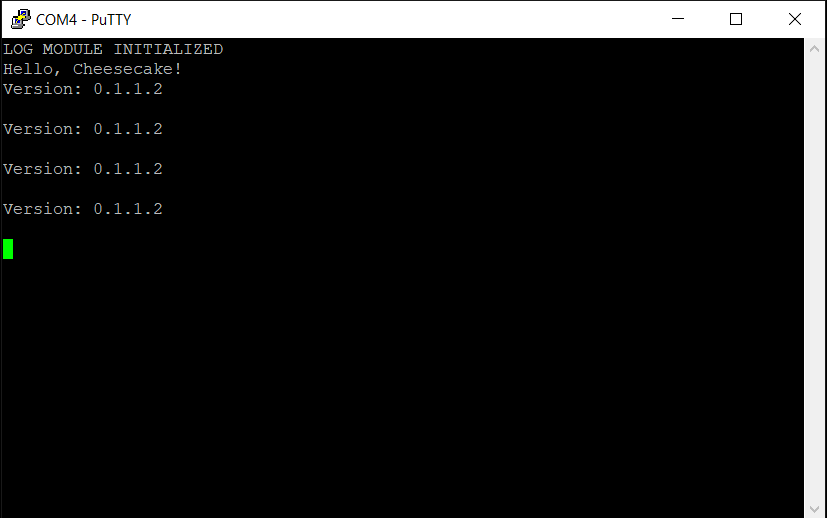

*Chapter Top* [Chapters[1]: Hello, Cheesecake!](chapter1.md)  |  *Next Chapter* [Chapters[2]: Processor Initialization and Exceptions](../chapter2/chapter2.md)  
*Previous Page* [Conventions and Design](conventions-design.md)  |  *Next Page* [Logging](logging.md)

## Building and Linking ([chapter1/code1](code1))

#### Building

While we do not want to dive too deep into Makefiles (GNU has their own excellent [documentation](https://www.gnu.org/software/make/manual/make.html)], we'll note a few features of the CheesecakeOS [Makefile](code1/Makefile) - for the love of the game.

```make
.phony := clean
ifeq (,$(filter $(phony), $(MAKECMDGOALS)))

ifndef ARCH
$(error ARCH is not specified)
endif

ifndef BOARD
$(error BOARD is not specified)
endif

endif
```
If either the ARCH or BOARD variables are not defined, and the target is not the phony `clean` target, Make will exit with an error.
```make
ARMCCC = aarch64-linux-gnu
CFLAGS = -Wall -nostdlib -nostartfiles -ffreestanding -mgeneral-regs-only
```
If you followed the AWS instructions in the [Getting Started](../chapter0/getting-started.md) Guide, and you selected an `x86` machine to develop on, you will be happy to know we are using the GNU `aarch64-linux-gnu` cross compiler. We tell the compiler only to use general registers, and also that we are compiling in a free-standing enviroment. There is no `C` library here. Any functionality we want we need to roll ourselves!
```make
BUILD_DIR = .build
LIB_DIR = $(BUILD_DIR)/libs

BOARD_SRC_DIR = arch/$(ARCH)/board/$(BOARD)/
BOARD_OBJ_DIR = $(BUILD_DIR)/board/
BOARD_C_FILES = $(wildcard $(BOARD_SRC_DIR)/*.c)
BOARD_S_FILES = $(wildcard $(BOARD_SRC_DIR)/*.S)
BOARD_OBJ_FILES = $(BOARD_C_FILES:$(BOARD_SRC_DIR)/%.c=$(BOARD_OBJ_DIR)/%_c.o) \
    $(BOARD_S_FILES:$(BOARD_SRC_DIR)/%.S=$(BOARD_OBJ_DIR)/%_s.o)
BOARD_INCLUDE_DIR = $(BOARD_SRC_DIR)/include/

ARCH_SRC_DIR = arch/$(ARCH)/
ARCH_OBJ_DIR = $(BUILD_DIR)/arch/
ARCH_C_FILES = $(wildcard $(ARCH_SRC_DIR)/*.c)
ARCH_S_FILES = $(wildcard $(ARCH_SRC_DIR)/*.S)
ARCH_OBJ_FILES = $(ARCH_C_FILES:$(ARCH_SRC_DIR)/%.c=$(ARCH_OBJ_DIR)/%_c.o) \
    $(ARCH_S_FILES:$(ARCH_SRC_DIR)/%.S=$(ARCH_OBJ_DIR)/%_s.o)
ARCH_INCLUDE_DIR = $(ARCH_SRC_DIR)/include/

KERNEL_SRC_DIR = src/
KERNEL_OBJ_DIR = $(BUILD_DIR)/kernel/
KERNEL_C_FILES = $(wildcard $(KERNEL_SRC_DIR)/*.c)
KERNEL_OBJ_FILES = $(KERNEL_C_FILES:$(KERNEL_SRC_DIR)/%.c=$(KERNEL_OBJ_DIR)/%.o)
KERNEL_INCLUDE_DIR = include/

OBJ_FILES = $(BOARD_OBJ_FILES) $(ARCH_OBJ_FILES) $(KERNEL_OBJ_FILES)

.PHONY: $(phony)
```
We setup the necessary variables to find our source and header files. In order to allow assembly code files (`.S`) and `C` sources files (`.c`) to be similarly named, we add different trails for their respective object files (`.o`).
```make
all: kernel8.img

kernel8.img: $(ARCH_SRC_DIR)/linker.ld \
    $(ARCH_OBJ_FILES)     \
    $(LIB_DIR)/libboard.a \
    $(LIB_DIR)/libcheesecake.a
    $(ARMCCC)-ld -T $(ARCH_SRC_DIR)/linker.ld \
        -o $(BUILD_DIR)/kernel8.elf  \
        $(ARCH_OBJ_FILES)            \
        -L$(LIB_DIR)                 \
        -lboard -lcheesecake -lboard
    $(ARMCCC)-objdump -d $(BUILD_DIR)/kernel8.elf > $(BUILD_DIR)/kernel8.dsa
    $(ARMCCC)-nm -n $(BUILD_DIR)/kernel8.elf > $(BUILD_DIR)/kernel8.map
    $(ARMCCC)-objcopy $(BUILD_DIR)/kernel8.elf -O binary kernel8.img
```
The cross compiler will create an `elf-binary`...
- `$(ARMCCC)-objdump -D $(BUILD_DIR)/kernel8.elf > $(BUILD_DIR)/kernel8.dsa` dumps the dissasembled information.
- `$(ARMCCC)-nm -n $(BUILD_DIR)/kernel8.elf > $(BUILD_DIR)/kernel8.map` dumps the kernel memory map.
- `$(ARMCCC)-objcopy $(BUILD_DIR)/kernel8.elf -O binary kernel8.img` extracts the raw binary from the `elf-binary` to create the final image.

Strangely, the board library appears twice, once before the cheesecake library, and once after. These two libraries have dependencies on each other. The cheesecake library depends on something defining [console_init](), while the board library depends on something defining [register_consle](). Each library defines the other's dependency. As a result, when the linker reads in the libraries from left to right, there will be some undefined symbol unless one of them appears twice.
```make
$(ARCH_OBJ_DIR)/%_c.o: $(ARCH_SRC_DIR)/%.c
    mkdir -p $(@D)
    $(ARMCCC)-gcc $(CFLAGS) \
        -I$(KERNEL_INCLUDE_DIR) \
        -I$(ARCH_INCLUDE_DIR)   \
        -MMD -c $< -o $@
$(ARCH_OBJ_DIR)/%_s.o: $(ARCH_SRC_DIR)/%.S
    mkdir -p $(@D)
    $(ARMCCC)-gcc $(CFLAGS) \
        -I$(KERNEL_INCLUDE_DIR) \
        -I$(ARCH_INCLUDE_DIR)   \
        -MMD -c $< -o $@

$(LIB_DIR)/libboard.a: $(BOARD_OBJ_FILES)
    mkdir -p $(@D)
    $(ARMCCC)-ar crs $(LIB_DIR)/libboard.a $(BOARD_OBJ_FILES)

$(BOARD_OBJ_DIR)/%_s.o: $(BOARD_SRC_DIR)/%.S
    mkdir -p $(@D)
    $(ARMCCC)-gcc $(CFLAGS) \
        -I$(BOARD_INCLUDE_DIR)  \
        -I$(ARCH_INCLUDE_DIR)   \
        -I$(KERNEL_INCLUDE_DIR) \
        -MMD -c $< -o $@

$(BOARD_OBJ_DIR)/%_c.o: $(BOARD_SRC_DIR)/%.c
    mkdir -p $(@D)
    $(ARMCCC)-gcc $(CFLAGS) \
        -I$(BOARD_INCLUDE_DIR)  \
        -I$(ARCH_INCLUDE_DIR)   \
        -I$(KERNEL_INCLUDE_DIR) \
        -MMD -c $< -o $@

$(LIB_DIR)/libcheesecake.a: $(KERNEL_OBJ_FILES)
    mkdir -p $(@D)
    $(ARMCCC)-ar crs $(LIB_DIR)/libcheesecake.a $(KERNEL_OBJ_FILES)

$(KERNEL_OBJ_DIR)/%.o: $(KERNEL_SRC_DIR)/%.c
    mkdir -p $(@D)
    $(ARMCCC)-gcc $(CFLAGS) \
        -I$(KERNEL_INCLUDE_DIR) \
        -I$(ARCH_INCLUDE_DIR)   \
        -MMD -c $< -o $@

DEP_FILES = $(OBJ_FILES:%.o=%.d)
-include $(DEP_FILES)

clean:
    rm -rf $(BUILD_DIR) *.img
```
The `-MMD` flag is added to the compilation commands in order to extract the include dependencies. The dependency files are all included into the [Makefile](code1/Makefile). This is a convenience that allows make to recompile when a header file changes, without requiring us to give all the possible header files for each individual source or object file.

We will continue to add to this `Makefile` as we need more features.

#### Linking

Our linker script, now located in the architecture-specific section [linker.ld](code1/arch/arm64/linker.ld) is ultra-super-basic:
```
OUTPUT_ARCH(aarch64)
ENTRY(_start)
SECTIONS
{
    . = 0x0;
    .text.boot : {
        _start = .;
        *(.text.boot)
    }
    .text : { *(.text) }
    .rodata : { *(.rodata) }
    .data : { *(.data) }
    . = ALIGN(0x8);
    bss_begin = .;
    .bss : { *(.bss*) }
    bss_end = .;
    . = 0x400000;
    _end = .;
}
```
The starting address is, conveniently, `0x0`. The `bss_begin` (aligned to 8 bytes), and the `bss_end` bounds are defined. The `_end` label is set to `4MB`.

In the chapters to come we will demanding much for of our linker script as we reserve static or compile-time regions of the CheesecakeOS image. Check the [GNU LD Documenation]() for all there is to know about linker scripts.

Now, if everything has gone right, when you build the `kernel8.img` from this section and load it on to your RaspberryPi, you should see output that looks something like:



*Chapter Top* [Chapters[1]: Hello, Cheesecake!](chapter1.md)  |  *Next Chapter* [Chapters[2]: Processor Initialization and Exceptions](../chapter2/chapter2.md)  
*Previous Page* [Conventions and Design](conventions-design.md)  |  *Next Page* [Logging](logging.md)
