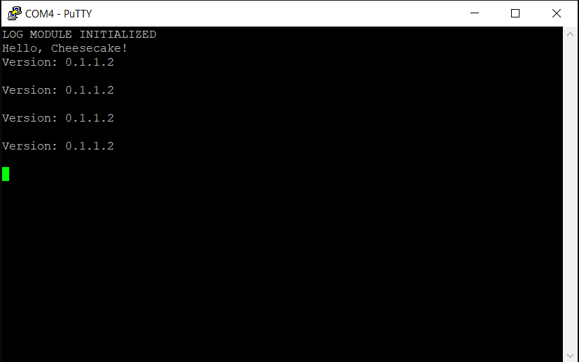

*Chapter Top* [Chapters[1]: Hello, Cheesecake!](chapter1.md)  |  *Next Chapter* [Chapters[2]: Processor Initialization and Exceptions](../chapter02/chapter2.md)  
*Previous Page* [Hello, Cheesecake!](hello-cheesecake.md)  |  *Next Page* [Logging](logging.md)

## Design and Conventions ([chapter1/code1](code1))

#### What We're Baking with

```bash
ccos4rbpi:~$ tree
.
├── Makefile
├── arch
│   └── arm64
│       ├── board
│       │   └── raspberry-pi-4
│       │       ├── config.txt
│       │       ├── mini-uart.S
│       │       └── mini-uart.c
│       ├── include
│       │   └── arch
│       │       └── timing.h
│       ├── linker.ld
│       ├── main.S
│       └── timing.S
├── build.sh
├── include
│   └── cake
│       └── log.h
└── src
    ├── cheesecake.c
    └── log.c
```

After some minor partitioning and refactoring, our project structure has evolved. Notably, source files are separated into three primary directories - [src](code1/src), [arch/arm64](code1/arch/arm64), and [arch/arm64/board/raspberry-pi-4](code1/arch/arm64/board/raspberry-pi-4). There are separate include directories for the main sources, [include/cake](code1/include/cake), and the architecture specific sources, [arch/arm64/include/arch](code1/arch/arm64/include/arch).

While not a primary goal, some portability is possible. Other architectures besides `arm64` could theoretically be plugged in, with the main source code generically available as a library for all. Architecture specific code can be reused to support multiple single board computers, not only the Raspberry Pi 4 - think a Raspberry Pi 3 plugin (implementation included in [Bonus](../chapter13/chapter13.md) at end of this volume). 

It could be argued the mini UART code, for example, is in fact a device driver. For this volume, however, we will leave it in the board-specific directory.

#### The Design Implementation

In order to facilitate this partitioning, a layer of indirection has been introduced, and a console structure has been defined in [include/cake/log.h](code1/include/cake/log.h):

```C
#ifndef _CAKE_LOG_H
#define _CAKE_LOG_H

struct console {
    void (*write)(char *s);
};

void log(char *s);
void register_console(struct console *c);

#endif
```

The `cheesecake_main` function, still in [src/cheesecake_main.c](code1/src/cheesecake_main.c), initializes the log module with a call to `log_init` from the new `init` function:

```C
#include "cake/log.h"
#include "arch/timing.h"

extern void log_init();

static void init();

void cheesecake_main(void)
{
    char *version = "Version: 0.1.1.2\r\n";
    init();
    log("Hello, Cheesecake!\r\n");
    while (1) {
        log(version);
        log("\r\n");
        DELAY(20000000);
    }
}

static void init()
{
    log_init();
    log("LOG MODULE INITIALIZED\r\n");
}
```

Notice also the original `__delay` routine has been replaced with a `DELAY` macro, supplied by the architecture specific include [arch/timing.h](code1/arch/arm64/include/arch/timing.h): 

```C
#ifndef _ARCH_TIMING_H
#define _ARCH_TIMING_H

#define DELAY __delay

void __delay(unsigned long delay);

#endif
```

The idea is any architecture could be implemented, with only the requirement to supply a definition for this macro. `DELAY` may then expand to whatever function the architecture needed, but the `src/cheesecake.c` source remains unchanged.

Additionally, a log module has been created, [src/log.c](code1/src/log.c), as a home for the `log` function:

```C
extern void console_init();

static struct console *console;

void log(char *s)
{
    console->write(s);
}

void log_init()
{
    console_init();
}

void register_console(struct console *c)
{
    console = c;
}
```

The log module indicates there is a function, `console_init`, defined elsewhere and called by the `log_init` function. The module provides the `register_console` callback, such that whoever does implement the `console_init` function can set the static `console` variable. This pointer will then be dereferenced when the `log` function is called, and the `write` member function executed. We complete the circle with the implementation in [arch/arm64/board/raspberry-pi-4/mini-uart.c](code1/arch/arm64/board/raspberry-pi-4/mini-uart.c):

```C
static void uart_puts(char *s);

static struct console console = {
    .write = uart_puts
};

void console_init()
{
    register_console(&console);
}
```

This is quite a bit of extra code and complexity. There is a penalty, a slow-down due to an extra function call and pointer hop to get to the `uart_puts` function. Such is the price to be paid for design and a little bit of flexibility.

#### Conventions

Many of the conventions used throughout this volume have already been demonstrated:
- Module layout
  - Code that is generic to any architecture goes in `src/`
  - Code that is instruction set architecture specific goes in `arch/{ARCH}`
  - Code that is board or chip specific goes in `arch/{ARCH}/board/{BOARD}`
- Header files
  - Generic header files begin with `_CAKE_`, and belong in `include/cake`
  - Instruction set architecture specific header files begin with `_ARCH_`, and belong in `arch/{ARCH}/include/arch`
  - Board or chip specific header files begin with `_BOARD_`, and belong in `arch/{ARCH}/board/{BOARD}/include/board`
- Low-level assembly routines or functions are named beginning with two underscores (`__`)
- All macros are defined in UPPERCASE
- No low-level assembly routines are directly allowed in the generic `src/` code, but they can be hidden by macros
- Within a module, or source file, the order of declaration/definition is
  - Global variables declared/defined in alphabetical order
  - External functions declared in alphabetical order
  - Internal type definitions defined in alphabetical order
  - Internal functions declared in alphabetical order
  - Internal static variables defined in alphabetical order
  - Static inline function definitions in alphabetical order
  - Function definitions, a mix of global and static, in alphabetical order

#### Building

If you are anything like me, you look forward to studying Makefiles with as much anticipation as cuddling a cactus. While we do not want to dive too deep into Makefiles (GNU has their own excellent [documentation](https://www.gnu.org/software/make/manual/make.html)], we'll note a few features of the CheesecakeOS [Makefile](code1/Makefile) - for the love of the game.

```make
.phony := clean
ifeq (,$(filter $(phony), $(MAKECMDGOALS)))

ifndef ARCH
$(error ARCH is not specified)
endif

ifndef BOARD
$(error BOARD is not specified)
endif

endif
```

If either the ARCH or BOARD variables are not defined, and the target is not the phony `clean` target, _make_ will exit with an error.

```make
ARMCCC = aarch64-linux-gnu
CFLAGS = -Wall -nostdlib -nostartfiles -ffreestanding -mgeneral-regs-only
```

If you followed the AWS instructions in the [Getting Started](../chapter0/getting-started.md) Guide, and you selected an `x86` machine, you will be happy to know we are using the GNU `aarch64-linux-gnu` cross compiler. We tell the compiler to use only general registers, and we are compiling in a free-standing environment. There is no _C_ library here. Any functionality we want we need to roll ourselves!

```make
BUILD_DIR = .build
LIB_DIR = $(BUILD_DIR)/libs

BOARD_SRC_DIR = arch/$(ARCH)/board/$(BOARD)/
BOARD_OBJ_DIR = $(BUILD_DIR)/board/
BOARD_C_FILES = $(wildcard $(BOARD_SRC_DIR)/*.c)
BOARD_S_FILES = $(wildcard $(BOARD_SRC_DIR)/*.S)
BOARD_OBJ_FILES = $(BOARD_C_FILES:$(BOARD_SRC_DIR)/%.c=$(BOARD_OBJ_DIR)/%_c.o) \
    $(BOARD_S_FILES:$(BOARD_SRC_DIR)/%.S=$(BOARD_OBJ_DIR)/%_s.o)
BOARD_INCLUDE_DIR = $(BOARD_SRC_DIR)/include/
ARCH_SRC_DIR = arch/$(ARCH)/
ARCH_OBJ_DIR = $(BUILD_DIR)/arch/
ARCH_C_FILES = $(wildcard $(ARCH_SRC_DIR)/*.c)
ARCH_S_FILES = $(wildcard $(ARCH_SRC_DIR)/*.S)
ARCH_OBJ_FILES = $(ARCH_C_FILES:$(ARCH_SRC_DIR)/%.c=$(ARCH_OBJ_DIR)/%_c.o) \
    $(ARCH_S_FILES:$(ARCH_SRC_DIR)/%.S=$(ARCH_OBJ_DIR)/%_s.o)
ARCH_INCLUDE_DIR = $(ARCH_SRC_DIR)/include/

KERNEL_SRC_DIR = src/
KERNEL_OBJ_DIR = $(BUILD_DIR)/kernel/
KERNEL_C_FILES = $(wildcard $(KERNEL_SRC_DIR)/*.c)
KERNEL_OBJ_FILES = $(KERNEL_C_FILES:$(KERNEL_SRC_DIR)/%.c=$(KERNEL_OBJ_DIR)/%.o)
KERNEL_INCLUDE_DIR = include/

OBJ_FILES = $(BOARD_OBJ_FILES) $(ARCH_OBJ_FILES) $(KERNEL_OBJ_FILES)

.PHONY: $(phony)
```

We setup the necessary variables to find our source and header files. In order to allow assembly code files (`.S`) and _C_ sources files (`.c`) to be similarly named, we add different trailers for their respective object files (`.o`).

```make
all: kernel8.img

kernel8.img: $(ARCH_SRC_DIR)/linker.ld \
    $(ARCH_OBJ_FILES)     \
    $(LIB_DIR)/libboard.a \
    $(LIB_DIR)/libcheesecake.a
    $(ARMCCC)-ld -T $(ARCH_SRC_DIR)/linker.ld \
        -o $(BUILD_DIR)/kernel8.elf  \
        $(ARCH_OBJ_FILES)            \
        -L$(LIB_DIR)                 \
        -lboard -lcheesecake -lboard
    $(ARMCCC)-objdump -D $(BUILD_DIR)/kernel8.elf > $(BUILD_DIR)/kernel8.dsa
    $(ARMCCC)-nm -n $(BUILD_DIR)/kernel8.elf > $(BUILD_DIR)/kernel8.map
    $(ARMCCC)-objcopy $(BUILD_DIR)/kernel8.elf -O binary kernel8.img
```

The cross compiler will create an `elf-binary`...
- `$(ARMCCC)-objdump -D $(BUILD_DIR)/kernel8.elf > $(BUILD_DIR)/kernel8.dsa` dumps the disassembled code instructions.
- `$(ARMCCC)-nm -n $(BUILD_DIR)/kernel8.elf > $(BUILD_DIR)/kernel8.map` dumps the kernel memory map.
- `$(ARMCCC)-objcopy $(BUILD_DIR)/kernel8.elf -O binary kernel8.img` extracts the raw binary from the `elf-binary` to create the final image.

Strangely, the board library appears twice, once before the cheesecake library, and once after. These two libraries have dependencies on each other. The cheesecake library depends on something defining [console_init](code1/src/log.c), while the board library depends on something defining [register_consle](code1/arch/arm64/board/raspberry-pi-4/mini-uart.c). Each library defines the other's dependency. When the linker reads in the libraries from left to right, there will be some undefined symbol(s) unless one of the libraries appears twice.

```make
$(ARCH_OBJ_DIR)/%_c.o: $(ARCH_SRC_DIR)/%.c
    mkdir -p $(@D)
    $(ARMCCC)-gcc $(CFLAGS) \
        -I$(KERNEL_INCLUDE_DIR) \
        -I$(ARCH_INCLUDE_DIR)   \
        -MMD -c $< -o $@
$(ARCH_OBJ_DIR)/%_s.o: $(ARCH_SRC_DIR)/%.S
    mkdir -p $(@D)
    $(ARMCCC)-gcc $(CFLAGS) \
        -I$(KERNEL_INCLUDE_DIR) \
        -I$(ARCH_INCLUDE_DIR)   \
        -MMD -c $< -o $@

$(LIB_DIR)/libboard.a: $(BOARD_OBJ_FILES)
    mkdir -p $(@D)
    $(ARMCCC)-ar crs $(LIB_DIR)/libboard.a $(BOARD_OBJ_FILES)

$(BOARD_OBJ_DIR)/%_s.o: $(BOARD_SRC_DIR)/%.S
    mkdir -p $(@D)
    $(ARMCCC)-gcc $(CFLAGS) \
        -I$(BOARD_INCLUDE_DIR)  \
        -I$(ARCH_INCLUDE_DIR)   \
        -I$(KERNEL_INCLUDE_DIR) \
        -MMD -c $< -o $@

$(BOARD_OBJ_DIR)/%_c.o: $(BOARD_SRC_DIR)/%.c
    mkdir -p $(@D)
    $(ARMCCC)-gcc $(CFLAGS) \
        -I$(BOARD_INCLUDE_DIR)  \
        -I$(ARCH_INCLUDE_DIR)   \
        -I$(KERNEL_INCLUDE_DIR) \
        -MMD -c $< -o $@

$(LIB_DIR)/libcheesecake.a: $(KERNEL_OBJ_FILES)
    mkdir -p $(@D)
    $(ARMCCC)-ar crs $(LIB_DIR)/libcheesecake.a $(KERNEL_OBJ_FILES)

$(KERNEL_OBJ_DIR)/%.o: $(KERNEL_SRC_DIR)/%.c
    mkdir -p $(@D)
    $(ARMCCC)-gcc $(CFLAGS) \
        -I$(KERNEL_INCLUDE_DIR) \
        -I$(ARCH_INCLUDE_DIR)   \
        -MMD -c $< -o $@

DEP_FILES = $(OBJ_FILES:%.o=%.d)
-include $(DEP_FILES)

clean:
    rm -rf $(BUILD_DIR) *.img
```

The `-MMD` flag is added to the compilation commands in order to extract the `#include` dependencies. The dependency files are all `-include`d into the [Makefile](code1/Makefile). This is a convenience that allows _make_ to recompile when a header file changes, without requiring us to give all the possible header file dependencies for each individual source or object file.

We will continue to add to this `Makefile` throughout the volume as the complexity of our build system increases.

#### Linking

Our linker script, relocated into the architecture-specific section [arch/arm64/linker.ld](code1/arch/arm64/linker.ld) is rudimentary:

```
OUTPUT_ARCH(aarch64)
ENTRY(_start)
SECTIONS
{
    . = 0x0;
    .text.boot : {
        _start = .;
        *(.text.boot)
    }
    .text : { *(.text) }
    .rodata : { *(.rodata) }
    .data : { *(.data) }
    . = ALIGN(0x8);
    bss_begin = .;
    .bss : { *(.bss*) }
    bss_end = .;
    . = 0x400000;
    _end = .;
}
```

The starting address is 0x0, the address where the Raspberry Pi 4 Bootloader will load our image. The `bss_begin` (aligned to 8 bytes), and the `bss_end` bounds are defined. The `_end` label is set to 4MB.

In the chapters to come we will demand much of our linker script as we reserve static regions of the CheesecakeOS image for special purposes. Check the [GNU ld Documenation](https://sourceware.org/binutils/docs/ld/) for all there is to know about linker scripts.

Now, if everything has gone right, when you build the `kernel8.img` from this slice and load it on to your Raspberry Pi, you will see output that looks something like:



*Previous Page* [Hello, Cheesecake!](hello-cheesecake.md)  |  *Next Page* [Logging](logging.md)  
*Chapter Top* [Chapters[1]: Hello, Cheesecake!](chapter1.md)  |  *Next Chapter* [Chapters[2]: Processor Initialization and Exceptions](../chapter02/chapter2.md)
