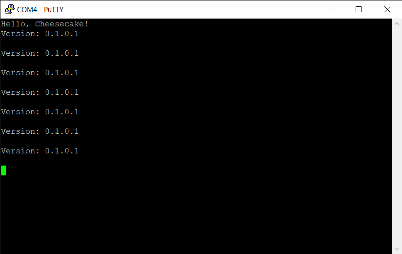

*Chapter Top* [Chapters[1]: Hello, Cheesecake!](chapter1.md)  |  *Next Chapter* [Chapters[2]: Processor Initialization and Exceptions](../chapter2/chapter2.md)
*Previous Page* [Chapters[1]: Hello, Cheesecake!](chaper1.md)  |  *Next Page* [Conventions and Design](conventions-and-design.md)

## Hello, Cheesecake! ([chapter1/code0](code0))

#### Up and Running

Inside the [chapter1/code0](code0) folder there is `config.txt` file. Copy that file to the boot partition of your SD card, and overwrite the existing `config.txt`. We will use this configuration for the remainder of the tutuorial. There is also a `build.sh` file. Assuming you followed the steps to [setup docker in the Getting Started Guide](../chapter0/getting-started.md), running this script from inside the `chapter1/code0` directory should work to build he kernel image.

```bash
ccos4rbpi:~$ ./build.sh
mkdir -p .build
aarch64-linux-gnu-gcc -Wall -nostdlib -nostartfiles -ffreestanding -mgeneral-regs-only -MMD -c src/cheesecake.c -o .build/cheesecake_c.o
mkdir -p .build
aarch64-linux-gnu-gcc -Wall -nostdlib -nostartfiles -ffreestanding -mgeneral-regs-only -MMD -c src/mini-uart.c -o .build/mini-uart_c.o
mkdir -p .build
aarch64-linux-gnu-gcc -Wall -nostdlib -nostartfiles -ffreestanding -mgeneral-regs-only -MMD -c src/mini-uart.S -o .build/mini-uart_s.o
mkdir -p .build
aarch64-linux-gnu-gcc -Wall -nostdlib -nostartfiles -ffreestanding -mgeneral-regs-only -MMD -c src/timing.S -o .build/timing_s.o
mkdir -p .build
aarch64-linux-gnu-gcc -Wall -nostdlib -nostartfiles -ffreestanding -mgeneral-regs-only -MMD -c src/main.S -o .build/main_s.o
aarch64-linux-gnu-ld -T linker.ld -o .build/kernel8.elf .build/cheesecake_c.o .build/mini-uart_c.o .build/mini-uart_s.o .build/timing_s.o .build/main_s.o
aarch64-linux-gnu-objdump -d .build/kernel8.elf > .build/kernel8.dsa
aarch64-linux-gnu-nm -n .build/kernel8.elf > .build/kernel8.map
aarch64-linux-gnu-objcopy .build/kernel8.elf -O binary kernel8.img
```

As a result of building, there should be a `kernel8.img` file created in your directory. Copy that file onto the `boot` partition of your SD card, possibly overwriting another `kernel8.img` file if one already exists. It is now possible to boot our first build of CheesecakeOS. Plugin your SD card, hook up your RaspberryPi to the console, and power it on. After a few seconds you should see some output. If everything has gone right, it might look something like this:



Congrats! You are up and running - now the real fun can begin.

#### What We're Baking With

```bash
ccos4rbpi:~$ tree
.
├── Makefile
├── build.sh
├── config.txt
├── linker.ld
└── src
    ├── cheesecake.c
    ├── main.S
    ├── mini-uart.S
    ├── mini-uart.c
    └── timing.S
```

Our current kernel has a super-simple structure. There is the RaspberryPi `config.txt` file, a `Makefile`, a linker script, and a few source files. We use a generic `config.txt` file that will work for all RaspberryPi 4 devices.

```bash
ccos4rbpi:~$ cat config.txt
arm_64bit=1
arm_peri_high=1
disable_commandline_tags=1
enable_gic=1
enable_uart=1
kernel_old=1
```

Each of the config options, and what effect they have is described in the [RaspberryPi config.txt Documentation](https://www.raspberrypi.org/documentation/configuration/config-txt/README.md). The only option interesting enough to mention here is the `arm_peri_high` setting. Depending on the RAM size of your RaspberryPi 4 (2GB, 4GB, 8GB), the boot loader may configure two different memory maps, one based on high peripherals, one based on low. Setting this configuration option means all devices will have the same memory map. As explained in the documentation, this means we need to provide our own ARM stub. This is something we will build into our image in [Chapter 2](../chapter2/chapter2.md). We will not change or mention this configuration file from here.

#### The Source Code

The remainder of this section is dedicaded to investigating the source code files. The `Makefile` and `linker.ld` script are examined in the [building](building.md) and [linking](linking.md) sections of this chapter, respectively. Let's begin with the [src/main.S](code0/src/main.S) assemebly source file, the entry point into our kernel:

```asm
#define MPIDR_HWID_MASK_LITE    0xFFFFFF

.section ".text.boot"

.globl __entry
__entry:
    mrs     x0, mpidr_el1
    and     x0, x0, #MPIDR_HWID_MASK_LITE
    cbz     x0, __run
    b       __sleep

__sleep:
    wfe
    b       __sleep

__run:
    adr     x0, bss_begin
    adr     x1, bss_end
    bl      __zerobss
    adrp    x13, _end
    mov     sp, x13
    bl      cheesecake_main
    b       __sleep

__zerobss:
    sub     x1, x1, x0
    str     xzr, [x0], #8
    subs    x1, x1, #8
    b.gt    __zerobss
    ret
```

Before writing any instructions, the assembler is notified, with the `.section ".text.boot"` directive, that the following code belongs in a special section called...`".text.boot"` (if you are unfamiliar with sections, please refer to the chapter on Linking from [Computer Systems: A Programmer's Perspective](https://www.amazon.com/Computer-Systems-Programmers-Perspective-3rd/dp/013409266X) by Bryant and O'Hallaron). The first routine is defined, the `__entry` function.

```asm
mrs     x0, mpidr_el1
```
The first instruction  moves the value of the `MPIDR_EL1` system register into the `x0` general purpose register. The `MPIDR_EL1 Register` is the Multiprocessor Affinity Register, explained on `pg.269` of the `ARM ARM`. It is used here so each processer can identify itself, as all processors (the RaspberryPi 4 has four) enter at the same place.
```asm
and     x0, x0, #MPIDR_HWID_MASK_LITE
``` 
The `MPIDR_HWID_MASK_LITE` macro masks off the upper `40` bits of the `x0` general purpose regiser, leaving only the bottom `24` bits to identify the CPU. Thus, we only support `16777216` unique CPUs.
```asm
cbz     x0, __run
``` 
Each CPU core checks the value of the `x0` register after the previous `and` instruction. If the value is `0`, the processor will branch to the `__run` routine. Otherwise, the next instruction will be executed.
```asm
b       __sleep
```
Finally, if the previous `compare and branch if zero` fell through, the processor will branch to the `__sleep` routine.

So, this `__entry` routine has each processor check it's own processor id at startup. `CPU 0` will branch to the `__run` routine, and all other CPUs branch to the `__sleep` routine. 

The explanation of each assembly instruction provided above will not be the norm for the rest of the book, but will only be provided in special cases. If you find it difficult to follow what happens in the assembly, please review the [prerequisites](../chapter0/prerequisites.md), and make sure to have a copy of the `ARM ARM` handy so you can review the effects of each instruction.

The `__sleep` routine is an infinite loop - so we are, for now, working with just a single CPU, `CPU 0`. We will add the others in when we are ready.

The `__run` routine is the core of the startup, and features three apparently undefined labels - `bss_begin`, `bss_end`, and `_end`. These variables are defined in the [linker.ld](code0/linker.ld) script. The `bss_begin` and `bss_end` labels define the addresses that are the bounds of the bss section. These bounds are passed on the the `__zerobss` routine so that the bss section memory is intialized to all zeroes. The `_end` label is an arbitrary address (`0x400000`, or 4MB), placed at the end of the image and used to initialize the stack pointer. As our image is ~1KB at this time, using this arbitraty label gives more than enough stack space. After the bss section and stack pointer are initialized, our kernel branches to the `cheesecake_main` function, the main kernel routine, defined in `C` in [src/cheesecake.c](code0/src/cheesecake.c):

```C
extern void __delay(unsigned long delay);
extern void uart_puts(char *s);

void cheesecake_main(void)
{
    char *version = "Version: 0.1.0.1\r\n";
    uart_puts("Hello, Cheesecake!\r\n");
    while (1) {
        uart_puts(version);
        uart_puts("\r\n");
        __delay(20000000);
    }
}
```

After saying hello, our `cheesecake_main` function runs in an interminable loop spitting out the version number. For this I/O, the `cheesecake_main` function makes calls to `uart_puts`, from [src/mini-uart.c](code0/src/mini-uart.c):

```C
extern int  __uart_can_tx();
extern void __uart_putchar(char c);

static inline int check_ready()
{
    return __uart_can_tx();
}

static inline void uart_putchar(char c)
{
    while(!check_ready()) {
    }
    return __uart_putchar(c);
}

void uart_puts(char *s)
{
    if(s) {
        for(char *str = s; *str != '\0'; str++) {
            uart_putchar(*str);
        }
    }
}
```

The functions in the `src/mini-uart.c` module are simple wrappers for the low-level assmembly I/O in [src/mini-uart.S](code0/src/mini-uart.S), where the magic really happens:

```asm
#define MAIN_PERIPH_BASE        (0x47C000000)
#define UART_BASE_REG           (MAIN_PERIPH_BASE + 0x2215000)
#define AUX_MU_IO_REG           ((UART_BASE_REG) + 0x40)
#define AUX_MU_LSR_REG          ((UART_BASE_REG) + 0x54)
#define AUX_MU_LSR_REG_TESHIFT  (5)
#define AUX_MU_LSR_REG_TEFLAG   (1 << (AUX_MU_LSR_REG_TESHIFT))

    .macro __MOV_Q, reg, val                                                                                                                                                         [11/186]
            .if     (((\val) >> 31) == 0 || ((\val) >> 31) == 0x1ffffffff)
            movz        \reg, :abs_g1_s:\val
            .else
            .if     (((\val) >> 47) == 0 || ((\val) >> 47) == 0x1ffff)
            movz        \reg, :abs_g2_s:\val
            .else
            movz        \reg, :abs_g3:\val
            movk        \reg, :abs_g2_nc:\val
            .endif
            movk        \reg, :abs_g1_nc:\val
            .endif
            movk        \reg, :abs_g0_nc:\val
        .endm

    .macro __DEV_READ_32, dst, src
        ldr     \dst, [\src]
    .endm

    .macro __DEV_WRITE_8, src, dst
        strb   \src, [\dst]
    .endm

.globl __uart_can_tx
__uart_can_tx:
    __MOV_Q         x0, AUX_MU_LSR_REG
    __DEV_READ_32   w0, x0
    and             w0, w0, AUX_MU_LSR_REG_TEFLAG
    ret

.globl __uart_putchar
__uart_putchar:
    __MOV_Q         x1, AUX_MU_IO_REG
    __DEV_WRITE_8   w0, x1
    ret
```

The source begins with these strange macros that seem arbitrary:
```asm
#define MAIN_PERIPH_BASE        (0x47C000000)
#define UART_BASE_REG           (MAIN_PERIPH_BASE + 0x2215000)
#define AUX_MU_IO_REG           ((UART_BASE_REG) + 0x40)
#define AUX_MU_LSR_REG          ((UART_BASE_REG) + 0x54)
#define AUX_MU_LSR_REG_TESHIFT  (5)
#define AUX_MU_LSR_REG_TEFLAG   (1 << (AUX_MU_LSR_REG_TESHIFT))
```
In fact, they come directly from the [BCM2711 ARM Peripherals](https://www.raspberrypi.org/documentation/hardware/raspberrypi/bcm2711/rpi_DATA_2711_1p0.pdf) Guide. We'll take a little detour into the weeds here to sort out these addresses:
- `0x47C000000` is the main peripheral base address, as explained on `pg. 10`. It also states, apropos to the next bullet, that behind the scenes, the VideoCore translates peripherals from addresses `0x7C00_0000` to  `0x7FFF_FFFF` to their `0x4_7nnn_nnnn` addresses.
- The documentation gives, on `pg. 12`, `0x7E21 5000` as the base address for the Mini UART. We now know this address will be at `0x47E215000`, or the base address + `0x2215000`.
- The `AUX_MU_IO_REG` and `AUX_MU_LSR_REG` registers are located at their documented offset
- On `pg. 15-16` it is clearly explained that a read to the last `8` bits of the `AUX_MU_IO_REG` register pulls a byte of the receive FIFO, and writing to those bits places a byte in the transmit FIFO.
- On `pg. 18-19`, the bits of the `AUX_MU_LSR_REG` are described. Bit `5`, starting from `0` is used to test if the transmit FIFO can accept a btye.

The `__MOV_Q` macro is taken directly from [Linux](https://github.com/torvalds/linux/blob/v4.20/arch/arm64/include/asm/assembler.h#L496). Because `ARM64` is a RISC architecture where all instructions are `32` bits, it can take more than one instruction to load a `64`-bit number into a register. This macro takes care of that for us.

The `__uart_can_tx` routine is then used to verify a byte can be accepted into the mini UART's transmit FIFO, and the `__uart_putchar` routine places it there for us!

The `__delay` routine, defined in [src/timing.S](code0/src/timing.S), is a countdown function:

```asm
.globl __delay
__delay:
    subs    x0, x0, #1
    bne     __delay
    ret
```

That's all it takes to get our embrionic CheesecakeOS up and outputting. No GPIO configuration or baud-rate setting is required. I cannot say for sure why this is the case. I believe it is because the specific bootloader used with tag 1.20200512 from the [Getting Started](../chapter0/gettting-started.md) Guide sets it up for us. If you insist on using a different version of the bootloader, you may have to do some extra startup configuration.
