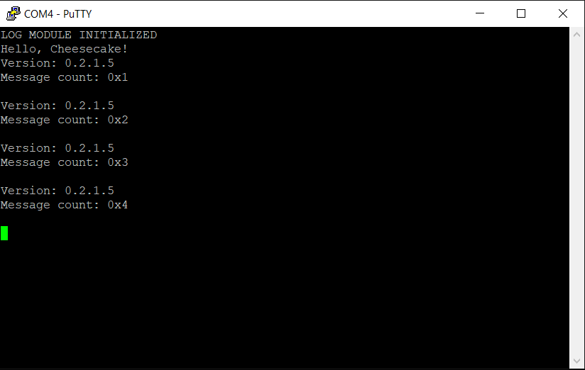

*Chapter Top* [Chapters[2]: Processor Initialization and Exceptions](chapter2.md)  |  *Next Chapter* [Chapters[3]: Processor Initialization and Exceptions](../chapter3/chapter3.md)   
*Previous Page* [Setting the Exception Level in the ARM Stub](arm-stub.md)  |  *Next Page* [The Interrupt Controller](interrupt-controller.md)

## Exceptions and the ARM Exception Vector Table ([chapter2/code1](code1))

#### ARM Exceptions

In the ARM architecture, exceptions are conditions or system events that require some action by privileged software - an _exception handler_ - to ensure correct functioning of the system. In ARMv8, there are four types of exceptions that can occur in four different contexts. A handler is defined for each of these sixteen conditions. This handler can be up to `32` instructions (`128` bytes). Space is not a problem, however, as most handlers are only one instruction, which branches to a seperate routine for actually performing the work. Each of the handler routines is defined to be at a predefined address, at `128`-byte offsets from a base address. This base address is said to be the `exception table`, or the `vector table`. When ever the system encounters a triggering event, the processor jumps to the correct offset based on the type of exception and context, and executes the instruction at that offset.

The base address of the `exception table` is written to `VBAR_EL1`. The `Vector Base Address Register` is explained on `pg. 2745` of the `ARM ARM`. The least significant `11` bits of the address are `RES0`, so the table must be defined at a `2KB`, or `2048`-byte aligned address. The math works as there are `16` handlers multiplied by `128`-bytes-per-handler. The layout of the table looks like:

| VBAR_EL1 Offset | Exception Type | Context | Valid in CheesecakeOS? |
| :---        | :---           | :---    | :---:                  |
| 0x000 | Synchronous | Current Exception Level with `SP0` Stack Pointer | :x: |
| 0x080 | IRQ | Current Exception Level with `SP0` Stack Pointer | :x: |
| 0x100 | FIQ | Current Exception Level with `SP0` Stack Pointer | :x: |
| 0x180 | System Error | Current Exception Level with `SP0` Stack Pointer | :x: |
| 0x200 | Synchronous | Current Exception Level with `SPx` Stack Pointer | :heavy_check_mark: |
| 0x280 | IRQ | Current Exception Level with `SPx` Stack Pointer | :heavy_check_mark: |
| 0x300 | FIQ | Current Exception Level with `SPx` Stack Pointer | :x: |
| 0x380 | System Error | Current Exception Level with `SPx` Stack Pointer | :x: |
| 0x400 | Synchronous | Lower Exception Level Using `AArch64` | :heavy_check_mark: |
| 0x480 | IRQ | Lower Exception Level Using `AArch64` | :heavy_check_mark: |
| 0x500 | FIQ | Lower Exception Level Using `AArch64` | :x: |
| 0x580 | System Error | Lower Exception Level Using `AArch64` | :x: |
| 0x600 | Synchronous | Lower Exception Level Using `AArch32` | :x: |
| 0x580 | IRQ | Lower Exception Level Using `AArch32` | :x: |
| 0x700 | FIQ | Lower Exception Level Using `AArch32` | :x: |
| 0x780 | System Error | Lower Exception Level Using `AArch32` | :x: |

When handling exceptions, software can make use of three special registers setup by the architecture on exception entry. The first, `SPSR_EL1`, the `Saved Program Status Register` explained on `pg. 377` of the `ARM ARM`, holds the saved process state when an exception is taken. This includes the DAIF exception masks, the values of the NCZV flags, and the Exception Level/Stack Pointer combination of the processor right before the exception. Second, `ESR_EL1`, the `Exception Syndrome Register` explained on `pg.2436` of the ARM ARM, contains information about the exceptional condition or state. The software can use this information to determine which action to take next. Finally, `ESR_EL1` the `Execption Link Register` holds the address of the return instruction to jump to after executing the `eret` instruction to end the handler routine.


#### What We're Baking With

```bash
ccos4rbpi:~$ tree
.
├── Makefile
├── arch
│   └── arm64
│       ├── board
│       │   └── raspberry-pi-4
│       │       ├── config.txt
│       │       ├── mini-uart.S
│       │       ├── mini-uart.c
│       │       └── secure_boot.S
│       ├── entry.S
│       ├── include
│       │   └── arch
│       │       ├── bare-metal.h
│       │       └── timing.h
│       ├── linker.ld
│       ├── main.S
│       └── timing.S
├── build.sh
├── include
│   └── cake
│       ├── log.h
│       └── types.h
├── kernel8.img
└── src
    ├── cheesecake.c
    └── log.c
```

The [arch/arm64/entry.S](code1/arch/arm64/entry.S) source file is the primary additional ingredient in this section:

```asm
    .macro __VECTABLE_ENTRY, label
        .align 7
        b \ label
    .endm

.align 11
.global vectors
vectors:
    __VECTABLE_ENTRY    __invalid_entry
    __VECTABLE_ENTRY    __invalid_entry
    __VECTABLE_ENTRY    __invalid_entry
    __VECTABLE_ENTRY    __invalid_entry
    __VECTABLE_ENTRY    __invalid_entry
    __VECTABLE_ENTRY    __invalid_entry
    __VECTABLE_ENTRY    __invalid_entry
    __VECTABLE_ENTRY    __invalid_entry
    __VECTABLE_ENTRY    __invalid_entry
    __VECTABLE_ENTRY    __invalid_entry
    __VECTABLE_ENTRY    __invalid_entry
    __VECTABLE_ENTRY    __invalid_entry
    __VECTABLE_ENTRY    __invalid_entry
    __VECTABLE_ENTRY    __invalid_entry
    __VECTABLE_ENTRY    __invalid_entry
    __VECTABLE_ENTRY    __invalid_entry

__invalid_entry:
__exception_hang:
    wfe
    b   __exception_hang
```

We define the simplest possible vector table, where each entry branches end up in an infinite loop. At this juncture, the points of interest in the source file are the `.align` directives. The vector table itself is aligned on a `2048`-byte boundry, and each table entry is aligned on a `128`-byte boundtry, thus satisfying the architectural requirements.

Installing the vector table happens back in [arch/arm64/main.S](arch/arm64/main.S):

```asm
    .macro __ADR_L, dst, sym
        adrp    \dst, \sym
        add     \dst, \dst, :lo12:\sym
    .endm

__run:
    __ADR_L     x0, vectors
    msr         vbar_el1, x0
    adrp        x13, _end
    mov         sp, x13
    adr         x0, bss_begin
    adr         x1, bss_end
    bl          __zerobss
    bl          cheesecake_main
    b           __sleep
```

The `__ADR_L` macro, similar to the `__MOV_Q` macro is borrowed from [Linux](https://github.com/torvalds/linux/blob/v4.20/arch/arm64/include/asm/assembler.h#L211). It enables the loading of a pc-relative address that is not page-aligned, but with a larger range than the stand-alone `adr` instruction.

Sanity checking the memory that is created on build, the `vectors` symbol is indeed placed at the correct alignemnt. The next symbol is placed `4` bytes after the final table entry, due to the single instruction `4-byte` instruction at that entry:

```bash
ccos4rbpi:~$ grep -A1 vectors .build/kernel8.map
0000000000000800 T vectors
0000000000000f84 t __exception_hang
```

Again, building and running doesn't display materially different output, but we've made another step towards having a recognizable computational machine:




*Chapter Top* [Chapters[2]: Processor Initialization and Exceptions](chapter2.md)  |  *Next Chapter* [Chapters[3]: Processor Initialization and Exceptions](../chapter3/chapter3.md)   
*Previous Page* [Setting the Exception Level in the ARM Stub](arm-stub.md)  |  *Next Page* [The Interrupt Controller](interrupt-controller.md)
