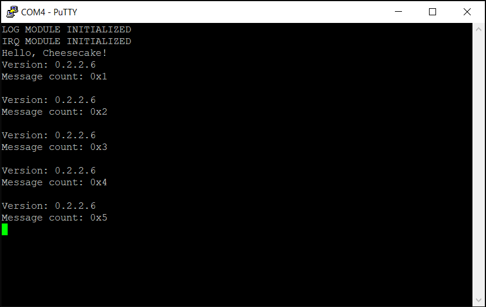

*Chapter Top* [Chapters[2]: Processor Initialization and Exceptions](chapter2.md)  |  *Next Chapter* [Chapters[3]: Memory Management Unit](../chapter03/chapter3.md)  
*Previous Page* [Exceptions and the Vector Table](exception-vector-table.md)  |  *Next Page* [Timer Interrupts](timer-interrupts.md)

## The Interrupt Controller ([chapter2/code2](code2))

#### The ARM GIC

Our Raspberry Pi 4 is equipped with an _ARM Generic Interrupt Controller_. The `GIC` is a complex interface with its own [specification](https://developer.arm.com/documentation/ihi0048/b?lang=en). Important registers are partitioned between the _Distributor_ and  each _CPU interface_. The Distributor block performs interrupt prioritization and distribution to the CPU interface blocks connected to the processors in the system. Each CPU interface block performs priority masking and preemption handling for a connected processor.

Some of the CPU interface registers are banked. This means each CPU has its own unique copy of the register. On these registers, if we desire the same value to be set for all CPUs, we must write that value to the banked register on each CPU.

Macros defining the _GIC_ registers we will use can be found in [arch/arm64/board/raspberry-pi-4/include/board/gic.h](code2/arch/arm64/board/raspberry-pi-4/include/board/gic.h). The registers beginning with `GICD_` relate to the distributor, while those beginning with `GICC_` relate to the CPU interface. The macros use the same names as the specification.

The [chapter2/code2](code2) build is the first to feature board-specific include files in [arch/arm64/board/raspberry-pi-4/include/board](code2/arch/arm64/board/raspberry-pi-4/include/board). The key peripheral base addresses are defined in [arch/arm64/board/raspberry-pi-4/include/board/peripheral.h](code2/arch/arm64/board/raspberry-pi-4/include/board/peripheral.h):

```C
#ifndef _BOARD_PERIPHERAL_H
#define _BOARD_PERIPHERAL_H

#define MAIN_PERIPH_BASE             (0x47C000000)
#define LOCAL_PERIPH_BASE            (0x4C0000000)
#define GIC_BASE                     ((LOCAL_PERIPH_BASE) + 0x00040000)

#endif
```

The `GIC_BASE` address of 0x4C0040000 comes from `pg. 90` of the [BCM2711 ARM Peripherals Manual](https://www.raspberrypi.org/documentation/hardware/raspberrypi/bcm2711/rpi_DATA_2711_1p0.pdf).

#### Configuring the GIC During Boot

Many of the _GIC_ registers need to be configured while the CPU has secure access. Since we initialize our kernel to operate in non-secure `EL1`, the setup must happen at boot time before we leave secure `EL3` in the `__secure_board_specific_setup` routine from [arch/arm64/board/secure-boot.S](code2/arch/arm64/board/secure-boot.S):

```asm
.globl __secure_board_specific_setup
__secure_board_specific_setup:
    mov     x28, x30
    bl      __setup_local_control
    bl      __setup_cortex_a72_regs
    bl      __setup_arm_arch_regs
    bl      __setup_gic
    mov     x30, x28
    ret
```

The `__setup_gic` routine is implemented as follows:

```asm
__setup_gic:
    mrs             x0, mpidr_el1
    tst             x0, #3
    __MOV_Q         x2, GICD_IGROUPR_OFFSET
    b.ne            2f
```

For all CPUs, the `GICD_IGROUPR_OFFSET` is moved into register `x2`. As the _GIC_ specification for the [GICD_IGROUPRn](https://developer.arm.com/documentation/ihi0048/b/Programmers--Model/Distributor-register-descriptions/Interrupt-Group-Registers--GICD-IGROUPRn?lang=en) registers informs, in a multiprocessor implementation, `GICD_IGROUPR0` is a banked register. We will configure it for each processor. For CPUs other than CPU 0, we branch past the global configuration.

```asm
    mov             w0, #3
    __MOV_Q         x1, GICD_CTLR
    __DEV_WRITE_32  w0, x1
    mov             w0, #~(0)
    mov             w1, #(7 * 4)
1:
    subs            w1, w1, #4
    add             x3, x2, x1
    __DEV_WRITE_32  w0, x3
    b.ne            1b
```

CPU 0 performs the _GIC Distributor_ configuration. The value three is written to `GICD_CTLR`, setting the two least significant bits. This enables all interrupts, both secure and insecure, to be forwarded to the CPU interfaces. Afterwards, the loop block sets all interrupts as _Group 1_, or non-secure, so our CPUs will be eligible to receive the interrupts after entering non-secure `EL1`. This is accomplished by writing the value 0xFFFFFFFF to each of the eight `GICD_IGROUPn` registers of the Distributor. The Raspberry Pi 4 [ARM stub](https://github.com/raspberrypi/tools/blob/master/armstubs/armstub8.S) shows the same logic, with eight registers and 32 configurable interrupts per register, supporting 256 unique interrupt requests.

```asm
2:
    mov             w0, #~(0)
    __DEV_WRITE_32  w0, x2
    mov             w0, #0x1e7
    __MOV_Q         x1, GICC_CTLR
    __DEV_WRITE_32  w0, x1
    mov             w0, #0xFF
    __MOV_Q         x1, GICC_PMR
    __DEV_WRITE_32  w0, x1
    dsb             sy
    isb
    ret
```

Since `GICD_IGROUPR0` is banked, all CPUs initialize interrupts 0-31 in _Group 1_. Yes, CPU 0 sets this register twice, but that is harmless. Each `GICC_CTLR` register is initialized, allowing non-secure interrupts. Finally, each `GICC_PMR` register is initialized with the lowest priority filter, allowing all interrupts through.

Before moving on, a short aside. There is an inconspicuous warning on `pg. 6-7` of the [BCM2711 ARM Peripherals Manual](https://www.raspberrypi.org/documentation/hardware/raspberrypi/bcm2711/rpi_DATA_2711_1p0.pdf). It shows how accessing multiple memory mapped peripherals without precautions can have disastrous consequences. Because we are accessing both the _GIC_ and the mini UART, we must heed these precautions. The manual suggests to:
- Issue a write memory barrier before the first write to a peripheral
- Issue a read memory barrier after the last read of a peripheral

In [arch/arm64/board/raspberry-pi-4/include/board/devio.h](code2/arch/arm64/board/raspberry-pi-4/include/board/devio.h), the device read and write macros have been updated to implement these suggestions:

```asm
    .macro __DEV_READ_32, dst, src
        ldr     \dst, [\src]
        dmb     ld
    .endm

    .macro __DEV_WRITE_32, src, dst
        dmb     st
        str     \src, [\dst]
    .endm

    .macro __DEV_WRITE_8, src, dst
        dmb     st
        strb    \src, [\dst]
    .endm
```

More on memory barriers in Chapter Five when we look at [ordering](../chapter05/atomics-ordering.md).

#### Handling IRQs

Before inundating our system with interrupt requests, let's update our vector table to handle them. Since our CheesecakeOS currently executes at `EL1` with the SPx stack pointer, we know which vector table entry to update in [arch/arm64/entry.S](code2/arch/arm64/entry.S):

```asm
.align 11
.global vectors
vectors:
    __VECTABLE_ENTRY    __invalid_entry
    __VECTABLE_ENTRY    __invalid_entry
    __VECTABLE_ENTRY    __invalid_entry
    __VECTABLE_ENTRY    __invalid_entry
    __VECTABLE_ENTRY    __invalid_entry
    __VECTABLE_ENTRY    __irq_el1h
    __VECTABLE_ENTRY    __invalid_entry
    __VECTABLE_ENTRY    __invalid_entry
    __VECTABLE_ENTRY    __invalid_entry
    __VECTABLE_ENTRY    __invalid_entry
    __VECTABLE_ENTRY    __invalid_entry
    __VECTABLE_ENTRY    __invalid_entry
    __VECTABLE_ENTRY    __invalid_entry
    __VECTABLE_ENTRY    __invalid_entry
    __VECTABLE_ENTRY    __invalid_entry
    __VECTABLE_ENTRY    __invalid_entry

__irq_el1h:
    __ENTRY_SAVE
    bl  handle_irq
    __ENTRY_RESTORE
```

The work of the exception handler is performed by the board-specific `handle_irq` function in [arch/arm64/board/raspberry-pi-4/irq.c](code2/arch/arm64/board/raspberry-pi-4/irq.c):

```C
extern unsigned int  __irq_acknowledge();
extern void __irq_end(unsigned int irq);

void handle_irq()
{
    unsigned int irq = __irq_acknowledge();
    __irq_end(irq);
}
```

Viewing the low level assembly functions in [arch/arm64/board/raspberry-pi-4/irq.S](code2/arch/arm64/board/raspberry-pi-4/irq.S):

```asm
.globl __irq_acknowledge
__irq_acknowledge:
    __MOV_Q         x0, GICC_IAR
    __DEV_READ_32   w0, x0
    ret

.globl __irq_end
__irq_end:
    __MOV_Q         x1, GICC_EOIR
    __DEV_WRITE_32  w0, x1
    ret
```

Currently, when receiving an IRQ, we simply query the ID of the request from the `GICC_IAR` register, and comply with the GIC architectural requirement to write the ID to the `GICC_EOIR` register.

#### Saving and Restoring State

Returning to the `__irq_el1h` handler, the `handle_irq` function is bookended by two macros, `__ENTRY_SAVE` and `__ENTRY_RESTORE`:

```asm
__irq_el1h:
    __ENTRY_SAVE
    bl  handle_irq
    __ENTRY_RESTORE
```

When the processor branches with link to the `handle_irq` function, the link register, `x30` is automatically updated with the return address. Also, we can expect other general purpose registers will be clobbered within the `handle_irq` function itself. If after returning from `handle_irq` we recklessly execute an `eret` instruction to resume as before the exception, our general purpose registers will likely be mangled, and our software will fail. Instead, we must carefully save the register state before running our handler, and restore that state after. This is the service performed by the `__ENTRY_SAVE` and `__ENTRY_RESTORE` macros. The information saved and restored is in the form of a new structure declared in [arch/arm64/include/arch/process.h](code2/arch/arm64/include/arch/process.h):

```C
#include "cake/types.h"

struct stack_save_registers {
    u64  regs[31];
    u64  sp;
    u64  pc;
    u64  pstate;
};
```

This structure is analogous to the `struct pt_regs` in Linux. There is room for general purpose registers `x0`-`x30`, the stack pointer, the program counter, and the processor state. This information will be saved on the stack, from bottom to top because the stack grows down.

> Note: the Linux `arm64` definition of `struct pt_regs` is located in the [arch/arm64/include/asm/ptrace.h](https://github.com/torvalds/linux/blob/v4.20/arch/arm64/include/asm/ptrace.h#L150) source.

The save operation is then a matter of creating some space on the stack and storing the data we care about, in the correct order:

```asm
    .macro __ENTRY_SAVE
        sub     sp, sp, #STRUCT_STACK_SAVE_REGISTERS_SIZE
        stp     x0, x1, [sp, #16 * 0]
        stp     x2, x3, [sp, #16 * 1]
        stp     x4, x5, [sp, #16 * 2]
        stp     x6, x7, [sp, #16 * 3]
        stp     x8, x9, [sp, #16 * 4]
        stp     x10, x11, [sp, #16 * 5]
        stp     x12, x13, [sp, #16 * 6]
        stp     x14, x15, [sp, #16 * 7]
        stp     x16, x17, [sp, #16 * 8]
        stp     x18, x19, [sp, #16 * 9]
        stp     x20, x21, [sp, #16 * 10]
        stp     x22, x23, [sp, #16 * 11]
        stp     x24, x25, [sp, #16 * 12]
        stp     x26, x27, [sp, #16 * 13]
        stp     x28, x29, [sp, #16 * 14]
        add     x21, sp, #STRUCT_STACK_SAVE_REGISTERS_SIZE
        mrs     x22, elr_el1
        mrs     x23, spsr_el1
        stp     x30, x21, [sp, #16 * 15]
        stp     x22, x23, [sp, #16 * 16]
    .endm
```

To illustrate an example, imagine the stack pointer was originally at address 0x300C00. The updated stack pointer would be at address 0x300AF0, and we can draw the state of the stack from top to bottom:

```
┌──────────┬───────────────────────────────────────────────────────────┬───────────────┐
│ ADDRESS  │ EXPLANATION                                               │ DATA          │
├──────────┼───────────────────────────────────────────────────────────┼───────────────┤
│ 0x300BF8 │ PREVIOUS SP - 0x008                                       │ PSTATE        │
├──────────┼───────────────────────────────────────────────────────────┼───────────────┤
│ 0x300BF0 │ PREVIOUS SP - 0x010                                       │ PC            │
├──────────┼───────────────────────────────────────────────────────────┼───────────────┤
│ 0x300BE8 │ PREVIOUS SP - 0x018                                       │ SP (PREVIOUS) │
├──────────┼───────────────────────────────────────────────────────────┼───────────────┤
│ 0x300BE0 │ PREVIOUS SP - 0x020                                       │ X30           │
├──────────┼───────────────────────────────────────────────────────────┼───────────────┤
│ 0x300BD8 │ PREVIOUS SP - 0x028                                       │ X29           │
├──────────┼───────────────────────────────────────────────────────────┼───────────────┤
│ ******** │ ********************************************************* │               │
├──────────┼───────────────────────────────────────────────────────────┼───────────────┤
│ 0x300B08 │ PREVIOUS SP - sizeof(struct stack_save_registers) + 0x018 │ X3            │
├──────────┼───────────────────────────────────────────────────────────┼───────────────┤
│ 0x300B00 │ PREVIOUS SP - sizeof(struct stack_save_registers) + 0x010 │ X2            │
├──────────┼───────────────────────────────────────────────────────────┼───────────────┤
│ 0x300AF8 │ PREVIOUS SP - sizeof(struct stack_save_registers) + 0x08  │ X1            │
├──────────┼───────────────────────────────────────────────────────────┼───────────────┤
│ 0x300AF0 │ PREVIOUS SP - sizeof(struct stack_save_registers)         │ X0            │
└──────────┴───────────────────────────────────────────────────────────┴───────────────┘
```

The saved `pstate` is the value of the `SPSR_EL1` register, while the program counter is the value of the `ELR_EL1` register. The fact these system registers are saved with the rest of the program state allows handling nested exceptions.

The restore operation is about pulling the stored data off the stack into the correct registers, and freeing the allocated stack space:

```asm
    .macro __ENTRY_RESTORE
        ldp     x22, x23, [sp, #16 * 16]
        msr     elr_el1, x22
        msr     spsr_el1, x23
        ldp     x0, x1, [sp, #16 * 0]
        ldp     x2, x3, [sp, #16 * 1]
        ldp     x4, x5, [sp, #16 * 2]
        ldp     x6, x7, [sp, #16 * 3]
        ldp     x8, x9, [sp, #16 * 4]
        ldp     x10, x11, [sp, #16 * 5]
        ldp     x12, x13, [sp, #16 * 6]
        ldp     x14, x15, [sp, #16 * 7]
        ldp     x16, x17, [sp, #16 * 8]
        ldp     x18, x19, [sp, #16 * 9]
        ldp     x20, x21, [sp, #16 * 10]
        ldp     x22, x23, [sp, #16 * 11]
        ldp     x24, x25, [sp, #16 * 12]
        ldp     x26, x27, [sp, #16 * 13]
        ldp     x28, x29, [sp, #16 * 14]
        ldp     x30, xzr, [sp, #16 * 15]
        add     sp, sp, #STRUCT_STACK_SAVE_REGISTERS_SIZE
        eret
    .endm
```

The registers are restored before the `eret` instruction at the end of `__ENTRY_RESTORE`. Notice also the `struct stack_save_registers` must be sized to a multiple of sixteen bytes in order to satisfy the ARM architectural requirement the stack pointer always be sixteen-byte aligned.

> Note: compare our implementation of `__ENTRY_SAVE` and `__ENTRY_RESTORE` with the Linux Kernel implementations of `kernel_entry` and `kernel_exit` in the [arch/arm64/kernel/entry.S](https://github.com/torvalds/linux/blob/v4.20/arch/arm64/kernel/entry.S) source.

#### Host Program

Funny enough, grepping through the code for the definition of the `STACK_SAVE_REGISTERS_SIZE` macro does not yield any results:

```bash
ccos4rbpi:~$ grep -r "#define STRUCT_STACK_SAVE_REGISTERS_SIZE"
ccos4rbpi:~$
```

This is because we do not want to statically define the size of this structure to be a given value - what if we later want to add more fields to be saved to the stack? Because this value is used in the assembly code, there is no access to the `sizeof` operator normally available in _C_. Instead, we create what is known as a _host program_ - a program that executes on the host system as part of the image building process - to leverage the advantages of the _C_ compiler and dynamically generate a compile-time constant value for this macro. The definitions are created in [arch/arm64/exec/asm-offsets.c](code2/arch/arm64/exec/asm-offsets.c):

```C
#include <stdio.h>
#include "arch/process.h"

int main()
{
    printf("#ifndef _EXEC_ASM_OFFSETS_H\n");
    printf("#define _EXEC_ASM_OFFSETS_H\n");
    printf("\n");
    printf("#define %s \t\t\t%lu\n", "STRUCT_STACK_SAVE_REGISTERS_SIZE", sizeof(struct stack_save_registers));
    printf("\n");
    printf("#endif\n");
    return 0;
}
```

Updates have been made to the [Makefile](code2/Makefile) to generate a special file and use it as part of the build process:

```make
$(ARCH_OBJ_DIR)/%_s.o: $(ARCH_SRC_DIR)/%.S
    mkdir -p $(@D)
    $(ARMCCC)-gcc $(CFLAGS) \
        -I$(KERNEL_INCLUDE_DIR) \
        -I$(ARCH_INCLUDE_DIR)   \
        -I$(EXEC_GEN_DIR)       \
        -MMD -c $< -o $@

exec: $(EXEC_GEN_DIR)/exec/asm-offsets.h

$(EXEC_GEN_DIR)/exec/asm-offsets.h: $(EXEC_GEN_DIR)/asm-offsets
    mkdir -p $(@D)
    $< > $@

$(EXEC_GEN_DIR)/asm-offsets: $(EXEC_OBJ_DIR)/asm-offsets.o
    mkdir -p $(@D)
    gcc -MMD $< -o $@

$(EXEC_OBJ_DIR)/asm-offsets.o: $(EXEC_SRC_DIR)/asm-offsets.c
    mkdir -p $(@D)
    gcc -I$(KERNEL_INCLUDE_DIR) \
        -I$(ARCH_INCLUDE_DIR)   \
        -MMD -c $< -o $@
```

In the [build.sh](code2/build.sh) script, the `exec` _make_ target is executed before the primary `all` target to ensure the generated macros are available for the main compilation.

Having added this sugary feature, we can now initialize the board-specific IRQ module, build, and run the image. If everything has gone right, it should look a little something like:



*Previous Page* [Exceptions and the Vector Table](exception-vector-table.md)  |  *Next Page* [Timer Interrupts](timer-interrupts.md)  
*Chapter Top* [Chapters[2]: Processor Initialization and Exceptions](chapter2.md)  |  *Next Chapter* [Chapters[3]: Memory Management Unit](../chapter03/chapter3.md)
