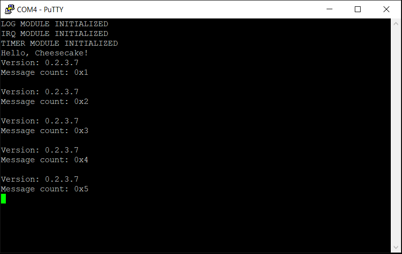

*Chapter Top* [Chapters[2]: Processor Initialization and Exceptions](chapter2.md)  |  *Next Chapter* [Chapters[3]: Memory Management Unit](../chapter03/chapter3.md)   
*Previous Page* [The Interrupt Controller](interrupt-controller.md)  |  *Next Page* [Chapters[3]: Memory Management Unit](../chapter03/chapter3.md)

## Timer Interrupts ([chapter2/code3](code3))

#### The System Timer

Timer interrupts are at the heart of any preemptive OS. Without them, processes would have to play kind and voluntarily yield the processor to others. A single processes could dominate a CPU. Fair scheduling would be a different game. In this slice we are going to utilize one of the Raspberry Pi 4 system timers to generate an interrupt at regular intervals. We choose to use `System Timer #3`. 

> Note: `System Timer #3` is the system timer used in the [RaspberryPiOS Linux Source](https://github.com/raspberrypi/linux/blob/rpi-5.10.y/drivers/clocksource/bcm2835_timer.c#L27). 

The peripheral is initialized in [arch/arm64/board/raspberry-pi-4/timer.c](code3/arch/arm64/board/raspberry-pi-4/timer.c):

```C
#define INTERRUPT_INTERVAL  (1000000)

extern unsigned int __timer_clock_low();
extern void __timer_control_reset();
extern void __timer_set_compare(unsigned int compare);

static unsigned int current;

void timer_init()
{
    current = __timer_clock_low();
    current += INTERRUPT_INTERVAL;
    __timer_set_compare(current);
}
```

The system timer has a 1MHz clock. Defining the `INTERRUPT_INTERVAL` as 1000000 will cause the corresponding interrupt line to trigger after one second. During initialization, the source calls down to the low-level device management assembly in [arch/arm64/board/raspberry-pi-4/timer.S](code3/arch/arm64/board/raspberry-pi-4/timer.S). First, the current 32-bit counter for the timer is retrieved with a call to `__timer_clock_low`, and then the compare value on which to assert an interrupt is updated by setting `__timer_set_compare`:

```asm
#define TIMER_BASE_REG  (MAIN_PERIPH_BASE + 0x2003000)
#define TIMER_CLO       ((TIMER_BASE_REG) + 0x4)
#define TIMER_C3        ((TIMER_BASE_REG) + 0x18)

.globl __timer_clock_low
__timer_clock_low:
    __MOV_Q         x0, TIMER_CLO
    __DEV_READ_32   w0, x0
    ret

.globl __timer_set_compare
__timer_set_compare:
    __MOV_Q         x1, TIMER_C3
    __DEV_WRITE_32  w0, x1
    ret
```

When a timer interrupt is received, the exception handler will call `timer_interrupt`: 

```C
void timer_interrupt()
{
    timer_init();
    __timer_control_reset();
}
```

The `timer_interrupt` function will reinitialize the timer for the next one-second interval. The `__timer_control_reset` function clears the interrupt line. Failing to do so would leave the interrupt asserted, causing the interrupt handler to execute as soon as interrupts are enabled, instead of after a full second:

```asm
#define TIMER_CS        ((TIMER_BASE_REG) + 0x0)

#define TIMER_CHANNEL   (3)
#define TIMER_CS_M3     (1 << (TIMER_CHANNEL))

.globl __timer_control_reset
__timer_control_reset:
    mov             w0, TIMER_CS_M3
    __MOV_Q         x1, TIMER_CS
    __DEV_WRITE_32  w0, x1
    ret
```

The registers we used here are found in _Chapter 10. System Timer_ of the [BCM2711 ARM Peripherals Manual](https://www.raspberrypi.org/documentation/hardware/raspberrypi/bcm2711/rpi_DATA_2711_1p0.pdf).

#### GIC Integration

Our code is tasteful, our will strong, and our hearts pure. But without more initialization, timer interrupts will not reach our processor. This is because all interrupts are managed by the _GIC_, and `System Timer #3` is not yet enabled for that interface. This is taken care of in [arch/arm64/board/raspberry-pi-4/irq.c](code3/arch/arm64/board/raspberry-pi-4/irq.c):

```C
#define SPID_TIMER3     (0x63)

extern void __irq_enable_spid(unsigned long spid);
extern void __irq_target_cpumask(unsigned long spid, unsigned long mask);

static void enable_irq_target_cpu()
{
    __irq_target_cpumask(SPID_TIMER3, CPU0_MASK);
}

static void init_irq_registers()
{
    __irq_enable_spid(SPID_TIMER3);
}

void irq_init()
{
    init_irq_registers();
    enable_irq_target_cpu();
}
```

The value 0x63 or 99 for `SPID_TIMER3` comes from _Chapter 6. Interrupts_ of the [BCM2711 ARM Peripherals Manual](https://www.raspberrypi.org/documentation/hardware/raspberrypi/bcm2711/rpi_DATA_2711_1p0.pdf):
- `System Timer #3` is VideoCore interrupt #3 (`pg. 85`).
- VideoCore IRQs begin at SPI (Shared Peripheral Interrupt) #96 (`pg. 87`).

The initialization function `irq_init` makes use of an expanded low-level interface from [arch/arm64/board/raspberry-pi-4/irq.S](code3/arch/arm64/board/raspberry-pi-4/irq.S):

```asm
.globl __irq_enable_spid
__irq_enable_spid:
    mov             x13, #5
    lsr             x1, x0, x13
    mov             x13, #2
    lsl             x1, x1, x13
    __MOV_Q         x3, GICD_ISENABLER_OFFSET
    add             x3, x3, x1
    and             w2, w0, #0x1f
    mov             x0, #1
    lsl             w2, w0, w2
    __DEV_WRITE_32  w2, x3
    isb
    ret
```

The `__irq_enable_spid` routine ensures the correct bit representing the desired interrupt is set in the correct `GICD_ISENABLERn` register. For example, with SPID 99:
- The value is first shifted right by five bits (divide by 32), leaving a value of three.
- This value is then shifted left by two bits (multiply by four), giving a value of twelve. 
- This value is added to the base `GICD_ISENABLER_OFFSET`. In this case, the result is equivalent to `GICD_ISENABLER3`. 
- The original value 99 has the least significant five bits masked (modulo 32), giving a value of three. 
- This is used as the shift value for a bit written to the calculated register, again, in this example, `GICD_ISENABLER3`.
- After bit three is set in `GICD_ISENABLER3`, `System Timer #3` is enabled with the distributor.
- Since the `GICD_ISENABLERn` registers are set-enable, there is no need to `orr` with the current value of the register.

The `__irq_target_cpumask` routine has similar logic to ensure the correct bits are set in the desired `GICD_ITARGETSRn` register. In our implementation, we set the input CPU mask to `CPU0_MASK` or 0b0001. The interrupt has been enabled with the _GIC_ distributor, but CPU 0 will be the only CPU enabled from the CPU interface side of the _GIC_. CPUs 1-3 will remain disabled, and will not be interrupted. The `GICD_ITARGETSRn` registers are _not_ set-enable, so an `orr` with the register's current value is required to avoid corrupting the state.

```asm
.globl __irq_target_cpumask
__irq_target_cpumask:
    mov             w3, #3
    and             w3, w0, w3
    lsl             w3, w3, #3
    lsl             w1, w1, w3
    mov             w3, #~(3)
    and             w2, w0, w3
    __MOV_Q         x3, GICD_ITARGETSR_OFFSET
    add             x3, x3, x2
    __DEV_READ_32   w4, x3
    orr             w4, w4, w1
    __DEV_WRITE_32  w4, x3
    isb
    ret
```

Back, to [arch/arm64/board/raspberry-pi-4/irq.c](code3/arch/arm64/board/raspberry-pi-4/irq.c), we spin in a loop handling all valid pending interrupt requests for the executing CPU:

```C
void handle_irq()
{
    do {
        unsigned int irq = __irq_acknowledge();
        unsigned int irqid = IRQ_IRQID_VALUE(irq);
        if(irqid < 1020) {
            __irq_end(irq);
            switch(irqid) {
                case SPID_TIMER3:
                    timer_interrupt();
                    break;
                default:
                    log("Encountered Undefined Interrupt: %x\r\n");
                    break;
            }
        }
        else {
            break;
        }
    } while(1);
}
```

If we receive a `System Timer #3` interrupt, we will call the `timer_interrupt` function from the timer module, reinitialize the timer countdown, and clear the interrupt line before returning. This code masks off the information from the interrupt acknowledgment such that the `irqid` variable contains only the interrupt id. As is suggested by the GIC Documentation, the entire value of `irq`, however, is written to the `GICD_EOIR`. When the `__irq_acknowledge` routine returns a value greater than or equal to 1020, no valid interrupt can be processed, and the loop terminates.

> Note: compare our `handle_irq` function with the one from the Linux Kernel [GIC source](https://github.com/torvalds/linux/blob/v4.20/drivers/irqchip/irq-gic.c#L353).

#### Last Step: Enabling IRQs

As we know, our computer boots with all _DAIF_ bits masked, so we will receive no interrupts until they are enabled. To help us, there is an architecture-specific low-level interface in [arch/arm64/irq.S](code3/arch/arm64/irq.S):

```asm
.global __irq_disable
__irq_disable:
    msr     daifset, #2
    ret

.globl __irq_enable
__irq_enable:
    msr     daifclr, #2
    ret

.global __wait_for_interrupt
__wait_for_interrupt:
    wfi
    dsb     sy
    isb
    ret
```

This interface is exported to the kernel through the macros in [arch/arm64/include/arch/irq.h](code3/arch/arm64/include/arch/irq.h):

```C
#ifndef _ARCH_IRQ_H
#define _ARCH_IRQ_H

#define IRQ_DISABLE         __irq_disable
#define IRQ_ENABLE          __irq_enable
#define WAIT_FOR_INTERRUPT  __wait_for_interrupt

extern void __irq_disable();
extern void __irq_enable();
extern void __wait_for_interrupt();

#endif
```

It is now possible to remove our ugly `DELAY` functionality in [src/cheescake.c](code3/src/cheesecake.c), and use `WAIT_FOR_INTERRUPT` instead:

```C
void cheesecake_main(void)
{
    unsigned long count = 1;
    char *version = "0.2.3.7";
    init();
    log("Hello, Cheesecake!\r\n");
    IRQ_ENABLE();
    while (1) {
        log("Version: %s\r\n", version);
        log("Message count: %x\r\n", count++);
        log("\r\n");
        WAIT_FOR_INTERRUPT();
    }
}
```

We now have IRQs enabled after `init`, and our `cheesecake_main` while loop waiting for interrupts on each iteration. Building and running should finally lead to a noticeable difference in output. The delay between each iteration through the loop should more reliably match approximately one second! And, if everything has gone right, it may well look something like:



*Previous Page* [The Interrupt Controller](interrupt-controller.md)  |  *Next Page* [Chapters[3]: Memory Management Unit](../chapter03/chapter3.md)  
*Chapter Top* [Chapters[2]: Processor Initialization and Exceptions](chapter2.md)  |  *Next Chapter* [Chapters[3]: Memory Management Unit](../chapter03/chapter3.md)
