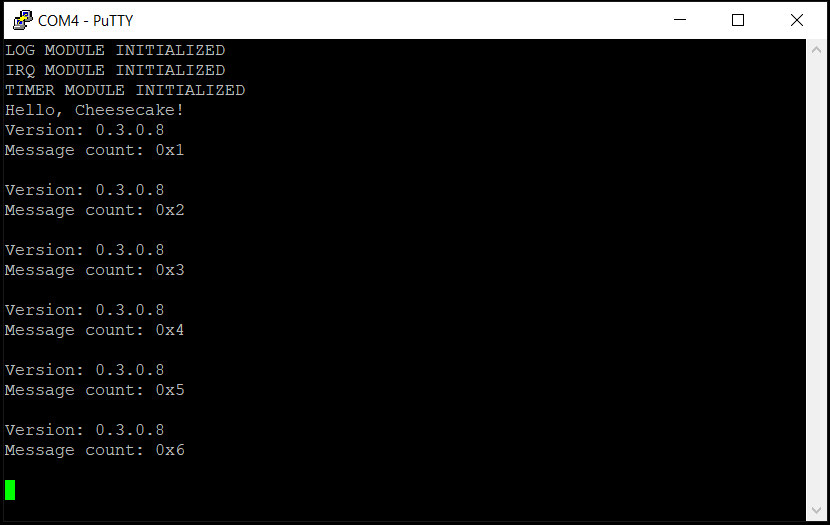

*Chapter Top* [Chapters[3]: Memory Management Unit](chapter3.md)  |  *Next Chapter* [Chapters[4]: Caches](../chapter04/chapter4.md)  
*Previous Page*  [ARM Page Tables](arm-page-tables.md) |  *Next Page* [Linear Mapping the Entire Physical Address Space](linear-mapping.md)

## Establishing Boot Tables([chapter3/code0](code0))

#### CheesecakeOS Configured Build System

The CheesecakeOS build system is significantly simpler than KBuild, the Linux build system. For our needs we create a configuration file of `key`=`value` pairs in [cheesecake.conf](code0/cheesecake.conf):

```bash
ccos4rbpi:~$ cat cheesecake.conf
PAGE_SHIFT=12
TEXT_OFFSET=0
VA_BITS=48
```

Configurations are exported to the build through a generated config header file. The source for the host program is located in [config/config.py](code0/config/config.py):

```python
#!/usr/bin/env python

import sys

print('#ifndef _CONFIG_CONFIG_H')
print('#define _CONFIG_CONFIG_H')
for line in sys.stdin:
    config = line.strip().split('=')
    print('#define {0}              {1}'.format(config[0], config[1]))
print('#endif')
```

This setup allows us to easily configure global compile-time constants as needed. The `config.h` header can be used anywhere, in architecture-specific or generic modules, without degrading the software design. The `PAGE_SHIFT` variable is immediately put to good use in the [arch/arm64/include/arch/page.h](code0/arch/arm64/include/arch/page.h) header:

```C
#ifndef _ARCH_PAGE_H
#define _ARCH_PAGE_H

#include "config/config.h"

#define PAGE_TABLE_LEVELS           (4)
#define TABLE_SHIFT                 (9)
#define PMD_SHIFT                   (PAGE_SHIFT + (1 * TABLE_SHIFT))
#define PUD_SHIFT                   (PAGE_SHIFT + (2 * TABLE_SHIFT))
#define PGD_SHIFT                   (PAGE_SHIFT + (3 * TABLE_SHIFT))

#define NUM_ENTRIES_PER_TABLE       ((UL(1)) << (TABLE_SHIFT))
#define TABLE_INDEX_MASK            ((NUM_ENTRIES_PER_TABLE) - 1)
#define PAGE_SIZE                   ((UL(1)) << PAGE_SHIFT)
#define PAGE_MASK                   (~((PAGE_SIZE) - 1))
#define SECTION_SIZE                ((UL(1)) << (PMD_SHIFT))
#define SECTION_MASK                (~((SECTION_SIZE) - 1))

#endif
```

`PAGE_SHIFT` determines the size of a page. A twelve-bit shift means 4KB pages. There are four page table levels and 512 entries per table.

#### Flexing with the Linker Script

The linker script, now a template in [arch/arm64/linker.template](code0/arch/arm64/linker.template) has taken on new responsibilities:

```C
#include "config/config.h"
#include "arch/bare-metal.h"
#include "arch/page.h"

#define IDMAP_DIR_SIZE              (PAGE_SIZE * (PAGE_TABLE_LEVELS - 1))
#define PAGE_GLOBAL_DIR_SIZE        (PAGE_SIZE * (PAGE_TABLE_LEVELS - 1))
```

The `arch/page.h` is included in order to use the `PAGE_TABLE_LEVELS` macro to calculate the space needed for the bootstrapping translation tables - set equal to the number of bytes for three pages: 12KB.

```C
OUTPUT_ARCH(aarch64)
ENTRY(_start)
SECTIONS
{
    . = TEXT_OFFSET;
    .text.boot : {
        _start = .;
        *(.text.boot)
    }
    .text : {
        . = ALIGN(PAGE_SIZE);
        _idmap_text_start = .;
        *(.idmap.text)
        _idmap_text_end = .;
        *(.text)
    }
```

A special `.idmap.text` section now appears. This section contains instructions in memory that are _id-mapped_ . In other words the code in this section will be setup in a translation table such that the virtual address resolves to equal the physical address. 

```C
    . = ALIGN(SECTION_SIZE);
    _kernel_text_end = .;
```

A _section_ is the size of a block one translation level above a page. In our case 2MB. It is also the block-size when we leave out one level of translation, using three levels instead of four. Our page table mappings for the kernel page tables will use section mappings, which is why we reserved only three pages worth of space for the initial tables.

```C
    .rodata : {
        *(.rodata)
    }
    .data : {
        *(.data)
    }
    . = ALIGN(PAGE_SIZE);
    page_global_dir = .;
    . += PAGE_GLOBAL_DIR_SIZE;
    end_page_global_dir = .;
```

At the end of the `.data` section, and before the `.bss` section, we statically allocate 12KB of space aligned to the size of a page. The space is bounded by the `page_global_dir` and `end_page_global_dir` addresses. There is room for one _PGD_, one _PUD_, and one _PMD_. Each entry in the _PMD_, recall, can map 2MB blocks - our math seems to be working so far! The base address, `page_global_dir`,  will ultimately be assigned to `TTBR1_EL1`.

```C
    . = ALIGN(0x8);
    bss_begin = .;
    .bss : {
        *(.bss*)
    }
    bss_end = .;
    . = ALIGN(PAGE_SIZE);
    init_stack = .;
    . += INIT_STACK_SIZE;
    . = ALIGN(SECTION_SIZE);
    _end_permenant_image = .;
    init_overwrite_storage = .;
    page_idmap_dir = .;
    . += IDMAP_DIR_SIZE;
    end_page_idmap_dir = .;
    . = ALIGN(SECTION_SIZE);
    _end = .;
}
```

After the `.bss` section, we allocate space for the initial stack for CPU 0. We also reserve an overwritable storage area. Here we create space for the identity mapping page tables, also with three pages. When no longer needed, the space can be returned to our memory allocator to service other allocation requests.

This template is made possible by a trick where we use the _C Preprocessor_ to process - but not compile - our template and place the resolution in the `.build` directory for further use by make. The magic can be found in the [Makefile](code0/Makefile):

```make
$(BUILD_DIR)/linker.ld: $(ARCH_SRC_DIR)/linker.template
    mkdir -p $(@D)
    gcc -E -x c \
        -I$(ARCH_INCLUDE_DIR)             \
        -I$(CONFIG_GEN_DIR)               \
        -D__LINKER__                      \
        $(ARCH_SRC_DIR)/linker.template | \
        grep -v "^#" > $(BUILD_DIR)/linker.ld
```

If you were to build the source at this moment and view the memory map in `.build/kernel8.map`, you should see the following included:

```
0000000000000000 T __entry
0000000000001000 T _idmap_text_end
0000000000001000 T _idmap_text_start
0000000000200000 R _kernel_text_end
0000000000201000 B page_global_dir
0000000000204000 B end_page_global_dir
0000000000400000 B _end_permenant_image
0000000000400000 B init_overwrite_storage
0000000000400000 B page_idmap_dir
0000000000403000 B end_page_idmap_dir
0000000000600000 B _end
```

Our alignment and sizes are looking as expected.

> Note: compare our linker page table setup to Linux in their [arm64 linker template](https://github.com/torvalds/linux/blob/v4.20/arch/arm64/kernel/vmlinux.lds.S#L141).

#### Loading the Boot Tables

In order to facilitate boot tables, additional useful macros are defined in [arch/arm64/include/arch/page.h](code0/arch/arm64/include/arch/page.h):

```C
#define PAGE_TABLE_AF               BIT_SET(10)
#define PAGE_TABLE_BLOCK            BIT_SET(0)
#define PAGE_TABLE_TABLE            (0b11)
#define PAGE_TABLE_SH               (0b11 << 8)
#define PAGE_TABLE_ATTR(n)          (n << 2)


#define NORMAL_INIT_MMU_FLAGS       PAGE_TABLE_AF | \
                                    PAGE_TABLE_SH | \
                                    PAGE_TABLE_ATTR((MT_NORMAL_NC)) | \
                                    PAGE_TABLE_BLOCK

#define MAIR(attr, mt)              ((attr) << ((mt) * 8))
#define MT_DEVICE_nGnRnE            (0)
#define MT_DEVICE_nGnRE             (1)
#define MT_DEVICE_GRE               (2)
#define MT_NORMAL_NC                (3)
#define MT_NORMAL                   (4)
#define MT_NORMAL_WT                (5)
#define MAIR_REGISTER_VALUE         MAIR(0b00000000, MT_DEVICE_nGnRnE) | \
                                    MAIR(0b00000100, MT_DEVICE_nGnRE) | \
                                    MAIR(0b00001100, MT_DEVICE_GRE) | \
                                    MAIR(0b01000100, MT_NORMAL_NC) | \
                                    MAIR(0b11111111, MT_NORMAL) | \
                                    MAIR(0b10111011, MT_NORMAL_WT)

#define TCR_T0SZ_SHIFT              (0)
#define TCR_T1SZ_SHIFT              (16)

#define TCR_T0SZ                    (((UL(64)) - (VA_BITS)) << (TCR_T0SZ_SHIFT))
#define TCR_IRGN0                   BIT_NOT_SET(9) | BIT_NOT_SET(8)
#define TCR_ORGN0                   BIT_NOT_SET(11) | BIT_NOT_SET(10)
#define TCR_SH0                     BIT_NOT_SET(13) | BIT_NOT_SET(12)
#define TCR_TG0                     BIT_NOT_SET(15) | BIT_NOT_SET(14)
#define TCR_T1SZ                    (((UL(64)) - (VA_BITS)) << (TCR_T1SZ_SHIFT))
#define TCR_A1                      BIT_NOT_SET(22)
#define TCR_IRGN1                   BIT_NOT_SET(25) | BIT_NOT_SET(24)
#define TCR_ORGN1                   BIT_NOT_SET(27) | BIT_NOT_SET(26)
#define TCR_SH1                     BIT_NOT_SET(29) | BIT_NOT_SET(28)
#define TCR_TG1                     BIT_SET(31) | BIT_NOT_SET(30)
#define TCR_IPS_48BIT               BIT_SET(34) | BIT_NOT_SET(33) | BIT_SET(32)
#define TCR_AS                      BIT_SET(36)

#define TCR_INIT_CONFIG             TCR_T0SZ | \
                                    TCR_IRGN0 | \
                                    TCR_ORGN0 | \
                                    TCR_SH0 | \
                                    TCR_TG0 | \
                                    TCR_T1SZ | \
                                    TCR_A1 | \
                                    TCR_IRGN1 | \
                                    TCR_ORGN1 | \
                                    TCR_SH1 | \
                                    TCR_TG1 | \
                                    TCR_IPS_48BIT | \
                                    TCR_AS
```

Enough scaffolding has been put in place to allow us to create our first page tables for use by the kernel. The work happens in [arch/arm64/main.S](code0/arch/arm64/main.S) with a series of new macros and routines:

```asm
#include "config/config.h"
#include "arch/page.h"

    .macro __ZERO_PAGE_TABLE, start, end
        adrp            x0, \start
        adrp            x1, \end
        sub             x1, x1, x0
    9999:
        stp             xzr, xzr, [x0], #16
        stp             xzr, xzr, [x0], #16
        stp             xzr, xzr, [x0], #16
        stp             xzr, xzr, [x0], #16
        subs            x1, x1, #64
        b.ne            9999b
    .endm


__create_page_tables:
    __ZERO_PAGE_TABLE   page_idmap_dir, end_page_idmap_dir
    __ZERO_PAGE_TABLE   page_global_dir, end_page_global_dir
```

The `__create_page_tables` routine begins by iterating through the entire 12KB of our `page_global_dir` and `page_idmap_dir` page tables, zeroing them 64 bytes at a time. We know, a priori, the boundaries and alignment of the page tables, so `adrp` is safe to use, and there is no need for additional alignment masking.

```
    .macro __CREATE_TABLE_ENTRY, tbl, virt, shift, num, tmp1, tmp2
        lsr     \tmp1, \virt, #\shift
        and     \tmp1, \tmp1, #\num - 1
        add     \tmp2, \tbl, #PAGE_SIZE
        orr     \tmp2, \tmp2, #PAGE_TABLE_TABLE
        str     \tmp2, [\tbl, \tmp1, lsl #3]
        add     \tbl, \tbl, #PAGE_SIZE
    .endm

    .macro __CREATE_PGD, tbl, virt, tmp1, tmp2
        __CREATE_TABLE_ENTRY    \tbl, \virt, PGD_SHIFT, NUM_ENTRIES_PER_TABLE, \tmp1, \tmp2
        __CREATE_TABLE_ENTRY    \tbl, \virt, PUD_SHIFT, NUM_ENTRIES_PER_TABLE, \tmp1, \tmp2
    .endm

    mov                 x7, NORMAL_INIT_MMU_FLAGS
    adrp                x0, page_idmap_dir
    adrp                x3, _idmap_text_start
    __CREATE_PGD        x0, x3, x5, x6
```

Next, the `__create_page_tables` routine places the value of `NORMAL_INIT_MMU_FLAGS` into `x7` for later use, and creates the _PGD_ for the identity mapping table. For now, the init flags configure the memory as non-cacheable (`MT_NORMAL_NC`). The caches are currently disabled, as we left those bits unset when entering `EL1`. We will update when we enable the caches in [Chapter Four](../chapter04/chapter4.md). 

For this first invocation of the  `__CREATE_PGD` macro, these values are used:
- `tbl`, or `x0`, is `page_idmap_dir`, we saw above from the kernel memory map that this is address `0x400000`
- `virt`, or `x3`, is `__idmap_text_start`, we saw above from the kernel memory map that this is address `0x1000`
- `x5` and `x6` are used as temporary scratch registers that can be clobbered, and are passed along to the `__CREATE_TABLE_ENTRY` macro

The `__CREATE_PGD` macro delegates all interesting work to the `__CREATE_TABLE_ENTRY` macro, which it uses twice, once with the `PGD_SHIFT`, once with `PUD_SHIFT`. In both cases, 512 is the number of entries per table, as previously discussed (4KB / 8-byte pointers).

The `__CREATE_TABLE_ENTRY` macro begins by calculating the index for the _PGD_ or _PUD_, logically shifting the virtual address to the right by the correct shift amount, then masking off all but the nine least significant bits. For the _PGD_, the correct shift amount is 39 bits, as bits 47-39 are the index. For the _PUD_, 30 is the shift amount. The index value then is saved in one of the temporary registers. The other temporary register stores the address to be placed in the index - the _PUD_ when inserting into the _PGD_, or the _PMD_ when inserting into the _PUD_. The next-level address is `orr`ed with 0x3, the value of `PAGE_TABLE_TABLE`, because they are valid entries pointing to tables instead of blocks. The last line of the macro increments the value of the table address stored in `x0`. We know after setting up the _PGD_ that:

- The _PGD_ index was ((0x1000 >> 39) & 0x1FF), or 0
- `tmp2` was ((0x400000 + 0x1000) | 0x3) or 0x401003
- The value stored in (0x400000 + (0 << 3)) is 0x401003
- `tbl` or `x0` is now equal to 0x400000 + 0x1000, 0x401000

After setting up the PUD:

- The PUD index was ((0x1000 >> 30) & 0x1FF), or 0
- `tmp2` was ((0x401000 + 0x1000) | 0x3) or 0x402003
- The value stored in (0x401000 + (0 << 3)) is 0x402003
- `tbl` or `x0` is now equal to 0x401000 + 0x1000, 0x402000

Continuing with our analysis of the `__create_page_tables` routine:

```asm
    .macro __BLOCK_MAP, tbl, flags, phys, start, end
        lsr     \start, \start, #PMD_SHIFT
        and     \start, \start, (NUM_ENTRIES_PER_TABLE - 1)
        lsr     \end, \end, #PMD_SHIFT
        and     \end, \end, (NUM_ENTRIES_PER_TABLE - 1)
        lsr     \phys, \phys, #PMD_SHIFT
        orr     \phys, \flags, \phys, lsl #PMD_SHIFT
     9998:
        str     \phys, [\tbl, \start, lsl #3]
        add     \start, \start, #1
        add     \phys, \phys, #SECTION_SIZE
        cmp     \start, \end
        b.ls    9998b
    .endm

    mov                 x5, x3
    __ADR_L             x6, _idmap_text_end
    __BLOCK_MAP         x0, x7, x3, x5, x6
    adrp                x0, page_global_dir
    __MOV_Q             x5, TEXT_OFFSET
    __CREATE_PGD        x0, x5, x3, x6
    adrp                x6, _end_permenant_image
    adrp                x3, _start
    sub                 x6, x6, x3
    add                 x6, x6, x5
    __BLOCK_MAP         x0, x7, x3, x5, x6
    dmb                 sy
    tlbi                vmalle1
    dsb                 sy
    isb
    ret
```

Having inserted the next translation level into the _PGD_ and _PUD_ of our identity mapping translation table, the `__BLOCK_MAP` macro is used to initialize the first few 2MB blocks of our kernel into the _PMD_. The values used as inputs into the macro:

- `tbl`, or `x0` is 0x402000, the value set after running the `__CREATE_TABLE_ENTRY` macros
- `flags` or `x7` is `NORMAL_INIT_MMU_FLAGS`, which will be `orr`ed to indicate to the memory system entries are blocks, inner sharable, accessible, valid, etc.
- `phys` or `x3` is 0x1000
- `start` or `x5` is the virtual address we are mapping, 0x1000, and it should be the same as the physical address as this is the identity mapping table
- `end` or `x6` is also 0x1000, the value of `_idmap_text_end`, as there is nothing yet in the `.idmap.text` section

Like its predecessor, the `__BLOCK_MAP` macro begins by calculating indexes into the _PMD_. Both start and end indexes. Since each _PMD_ entry points to a 2MB block, and there are 512 pointers, it is possible to map up to 1GB. Our assumption is the required mapping will safely fit within this 1GB, only one _PMD_ page is needed, with no additional indexes into the _PUD_. After establishing the bounds of the indexes to use, `phys`, or `x3`, is properly aligned by double shifting, first right and then left. The left shift is done as part of an `orr` instruction that sets the correct block descriptor attributes. This descriptor is stored in the correct index of the _PMD_, and loops. Adding `SECTION_SIZE` to the descriptor on each iteration maintains the correct descriptor attributes for each entry. For the identity mapping table we know:

- The start index is equal to ((0x1000 >> 21) & 0x1FF), or 0
- The end index is equal to ((0x1000 >> 21) & 0x1FF), or 0
- The descriptor to be stored is equal to (((0x1000 >> 21) << 21) | 0x70F), or 0x70F
- The value stored in (0x4020000 + (0 << 3)) is 0x70F
- The loop terminates after one iteration, and the table setup is complete

An identical procedure is used to setup the `page_global_dir`. There are some additional subtleties involved with initializing the `page_global_dir`, which are not yet transparent. We will revisit this at the end of the chapter when we have [enabled the MMU](mmu.md). After establishing these boot tables, at the end of the `__create_page_tables` routine, we invalidate the entire Translation Lookaside Buffer, or TLB, to ensure there are no stale entries left over on reset. We will dive deeper into TLB maintenance in [Chapter Nine](../chapter09/chapter9.md).

> Note: compare our page table setup routines with the Linux `arm64` [implementation](https://github.com/torvalds/linux/blob/v4.20/arch/arm64/kernel/head.S#L286).

In this slice we also take care to initialize `MAIR_EL1` and `TCR_EL1`. Again, most settings are for non-cacheable memory, which will need adjustment when caches are enabled:

```asm
__setup_mem_attrs:
    __MOV_Q     x5, MAIR_REGISTER_VALUE
    msr         mair_el1, x5
    dsb         sy
    isb
    ret

__setup_trans_ctrl:
    __MOV_Q     x5, TCR_INIT_CONFIG
    msr         tcr_el1, x5
    dsb         sy
    isb
    ret
```

We are not yet ready to turn on the Memory Management Unit. However, in this section we were sneaky and replaced the hardcoded initial stack with a dynamic stack area reserved by our linker template. So let us ensure at this juncture our operating system still builds and boots. If everything has gone right, you will see something resembling:



*Previous Page*  [ARM Page Tables](arm-page-tables.md) |  *Next Page* [Linear Mapping the Entire Physical Address Space](linear-mapping.md)  
*Chapter Top* [Chapters[3]: Memory Management Unit](chapter3.md)  |  *Next Chapter* [Chapters[4]: Caches](../chapter04/chapter4.md)
