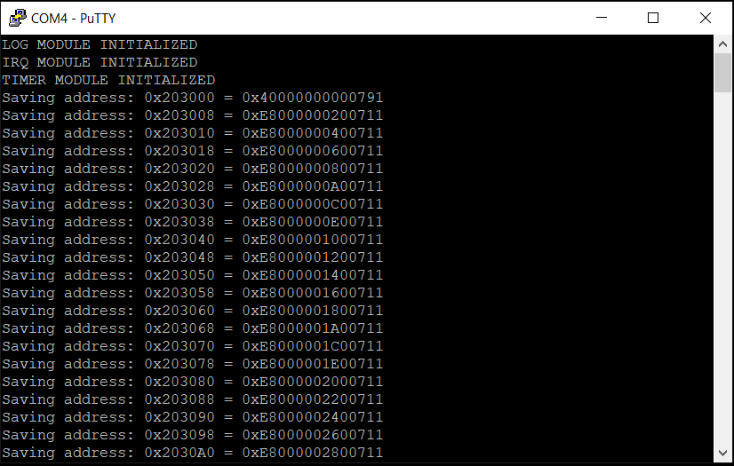

*Chapter Top* [Chapters[3]: Memory Management Unit](chapter3.md)  |  *Next Chapter* [Chapters[4]: Caches](../chapter4/chapter4.md)  
*Previous Page*  [Establishing Boot Tables](boot-tables.md) |  *Next Page* [Turning on the MMU](mmu.md)

## Linear Mapping the Entire Physical Address Space ([chapter3/code1](code1))

#### What We're Baking With
```bash
.
├── Makefile
├── arch
│   └── arm64
│       ├── allocate.c
│       ├── barrier.S
│       ├── board
│       │   └── raspberry-pi-4
│       │       ├── config.txt
│       │       ├── include
│       │       │   └── board
│       │       │       ├── bare-metal.h
│       │       │       ├── devio.h
│       │       │       ├── gic.h
│       │       │       └── peripheral.h
│       │       ├── irq.S
│       │       ├── irq.c
│       │       ├── memmap.c
│       │       ├── mini-uart.S
│       │       ├── mini-uart.c
│       │       ├── secure-boot.S
│       │       ├── timer.S
│       │       └── timer.c
│       ├── entry.S
│       ├── error.c
│       ├── exec
│       │   └── asm-offsets.c
│       ├── include
│       │   └── arch
│       │       ├── bare-metal.h
│       │       ├── irq.h
│       │       ├── linux-extension.h
│       │       ├── memory.h
│       │       ├── page.h
│       │       ├── process.h
│       │       └── prot.h
│       ├── irq.S
│       ├── linker.template
│       ├── main.S
│       └── memset.S
├── build.sh
├── cheesecake.conf
├── config
│   └── config.py
├── include
│   └── cake
│       ├── log.h
│       └── types.h
└── src
    ├── cheesecake.c
    └── log.c
```

In this section, we add an architecture-specific `allocate.c` module and a board-specific `memmap.c` module to faciliate the kernel's mapping of the entire physical address space.

#### The Raspberry Pi 4's Physical Address Space

In the previous section, we did the inital setup for the CheesecakeOS kernel's PGD. However, the only addresses that are mapped right now are in the kernel image. Other addresses are not yet mapped, such as the UART and GIC IO registers. Turning on the MMU, and accessing those addresses before they are properly mapped would cause a translation fault. We want the kernel to be aware of the entire physical address map. This will allow the kernel to manage all of the system's RAM for free memory allocation purposes, and communicate with all peripherals.

The Raspberry Pi 4's physical address map is described in the beginning of the [BCM2711 ARM Peripherals](https://www.raspberrypi.org/documentation/hardware/raspberrypi/bcm2711/rpi_DATA_2711_1p0.pdf) Guide. In our `config.txt` file, we configured `arm_peri_high`=`1`. The advantage of this configuration is that all Raspberry Pi 4s, regardless of amount of RAM memory (2GB, 4GB, 8GB), share the same memory map. The amount of memory supported by the build is a configuration option in [chessecake.conf](code1/cheesecake.conf). For the tutorial, we select 4GB, but you can choose the value for your specific Pi:

```bash
cat cheesecake.conf
MEMORY_SIZE=MEMORY_SIZE_4GB
PAGE_SHIFT=12
TEXT_OFFSET=0
VA_BITS=48
```

In order to build a memory map the kernel can use, two new structures are introduced in [arch/arm64/include/arch/memory.h](code1/arch/arm64/include/arch/memory.h):

```C
bare-metal.h"

#define MEM_TYPE_RESERVED               BIT_SET(0)
#define MEM_TYPE_SDRAM                  BIT_SET(1)
#define MEM_TYPE_CACHE                  BIT_SET(2)
#define MEM_TYPE_PERIPHERAL             BIT_SET(3)
#define MEM_TYPE_LOCAL_PERIPHERAL       BIT_SET(4)
#define MEM_TYPE_PCIE                   BIT_SET(5)

#define MEM_FLAGS_NONE                  (0)
#define MEM_FLAGS_CAKE                  BIT_SET(1)
#define MEM_FLAGS_CAKE_TEXT             BIT_SET(2)
#define MEM_FLAGS_OVERWRITE             BIT_SET(3)
#define MEM_FLAGS_BABY_BOOT             BIT_SET(4)
#define MEM_FLAGS_ENDMAP                BIT_SET(5)
#define MEM_FLAGS_TEXT                  BIT_SET(6)

struct address_region {
    unsigned long start;
    unsigned long size;
    unsigned long flags;
    unsigned long type;
};

struct address_map {
    struct address_region *map;
    unsigned long size;
};

#endif
```

The structures are generic to the `arm64` architecture, allowing for multiple memory-map support, extending beyond just the Raspberry Pi 4. The memory map we will use and the function to export it to the architecture are both defined in [arch/arm64/board/raspberry-pi-4/memmap.c](code1/arch/arm64/board/raspberry-pi-4/memmap.c):

```C
#define MEMORY_SIZE_2GB                 0x080000000
#define MEMORY_SIZE_4GB                 0x100000000
#define MEMORY_SIZE_8GB                 0x200000000

#define END_OF_USABLE_SDRAM             MEMORY_SIZE
#define VC_SDRAM_SIZE                   0x8000000
#define START_OF_VC_SDRAM               (0x40000000 - (VC_SDRAM_SIZE))

#define SET_BY_ARCH_AT_INIT             (0)

static struct address_region memory_map[] = {
    {
        .start = 0x0,
        .size = SET_BY_ARCH_AT_INIT,
        .flags = MEM_FLAGS_CAKE_TEXT,
        .type = MEM_TYPE_SDRAM
    },
    {
        .start = SET_BY_ARCH_AT_INIT,
        .size = SET_BY_ARCH_AT_INIT,
        .flags = MEM_FLAGS_CAKE,
        .type = MEM_TYPE_SDRAM
    },
    {
        .start = SET_BY_ARCH_AT_INIT,
        .size = SET_BY_ARCH_AT_INIT,
        .flags = MEM_FLAGS_OVERWRITE,
        .type = MEM_TYPE_SDRAM
    },
    {
        .start = SET_BY_ARCH_AT_INIT,
        .size = SET_BY_ARCH_AT_INIT,
        .flags = MEM_FLAGS_BABY_BOOT,
        .type = MEM_TYPE_SDRAM
    },
    {
        .start = SET_BY_ARCH_AT_INIT,
        .size = START_OF_VC_SDRAM - SET_BY_ARCH_AT_INIT,
        .flags = MEM_FLAGS_NONE,
        .type = MEM_TYPE_SDRAM
    },
    {
        .start = START_OF_VC_SDRAM,
        .size =  VC_SDRAM_SIZE,
        .flags = MEM_FLAGS_NONE,
        .type = MEM_TYPE_RESERVED
    },
    {
        .start = 0x40000000,
        .size = END_OF_USABLE_SDRAM - 0x40000000,
        .flags = MEM_FLAGS_ENDMAP,
        .type = MEM_TYPE_SDRAM
    },
    {
        .start = END_OF_USABLE_SDRAM,
        .size = 0x400000000 - END_OF_USABLE_SDRAM,
        .flags = MEM_FLAGS_NONE,
        .type = MEM_TYPE_RESERVED
    },
    {
        .start = 0x400000000,
        .size = 0x40000000,
        .flags = MEM_FLAGS_NONE,
        .type = MEM_TYPE_CACHE
    },
    {
        .start = 0x440000000,
        .size = 0x47C000000 - 0x440000000,
        .flags = 0,
        .type = MEM_TYPE_RESERVED
    },
    {
        .start = 0x47C000000,
        .size = 0x480000000 - 0x47C000000,
        .flags = 0,
        .type = MEM_TYPE_PERIPHERAL
    },
    {
        .start = 0x480000000,
        .size = 0x4C0000000 - 0x480000000,
        .flags = 0,
        .type = MEM_TYPE_CACHE
    },
    {
        .start = 0x4C0000000,
        .size = 0x500000000 - 0x4C0000000,
        .flags = 0,
        .type = MEM_TYPE_LOCAL_PERIPHERAL
    },
    {
        .start = 0x500000000,
        .size = 0x600000000 - 0x500000000,
        .flags = 0,
        .type = MEM_TYPE_RESERVED
    },
    {
        .start = 0x600000000,
        .size = 0x800000000 - 0x600000000,
        .flags = 0,
        .type = MEM_TYPE_PCIE
    }
};

static struct address_map raspberry_pi_4_address_map = {
    .map = (struct address_region *) memory_map,
    .size = (sizeof(memory_map) / sizeof(struct address_region))
};

struct address_map *addrmap()
{
    extern unsigned long _kernel_text_end[];
    extern unsigned long _end_permenant_image[];
    extern unsigned long _end[];
    struct address_region addr_region_zero = {
        .start = 0x0,
        .size = (unsigned long) _kernel_text_end,
        .flags = MEM_FLAGS_CAKE_TEXT,
        .type = MEM_TYPE_SDRAM
    };
    struct address_region addr_region_one = {
        .start = (unsigned long) _kernel_text_end,
        .size = (unsigned long) _end_permenant_image - (unsigned long) _kernel_text_end,
        .flags = MEM_FLAGS_CAKE,
        .type = MEM_TYPE_SDRAM
    };
    struct address_region addr_region_two = {
        .start = (unsigned long) _end_permenant_image,
        .size = (unsigned long) _end - (unsigned long) _end_permenant_image,
        .flags = MEM_FLAGS_OVERWRITE,
        .type = MEM_TYPE_SDRAM
    };
    struct address_region addr_region_three = {
        .start = (unsigned long) _end,
        .size = SECTION_SIZE,
        .flags = MEM_FLAGS_BABY_BOOT,
        .type = MEM_TYPE_SDRAM
    };
    memory_map[0] = addr_region_zero;
    memory_map[1] = addr_region_one;
    memory_map[2] = addr_region_two;
    memory_map[3] = addr_region_three;
    memory_map[4].start = (unsigned long) _end + SECTION_SIZE;
    memory_map[4].size -= (((unsigned long) _end) + SECTION_SIZE);
    return &raspberry_pi_4_address_map;
}

```

The first few regions have variable boundries, which are filled in by a combination of the `_end_kernel_text`, `_end_permenant_image`, and `_end` linker address variables, along with the `END_OF_USABLE_DRAM` macro, which takes on the value, in bytes, of the RAM configuration of our Raspberry Pi 4.


*Chapter Top* [Chapters[3]: Memory Management Unit](chapter3.md)  |  *Next Chapter* [Chapters[4]: Caches](../chapter4/chapter4.md)  
*Previous Page*  [Establishing Boot Tables](boot-tables.md) |  *Next Page* [Turning on the MMU](mmu.md)

#### The Baby-Boot Allocator

When setting up the inital boot tables, we statically allocated three pages - a one PGD, one PUD, and one PMD. This setup could map the first 1GB of memory, where the kernel image is loaded. The entire address space is larger than 1GB, however. The Raspberry Pi 4 memory map is 35 bits, or 32GB. Since we want to support multiple memory maps, we need to be able to dynamically allocate some memory to fill out the kernel's view of the address map. We create a baby-boot alloator in order to do so. The allocator structures and interface are setup in [arch/arm64/allocate.c](code1/arch/arm64/allocate.c):

```C
#define BABY_BOOT_SIZE  NUM_ENTRIES_PER_TABLE

static unsigned long baby_boot_allocator[BABY_BOOT_SIZE];
static unsigned int baby_boot_pointer = 0;

unsigned long alloc_baby_boot_pages(unsigned int numpages)
{
    unsigned long addr = 0;
    if(baby_boot_pointer + (numpages - 1) < NUM_ENTRIES_PER_TABLE) {
        addr = baby_boot_allocator[baby_boot_pointer];
        baby_boot_pointer += numpages;
    }
    return addr;
}
```

The baby-boot allocator, true to its name is as sweet as a baby. Simply, 512 pointers, the number that fit in a page, are statically allocated in the kernel image. Each pointer is itself a pointer to a page of memory. Each page can act as another PMD in our PGD, capable of mapping 1GB. There is no problem covering the complete memory map of a system like the Raspberry Pi 4, and similar small systems. Assuming the pointers are to sequential pages, the baby boot allocator has 2MB of memory to work with. This is exactly the amount of memory that was reserved in our Raspberry Pi 4 memory map that had the `MEM_FLAGS_BABY_BOOT` flag set. We placed it right after the end of the kernel image:

```C
    struct address_region addr_region_three = {
        .start = (unsigned long) _end,
        .size = SECTION_SIZE,
        .flags = MEM_FLAGS_BABY_BOOT,
        .type = MEM_TYPE_SDRAM
    };
```

The `paging_init` funtion is then responsible for

1. Initalizing the baby-boot allocator structures
2. Section-mapping the whole address map

```C
void paging_init()
{
    struct address_map *address_map = addrmap();
    struct address_region addrreg;
    for(unsigned int i = 0; i < address_map->size; i++) {
        addrreg = address_map->map[i];
        if(addrreg.flags & MEM_FLAGS_BABY_BOOT) {
            initialize_baby_boot_allocator(addrreg.start, addrreg.start + addrreg.size);
            break;
        }
    }
    for(unsigned int i = 0; i < address_map->size; i++) {
        addrreg = address_map->map[i];
        linear_map_region(&addrreg);
    }
}
```

The `paging_init` function loops through the `struct address region`s in the address map to find the one with the `MEM_FLAGS_BABY_BOOT` flag set. Then, initalizes the baby-boot array:

```C
static void initialize_baby_boot_allocator(unsigned long start, unsigned long end)
{
    unsigned int pmd_index;
    unsigned long *page_upper_dir, *page_middle_dir, *target_addr, next_addr = start;
    for(unsigned int i = 0; i < BABY_BOOT_SIZE; i++) {
        baby_boot_allocator[i] = next_addr;
        next_addr += PAGE_SIZE;
    }
    page_upper_dir = (unsigned long *) (*page_global_dir & (PAGE_MASK));
    page_middle_dir = (unsigned long *) (*page_upper_dir & (PAGE_MASK));
    pmd_index = (start >> (PMD_SHIFT)) & (TABLE_INDEX_MASK);
    target_addr = page_middle_dir + pmd_index;
    for(unsigned long i = start; i < end; i += SECTION_SIZE) {
        *(target_addr++) = (i | NORMAL_INIT_MMU_FLAGS);
    }
    __dsb_sy();
    memset((void *) start, 0, end - start);
}
```

Once the allocator setup is complete, the `paging_init` function can make use of the allocator, setting up the mappings for each region:

```C
static unsigned long linear_map_prot_flags(unsigned long memtype, unsigned long flags)
{
    unsigned long prot = 0;
    switch(memtype) {
        case MEM_TYPE_SDRAM:
            switch(flags) {
                case MEM_FLAGS_CAKE_TEXT:
                    prot = SECT_KERNEL_ROX;
                    break;
                default:
                    prot = SECT_KERNEL;
                    break;
            }
            break;
        default:
            prot = PROT_SECT_DEVICE_nGnRnE;
            break;
    }
    return prot;
}

static void linear_map_region(struct address_region *addrreg)
{
    unsigned long flags, start_addr, end_addr;
    if(addrreg->type != MEM_TYPE_RESERVED) {
        flags = linear_map_prot_flags(addrreg->type, addrreg->flags);
        start_addr = addrreg->start;
        end_addr = start_addr + addrreg->size;
        for(unsigned long i = start_addr; i < end_addr; i += SECTION_SIZE) {
            linear_map_section(i, flags);
        }
    }
}
```

Those sections that are flagged as `MEM_TYPE_RESERVED` cannot be used, and are skipped over. For those that do need mappings, the correct descriptor flags are calculated, and passed along to the `linear_map_section` function, for each 2MB section in the region:

```C
static void linear_map_section(unsigned long start, unsigned long flags)
{
    unsigned int pgd_index, pud_index, pmd_index;
    unsigned long pgd_raw_entry;
    unsigned long pud_phys_addr, *pud_virt_addr, pud_raw_entry;
    unsigned long pmd_phys_addr, *pmd_virt_addr;
    unsigned long baby_boot_addr;
    pgd_index = (start >> PGD_SHIFT) & (TABLE_INDEX_MASK);
    pgd_raw_entry = *(page_global_dir + pgd_index);
    pud_phys_addr = pgd_raw_entry & (RAW_PAGE_TABLE_ADDR_MASK);
    pud_virt_addr = (unsigned long *) pud_phys_addr;
```

The first step is to calculate the address of the PUD:

1. Calculate the index of start into the PGD
2. Retain the value of that index
3. Mask away bits 63-48 and 11-0 with the `RAW_PAGE_TABLE_ADDR_MASK`, leaving only the location of the PUD
4. Cast that unsigned long to a pointer to an unsigned long.

```C
    pud_index = (start >> PUD_SHIFT) & (TABLE_INDEX_MASK);
    pud_raw_entry = *(pud_virt_addr + pud_index);
    pmd_phys_addr = pud_raw_entry & RAW_PAGE_TABLE_ADDR_MASK;
    pmd_virt_addr = (unsigned long *) pmd_phys_addr;
```

The same algorithm is used to calculate the address of the PMD.

```C
    if(!pmd_phys_addr) {
        baby_boot_addr = alloc_baby_boot_pages(1);
        log("Allocated baby boot page: %x\r\n", baby_boot_addr);
        *(pud_virt_addr + pud_index) = (baby_boot_addr | PAGE_TABLE_TABLE);
        pmd_virt_addr = (unsigned long *) baby_boot_addr;
    }
```

If the PMD is not a valid address, as in, it is equal to the value 0, we allocate a baby-boot page and log that we have done so. Recall two points:

1. The PUD page was initalized to all 0s when setting up the boot table, so checking the PMD pointers in said PMD page for a falsey value is a valid check
2. The first PMD page representing the first 1GB of memory is already allocated, so no baby-boot page is allocated for the first 1GB

```C
    pmd_index = (start >> PMD_SHIFT) & (TABLE_INDEX_MASK);
    log("Saving address: %x = %x\r\n",
        (pmd_virt_addr + pmd_index),
        (start | flags));
    *(pmd_virt_addr + pmd_index) = (start | flags);
    __dsb_sy();
```

Finally, the index into the PMD page, which may have just been allocated, is used to store the physical address `start` that was passed into the function. This address is `or`ed logically with the protection flags for the section. These flags are defined in [arch/arm64/include/arch/prot.h](code1/arch/arm64/include/arch/prot.h):

```C
#ifndef _ARCH_PROT_H
#define _ARCH_PROT_H

#include "arch/bare-metal.h"
#include "arch/page.h"

#define PTE_VALID           BIT_SET(0)
#define PTE_DIRTY           BIT_SET(51)
#define PTE_WRITE           BIT_SET(55)
#define PTE_SPECIAL         BIT_SET(56)
#define PTE_USER            BIT_SET(6)
#define PTE_RDONLY          BIT_SET(7)
#define PTE_SHARED          BIT_SET(8) | BIT_SET(9)
#define PTE_AF              BIT_SET(10)
#define PTE_NG              BIT_SET(11)
#define PTE_DBM             PTE_DIRTY
#define PTE_CONT            BIT_SET(52)
#define PTE_PXN             BIT_SET(53)
#define PTE_UXN             BIT_SET(54)
#define PTE_TYPE_PAGE       PTE_VALID | BIT_SET(1)
#define PROT_PAGE_DEFUALT   (PTE_TYPE_PAGE | PTE_AF | PTE_SHARED)

#define PMD_TYPE_TABLE      PTE_VALID | BIT_SET(1)
#define PMD_TYPE_SECT       PTE_VALID | BIT_NOT_SET(1)
#define PMD_SECT_USER       PTE_USER
#define PMD_SECT_RDONLY     PTE_RDONLY
#define PMD_SECT_SHARED     PTE_SHARED
#define PMD_SECT_AF         PTE_AF
#define PMD_SECT_NG         PTE_NG
#define PMD_SECT_CONT       PTE_CONT
#define PMD_SECT_PXN        PTE_PXN
#define PMD_SECT_UXN        PTE_UXN
#define PROT_SECT_DEFAULT   (PMD_TYPE_SECT | PMD_SECT_AF | PMD_SECT_SHARED)

#define PROT_SECT_DEVICE_nGnRnE  (PROT_SECT_DEFAULT | \
                                  PMD_SECT_PXN | \
                                  PMD_SECT_UXN | \
                                  PAGE_TABLE_ATTR(MT_DEVICE_nGnRnE))

#define PROT_SECT_NORMAL         (PROT_SECT_DEFAULT | \
                                  PMD_SECT_PXN | \
                                  PMD_SECT_UXN | \
                                  PAGE_TABLE_ATTR(MT_NORMAL))

#define SECT_KERNEL         (PROT_SECT_NORMAL | PTE_DIRTY | PTE_WRITE)
#define SECT_KERNEL_ROX     ((PROT_SECT_NORMAL | PMD_SECT_RDONLY) & (~(PMD_SECT_PXN)))

#endif

```

For example, the first 2MB of memory are contained within a region flagged with `MEM_FLAGS_CAKE_TEXT`. For this region, we use `SECT_KERNEL_ROX`. For this type of memory, we carefully clear the `PXN` (Priveledged Execute Never) bit, and marked it as read-only.

#### Linear Mapping

When the `paging_init` function completes, the entire physical address space will be _linear mapped_ or _flat mapped_. These terms mean there is a constant offset between a virtual address and a physical address. So far, in this specific case, what we have done is _identity mapping_. As noted, identity mapping is a speical case of linear mapping where the constant offset between virtual and physical addresses is 0 - the two addresses are equal. This will change in the next section as we ultimately enable the Memory Mangement Unit. We will want all kernel address accesses to have 0xFFFF in the sixteen moste signigicant bits - not the case currently. Before we get there, let's serve up the lastest version of CheesecakeOS - chilled! If everything has gone right you should see something like:


