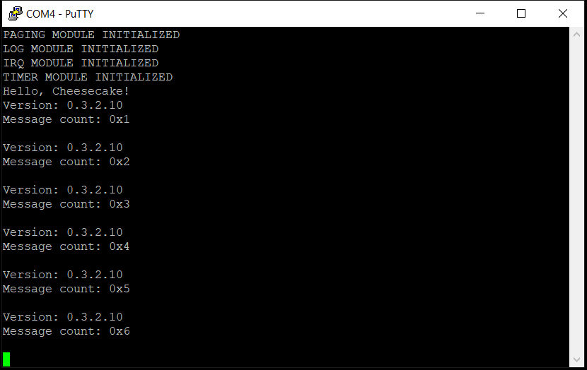

*Chapter Top* [Chapters[3]: Memory Management Unit](chapter3.md)  |  *Next Chapter* [Chapters[4]: Caches](../chapter4/chapter4.md)  
*Previous Page* [Linear Mapping the Entire Physical Address Space](linear-mapping.md) |  *Next Page* [Chapters[4]: Caches](../chapter4/chapter4.md)

## Turning On the MMU ([chapter3/code1](code1))

#### What We're Baking With
```bash
tree
.
├── Makefile
├── arch
│   └── arm64
│       ├── allocate.c
│       ├── barrier.S
│       ├── board
│       │   └── raspberry-pi-4
│       │       ├── config.txt
│       │       ├── include
│       │       │   └── board
│       │       │       ├── bare-metal.h
│       │       │       ├── devio.h
│       │       │       ├── gic.h
│       │       │       └── peripheral.h
│       │       ├── irq.S
│       │       ├── irq.c
│       │       ├── memmap.c
│       │       ├── mini-uart.S
│       │       ├── mini-uart.c
│       │       ├── secure-boot.S
│       │       ├── timer.S
│       │       └── timer.c
│       ├── cache.S
│       ├── entry.S
│       ├── error.c
│       ├── exec
│       │   └── asm-offsets.c
│       ├── include
│       │   └── arch
│       │       ├── bare-metal.h
│       │       ├── cache.h
│       │       ├── irq.h
│       │       ├── linux-extension.h
│       │       ├── memory.h
│       │       ├── page.h
│       │       ├── process.h
│       │       └── prot.h
│       ├── irq.S
│       ├── linker.template
│       ├── main.S
│       ├── memset.S
│       └── sync.c
├── build.sh
├── cheesecake.conf
├── config
│   └── config.py
├── include
│   └── cake
│       ├── log.h
│       └── types.h
└── src
    ├── cheesecake.c
    └── log.c
```

At long last we are going to enable the Memory Management Unit and use virtual addresses. We also add an error catching function to inform us when we access a bad address.

#### From Physical to Virtual Addresses

The world changes the very instruction the MMU is enabled. From that point all address are virtual addresses. We have already identity mapped the entire address space. However, when working with the ARM architecture, we want each of our kernel's memory accesses to have all 1s in the sixteen most significant bits, so our processor will select the PGD stored in `TTBR1_EL1`. In order to help, there are new macros in [arch/arm64/include/arch/bare-metal.h](code2/arch/arm64/include/arch/bare-metal.h):

```C
#define LINEAR_ADDR_MASK    ((UL(1) << (VA_BITS)) - 1)
#define VADDR_START         (~(LINEAR_ADDR_MASK))
#define VIRT_TO_PHYS(virt)  ((virt) & (LINEAR_ADDR_MASK))
#define PHYS_TO_VIRT(phys)  ((phys) | (VADDR_START))
```

We can use these macros to
- Update our kernel's page tables from an _identity mapping_ to a _linear mapping_ where the constant offset is `0xFFFF_0000_0000_0000`
- Have our kernel page table virtual addresses exist in the `TTBR0_EL1` range
- Find the kernel's virtual address for any given physical address
- Calculate the physical address of any address the kernel would use

Our first is to update the starting address in our [arch/arm64/linker.template](code2/arch/arm64/linker.template):

```C
OUTPUT_ARCH(aarch64)
ENTRY(_start)
SECTIONS
{
    . = VADDR_START + TEXT_OFFSET;
    .text.boot : {
        _start = .;
        *(.text.boot)
    }
```

Importantly, the `_start` address here is not used as the location in RAM from which to begin executing instructions. The bootloader will still load the kernel at address 0x0. From there, `adr` and `adrp` instruction will load PC-relative addresses. Thus, when we setup our initial boot tables, we will be using physical addresses. Page tables must be build from physical addresses, essential to avoid an intractable chicken-and-egg problem. We next use the `PHYS_TO_VIRT` macro to convert the addresses from the Raspberry Pi 4 address map to virtual addresses when filling out the kernel's PGD. The `linear_map_section` function in [arch/arm64/allocate.c](code2/arch/arm64/allocate.c) now reads:

```C
static void linear_map_section(unsigned long start, unsigned long flags)
{
    unsigned int pgd_index, pud_index, pmd_index;
    unsigned long pgd_raw_entry;
    unsigned long pud_phys_addr, *pud_virt_addr, pud_raw_entry;
    unsigned long pmd_phys_addr, *pmd_virt_addr;
    unsigned long baby_boot_addr;
    pgd_index = (start >> PGD_SHIFT) & (TABLE_INDEX_MASK);
    pgd_raw_entry = *(page_global_dir + pgd_index);
    pud_phys_addr = pgd_raw_entry & (RAW_PAGE_TABLE_ADDR_MASK);
    pud_virt_addr = (unsigned long *) PHYS_TO_VIRT(pud_phys_addr);
```

The first deviation from our previous identity mapping algorithm is to convert the _physical_ PUD address (setup earlier within the `__create_page_tables` routine) to the correct _virtual_ address with our `PHYS_TO_VIRT` offset. This is necessary - the MMU is already on at this point, so all address references must be virtual addresses! Dereferencing the physical address would be a fault.

```C
    pud_index = (start >> PUD_SHIFT) & (TABLE_INDEX_MASK);
    pud_raw_entry = *(pud_virt_addr + pud_index);
```

After converting the PUD to a virtual address, we are able to dereference our pointer to get the `pud_raw_entry` that will serve as a reference to the PMD.

```C
    pmd_phys_addr = pud_raw_entry & (RAW_PAGE_TABLE_ADDR_MASK);
    pmd_virt_addr = (unsigned long *) PHYS_TO_VIRT(pmd_phys_addr);
    if(!pmd_phys_addr) {
        baby_boot_addr = alloc_baby_boot_pages(1);
        *(pud_virt_addr + pud_index) = (baby_boot_addr | PAGE_TABLE_TABLE);
        pmd_virt_addr = (unsigned long *) PHYS_TO_VIRT(baby_boot_addr);
    }
```

The PMD is handled the same way as the PUD. If the PMD was not previously allocated, the physical address will be 0x0, and a baby-boot page is allocated to initialize it. The `pmd_virt_addr` is updated to reflect the virtual address of the freshly allocated PMD that will hold the 2MB section mappings.

```C
    pmd_index = (start >> PMD_SHIFT) & (TABLE_INDEX_MASK);
    *(pmd_virt_addr + pmd_index) = (start | flags);
    __tlbi_vmalle1();
}
```

The function ends by placing a refernce to the physical start of the 2MB section in the proper PMD index, `or`ed with the desired flags, and flushing the Translation Lookaside Buffer. This flush is required in the case translation attributes of existing entires were updated. A similar pattern is used to initalize the baby-boot allocator as well:

```C
static void initialize_baby_boot_allocator(unsigned long start, unsigned long end)
{
    unsigned int pmd_index;
    unsigned long *page_upper_dir, *page_middle_dir, *target_addr, next_addr = start;
    for(unsigned int i = 0; i < BABY_BOOT_SIZE; i++) {
        baby_boot_allocator[i] = next_addr;
        next_addr += PAGE_SIZE;
    }
    page_upper_dir = (unsigned long *) PHYS_TO_VIRT((*page_global_dir & (PAGE_MASK)));
    page_middle_dir = (unsigned long *) PHYS_TO_VIRT((*page_upper_dir & (PAGE_MASK)));
    pmd_index = (start >> (PMD_SHIFT)) & (TABLE_INDEX_MASK);
    target_addr = page_middle_dir + pmd_index;
    for(unsigned long i = start; i < end; i += SECTION_SIZE) {
        *(target_addr++) = (i | NORMAL_INIT_MMU_FLAGS);
    }
    __dsb_sy();
    memset((void *) PHYS_TO_VIRT(start), 0, end - start);
}
```

Not to be left behind, all peripheral/device address references are virtualized. For example, the function to write to the mini UART in [arch/arm64/board/raspberry-pi-4/mini-uart.S](code2/arch/arm64/board/raspberry-pi-4/mini-uart.S) is now:

```asm
.globl __uart_putchar
__uart_putchar:
    __MOV_Q         x1, PHYS_TO_VIRT(AUX_MU_IO_REG)
    __DEV_WRITE_8   w0, x1
    ret
```

#### The *.idmap.text* Section

Previously, we insisted on creating two page tables at boot time, one of them for the purpose of _identity mapping_ this strange, and, before now, unused `.idmap.text` section. We now make the most of this section in [arch/arm64/main.S](arch/arm64/main.S):

```asm
__el1entry:
    mrs     x0, mpidr_el1
    and     x0, x0, #MPIDR_HWID_MASK_LITE
    cbz     x0, __primary_init
    b       __sleep

.section ".idmap.text"

__primary_init:
    bl      __create_page_tables
    bl      __setup_mem_attrs
    bl      __setup_trans_ctrl
    bl      __turnon_mmu
    ldr     x8, =__run
    br      x8

```

The `__el1entry` routine, which previously branched to the `__run` routine for the primary CPU, now instead branches to the `__primary_init` routine. This routine, and everything it calls before branching to `__run` is contained within the `.idmap.text` section - and, is therefore mapped within the `page_idmap_dir`. The first three setup routines, `__create_page_tables`, `__setup_mem_attrs`, and `__setup_trans_ctrl` have already been disected. There is one sublety that can be illuminated at this time:

```asm
    adrp                x0, page_idmap_dir
    adrp                x3, _idmap_text_start
    __CREATE_PGD        x0, x3, x5, x6
    mov                 x5, x3
    __ADR_L             x6, _idmap_text_end
    __BLOCK_MAP         x0, x7, x3, x5, x6
    adrp                x0, page_global_dir
    __MOV_Q             x5, VADDR_START + TEXT_OFFSET
    __CREATE_PGD        x0, x5, x3, x6
    adrp                x6, _end_permenant_image
    adrp                x3, _start
    sub                 x6, x6, x3
    add                 x6, x6, x5
    __BLOCK_MAP         x0, x7, x3, x5, x6
```

There is a slight difference is how the bounds of the `page_idmap_dir` and the `page_gloabl_dir` are setup for the `__BLOCK_MAP` macro. For the `page_idmap_dir`, the bounds are calculated with simple `adrp` instructions. These are PC-relative calculations before the MMU is enabled, so they will be physical addresses, relative to the current instruction pointer. This is the desired outcome because the `page_idmap_dir` is identity mapping physical addresses. We use a different approach to get the bounds of the `page_global_dir` mapping. Beginning by loading the `VADDR_START + TEXT_OFFSET` value directly into `x5`, the end address is then calculated by adding the difference between the physical start and end of the kernel image. I am fairly certain this is not neccessary, as the virtual addresses in this case are used only to calculate indexes. The virtual offset is not used. *_BUT_* - this is how Linux does it! So we might as well do it the same way.

To finally enable the MMU:

```
__turnon_mmu:
    adrp    x1, page_idmap_dir
    adrp    x2, page_global_dir
    msr     ttbr0_el1, x1
    msr     ttbr1_el1, x2
    dsb     sy
    isb
    mrs     x0, sctlr_el1
    orr     x0, x0, #MMU_M_FLAG
    msr     sctlr_el1, x0
    dsb     sy
    isb
    ic      iallu
    dsb     sy
    isb
    ret
```

The `page_idmap_dir` is loaded into `TTBR0_EL1`, and will be used for all virtual addresses where the sixteen most significant bits are all 0s. The `page_global_dir` is loaded into `TTBR1_EL1`, and will be used to translate all virtual addresses where the sixteen most significant bits are all 1s. The `M` flag of `SCTLR_EL1` is set, and loaded. Immediately after this instruction, every address reference is a virtual address. The program counter was pointing to an address with all `0s` in the first sixteen significant bits. Also `x30`, the register that holds the return address to return from the `__turnon_mmu` routine branch has an address with all `0s` in the first sixteen bits. This is why we bothered to create and map an identity-mapping section. We are covered for right after we turn the MMU on! There are no translation faults as these addresses are successfully translated by the `page_idmap_dir` stored in TTBR0_EL1.

After returning, we load the value of the `__run` routine address from a literal pool that has stored its value based on the `_start` defined in the linker template. It will have a value where the first sixteen bits are all 1s. After branching to `__run`, the `page_global_dir` stored in `TTBR1_EL1` will be the dominant translation engine.

We now need to switch the order of initalization in the `init` function in [src/cheesecake.c](code2/src/cheesecake.c):

```C
static void init()
{
    paging_init();
    log_init();
    log("PAGING MODULE INITIALIZED\r\n");
    log("LOG MODULE INITIALIZED\r\n");
    irq_init();
    log("IRQ MODULE INITIALIZED\r\n");
    timer_init();
    log("TIMER MODULE INITIALIZED\r\n");
}
```

Before anything can be logged, the logging module needs to be initalized. Before the logging device can be accessed, however, the virtual address must be properly mapped into the `page_global_dir` PGD to avoid translation faults. Thus, setting up the linear map runs first. If we have approached this problem clearly, and avoided any bugs, we will have smoothly converted our little operating system to using virtual addresses, and will be able to enjoy the fruits of doing so as we continue on. If everything has gone spectacularly well, when you build and run the source, your output should resemble:




#### Error Catching

As CheesecakeOS develops, it might be handy to have a small troubleshooting aid. A new routine has been added to the vector table in [arch/arm64/entry.S](code2/arch/arm64/entry.S):

```asm
.align 11
.global vectors
vectors:
    __VECTABLE_ENTRY    __invalid_entry
    __VECTABLE_ENTRY    __invalid_entry
    __VECTABLE_ENTRY    __invalid_entry
    __VECTABLE_ENTRY    __invalid_entry
    __VECTABLE_ENTRY    __sync_el1h
    __VECTABLE_ENTRY    __irq_el1h
    __VECTABLE_ENTRY    __invalid_entry
    __VECTABLE_ENTRY    __invalid_entry
    __VECTABLE_ENTRY    __invalid_entry
    __VECTABLE_ENTRY    __invalid_entry
    __VECTABLE_ENTRY    __invalid_entry
    __VECTABLE_ENTRY    __invalid_entry
    __VECTABLE_ENTRY    __invalid_entry
    __VECTABLE_ENTRY    __invalid_entry
    __VECTABLE_ENTRY    __invalid_entry
    __VECTABLE_ENTRY    __invalid_entry

__sync_el1h:
    mrs     x0, esr_el1
    mrs     x1, far_el1
    bl      handle_sync
    b       __exception_hang
```

The _Exception Syndrome Register_ and the `Fault Address Register` are passed to `handle_sync` function, defined in the new [arch/arm64/sync.c](code2/arch/arm64/sync.c):

```C
void handle_sync(unsigned long esr, unsigned long far)
{
    char *abort_fault_status;
    unsigned long errorcode, iss, fsc;
    errorcode = ESR_EC_VALUE(esr);
    iss = ESR_ISS_VALUE(esr);
    char *err_message = errorcodes[errorcode];
    log("%s\r\n", err_message);
    switch(errorcode) {
        case SYNC_INSTRUCTION_ABORT_SAME_100001:
            fsc = INSTRUCTION_ABORT_IFSC_VALUE(iss);
            abort_fault_status = faultstatus[fsc];
            log("%s\r\n", abort_fault_status);
            log("Fault Address Register: %x\r\n", far);
            break;
        case SYNC_DATA_ABORT_SAME_100101:
            fsc = DATA_ABORT_DFSC_VALUE(iss);
            abort_fault_status = faultstatus[fsc];
            log("%s\r\n", abort_fault_status);
            log("Fault Address Register: %x\r\n", far);
            break;
        default:
            log("No futher comment\r\n");
            break;
    }
}
```      

In the unfathomable case we commit a programming error that leads to referencing or deferencing a faulting address, we should land here to get more information about our blunder.

*Chapter Top* [Chapters[3]: Memory Management Unit](chapter3.md)  |  *Next Chapter* [Chapters[4]: Caches](../chapter4/chapter4.md)  
*Previous Page* [Linear Mapping the Entire Physical Address Space](linear-mapping.md) |  *Next Page* [Chapters[4]: Caches](../chapter4/chapter4.md)
