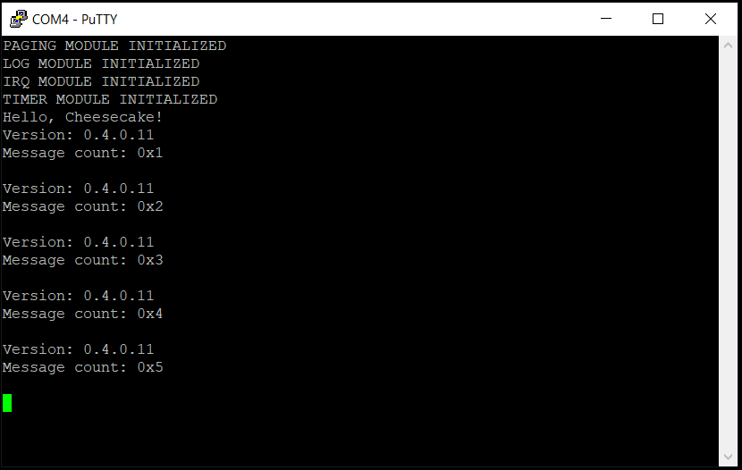

*Previous Top* [Chapters[4]: Caches](chapter4.md) | *Next Chapter* [Chapters[5]: SMP](../chapter05/chapter5.md)  
*Previous Page* [Chapters[4]: Caches](chapter4.md) | *Next Page* [Chapters[5]: SMP](../chapter05/chapter5.md)

## Enabling the Caches

#### Invalidating the Entire Cache to the Point of Coherency

A key concept with respect to caching is coherency. The Raspberry Pi 4 has four CPU cores, each with two L1-caches, one for data one for instructions. There is also a shared, unified L2-cache used by all of the CPUs. We would like all of these caches to be _coherent_ with each other - in other words, we want them all to give the same answer when we read, and effectively broadcast updates to one another when we write. We want them all to share the same view of the memory system. ARM architectures that use caches and reference virtual addresses define a _Point of Coherency_, or _PoC_. This is the point at which all observers that can access memory are guaranteed to see the same copy of a memory location. Typically, the _PoC_ is the main external system memory, also true for our Raspberry Pi 4 device. The ARM Programmer's Guide section on [Cache Maintenence](https://developer.arm.com/documentation/den0024/a/Caches/Cache-maintenance) provides a generic routine for invalidating the entire cache to the _PoC_, a task we take care to perform on startup, to be certain there are no unsavory reset values stuck in the caches. We take ARM's example code, and bake it into [arch/arm64/board/raspberry-pi-4/secure-boot.S](code0/arch/arm64/board/raspberry-pi-4/secure-boot.S):

```asm
__invalidate_caches:
    mrs     x0, clidr_el1
    and     w3, w0, #0x07000000
    lsr     w3, w3, #23
    cbz     w3, 5f
    mov     w10, #0
    mov     w8, #1
1:
    add     w2, w10, w10, lsr #1
    lsr     w1, w0, w2
    and     w1, w1, #0x7
    cmp     w1, #2
    b.lt    4f
    msr     csselr_el1, x10
    isb
    mrs     x1, ccsidr_el1
    and     w2, w1, #7
    add     w2, w2, #4
    ubfx    w4, w1, #3, #10
    clz     w5, w4
    lsl     w9, w4, w5
    lsl     w16, w8, w5
2:
    ubfx    w7, w1, #13, #15
    lsl     w7, w7, w2
    lsl     w17, w8, w2
3:
    orr     w11, w10, w9
    orr     w11, w11, w7
    dc      isw, x11
    subs    w7, w7, w17
    b.ge    3b
    subs    x9, x9, x16
    b.ge    2b
4:
    add     w10, w10, #2
    cmp     w3, w10
    dsb     sy
    b.gt    1b
5:
    dsb     sy
    isb
    ret
```

#### Flipping the Cache Switch

A few adjustments to cacheability attributes in [arch/arm64/include/arch/page.h](code0/arch/arm64/include/arch/page.h) - from caching disabled to caching enabled - will help us forward. For example, we change the `NORMAL_INIT_MMU` flags to use `MT_NORMAL` attributes of `MAIR_EL1`, instead of the previously configured `MT_NORMAL_NC`:

```C
#define NORMAL_INIT_MMU_FLAGS       PAGE_TABLE_AF | \
                                    PAGE_TABLE_SH | \
                                    PAGE_TABLE_ATTR((MT_NORMAL)) | \
                                    PAGE_TABLE_BLOCK

#define MT_NORMAL_NC                (3)
#define MT_NORMAL                   (4)

#define MAIR_REGISTER_VALUE         MAIR(0b00000000, MT_DEVICE_nGnRnE) | \
                                    MAIR(0b00000100, MT_DEVICE_nGnRE) | \
                                    MAIR(0b00001100, MT_DEVICE_GRE) | \
                                    MAIR(0b01000100, MT_NORMAL_NC) | \
                                    MAIR(0b11111111, MT_NORMAL) | \
                                    MAIR(0b10111011, MT_NORMAL_WT)
```

We have also made some updates to table-walk cacheability in `TCR_EL1`. We conclude by enabling the caches in [arch/arm64/main.S](code0/arch/arm64/main.S). Before setting the bits in `SCTLR_EL1`, there are two cache cleaning operations we perform, both in the `__create_page_tables` routine. We clean the cache entries for the page tables, once before populating them, and once after:

```asm
__create_page_tables:
    mov                 x28, x30
    __INVAL_D_CACHE     page_idmap_dir, end_page_idmap_dir
    __INVAL_D_CACHE     page_global_dir, end_page_global_dir
    __ZERO_PAGE_TABLE   page_idmap_dir, end_page_idmap_dir
    __ZERO_PAGE_TABLE   page_global_dir, end_page_global_dir
    mov                 x7, NORMAL_INIT_MMU_FLAGS
    adrp                x0, page_idmap_dir
    adrp                x3, _idmap_text_start
    __CREATE_PGD        x0, x3, x5, x6
    mov                 x5, x3
    __ADR_L             x6, _idmap_text_end
    __BLOCK_MAP         x0, x7, x3, x5, x6
    adrp                x0, page_global_dir
    __MOV_Q             x5, VADDR_START + TEXT_OFFSET
    __CREATE_PGD        x0, x5, x3, x6
    adrp                x6, _end_permenant_image
    adrp                x3, _start
    sub                 x6, x6, x3
    add                 x6, x6, x5
    __BLOCK_MAP         x0, x7, x3, x5, x6
    dmb                 sy
    tlbi                vmalle1
    dsb                 sy
    isb
    __INVAL_D_CACHE     page_idmap_dir, end_page_idmap_dir
    __INVAL_D_CACHE     page_global_dir, end_page_global_dir
    mov                 x30, x28
    ret
```

We invalidate the cache before populating the page tables for the same reason we do so in the `secure-boot` code. We do not want to make a reference to a stale cache line from reset and load an inadvertent value. While we already took care to completely clean the caches is the `secure-boot`, the architecture should not assume this has already happened at the board level.

Because the MMU is still off and caches are not yet enabled at this point all memory accesses are still non-cacheable, and cacheability configuration is ignored. There could be speculatively loaded cache lines after the page tables are populated. For this reason, we invalidate the caches once more. The code that does the invalidation work is located in [arch/arm64/cache.S](code0/arch/arm64/cache.S):

```asm
.globl __invalidate_dcache_range
__invalidate_dcache_range:
    add     x1, x1, x0
    mrs     x3, ctr_el0
    ubfm    x3, x3, #16, #19
    mov     x2, #4
    lsl     x2, x2, x3
    sub     x3, x2, #1
    tst     x1, x3
    bic     x1, x1, x3
    b.eq    1f
    dc      civac, x1
1:  
    tst     x0, x3
    bic     x0, x0, x3
    b.eq    2f
    dc      civac, x0
    b       3f
2:  
    dc      ivac, x0
3:  
    add     x0, x0, x2
    cmp     x0, x1
    b.lo    2b
    dsb     sy
    ret
```

> Note: see comment in Linux `__create_page_tables` routine about [cache cleaning](https://github.com/torvalds/linux/blob/v4.20/arch/arm64/kernel/head.S#L390).

Back in `arch/arch64/main.S`, the caches are enabled at the same time as the MMU by setting the `CACHE_C_FLAG` and `CACHE_I_FLAG` in the `__turnon_mmu` routine:

```asm
    mrs     x0, sctlr_el1
    orr     x0, x0, #MMU_M_FLAG
    orr     x0, x0, #CACHE_C_FLAG
    orr     x0, x0, #CACHE_I_FLAG
    msr     sctlr_el1, x0
```

After jumping though these hoops, building, and running, hopefully you see something like:



*Previous Page* [Chapters[4]: Caches](chapter4.md) | *Next Page* [Chapters[5]: SMP](../chapter05/chapter5.md)  
*Previous Top* [Chapters[4]: Caches](chapter4.md) | *Next Chapter* [Chapters[5]: SMP](../chapter05/chapter5.md)
