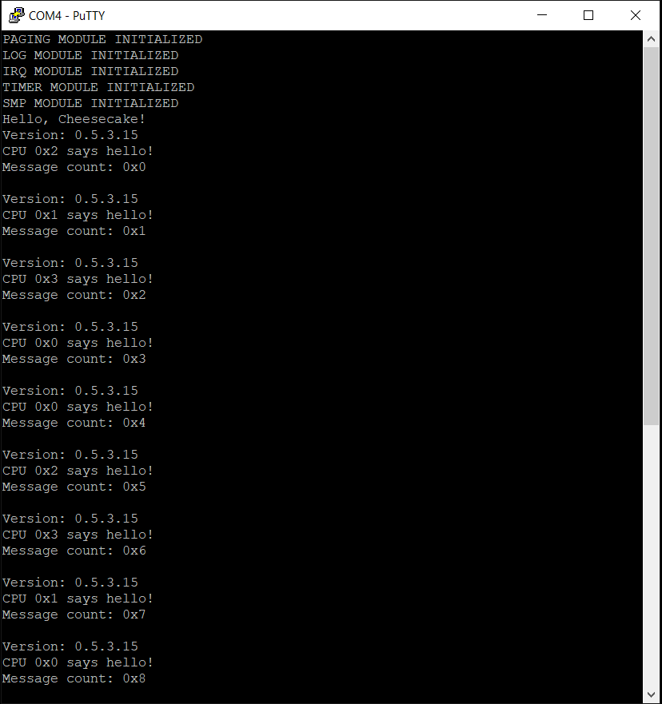

*Chapter Top* [Chapters[5]: SMP](chapter5.md) | *Next Chapter* [Chapters[6]: Memory Allocation](../chapter6/chapter6.md)  
*Previous Page* [Spinlocks](spinlocks.md) | *Next Page* [Chapters[6]: Memory Allocation](atomics-ordering.md)

## Atomics and Ordering

#### Will Deacon

First, before continuing with this tutorial, attempt to absorb Will Deacon's lessons. Will is a true champion in concurrent operating system development:

- https://www.youtube.com/watch?v=6LoWmTrHP9I
- https://www.kernel.org/doc/html/latest/staging/index.html#memory-barriers
- https://www.kernel.org/doc/html/latest/staging/index.html#atomic-types

#### What We're Baking With
```bash
.
├── Makefile
├── arch
│   └── arm64
│       ├── allocate.c
│       ├── atomic.S
│       ├── barrier.S
│       ├── board
│       │   └── raspberry-pi-4
│       │       ├── config.txt
│       │       ├── include
│       │       │   └── board
│       │       │       ├── bare-metal.h
│       │       │       ├── devio.h
│       │       │       ├── gic.h
│       │       │       └── peripheral.h
│       │       ├── irq.S
│       │       ├── irq.c
│       │       ├── memmap.c
│       │       ├── mini-uart.S
│       │       ├── mini-uart.c
│       │       ├── secure-boot.S
│       │       ├── timer.S
│       │       └── timer.c
│       ├── cache.S
│       ├── entry.S
│       ├── error.c
│       ├── event.S
│       ├── exec
│       │   └── asm-offsets.c
│       ├── include
│       │   └── arch
│       │       ├── allocate.h
│       │       ├── atomic.h
│       │       ├── bare-metal.h
│       │       ├── barrier.h
│       │       ├── cache.h
│       │       ├── irq.h
│       │       ├── linux-extension.h
│       │       ├── lock.h
│       │       ├── memory.h
│       │       ├── page.h
│       │       ├── process.h
│       │       ├── prot.h
│       │       └── smp.h
│       ├── irq.S
│       ├── linker.template
│       ├── lock.S
│       ├── lock.c
│       ├── main.S
│       ├── memset.S
│       ├── smp.S
│       ├── smp.c
│       └── sync.c
├── build.sh
├── cheesecake.conf
├── config
│   └── config.py
├── include
│   └── cake
│       ├── bitops.h
│       ├── compiler.h
│       ├── lock.h
│       ├── log.h
│       └── types.h
└── src
    ├── cheesecake.c
    └── log.c
```

In addition to adding the atomics capabilities, the [arch/arm64/include/arch/barrier.h] capabilities have been expanded to enable proper ordering of instructions accross processors in our OS.

#### Atomics

An atomic operation is indivisable. Many operations we would like our CheesecakeOS to perform are not natuarally atomic. They involve multiple instructions. Most typically, there are read-modify-write sequences. A pointer is loaded, the read. The defererenced value is updated, the modify. The updated value is stored back to the memory address, the write. If this operation is not atomic, and multiple CPUs - or even threads - can access the memory requiring updating, the final value can land in an inconsistent state.

While locks can be used to protect critical regions of code and the data updates within, locking is considered expensive, and is not always required to arrive at a correct result. Throughout the course of this tutorial we will be building up a library of atomic functions, made possible by our processor with special ARM instructions. We do not currently have a need for these atomics, but they will come in handy in later chapters. For now we want to provide enough functionality to implement the bitmap functions in [include/cake/bitops.h](code3/include/cake/bitops.h):

```C
#include "cake/compiler.h"
#include "arch/atomic.h"

#define BITS_PER_BYTE   (8)
#define BITS_PER_LONG   (BITS_BER_BYTE * sizeof(unsigned long))
#define BIT_WORD(bit)   ((bit) / BITS_PER_LONG)
#define BIT_MASK(bit)   (1UL << ((bit) % BITS_PER_LONG))

static inline void clear_bit(volatile unsigned long *bitmap, unsigned long bit)
{
    bitmap += BIT_WORD(bit);
    ATOMIC_LONG_ANDNOT(bitmap, BIT_MASK(bit));
}

static inline void set_bit(volatile unsigned long *bitmap, unsigned long bit)
{
    bitmap += BIT_WORD(bit);
    ATOMIC_LONG_OR(bitmap, BIT_MASK(bit));
}

static inline int test_and_set_bit(volatile unsigned long *bitmap, unsigned long bit)
{
    long old;
    unsigned long mask = BIT_MASK(bit);
    bitmap += BIT_WORD(bit);
    if (READ_ONCE(*bitmap) & mask)
        return 1;
    old = ATOMIC_LONG_FETCH_OR(bitmap, mask);
    return !!(old & mask);
}
```

Bitmaps provide a nice, clear usecase for read-modify-write atomic operations. Bitmap functions usually operate on one bit at a time for a software perspective. But from an operational perspective, modifying a single bit can have an impact on all 64 bits of a long when that modify is stored back to the memory system. If another bit of the 64 in question is updated concurrently in another context after being loaded into this context, the write-back will have the wrong value and the previous update will be lost. 

The `READ_ONCE` macro, taken from Linux, has multi-purpose functionality. In this case, it is used to ensure the compiler will load the value of the bitmap from memory, rather than have it cached in a register - it does appear in a `static incline` function.

The three atomic macros shown here, `ATOMIC_LONG_AND_NOT`, `ATOMIC_LONG_OR`, and `ATOMIC_LONG_FETCH_OR` are defined in the architecture specific [arch/arm64/include/arch/atomic.h](code3/arch/arm64/include/arch/atomic.h):

```C
#ifndef _ARCH_ATOMIC_H
#define _ARCH_ATOMIC_H

#define ATOMIC_LONG_ANDNOT      __atomic64_andnot
#define ATOMIC_LONG_FETCH_OR   __atomic64_fetch_or
#define ATOMIC_LONG_OR          __atomic64_or

void __atomic64_andnot(volatile unsigned long *bitmap, unsigned long bit);
int __atomic64_fetch_or(volatile unsigned long *bitmap, unsigned long bit);
void __atomic64_or(volatile unsigned long *bitmap, unsigned long bit);

#endif
```

The function that implement these macros in [arch/arm64/atomic.S](code3/arch/arm64/atomic.S) all have a similar theme. They use load-exclusive and store-exclusive varients to ensure the store succeeds in an atomic fashion. If the store-exclusive fails, indicating the operation could not be completed atomically, the entire routine is tried again, from the load-exclusive:

```asm
__atomic64_fetch_or:
    prfm    pstl1strm, [x0]
1:
    ldxr    x2, [x0]
    orr     x3, x2, x1
    stlxr   w4, x3, [x0]
    cbnz    w4, 1b
    dmb     ish
    mov     x0, x2
    ret

__atomic64_or:
    prfm    pstl1strm, [x0]
1:
    ldxr    x2, [x0]
    orr     x2, x2, x1
    stxr    w3, x2, [x0]
    cbnz    w3, 1b
    ret

__atomic64_andnot:
    prfm    pstl1strm, [x0]
1:
    ldxr    x2, [x0]
    bic     x2, x2, x1
    stxr    w3, x2, [x0]
    cbnz    w3, 1b
    ret
```

#### Ordering

While there may be some intuition around the concept of atomics, ordering is an extremly difficult topic to mentally map. One of the issues we face as developers of the lowest-level software that manages multiple CPUs is that each CPU has a view of the systems memory, and those views may not be consistent. To take it a step further, not only may views be inconsistent, but the _order_ in which updates to they system are commited by a CPU may not be the same as the order in which those commits are synchronized into the views of the other CPUs of the system.

The art and science of ordering attempts to tackle this challenge. The tools a processor provides to help are known as _barriers_. Barriers come in many varieties. Ours are defined in [arch/arm64/barrier.h](code3/arch/arm64/barrier.h):

```C
#ifndef _ARCH_BARRIER_H
#define _ARCH_BARRIER_H

#define sev()                       asm volatile("sev" : : : "memory")
#define wfe()                       asm volatile("wfe" : : : "memory")
#define wfi()                       asm volatile("wfi" : : : "memory")

#define isb()                       asm volatile("isb" : : : "memory")
#define dmb(opt)                    asm volatile("dmb " #opt : : : "memory")
#define dsb(opt)                    asm volatile("dsb " #opt : : : "memory")

#define sys_mb()                    dsb(sy)
#define sys_rmb()                   dsb(ld)
#define sys_wmb()                   dsb(st)

#define smp_mb()                    dmb(ish)
#define smp_rmb()                   dmb(ishld)
#define smp_wmb()                   dmb(ishst)

#define LOAD_ACQUIRE(ptr)           __load_acquire(ptr)
#define STORE_RELEASE(ptr, val)     __store_release(ptr, val)

unsigned long __load_acquire(void *src)
void __store_release(void *dest, unsigned long val);
```

The implementation of the routines covered by the `LOAD_ACQUIRE` and `STORE_RELEASE` macros is found in [arch/arm64/barrier.S](code3/arch/arm64/barrier.S):

```asm
.globl __load_acquire
__load_acquire:
    ldar    x0, [x0]
    ret

.globl __store_release
__store_release:
    stlr    x1, [x0]
    ret
```

The implementations we have gone through so far depend on features of the architecture. But we have not put them to use in an executable context just yet. So the results of our build should not change. Nevertheless, hard work should be rewarded with an incremement in the build number. Hopefully you see something like:



*Chapter Top* [Chapters[5]: SMP](chapter5.md) | *Next Chapter* [Chapters[6]: Memory Allocation](../chapter6/chapter6.md)  
*Previous Page* [Spinlocks](spinlocks.md) | *Next Page* [Chapters[6]: Memory Allocation](atomics-ordering.md)
