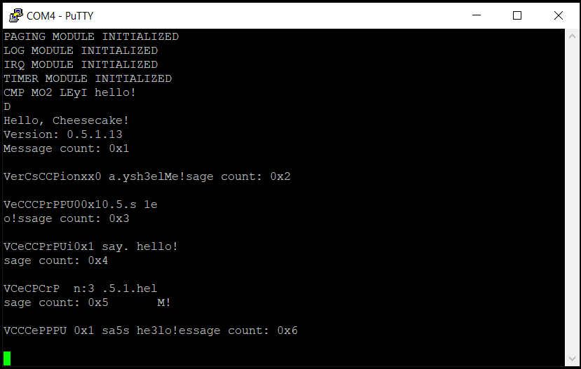

*Chapter Top* [Chapters[5]: SMP](chapter5.md) | *Next Chapter* [Chapters[6]: Memory Allocation](../chapter06/chapter6.md)  
*Previous Page* [Synchronization](synchronization.md) | *Next Page* [Spinlocks](spinlocks.md)

## The Cantankerous Cache Bug([chapter5/code1](code1))

#### Addressing Our Half-Baked Synchronization

The conclusion of the previous slice showed our CheesecakeOS able to boot and begin logging, but unable to make it through the SMP module initialization. For reference, here is the code it was executing:

```C
void smp_init()
{
    unsigned long num_alive;
    *cpu_spin_pen = CPU_INITIALIZED;
    for(unsigned long i = 1; i < NUM_CPUS; i++) {
        cpu_spin_pen[i] = CPU_RELEASED;
        idle_stacks[i] = PHYS_TO_VIRT(alloc_baby_boot_pages(8) + INIT_STACK_SIZE);
    }
    __dsb_sy();
    __sev();
    while(1) {
        for(num_alive = 0; num_alive < NUM_CPUS; num_alive++) {
            if(!(cpu_spin_pen[num_alive] == CPU_INITIALIZED)) {
                break;
            }
        }
        if(num_alive == NUM_CPUS) {
            break;
        }
    }
}
```

OK, so it seems quite likely our software is getting stuck in the infinite while loop waiting for other CPUs to confirm they have initialized themselves. But how can this happen? The other CPUs are signaled to wake up, and, when they have finished much the same CPU initialization as the primary CPU, they let it be known they are complete. So where is the bug?

Difficult to say for certain, but here is one theory. When we setup the page tables for the kernel image, we mark normal memory as cacheable, using the `MT_NORMAL` index of the `MAIR_EL1` register. This memory uses a write-back caching policy, the more optimized option between write-back and write-through. Write-back means the memory update will remain only in the cache until the cache line must be evicted. Only at that time will the write, stored in the cache, be committed to main memory.

The hardware ensures coherency between CPU caches, such that this delay in committing the update to main memory is not an issue. The update will be visible to all CPUs through their caches. In this case, however, we have a unique exception: the caches are enabled on the primary CPU, but not on the secondary CPUs. When the primary CPU updates the value of the `cpu_spin_pen` entry, the result is stored in the CPU's cache, but not yet committed to main memory. When the secondary CPUs read that value, because their caches are not yet enabled, the hardware does not check for the result in another CPU's cache. It looks for the value in main memory, and still sees the `CPU_IN_PEN` value stored there. The secondary CPUs then return to the top of the loop, issue a `wfe`, and wait for an event that will never come. The primary CPU is stuck in an infinite loop waiting for the secondary CPUs to confirm they are initialized - an impossibility.

The solution to this conundrum is to force CPU 0 to write the `cpu_spin_pen` entries back to main memory. This is accomplished by a _cache cleaning_ instruction. Cache cleaning forces write updates in the cache to be committed to main memory.

We place the call to clean in the `smp_init` function in [arch/arm64/smp.c](code1/arch/arm64/smp.c) just before the `__sev` routine that will wake our sleeping secondary CPUs to check if they can break out of their pen:

```C
#include "arch/cache.h"

    __dsb_sy();
    __clean_and_inval_dcache_range(cpu_spin_pen, (sizeof(unsigned long *) * NUM_CPUS));
    __sev();
```

The low level details of cleaning the cache are found in [arch/arm64/cache.S](code1/arch/arm64/cache.S):

```asm
.globl __clean_and_inval_dcache_range
__clean_and_inval_dcache_range:
    add     x1, x1, x0
    mrs     x3, ctr_el0
    ubfm    x3, x3, #16, #19
    mov     x2, #4
    lsl     x2, x2, x3
```

The beginning of the data cache range to be cleaned and invalidated is stored in `x0`, while the end of the range is calculated in `x1`. Bits 19-16 of the _Cache Type Register_, `CTR_EL0`, represent _log-base-2_ of the number of 4-byte words in the smallest cache line of all the data and unified caches that are controlled by the executing processor. By calculating `4 << DminLine`, the minimum cache line size is calculated, and can be used as the loop interval.

```asm
1:
    dc      civac, x0
    add     x0, x0, x2
    cmp     x0, x1
    b.lo    1b
    dsb     sy
    isb
    ret
```

The actual cleaning is accomplished with the `dc civac` instruction, which cleans and invalidates all cache lines that hold the virtual address to the point of coherency. No alignment restrictions apply to the given virtual address. The routine exists after the entire range has been cleaned and invalidated.

After applying this cache-cleaning step, we can try building and running once again. Hopefully the result looks something like:



While ugly, our OS is now making it past the initialization stage, and clearly all CPUs are running (with their own caches and virtual memory enabled!).

*Previous Page* [Synchronization](synchronization.md) | *Next Page* [Spinlocks](spinlocks.md)  
*Chapter Top* [Chapters[5]: SMP](chapter5.md) | *Next Chapter* [Chapters[6]: Memory Allocation](../chapter06/chapter6.md)
