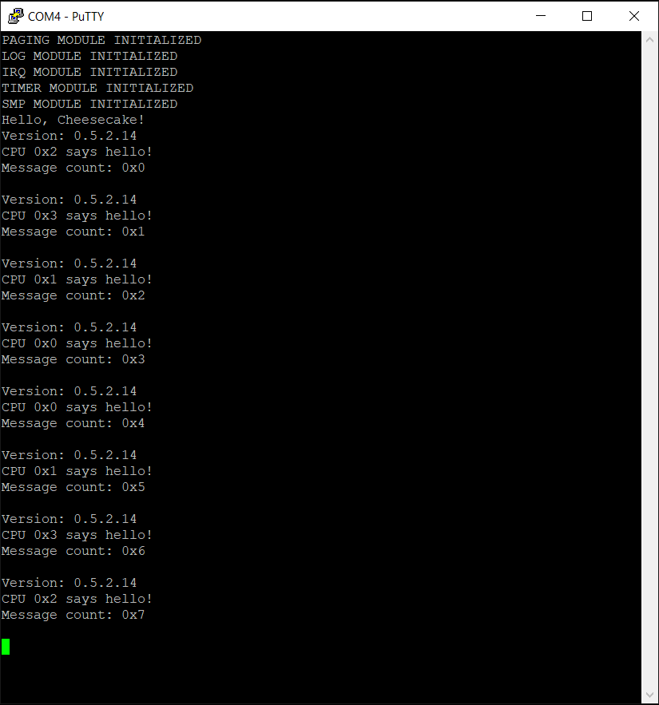

*Chapter Top* [Chapters[5]: SMP](chapter5.md) | *Next Chapter* [Chapters[6]: Memory Allocation](../chapter6/chapter6.md)  
*Previous Page* [The Cantankerous Cache Bug](cache-bug.md) | *Next Page* [Atomics and Ordering](atomics-ordering.md)

## Spinlocks

#### What We're Baking With

```bash
.
├── Makefile
├── arch
│   └── arm64
│       ├── allocate.c
│       ├── barrier.S
│       ├── board
│       │   └── raspberry-pi-4
│       │       ├── config.txt
│       │       ├── include
│       │       │   └── board
│       │       │       ├── bare-metal.h
│       │       │       ├── devio.h
│       │       │       ├── gic.h
│       │       │       └── peripheral.h
│       │       ├── irq.S
│       │       ├── irq.c
│       │       ├── memmap.c
│       │       ├── mini-uart.S
│       │       ├── mini-uart.c
│       │       ├── secure-boot.S
│       │       ├── timer.S
│       │       └── timer.c
│       ├── cache.S
│       ├── entry.S
│       ├── error.c
│       ├── event.S
│       ├── exec
│       │   └── asm-offsets.c
│       ├── include
│       │   └── arch
│       │       ├── allocate.h
│       │       ├── bare-metal.h
│       │       ├── cache.h
│       │       ├── irq.h
│       │       ├── linux-extension.h
│       │       ├── lock.h
│       │       ├── memory.h
│       │       ├── page.h
│       │       ├── process.h
│       │       ├── prot.h
│       │       └── smp.h
│       ├── irq.S
│       ├── linker.template
│       ├── lock.S
│       ├── lock.c
│       ├── main.S
│       ├── memset.S
│       ├── smp.S
│       ├── smp.c
│       └── sync.c
├── build.sh
├── cheesecake.conf
├── config
│   └── config.py
├── include
│   └── cake
│       ├── lock.h
│       ├── log.h
│       └── types.h
└── src
    ├── cheesecake.c
    └── log.c
```

The addition of the locking modules will give us the tool necessary to protect critical regions of code when multiple CPUs would like to otherwise trample each other.

#### Protecting Critical Regions

Spinlocks do exactly as their name suggests. They cause a CPU to spin in an infinte loop while attempting to acquire a lock. When one CPU has acquired a lock, other CPUs are not able to grab a hold of it until it has been released. Thus, lock/acquire and unlock/release instructions form the bounds of critical regions - regions of code we would like only one CPU to have access exclusive access.

The protection of critical regions of code is used to protect shared data such that access to that data remains consistent. Multiple simultaneous updates to a shared data structure could leave that structure in an inconsistent state. In our CheesecakeOS, at this moment, the logging buffer is unproteced and multiple CPUs are accessing the critical logging function simultaneously leading to a mess of output on the screen. A spinlock can help us fix this.

Our spinlock implementation is not particularly brilliant or creative - it is a ticket spinlock that can be found on `pg. 6535` of the `ARM ARM`. A ticket spinlock is nice, conceptually. It is componsed of two values, an owner and a ticket. The structure to represent the lock is defined in [include/cake/lock.h](code1/include/cake/lock.h):

```C
struct spinlock {
    unsigned int owner;
    unsigned int ticket;
};
```

When a thread of execution attempts to acquire a lock, it will _take the next ticket_ and wait in line. When the value of the owner equals the value of the ticket, the thread has acquired the lock, and can proceed. When the thread releases the lock, it will increment the owner value, so that the thread holding the next ticket can proceed. So threads are able to proceed in a FIFO fashion, and there is less risk of starvation from one thread being unlucky while many threads are attempting to acquire the lock at once.

The spinlock is put to use as in [src/cheesecake.c](code1/src/cheesecake.c):

```C
static struct spinlock big_cake_lock = {
    .owner = 0,
    .ticket = 0
};

void cheesecake_main(void)
{
    SPIN_LOCK(&big_cake_lock);
    init();
    log("Hello, Cheesecake!\r\n");
    SPIN_UNLOCK(&big_cake_lock);
    IRQ_ENABLE();
    do_idle();
}
```

Where the `SPIN_LOCK` and `SPIN_UNLOCK` macros are defined, along with others, in [arch/arm64/include/arch/lock.h](code1/arch/arm64/include/arch/lock.h):

```C
#include "cake/lock.h"

#define SPIN_LOCK               __spin_lock
#define SPIN_LOCK_IRQSAVE       spin_lock_irqsave
#define SPIN_UNLOCK             __spin_unlock
#define SPIN_UNLOCK_IRQRESTORE  spin_unlock_irqrestore

void __spin_lock(struct spinlock *lock);
void __spin_unlock(struct spinlock *lock);
unsigned long spin_lock_irqsave(struct spinlock *lock);
void spin_unlock_irqrestore(struct spinlock *lock, unsigned long flags);
```

Our implementation of actual locking is located in [arch/arm64/lock.S](code1/arch/arm64/lock.S):

```asm

#define TICKET_SHIFT    (32)
#define TICKET_VALUE    (1 << TICKET_SHIFT)

.globl __spin_lock
__spin_lock:
    prfm    pstl1strm, [x0]
1:
    ldaxr   x3, [x0]
    mov     x6, #TICKET_VALUE
    add     x1, x3, x6
    stxr    w2, x1, [x0]
    cbnz    w2, 1b
```

A pointer to a `struct spinlock` is passed to the `__spin_lock` routine. First, the whole 64-bit value of the lock is loaded into `x3`, and the ticket value is incremented. The processor attempts to store the new value back into the spinlock's memory address with a `stxr` instruction. _If_ this store is successful, a 0 will be written to `w2`. If this store is not successful, the processor returns to the `ldxar` to try again. This load-exclusive, store-exclusive pairing ensures that the operation will be atomic, and the value loaded into `x3` can be used for the ticket and owner numbers.

```asm
    eor     x1, x3, x3, ror #32
    cbz     x1, 3f
```

An exclusive-or between the ticket and the owner values is a quick way to check if they are equal. If they are equal, the code jumps ahead to a return in order to move on to the critical region.

```asm
    sevl
2:
    wfe
    ldaxr   w2, [x0]
    eor     x1, x2, x3, lsr #32
    cbnz    x1, 2b
3:
    ret
```

In the case the ticket and owner are not equal, the code enters a busy spin loop. First, a local event is sent to prime the loop, ensureing it is executed at least once. Another exclusive load is performed, and again the process checks the ticket and owner values to determine if they are equal. As long as they are different, the spinning continues. When they are equal, the processor is free to leave the loop and proceed to the critical section. 

```asm
.globl __spin_unlock
__spin_unlock:
    ldr     w1, [x0]
    add     w1, w1, #1
    stlr    w1, [x0]
    ret
```

The `__spin_unlock` routine carefully updates the owner, but only the owner, by loading only the lower 32-bits of the `struct spinlock` pointer, incrementing by 1, and storing back only the lower 32-bits. The `stlr` instruction will generate an event to resume any threads waiting on the lock with the `wfe` instruction. The owner was incremented so the thread holding the next ticket will be allowed to continue to the critical region. These two small functions are the entire locking implementation for this tutorial. We are lucky modern processors give us such neat, compact solutions for a fairly obnoxious problem.

#### Spinlocks and Interrupts

One subtely involves the use of spinlocks with IRQs. If a lock protecting a critical region is used in an interrupt handler for a given, that interrupt must be disabled on the local CPU before the local CPU attempts to acquire the lock. Otherwise a deadlock is possible. A CPU can acquire the lock, and, in the middle of executing within the critical region, be interrupted. The interrupt handler for the given interrupt may then attempt to acquire the lock. As the original thread that was interrupted still holds the lock, the interrupt will never acquire the lock.

In order to faciliate the disabling of interrupts, the `SPIN_LOCK_IRQSAVE` macro disables interrupts, and returns the state before disabling. The `SPIN_INLOCK_IRQRESTORE` macro restores the interrupt masks to the state before disabling - if interrupts had been disabled previously, they remain so. If interrupts had been enabled, they are enabled once more. The implementations of these macros for the arm64 architecture come from [arch/arm64/lock.c](code1/arch/arm64/lock.c):

```C
#include "cake/lock.h"

extern void __irq_restore(unsigned long flags);
extern unsigned long __irq_save();

unsigned long spin_lock_irqsave(struct spinlock *lock)
{
    unsigned long flags = __irq_save();
    __spin_lock(lock);
    return flags;
}

void spin_unlock_irqrestore(struct spinlock *lock, unsigned long flags)
{
    __spin_unlock(lock);
    __irq_restore(flags);
}
```

The low-level `__irq_save` and `__irq_restore` routines are defined back in [arch/arm64/lock.S](code1/arch/arm64/lock.S):

```asm
.globl __irq_restore
__irq_restore:
    msr  daif, x0
    ret

.globl __irq_save
__irq_save:
    mrs     x0, daif
    msr     daifset, #2
    ret
```

We use the `SPIN_LOCK_IRQSAVE` and `SPIN_LOCK_IRQRESTORE` in our `do_idle` function. The `big_cake_lock` spinlock is not used in IRQs, but the irq handler does log in the case an IRQ is not found, so disabling IRQs ensure CPUs won't trample each other in an attempt to log output, even if an IRQ is not recognized. Now, building and running should appear much cleaner:



*Chapter Top* [Chapters[5]: SMP](chapter5.md) | *Next Chapter* [Chapters[6]: Memory Allocation](../chapter6/chapter6.md)  
*Previous Page* [The Cantankerous Cache Bug](cache-bug.md) | *Next Page* [Atomics and Ordering](atomics-ordering.md)
