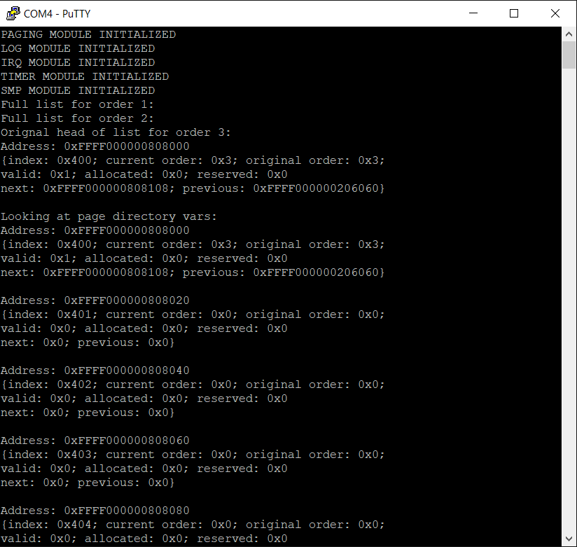

*Chapter Top* [Chapters[6]: Memory Allocator](chapter6.md) | *Next Chapter* [Chapters[7]: Scheduling and Processes](../chapter07/chapter7.md)  
*Previous Page* [The Global Memory Map](global-memmap.md) | *Next Page* [Slab Allocator with Object Caches](slab.md)

## Binary Buddies ([chapter06/code1](code1))

#### Allocating Pages

Having initialized the freelists to manage all the available pages in the system, our OS needs to provide a sane interface through which clients can request allocations of blocks of free memory. Extending the [src/allocate.c](code1/src/allocate.c) module, we create the `alloc_pages` function, which takes in the order of the request as an argument:

```C
static struct spinlock allocator_lock = {
    .owner = 0,
    .ticket = 0
};

struct page *alloc_pages(unsigned int order)
{
    struct list *freelist;
    struct page *buddy, *s;
    struct page *p = 0;
    unsigned long pfn, bpfn;
    unsigned int i = order;
    SPIN_LOCK(&allocator_lock);
    while(i <= MAX_ORDER) {
        freelist = &(freelists[i]);
        if(!list_empty(freelist)) {
            p = LIST_FIRST_ENTRY(freelist, struct page, pagelist);
            list_delete(&(p->pagelist));
            break;
        }
        i++;
    }
    SPIN_UNLOCK(&allocator_lock);
```

The `freelists` are protected from concurrent access by the `allocator_lock`. After the client acquires the lock, each freelist, beginning with the smallest that could satisfy the request, is probed for a free block. If the list is not empty, the first page in the freelist is taken. After a reference is found or all freelists have been searched, the lock is released, allowing other clients a chance to continue.

```C
    if(p) {
        SPIN_LOCK(&allocator_lock);
        while(i > order) {
            --i;
            p->current_order = i;
            freelist = &(freelists[i]);
            list_add(freelist, &(p->pagelist));
            pfn = p->pfn;
            bpfn = pfn + (1 << i);
            buddy = &(GLOBAL_MEMMAP[bpfn]);
            buddy->valid = 1;
            buddy->original_order = i + 1;
            buddy->current_order = i;
            p = buddy;
        }
        SPIN_UNLOCK(&allocator_lock);
```

If a block of memory was found, the freelists are again protected from concurrent access. The block found may have been of a higher order than requested. If the block order and request order match, the lock is immediately released. In the case the block found is of a higher order, to avoid wasting memory, the block is split into two halves. The top half is added to the freelist of one order less, tracked by the `current_order` field of the `struct page` representation. The bottom half is set as a newly valid page, takes the same values for `current_order` and `original_order` members as the top, and is used for the allocation. This splitting process then continues with the split block until the order of the block equals the order of the request. We call the two halves of a split _buddies_.

```C
        for(i = p->pfn; i < (p->pfn + (1 << order)); i++) {
            s = &(GLOBAL_MEMMAP[i]);
            s->allocated = 1;
        }
    }
    return p;
}
```

After the allocation has been correctly sized, each page in the allocation is marked as allocated. Having seen the code, let's walk through the expected outcome of an example allocation. In the previous section, we saw this output for freelists of orders one, two and three:

```
Printing freelist for order: 0x1
Printing freelist for order: 0x2
Printing freelist for order: 0x3
{Page Details: index: 0x400, allocated: 0x0, valid: 0x1}
{List Details: next: 0xFFFF000000808108, prev: 0xFFFF000000206058}
{Page Details: index: 0x408, allocated: 0x0, valid: 0x1}
{List Details: next: 0xFFFF000000808208, prev: 0xFFFF000000808008}
```

Our freelists can be drawn:

```
┌────────────────────┬────────────────────┬────────────────────┬────────────────────┬────────────────────┬────────────────────┐
│  Freelist Order 1  │                    │  Freelist Order 2  │                    │  Freelist Order 3  │                    │
├────────────────────┼────────────────────┼────────────────────┼────────────────────┼────────────────────┼────────────────────┤
│        PREV        │        NEXT        │        PREV        │        NEXT        │        PREV        │        NEXT        │
├────────────────────┼────────────────────┼────────────────────┼────────────────────┼────────────────────┼────────────────────┤
│ 0xFFFF000000206038 │ 0xFFFF000000206040 │ 0xFFFF000000206048 │ 0xFFFF000000206050 │ 0xFFFF000000206058 │ 0xFFFF000000206060 │
└─────────┬──────────┴─────────┬──────────┴─────────┬──────────┴─────────┬──────────┴─────────┬──────────┴─────────┬──────────┘
          │                    │                    │                    │                    │                    │
          │                    │                    │                    │                    │                    │
          │                    │                    │                    │                    │                    │
┌─────────▼──────────┬─────────▼──────────┬─────────▼──────────┬─────────▼──────────┬─────────▼──────────┬─────────▼──────────┐
│ 0xFFFF000000206038 │ 0xFFFF000000206038 │ 0xFFFF000000206048 │ 0xFFFF000000206048 │ 0xFFFF00000080BF08 │ 0xFFFF000000808008 │
└────────────────────┴────────────────────┴────────────────────┴────────────────────┴────────────────────┴─────────┬──────────┘
                                                                                                                   │ 
                                                                                                                   │ 
                                                                                                                   │
                                                                                    ┌────────────────────┬─────────┴──────────┐
                                                                                    │ Order Three Block  │                    │
  ┌────────────────────┬───────┬────────────────┬────────────────────┐◄─────────────┼────────────────────┼────────────────────┤
  │ 0xFFFF000000808000 │  0:0  │ ALLOCATED      │ 0                  │              │        PREV        │        NEXT        │
  ├────────────────────┼───────┼────────────────┼────────────────────┤              ├────────────────────┼────────────────────┤
  │ 0xFFFF000000808000 │  1:1  │ RESERVED       │ 0                  │              │ 0xFFFF000000808008 │ 0xFFFF000000808010 │
  ├────────────────────┼───────┼────────────────┼────────────────────┤              └──────────┬─────────┴──────────┬─────────┘
  │ 0xFFFF000000808000 │  2:2  │ VALID          │ 1                  │                         │                    │
  ├────────────────────┼───────┼────────────────┼────────────────────┤                         │                    │
  │ 0xFFFF000000808000 │  3:6  │ CURRENT ORDER  │ 3                  │                         │                    │
  ├────────────────────┼───────┼────────────────┼────────────────────┤              ┌──────────▼─────────┬──────────▼─────────┐
  │ 0xFFFF000000808000 │  7:10 │ ORIGINAL ORDER │ 3                  │              │ 0xFFFF000000206058 │ 0xFFFF000000808108 │
  ├────────────────────┼───────┼────────────────┼────────────────────┤              └────────────────────┴────────────────────┘
  │ 0xFFFF000000808000 │ 11:63 │ PFN            │ 1024               │
  ├────────────────────┼───────┼────────────────┼────────────────────┤
  │ 0xFFFF000000808008 │  0:63 │ PREV           │ 0xFFFF000000206058 │
  ├────────────────────┼───────┼────────────────┼────────────────────┤
  │ 0xFFFF000000808010 │  0:63 │ NEXT           │ 0xFFFF000000808108 │
  ├────────────────────┼───────┼────────────────┼────────────────────┤
  │ 0xFFFF000000808018 │  0:63 │ REFCOUNT       │ 0                  │
  └────────────────────┴───────┴────────────────┴────────────────────┘
```

Let's now imagine the allocator receives a request to allocate a two-page block:

```C
    struct page *p = alloc_pages(1);
```

At the top of the `alloc_pages` function:

| Variable | Value |
| :--- | :--- |
| unsigned int order | 1 |
| unsigned int i | 1 |
| struct page *p | 0 |
| struct page *buddy | undefined |

As both the freelist of order one, and the freelist of order two are empty, the first two iterations through the `for` loop result in an increment of `i`. On the third iteration, we find a non-empty list with blocks of memory available for allocation. The first entry in the freelist of order three is a pointer to a list contained within a `struct page` structure located at address 0xFFFF000000808000. After the entry is found and removed from the freelist, our variables look like:

| Variable | Value |
| :--- | :--- |
| unsigned int order | 1 |
| unsigned int i | 3 |
| struct page *p | 0xFFFF000000808000 |
| struct page *buddy | undefined |

We can also update our picture to illustrate the removal of the found page from the freelist:

```
┌────────────────────┬────────────────────┬────────────────────┬────────────────────┬────────────────────┬────────────────────┐
│  Freelist Order 1  │                    │  Freelist Order 2  │                    │  Freelist Order 3  │                    │
├────────────────────┼────────────────────┼────────────────────┼────────────────────┼────────────────────┼────────────────────┤
│        PREV        │        NEXT        │        PREV        │        NEXT        │        PREV        │        NEXT        │
├────────────────────┼────────────────────┼────────────────────┼────────────────────┼────────────────────┼────────────────────┤
│ 0xFFFF000000206038 │ 0xFFFF000000206040 │ 0xFFFF000000206048 │ 0xFFFF000000206050 │ 0xFFFF000000206058 │ 0xFFFF000000206060 │
└─────────┬──────────┴─────────┬──────────┴─────────┬──────────┴─────────┬──────────┴─────────┬──────────┴─────────┬──────────┘
          │                    │                    │                    │                    │                    │
          │                    │                    │                    │                    │                    │
          │                    │                    │                    │                    │                    │
┌─────────▼──────────┬─────────▼──────────┬─────────▼──────────┬─────────▼──────────┬─────────▼──────────┬─────────▼──────────┐
│ 0xFFFF000000206038 │ 0xFFFF000000206038 │ 0xFFFF000000206048 │ 0xFFFF000000206048 │ 0xFFFF00000080BF08 │ 0xFFFF000000808108 │
└────────────────────┴────────────────────┴────────────────────┴────────────────────┴────────────────────┴─────────┬──────────┘
                                                                                                                   │ 
                                                                                                                   │ 
                                                                                                                   │
                                                                                    ┌────────────────────┬─────────┴──────────┐
                                                                                    │ Order Three Block  │                    │
  ┌────────────────────┬───────┬────────────────┬──────┐                            ├────────────────────┼────────────────────┤
  │ 0xFFFF000000808000 │  0:0  │ ALLOCATED      │ 0    │                            │        PREV        │        NEXT        │
  ├────────────────────┼───────┼────────────────┼──────┤                            ├────────────────────┼────────────────────┤
  │ 0xFFFF000000808000 │  1:1  │ RESERVED       │ 0    │                            │ 0xFFFF000000808108 │ 0xFFFF000000808110 │
  ├────────────────────┼───────┼────────────────┼──────┤                            └──────────┬─────────┴──────────┬─────────┘
  │ 0xFFFF000000808000 │  2:2  │ VALID          │ 1    │                                       │                    │
  ├────────────────────┼───────┼────────────────┼──────┤                                       │                    │
  │ 0xFFFF000000808000 │  3:6  │ CURRENT ORDER  │ 3    │                                       │                    │
  ├────────────────────┼───────┼────────────────┼──────┤                            ┌──────────▼─────────┬──────────▼─────────┐
  │ 0xFFFF000000808000 │  7:10 │ ORIGINAL ORDER │ 3    │                            │ 0xFFFF000000206058 │ 0xFFFF000000808208 │
  ├────────────────────┼───────┼────────────────┼──────┤                            └────────────────────┴────────────────────┘
  │ 0xFFFF000000808000 │ 11:63 │ PFN            │ 1024 │
  ├────────────────────┼───────┼────────────────┼──────┤
  │ 0xFFFF000000808008 │  0:63 │ PREV           │ 0    │
  ├────────────────────┼───────┼────────────────┼──────┤
  │ 0xFFFF000000808010 │  0:63 │ NEXT           │ 0    │
  ├────────────────────┼───────┼────────────────┼──────┤
  │ 0xFFFF000000808018 │  0:63 │ REFCOUNT       │ 0    │
  └────────────────────┴───────┴────────────────┴──────┘
```

Since a page was found, and the page is not of an order originally requested, the `alloc_pages` function enters the `while` loop. In English, the algorithm:

- Decrements `i` from three to two
- Sets the current order of our found page to two (original order still is three)
- Grabs a reference to the freelist of order two
- Adds the `pagelist` of our found page to the freelist of order two
- Grabs the page-frame-number of our found page
- Grabs the page-frame-number of the next order two page frame (half the size of our found page of order three), or the PFN four greater
- From the `GLOBAL_MEMMAP` gets a reference to the page at the next order two page frame
- Sets that page as a valid page, and sets the original order to three and current order to two

Thus the size of the allocation has been cut in half. Our variables now look like:
| Variable | Value |
| :--- | :--- |
| unsigned int order | 1 |
| unsigned int i | 2 |
| struct page *p | 0xFFFF000000808000 |
| struct page *buddy | 0xFFFF000000808080 |

The last step of the `while` loop:

- Updates the found page to be the next order two page

Our freelist visualization now looks like:

```
┌────────────────────┬────────────────────┬────────────────────┬────────────────────┬────────────────────┬────────────────────┐
│  Freelist Order 1  │                    │  Freelist Order 2  │                    │  Freelist Order 3  │                    │
├────────────────────┼────────────────────┼────────────────────┼────────────────────┼────────────────────┼────────────────────┤
│        PREV        │        NEXT        │        PREV        │        NEXT        │        PREV        │        NEXT        │
├────────────────────┼────────────────────┼────────────────────┼────────────────────┼────────────────────┼────────────────────┤
│ 0xFFFF000000206038 │ 0xFFFF000000206040 │ 0xFFFF000000206048 │ 0xFFFF000000206050 │ 0xFFFF000000206058 │ 0xFFFF000000206060 │
└─────────┬──────────┴─────────┬──────────┴─────────┬──────────┴─────────┬──────────┴─────────┬──────────┴─────────┬──────────┘
          │                    │                    │                    │                    │                    │
          │                    │                    │                    │                    │                    │
          │                    │                    │                    │                    │                    │
┌─────────▼──────────┬─────────▼──────────┬─────────▼──────────┬─────────▼──────────┬─────────▼──────────┬─────────▼──────────┐
│ 0xFFFF000000206038 │ 0xFFFF000000206038 │ 0xFFFF000000206048 │ 0xFFFF000000206048 │ 0xFFFF00000080BF08 │ 0xFFFF000000808108 │
└────────────────────┴────────────────────┴────────────────────┴────────────────────┴────────────────────┴────────────────────┘

  ┌────────────────────┬───────┬────────────────┬──────┐
  │ 0xFFFF000000808080 │  0:0  │ ALLOCATED      │ 0    │
  ├────────────────────┼───────┼────────────────┼──────┤
  │ 0xFFFF000000808080 │  1:1  │ RESERVED       │ 0    │
  ├────────────────────┼───────┼────────────────┼──────┤
  │ 0xFFFF000000808080 │  2:2  │ VALID          │ 1    │
  ├────────────────────┼───────┼────────────────┼──────┤
  │ 0xFFFF000000808080 │  3:6  │ CURRENT ORDER  │ 2    │
  ├────────────────────┼───────┼────────────────┼──────┤
  │ 0xFFFF000000808080 │  7:10 │ ORIGINAL ORDER │ 3    │
  ├────────────────────┼───────┼────────────────┼──────┤
  │ 0xFFFF000000808080 │ 11:63 │ PFN            │ 1028 │
  ├────────────────────┼───────┼────────────────┼──────┤
  │ 0xFFFF000000808088 │  0:63 │ PREV           │ 0    │
  ├────────────────────┼───────┼────────────────┼──────┤
  │ 0xFFFF000000808090 │  0:63 │ NEXT           │ 0    │
  ├────────────────────┼───────┼────────────────┼──────┤
  │ 0xFFFF000000808098 │  0:63 │ REFCOUNT       │ 0    │
  └────────────────────┴───────┴────────────────┴──────┘
```

The original page we found to allocate has been broken into two pieces. The top half has been added back to the allocator, but as a page of order two. We still have a reference to the bottom half. Still, our allocation is too big, as the client requested an allocation of order one. So the loop repeats and:

- Decrements `i` from two to one
- Sets the current order of our found page to one (original order still is three)
- Grabs a reference to the freelist of order one
- Adds the `pagelist` of our found page to the freelist of order one
- Grabs the page-frame-number of our found page
- Grabs the page-frame-number of the next order one page frame (one-fourth the size of our found page of order three), or the PFN two greater
- From the `GLOBAL_MEMMAP` gets a reference to the page at the next order one page frame
- Sets that page as a valid page, and sets the original order to two and current order to one

In this case the current order of the page reference is only two, not three as the original allocation. As we will see in the example of the `free_pages` function, this is acceptable.

Thus the size of the allocation has been cut in half once more. Our variables now look like:
| Variable | Value |
| :--- | :--- |
| unsigned int order | 1 |
| unsigned int i | 1 |
| struct page *p | 0xFFFF000000808080 |
| struct page *buddy | 0xFFFF0000008080C0 |

The last step of the `while` loop:

- Updates the found page to be the next order one page

Since the page is of the correct order, the loop terminates, the page is marked as allocated, and the function returns. Our visualization ends as:

```
┌────────────────────┬────────────────────┬────────────────────┬────────────────────┬────────────────────┬────────────────────┐
│  Freelist Order 1  │                    │  Freelist Order 2  │                    │  Freelist Order 3  │                    │
├────────────────────┼────────────────────┼────────────────────┼────────────────────┼────────────────────┼────────────────────┤
│        PREV        │        NEXT        │        PREV        │        NEXT        │        PREV        │        NEXT        │
├────────────────────┼────────────────────┼────────────────────┼────────────────────┼────────────────────┼────────────────────┤
│ 0xFFFF000000206038 │ 0xFFFF000000206040 │ 0xFFFF000000206048 │ 0xFFFF000000206050 │ 0xFFFF000000206058 │ 0xFFFF000000206060 │
└─────────┬──────────┴─────────┬──────────┴─────────┬──────────┴─────────┬──────────┴─────────┬──────────┴─────────┬──────────┘
          │                    │                    │                    │                    │                    │
          │                    │                    │                    │                    │                    │
          │                    │                    │                    │                    │                    │
┌─────────▼──────────┬─────────▼──────────┬─────────▼──────────┬─────────▼──────────┬─────────▼──────────┬─────────▼──────────┐
│ 0xFFFF000000206038 │ 0xFFFF000000206038 │ 0xFFFF000000206048 │ 0xFFFF000000206048 │ 0xFFFF00000080BF08 │ 0xFFFF000000808108 │
└────────────────────┴────────────────────┴────────────────────┴────────────────────┴────────────────────┴────────────────────┘

  ┌────────────────────┬───────┬────────────────┬──────┐
  │ 0xFFFF0000008080C0 │  0:0  │ ALLOCATED      │ 1    │
  ├────────────────────┼───────┼────────────────┼──────┤
  │ 0xFFFF0000008080C0 │  1:1  │ RESERVED       │ 0    │
  ├────────────────────┼───────┼────────────────┼──────┤
  │ 0xFFFF0000008080C0 │  2:2  │ VALID          │ 1    │
  ├────────────────────┼───────┼────────────────┼──────┤
  │ 0xFFFF0000008080C0 │  3:6  │ CURRENT ORDER  │ 1    │
  ├────────────────────┼───────┼────────────────┼──────┤
  │ 0xFFFF0000008080C0 │  7:10 │ ORIGINAL ORDER │ 2    │
  ├────────────────────┼───────┼────────────────┼──────┤
  │ 0xFFFF0000008080C0 │ 11:63 │ PFN            │ 1030 │
  ├────────────────────┼───────┼────────────────┼──────┤
  │ 0xFFFF0000008080C8 │  0:63 │ PREV           │ 0    │
  ├────────────────────┼───────┼────────────────┼──────┤
  │ 0xFFFF0000008080D0 │  0:63 │ NEXT           │ 0    │
  ├────────────────────┼───────┼────────────────┼──────┤
  │ 0xFFFF0000008080D8 │  0:63 │ REFCOUNT       │ 0    │
  └────────────────────┴───────┴────────────────┴──────┘
```

#### Freeing Pages

The freeing operation goes beyond simply returning a page to the freelist of its current order. The `free_pages` function attempts to undue the potential fragmentation of the allocate operation - what is called coalescing. The coalesce operation is subtle, but not complicated. The `free_pages` function itself is quite simple:

```C
#define PAGE_IS_TAIL(page)      ((page->pfn) & ((1 << ((page->current_order) + 1)) - 1))
#define PAGE_IS_HEAD(page)      (!(PAGE_IS_TAIL(page)))
#define HEAD_BUDDY_PFN(page)    ((page->pfn) - (1 << (page->current_order)))
#define TAIL_BUDDY_PFN(page)    ((page->pfn) + (1 << (page->current_order)))
#define HEAD_BUDDY(page)        (&(GLOBAL_MEMMAP[HEAD_BUDDY_PFN(page)]))
#define TAIL_BUDDY(page)        (&(GLOBAL_MEMMAP[TAIL_BUDDY_PFN(page)]))
#define SHOULD_COALESCE(page, buddy)                        \
    (!(buddy->allocated) &&                                 \
    ((page->current_order) == (buddy->current_order)) &&    \
    ((page->current_order) < (page->original_order))  &&    \
    ((buddy->current_order) < (buddy->original_order)))

void free_pages(struct page *page)
{
    struct page *buddy, *s;
    for(unsigned long i = page->pfn; i < (page->pfn + (1 << page->current_order)); i++) {
        s = &(GLOBAL_MEMMAP[i]);
        s->allocated = 0;
    }
    SPIN_LOCK(&allocator_lock);
    while(1) {
        if(PAGE_IS_HEAD(page)) {
            buddy = TAIL_BUDDY(page);
            if(SHOULD_COALESCE(page, buddy)) {
                list_delete(&(buddy->pagelist));
                buddy->valid = 0;
                buddy->current_order = 0;
                buddy->original_order = 0;
                page->current_order++;
                continue;
            }
        }
        else {
            buddy = HEAD_BUDDY(page);
            if(SHOULD_COALESCE(page, buddy)) {
                list_delete(&(buddy->pagelist));
                page->valid = 0;
                page->current_order = 0;
                page->original_order = 0;
                buddy->current_order++;
                page = buddy;
                continue;
            }
        }
        break;
    }
    list_add(&(freelists[page->current_order]), &(page->pagelist));
    SPIN_UNLOCK(&allocator_lock);
}
```

After marking each of the pages in the freed block as unallocated, the `free_function` acquires the `allocate_lock` and determines if the freed page is the top or bottom half of the block one order larger. Then, able to locate the buddy of that block, it determines if coalescing is appropriate. If it is, it performs the coalescing operation. If at any point coalescing should not be performed, the loop terminates, the page is added to the freelist of the page's current order, the lock is released, and the function exists.

As an example, let's revisit the allocation and assume the same state only now freeing the page previously allocated. We pick up at the point of entering the `while` loop (so the page being free is no longer marked as allocated):

```
┌────────────────────┬────────────────────┬────────────────────┬────────────────────┬────────────────────┬────────────────────┐
│  Freelist Order 1  │                    │  Freelist Order 2  │                    │  Freelist Order 3  │                    │
├────────────────────┼────────────────────┼────────────────────┼────────────────────┼────────────────────┼────────────────────┤
│        PREV        │        NEXT        │        PREV        │        NEXT        │        PREV        │        NEXT        │
├────────────────────┼────────────────────┼────────────────────┼────────────────────┼────────────────────┼────────────────────┤
│ 0xFFFF000000206038 │ 0xFFFF000000206040 │ 0xFFFF000000206048 │ 0xFFFF000000206050 │ 0xFFFF000000206058 │ 0xFFFF000000206060 │
└─────────┬──────────┴─────────┬──────────┴─────────┬──────────┴─────────┬──────────┴─────────┬──────────┴─────────┬──────────┘
          │                    │                    │                    │                    │                    │
          │                    │                    │                    │                    │                    │
          │                    │                    │                    │                    │                    │
┌─────────▼──────────┬─────────▼──────────┬─────────▼──────────┬─────────▼──────────┬─────────▼──────────┬─────────▼──────────┐
│ 0xFFFF000000206038 │ 0xFFFF000000206038 │ 0xFFFF000000206048 │ 0xFFFF000000206048 │ 0xFFFF00000080BF08 │ 0xFFFF000000808108 │
└────────────────────┴────────────────────┴────────────────────┴────────────────────┴────────────────────┴────────────────────┘

  ┌────────────────────┬───────┬────────────────┬──────┐
  │ 0xFFFF0000008080C0 │  0:0  │ ALLOCATED      │ 0    │
  ├────────────────────┼───────┼────────────────┼──────┤
  │ 0xFFFF0000008080C0 │  1:1  │ RESERVED       │ 0    │
  ├────────────────────┼───────┼────────────────┼──────┤
  │ 0xFFFF0000008080C0 │  2:2  │ VALID          │ 1    │
  ├────────────────────┼───────┼────────────────┼──────┤
  │ 0xFFFF0000008080C0 │  3:6  │ CURRENT ORDER  │ 1    │
  ├────────────────────┼───────┼────────────────┼──────┤
  │ 0xFFFF0000008080C0 │  7:10 │ ORIGINAL ORDER │ 2    │
  ├────────────────────┼───────┼────────────────┼──────┤
  │ 0xFFFF0000008080C0 │ 11:63 │ PFN            │ 1030 │
  ├────────────────────┼───────┼────────────────┼──────┤
  │ 0xFFFF0000008080C8 │  0:63 │ PREV           │ 0    │
  ├────────────────────┼───────┼────────────────┼──────┤
  │ 0xFFFF0000008080D0 │  0:63 │ NEXT           │ 0    │
  ├────────────────────┼───────┼────────────────┼──────┤
  │ 0xFFFF0000008080D8 │  0:63 │ REFCOUNT       │ 0    │
  └────────────────────┴───────┴────────────────┴──────┘
```

In order to determine if the page is the top half of the buddy or the bottom half, the `free_pages` function uses the fact that the page frame is aligned to the `current_order` mask. A top-alf, or head buddy will also be aligned to the order of one greater. In our example:

- (!((page-\>pfn) & ((1 << ((page-\>current\_order) + 1)) - 1)))
- (!((1030) & ((1 << (1 + 1)) - 1)))
- !(1030 & (4 - 1))
- !(0b10000000010 & 0b00000000011)
- !(true)
- false

On the first entry into the `while` loop we know we are working with a tail buddy. The algorithm then grabs a reference to the head buddy:

- head buddy = &(GLOBAL\_MEMMAP[HEAD\_BUDDY\_PFN(page)])
- head buddy = &(GLOBAL\_MEMMAP[((page-\>pfn) - (1 << (page-\>current\_order)))])
- head buddy = &(GLOBAL\_MEMMAP[1030 - (1 << 1)])
- head buddy = &(GLOBAL\_MEMMAP[1030 - 2])
- head buddy = &(GLOBAL\_MEMMAP[1028])

Now, having a reference to the head buddy, the `struct page` at index 1028 in the `GLOBAL_MEMMAP`, the buddy is removed from its freelist. The original page passed to `free_pages` is coalesced into the buddy page and the page reference is replaced by the buddy reference. The current order of the buddy increases by one. It is clear the tail buddy disappears, no longer a valid page. This is why it was ok for the tail buddy to have a lower original order. It ceases to exist when coalesced.

Our visualization now looks like:

```
┌────────────────────┬────────────────────┬────────────────────┬────────────────────┬────────────────────┬────────────────────┐
│  Freelist Order 1  │                    │  Freelist Order 2  │                    │  Freelist Order 3  │                    │
├────────────────────┼────────────────────┼────────────────────┼────────────────────┼────────────────────┼────────────────────┤
│        PREV        │        NEXT        │        PREV        │        NEXT        │        PREV        │        NEXT        │
├────────────────────┼────────────────────┼────────────────────┼────────────────────┼────────────────────┼────────────────────┤
│ 0xFFFF000000206038 │ 0xFFFF000000206040 │ 0xFFFF000000206048 │ 0xFFFF000000206050 │ 0xFFFF000000206058 │ 0xFFFF000000206060 │
└─────────┬──────────┴─────────┬──────────┴─────────┬──────────┴─────────┬──────────┴─────────┬──────────┴─────────┬──────────┘
          │                    │                    │                    │                    │                    │
          │                    │                    │                    │                    │                    │
          │                    │                    │                    │                    │                    │
┌─────────▼──────────┬─────────▼──────────┬─────────▼──────────┬─────────▼──────────┬─────────▼──────────┬─────────▼──────────┐
│ 0xFFFF000000206038 │ 0xFFFF000000206038 │ 0xFFFF000000206048 │ 0xFFFF000000206048 │ 0xFFFF00000080BF08 │ 0xFFFF000000808108 │
└────────────────────┴────────────────────┴────────────────────┴────────────────────┴────────────────────┴────────────────────┘

  ┌────────────────────┬───────┬────────────────┬──────┐
  │ 0xFFFF000000808080 │  0:0  │ ALLOCATED      │ 0    │
  ├────────────────────┼───────┼────────────────┼──────┤
  │ 0xFFFF000000808080 │  1:1  │ RESERVED       │ 0    │
  ├────────────────────┼───────┼────────────────┼──────┤
  │ 0xFFFF000000808080 │  2:2  │ VALID          │ 1    │
  ├────────────────────┼───────┼────────────────┼──────┤
  │ 0xFFFF000000808080 │  3:6  │ CURRENT ORDER  │ 2    │
  ├────────────────────┼───────┼────────────────┼──────┤
  │ 0xFFFF000000808080 │  7:10 │ ORIGINAL ORDER │ 3    │
  ├────────────────────┼───────┼────────────────┼──────┤
  │ 0xFFFF000000808080 │ 11:63 │ PFN            │ 1028 │
  ├────────────────────┼───────┼────────────────┼──────┤
  │ 0xFFFF000000808088 │  0:63 │ PREV           │ 0    │
  ├────────────────────┼───────┼────────────────┼──────┤
  │ 0xFFFF000000808090 │  0:63 │ NEXT           │ 0    │
  ├────────────────────┼───────┼────────────────┼──────┤
  │ 0xFFFF000000808098 │  0:63 │ REFCOUNT       │ 0    │
  └────────────────────┴───────┴────────────────┴──────┘
```

This is the same intermediate picture we saw during the allocation phase. The loop will continue to coalesce for one more iteration. The state of the allocator will, at the termination of the loop, return as it was before the initial allocation request.

The binary-buddy allocator is complete. Building and running will log copious output, walking through allocates and frees to test our assumptions:



*Previous Page* [The Global Memory Map](global-memmap.md) | *Next Page* [Slab Allocator with Object Caches](slab.md)  
*Chapter Top* [Chapters[6]: Memory Allocator](chapter6.md) | *Next Chapter* [Chapters[7]: Scheduling and Processes](../chapter07/chapter7.md)
