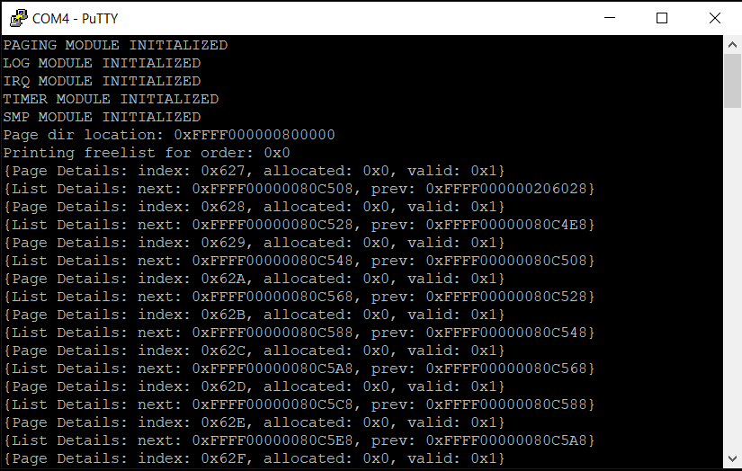

*Chapter Top* [Chapters[6]: Memory Allocator](chapter6.md) | *Next Chapter* [Chapters[7]: Scheduling and Processes](../chapter07/chapter7.md)  
*Previous Page* [Chapters[6]: Memory Allocator](chapter6.md) | *Next Page* [Binary Buddies](binary-buddies.md)

## The Global Memory Map

#### The List Library

Going forward, we will need to keep track of collections of objects. We will lean heavily on a linked-list structure, defined in [include/cake/list.h](code0/include/cake/list.h). Our implementation is copied from Linux - no reason to mess with the best. We use a circular, doubly-linked list:

```
struct list {
    struct list *next;
    struct list *prev;
};
```

Whenever we need a list of objects, we use Linux's brilliant idea of embedding the list structure within the object itself. Then, given a pointer to a list object, a reference to the containing object can be found through a calculation of the offset of the list from the head of the container. A helper macro for just this purpose is defined in [include/cake/cake.h](code0/include/cake/cake.h):

```C
#define OFFSETOF(type, member)    __builtin_offsetof(type, member)

#define CONTAINER_OF(ptr, type, member) ({          \
    void *__mptr = (void *)(ptr);                   \
    ((type *)(__mptr - OFFSETOF(type, member))); })
```

Most useful lists will have a _canonical head_, a `struct list` structure that is only used as the head of the list with no containing object.

```C
static inline int list_empty(struct list *list)
{
    return READ_ONCE(list->next) == list;
}
```

The `list_empty` function can then be used to test for an empty list. If empty, the `next` pointer will point back to itself. We initialize empty lists with this pattern:

```C
    struct list mylist;
    mylist.prev = &mylist;
    mylist.next = &mylist;
```

The list implementation is always _first-out_. It can be used to implement a queue, in the case of _last-in-first-out_, or a stack in the case of _first-in-first-out_.

```C
#define LIST_ENTRY(ptr, type, member)   \
    CONTAINER_OF(ptr, type, member)

#define LIST_FIRST_ENTRY(ptr, type, member)     \
        LIST_ENTRY((ptr)->next, type, member)

static inline void list_delete(struct list *element)
{
    struct list *next, *prev;
    next = element->next;
    prev = element->prev;
    prev->next = next;
    WRITE_ONCE(next->prev, prev);
    element->next = 0;
    element->prev = 0;
}
```

To pop from a list we can use the `LIST_FIRST_ENTRY` to calculate a reference to the first containing object of interest, given the head of a list. Then the `list_delete` function detaches the contained list element from the list, and fills in the gap left otherwise:

```C
    struct mystruct item = LIST_FIRST_ENTRY(mylist, struct mystruct, mystructlist);
    list_delete(&(item->mystructlist));
```

To implement a stack, `struct list` structures should be added to the front of the list, so they will be the first to be selected. For a queue, items should be added to the end of the list. These operations are encapsulated in `list_add` for stacks, and `list_enqueue` for queues.

```C
static inline void list_add(struct list *list, struct list *element)
{
    struct list *prev, *next;
    prev = list;
    next = list->next;
    next->prev = element;
    element->next = next;
    element->prev = prev;
    WRITE_ONCE(prev->next, element);
}

static inline void list_enqueue(struct list *list, struct list *element)
{
    struct list *prev, *next;
    prev = list->prev;
    next = list;
    next->prev = element;
    element->next = next;
    element->prev = prev;
    WRITE_ONCE(prev->next, element);
}
```

If neither a stack nor a queue is specifically needed, but we only want a linked collection of objects, it does not matter which add function is used - both will work.

> Note: See the Linux [list implementation](https://github.com/torvalds/linux/blob/v4.20/include/linux/list.h), as well as the [type definition](https://github.com/torvalds/linux/blob/v4.20/include/linux/types.h#L186), and the famous [container\_of macro](https://github.com/torvalds/linux/blob/v4.20/include/linux/kernel.h#L995).

#### All the Pages

To an operating system, memory comes in page-sized units. Requests to allocate and free memory are generally requests to allocate and free blocks of pages. Therefore CheesecakeOS, like Linux, keeps track of all of the RAM pages of the system. That is a lot of pages! On a 4GB Raspberry Pi 4 with 4KB pages, it comes to 1,048,576 pages. Since a struct will represent each page, each byte in the struct will cost 1MB in overhead. So the structure will need to be as small as possible. CheesecakeOS has a 32-byte `struct page` defined in [include/cake/allocate.h](code0/include/cake/allocate.h):

```C
#define GLOBAL_MEMMAP   system_phys_page_dir
#define MAX_ORDER       (9)

struct page {
    unsigned long allocated: 1;
    unsigned long reserved: 1;
    unsigned long valid: 1;
    unsigned long current_order: 4;
    unsigned long original_order: 4;
    unsigned long pfn: 53;
    struct list pagelist;
    unsigned long refcount;
};

extern struct page *system_phys_page_dir;
```

The `struct page` is intended to be as memory efficient as possible:
- Only one bit, each, is needed to determine if the page is `allocated`, `reserved`, and `valid`. 
- Both `current_order` and `original_order`, used by the binary buddy allocator described in the next slice, and taking on a value in the range [0, 9] can be expressed in four bits each. 
- The page-frame-number, or _PFN_ can be up to 53 bits. For perspective, our 4GB of memory with 4KB pages can be expressed in 20 bits, so 53 bits is ample support for many systems. 
- The page structures can be linked together in a list, which will be necessary for the allocator implementation, where we will pull a page from a list of available pages in order to satisfy allocation requests. 
- We will ultimately want to keep track of the number of references to a page, so we can be sure to delay freeing the page back to the allocator until it is no longer needed.

We will keep track of all the pages in the system through a linear array, where each page's page-frame-number is an index into that array. The array is declared as `system_phys_page_dir`, though we will reference it by the `GLOBAL_MEMMAP` macro-alias. The `system_phys_page_dir` is defined in the new kernel module [src/allocate.c](code0/src/allocate.c), along with a statically defined array of _freelists_:

```C
static struct list freelists[MAX_ORDER + 1];
struct page *system_phys_page_dir;

void allocate_init()
{
    for(unsigned int i = 0; i <= MAX_ORDER; i++) {
        struct list *freelist = &(freelists[i]);
        freelist->next = freelist;
        freelist->prev = freelist;
    }
    arch_populate_allocate_structures(freelists);
    log("Page dir location: %x\r\n", (unsigned long) system_phys_page_dir);
    for(unsigned long i = 0; i <= MAX_ORDER ; i++) {
        struct list *freelist = &(freelists[i]);
        struct page *p;
        log("Printing freelist for order: %x\r\n", i);
        LIST_FOR_EACH_ENTRY(p, freelist, pagelist) {
            log("{Page Details: index: %x, allocated: %x, valid: %x}\r\n",
                p->pfn, p->allocated, p->valid);
            log("{List Details: next: %x, prev: %x}\r\n",
                p->pagelist.next, p->pagelist.prev);
        }
    }
}
```

The `GLOBAL_MEMMAP` and `freelists` arrays team-up to form the data structures enabling memory allocation. The `freelists` are lists of blocks of free consecutive pages, grouped by _order_. Order 0 indicates a single page. Order one has blocks of two consecutive pages.

| Free List Index | Order | Block Size (in Pages) |
| :---           | :--- | :---                 |
| 0 | 0 | 1 |
| 1 | 1 | 2 |
| 2 | 2 | 4 |
| 3 | 3 | 8 |
| 4 | 4 | 16 |
| 5 | 5 | 32 |
| 6 | 6 | 64 |
| 7 | 7 | 128 |
| 8 | 8 | 256 |
| 9 | 9 | 512 |

Freelist blocks of order nine are blocks of 512 consecutive pages, or, with 4KB pages, 2MB blocks of memory. The allocator accommodates requests of these various block sizes. For example, the size of the kernel stack we use is eight pages. Requests for new kernel stacks can be satisfied by allocating from the freelist of order three.

It is the architecture's job to initialize both the `GLOBAL_MEMMAP`, and the `freelists`. In order to do so, it uses a simple new structure, `struct draminit`, defined in [arch/arm64/include/arch/memory.h](code0/arch/arm64/include/arch/memory.h):

```C
struct draminit {
    unsigned long start;
    unsigned long end;
    unsigned long block;
};
```

The `struct draminit` structure is exported by the board-specific `draminit` function, defined in [arch/arm64/board/raspberry-pi-4/memmap.c](code0/arch/arm64/board/raspberry-pi-4/memmap.c):

```C
static struct draminit raspberry_pi_4_draminit = {
    .start = 0x0,
    .end = END_OF_USABLE_SDRAM,
};

struct draminit *draminit()
{
    struct draminit *d = &raspberry_pi_4_draminit;
    d->block = memory_map[ADDRESS_REGION_DRAM_INIT].start;
    return d;
}
```

In this way, the start and end of RAM, as well as the first available address, is communicated to the architecture so it can complete the necessary initialization. This first available address, stored in the `block` member of the `struct draminit` structure, will serve as the base of the `GLOBAL_MEMMAP`. The work is done in the `arch_populate_allocate_structures` function, defined in [code0/arch/arm64/allocate.c](code0/arch/arm64/allocate.c):

```C
#include "cake/allocate.h"

extern struct draminit *draminit();
extern void memset(void *x, int c, unsigned long count);

static struct address_map *address_map;

void arch_populate_allocate_structures(struct list *freelists)
{
    unsigned long firstfree, physstart, numpages;
    struct address_region addrreg;
    struct draminit *d = draminit();
    physstart = d->block;
    numpages = d->end >> PAGE_SHIFT;
    firstfree = physstart + (numpages * sizeof(struct page));
    GLOBAL_MEMMAP = (struct page *) PHYS_TO_VIRT(physstart);
    memset(GLOBAL_MEMMAP, 0, firstfree - physstart);
```

The number of pages is calculated by the last DRAM address, shifted by the page size. The memory region to be reserved for the `GLOBAL_MEMMAP` is calculated by multiplying the number of pages by the size of the `struct page` structure, and adding this value to the `block` address. In the case of a 4GB Raspberry Pi 4, we expect the first available address at this time to be at the 8MB mark, and the end of the `GLOBAL_MEMMAP` to be at 40MB.

| Region | Start Address | End Address |
| :---   | :--- | :--- |
| Kernel Text | 0MB | 2MB |
| Kernel Data | 2MB | 4MB |
| Temporary Storage | 4MB | 6MB |
| Baby Boot Allocator | 6MB | 8MB |
| `GLOBAL_MEMMAP` | 8MB | 40 MB |

The physical address of this block that comes from the board, is converted to the kernel's virtual address, and assigned. Then the entire array region is zeroed.

```C
    for(unsigned int i = 0; i < address_map->size; i++) {
        addrreg = address_map->map[i];
        if(addrreg.type == MEM_TYPE_SDRAM) {
            switch(addrreg.flags) {
                case MEM_FLAGS_CAKE_TEXT:
                case MEM_FLAGS_CAKE:
                    alloc_kernel_pages(&addrreg, freelists);
                    break;
                case MEM_FLAGS_OVERWRITE:
                    alloc_overwrite_pages(&addrreg, freelists);
                    break;
                case MEM_FLAGS_BABY_BOOT:
                    alloc_unused_baby_boot_pages(&addrreg, freelists);
                    break;
                default:
                    alloc_dram_pages(&addrreg, freelists, firstfree);
                    break;
            }
        }
    }
```

Iterating through the same `address_map` we used for the `paging_init` setup, each address region of type `MEM_TYPE_SDRAM` is considered. The flags of each region determine how to initialize the `GLOBAL_MEMMAP` pages within.

```C
static void alloc_kernel_pages(struct address_region *addrreg, struct list *freelists)
{
    unsigned long start = addrreg->start;
    unsigned long end = start + addrreg->size;
    if((start & (SECTION_SIZE - 1)) || (end & (SECTION_SIZE - 1))) {
        log("Unexpected kernel bounds\r\n");
    }
    while(start < end) {
        struct page p;
        unsigned long startframe = start >> PAGE_SHIFT;
        unsigned long endframe = (start + SECTION_SIZE) >> PAGE_SHIFT;
        p.allocated = 1;
        p.reserved = 1;
        p.valid = 1;
        p.current_order = 9;
        p.original_order = 9;
        p.pfn = startframe;
        p.pagelist.next = 0;
        p.pagelist.prev = 0;
        GLOBAL_MEMMAP[startframe] = p;
        for(unsigned int i = startframe + 1; i < endframe; i++) {
            p.valid = 0;
            p.current_order = 0;
            p.original_order = 0;
            p.pfn = i;
            GLOBAL_MEMMAP[i] = p;
        }
        start += SECTION_SIZE;
    }
}
```

The `alloc_kernel_pages` function loops through the address region, one section (2MB) at a time. In the case of both the `MEM_FLAGS_CAKE_TEXT`, and the `MEM_FLAGS_CAKE` regions, given our current CheesecakeOS kernel, only one iteration is needed. But if the kernel grows, the implementation can accommodate. For each iteration through the loop, the start page is initialized as allocated, reserved, and valid. The current and original orders are set to nine, representing a 2MB block. The next 511 pages are marked as not valid, already represented by the lead page.

While the kernel pages are reserved, and not available for use by the allocator (allocating and overwriting kernel pages would be a disaster), there are two special cases of image memory that can be served up for allocation. The region of the kernel image specifically marked as temporary and overwritable, no longer used after all CPUs have been initialized. Also any unused baby-boot allocator pages.

```C
#define OVERWRITE_FREEBLOCK_SHIFT   (3)
#define OVERWRITE_FREEBLOCK_SIZE    ((PAGE_SIZE) << OVERWRITE_FREEBLOCK_SHIFT)

static void alloc_overwrite_pages(struct address_region *addrreg, struct list *freelists)
{
    unsigned long start = addrreg->start;
    unsigned long end = start + addrreg->size;
    if((start & (SECTION_SIZE - 1)) || (end & (SECTION_SIZE -1))) {
        log("Unexpected overwrite bounds\r\n");
    }
    while(start < end) {
        struct list *fp;
        struct page p;
        unsigned long startframe = start >> PAGE_SHIFT;
        unsigned long endframe = (start + OVERWRITE_FREEBLOCK_SIZE) >> PAGE_SHIFT;
        p.allocated = 0;
        p.reserved = 0;
        p.valid = 1;
        p.current_order = OVERWRITE_FREEBLOCK_SHIFT;
        p.original_order = OVERWRITE_FREEBLOCK_SHIFT;
        p.pfn = startframe;
        p.pagelist.next = 0;
        p.pagelist.prev = 0;
        GLOBAL_MEMMAP[startframe] = p;
        fp = &(GLOBAL_MEMMAP[startframe].pagelist);
        list_enqueue(&(freelists[OVERWRITE_FREEBLOCK_SHIFT]), fp);
        for(unsigned int i = startframe + 1; i < endframe; i++) {
            p.valid = 0;
            p.current_order = 0;
            p.original_order = 0;
            p.pfn = i;
            GLOBAL_MEMMAP[i] = p;
        }
        start += OVERWRITE_FREEBLOCK_SIZE;
    }
}
```

In contrast to the kernel pages, the `MEM_FLAGS_OVERWRITE` address region is broken up into eight-page blocks. The first page in each block represents the entire block, and is the only valid page. It is marked as unallocated but valid. Each of the eight page blocks in the region is also added to the freelist of order three.

```C
static void alloc_unused_baby_boot_pages(struct address_region *addrreg,
    struct list *freelists)
{
    unsigned long start = addrreg->start;
    unsigned long end = start + addrreg->size;
    if((start & (SECTION_SIZE - 1)) || (end & (SECTION_SIZE -1))) {
        log("Unexpected baby boot bounds\r\n");
    }
    while(start < end) {
        struct page p;
        unsigned long frame = start >> PAGE_SHIFT;
        p.allocated = 1;
        p.reserved = 1;
        p. valid = 1;
        p.current_order = 0;
        p.original_order = 0;
        p.pfn = frame;
        p.pagelist.next = 0;
        p.pagelist.prev = 0;
        GLOBAL_MEMMAP[frame] = p;
        start += PAGE_SIZE;
    }
    while((start = alloc_baby_boot_pages(1)) != 0) {
        struct page *p;
        unsigned long frame = start >> PAGE_SHIFT;
        p = &(GLOBAL_MEMMAP[frame]);
        p->allocated = 0;
        p->reserved = 0;
        list_enqueue(&(freelists[0]), &(p->pagelist));
    }
}
```

In handling the `MEM_TYPE_BABY_BOOT` pages, the implementation first assumes that all pages are allocated, and reserved - already in use for either global page tables, or for early kernel stacks. After initializing each page as such, each remaining baby-boot allocator page is requested, one at a time, and the original assumptions are overwritten for those pages. If any pages remain, they are added to the freelist of order zero.

```C
static void alloc_dram_pages(struct address_region *addrreg,
    struct list *freelists, unsigned long firstfree)
{
    unsigned long start = addrreg->start;
    unsigned long end = start + addrreg->size;
    if((start & (SECTION_SIZE - 1)) || (end & (SECTION_SIZE -1))) {
        log("Unexpected memory region bounds\r\n");
    }
    while(start < end) {
        struct list *fp;
        struct page p;
        int allocated_for_page_dir;
        unsigned long startframe, endframe;
        unsigned int end_shift = MAX_ORDER + PAGE_SHIFT;
        while((start + (1 << end_shift)) > end) {
            end_shift--;
        }
        startframe = start >> PAGE_SHIFT;
        endframe = (start + (1 << end_shift)) >> PAGE_SHIFT;
        allocated_for_page_dir = start < firstfree ? 1 : 0;
        p.allocated = allocated_for_page_dir;
        p.reserved = allocated_for_page_dir;
        p.valid = 1;
        p.current_order = end_shift - PAGE_SHIFT;
        p.original_order = end_shift - PAGE_SHIFT;
        p.pfn = startframe;
        p.pagelist.next = 0;
        p.pagelist.prev = 0;
        GLOBAL_MEMMAP[startframe] = p;
        if(!allocated_for_page_dir) {
            fp = &(GLOBAL_MEMMAP[startframe].pagelist);
            list_enqueue(&(freelists[end_shift - PAGE_SHIFT]), fp);
        }
        for(unsigned int i = startframe + 1; i < endframe; i++) {
            p.valid = 0;
            p.current_order = 0;
            p.original_order = 0;
            p.pfn = i;
            GLOBAL_MEMMAP[i] = p;
        }
        start += (1 << end_shift);
    }
}
```

For the general case, each address region is broken down into blocks of the largest possible order - hopefully all will be 2MB blocks, and this is the case for the Raspberry Pi 4 as all address regions begin and end on 2MB-aligned boundaries. Just in case this is not true, however, the implementation calculates the block size on each iteration. The first page frame not used for the allocation of the `GLOBAL_MEMMAP` is passed into the `alloc_dram_pages` as the `firstfree` parameter. For the case of a 4GB Raspberry Pi 4 with our current code base:

- The `GLOBAL_MEMMAP` should begin at the 8MB mark, which is _PFN_ 2048 (0x800)
- There are 32MB needed to store the `GLOBAL_MEMMAP` array, which is 8192 pages (0x2000)
- The first free page should be at the 40MB mark, or _PFN_ 10240 (0x2800)

If the first page in the block is not reserved for the `GLOBAL_MEMMAP`, it is added to the freelist of the correct order. All other pages in the block are marked as invalid. 

After the `arch_populate_allocate_structures` function completes all pages in the system are accounted for, and the blocks of memory that are available to service allocation requests are setup in freelists. To get a look at the data stored in the freelists, build and run CheesecakeOS. The `allocate_init` function will log the contents of each freelist between zero and `MAX_ORDER`:



The logging output can confirm or refute our previously calculated assumptions.

```
Page dir location: 0xFFFF000000800000
```

The `GLOBAL_MEMMAP` begins at virtual address `0xFFFF000000800000`, which corresponds to physical address `0x800000`, or 8MB.

```
Printing freelist for order: 0x0
{Page Details: index: 0x627, allocated: 0x0, valid: 0x1}
{List Details: next: 0xFFFF00000080C508, prev: 0xFFFF000000206028}
{Page Details: index: 0x628, allocated: 0x0, valid: 0x1}
{List Details: next: 0xFFFF00000080C528, prev: 0xFFFF00000080C4E8}
{Page Details: index: 0x629, allocated: 0x0, valid: 0x1}
```

The first page in the zero-order free list is page 0x627, or page 39 (starting from zero) of the section reserved for the baby-boot allocator. The indexes, or page frame numbers, of each member of the list increases by one, as expected.

```
Printing freelist for order: 0x1
Printing freelist for order: 0x2
Printing freelist for order: 0x3
{Page Details: index: 0x400, allocated: 0x0, valid: 0x1}
{List Details: next: 0xFFFF000000808108, prev: 0xFFFF000000206058}
{Page Details: index: 0x408, allocated: 0x0, valid: 0x1}
{List Details: next: 0xFFFF000000808208, prev: 0xFFFF000000808008}
{Page Details: index: 0x410, allocated: 0x0, valid: 0x1}
{List Details: next: 0xFFFF000000808308, prev: 0xFFFF000000808108}
```

The freelists of order one and order two are empty as expected. Order three contains eight page blocks between the addresses of 4MB and 6MB, the overwritable temporary storage region.

```
Printing freelist for order: 0x4
Printing freelist for order: 0x5
Printing freelist for order: 0x6
Printing freelist for order: 0x7
Printing freelist for order: 0x8
Printing freelist for order: 0x9
{Page Details: index: 0x2800, allocated: 0x0, valid: 0x1}
{List Details: next: 0xFFFF000000854008, prev: 0xFFFF0000002060B8}
{Page Details: index: 0x2A00, allocated: 0x0, valid: 0x1}
{List Details: next: 0xFFFF000000858008, prev: 0xFFFF000000850008}
{Page Details: index: 0x2C00, allocated: 0x0, valid: 0x1}
{List Details: next: 0xFFFF00000085C008, prev: 0xFFFF000000854008}
{Page Details: index: 0x2E00, allocated: 0x0, valid: 0x1}
***
***
***
{Page Details: index: 0xFFA00, allocated: 0x0, valid: 0x1}
{List Details: next: 0xFFFF0000027F8008, prev: 0xFFFF0000027F0008}
{Page Details: index: 0xFFC00, allocated: 0x0, valid: 0x1}
{List Details: next: 0xFFFF0000027FC008, prev: 0xFFFF0000027F4008}
{Page Details: index: 0xFFE00, allocated: 0x0, valid: 0x1}
{List Details: next: 0xFFFF0000002060B8, prev: 0xFFFF0000027F8008}
```

The only other freelist containing entries is that of `MAX_ORDER`, or order nine. The first free page is page number 0x2800, as calculated previously. The PFN of the blocks in the list increase in increments of 512. The last free page is 0xFFE00 or decimal 1048064. This is 512 fewer than the 1048576 total number of pages previously calculated. The math checks out.

In the `MAX_ORDER` freelist, both the first available block's `prev` pointer, and the last available blocks `next` point point to the same address. This is also correct. Recall once more that the `GLOBAL_MEMMAP` will begin at the 8MB mark, or physical address 0x800000, virtual address 0xFFFF000000800000. The first general free block will be at index 10240 of the `GLOBAL_MEMMAP` array, and each `struct page` in the array takes up 32 bytes of memory. Thus the address of the first general free block should located at `0x800000 + (0x20 * 0x2800)`, which comes out to physical address 0x850000, virtual address 0xFFFF000000850000. The offset of the `pagelist` member of each page is eight bytes, so the virtual address of the first general freeblock's `pagelist` member should be 0xFFFF000000850008. Fortunately, this is the value shown by the log as the second general freeblock's `prev` pointer. 

The second to last general freeblock has a value of 0x0xFFFF0000027FC008 as the `pagelist` offset in it's `next` pointer. Given 1048676 pages, 512 page blocks, and 1058604 as the PFN of the last valid page in the list, the correct address of the last general free block's `pagelist` physical address is given by `0x800000 + (0x20 * 0xFFE00) + 0x8`, which equals 0x27FC008, and corresponds to the correct virtual address.

*Previous Page* [Chapters[6]: Memory Allocator](chapter6.md) | *Next Page* [Binary Buddies](binary-buddies.md)  
*Chapter Top* [Chapters[6]: Memory Allocator](chapter6.md) | *Next Chapter* [Chapters[7]: Scheduling and Processes](../chapter07/chapter7.md)
