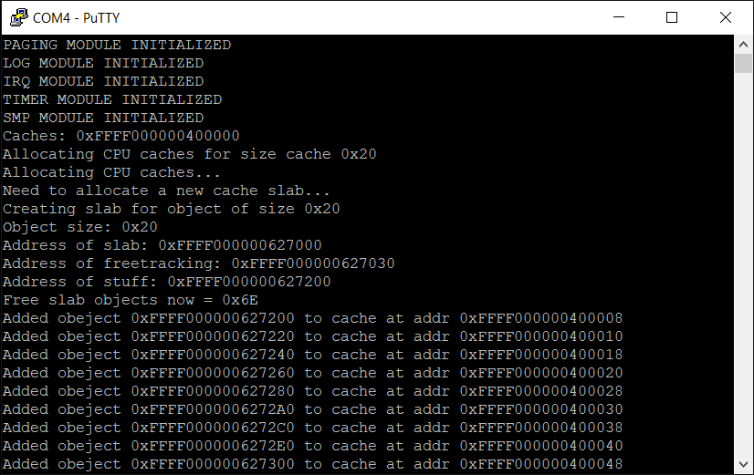

*Chapter Top* [Chapters[6]: Memory Allocator](chapter6.md) | *Next Chapter* [Chapters[7]: Scheduling and Processes](../chapter07/chapter7.md)  
*Previous Page* [Binary Buddies](binary-buddies.md) | *Next Page* [Chapters[7]: Scheduling and Processes](../chapter07/chapter7.md)

## Slab Allocator with Object Caches ([chapter06/code2](code2))

#### Slabs

It is now possible for our CheesecakeOS to allocate memory in page-size chunks, or multiples thereof. We can imagine, in further implementation, there could be some system call (`mmap` or `sbrk`) whereby user-space applications request these chunks of memory for `malloc` in a _C_ library. It is also the case kernel service will need to be able to dynamically request memory. Processes and buffers will be created and destroyed. Some of these objects will be materially smaller than 4KB. Allocating and freeing whole pages in these instances would be wasteful.

This is where slabs come in. Slabs are blocks of memory sized to multiples of a page, cut up into individual object-sized pieces, and managed by a kernel API. Each block has state, maintained by a slab descriptor. The descriptor is defined in [include/cake/allocate.h](code2/include/cake/allocate.h):

```C
struct slab {
    struct list slablist;
    struct page *page;
    struct cache *cache;
    void *block;
    unsigned int usage;
    unsigned int next_free;
};
```

There are three components involved in slab management:
1. The slab descriptor
2. An array to keep track of free and allocated objects from the slab, used like a stack
3. The objects themselves

For larger objects, the slab descriptor and free stack are stored _off-slab_. For objects that are small, it is convenient (and, for bootstrapping purposes, necessary), to include the slab and free-object stack _on-slab_. The slab descriptor itself takes up 48 bytes. The free stack is positioned right after, at the 48-byte offset. 

The `*block`, the address where the slab's objects begin, comes after the free stack for on-slab descriptors. The pointer may be aligned if profitable to do so. In the case the descriptor and free stack are stored off-slab, the `*block` is the slab. Visualizing a slab containing 64 objects of 32 bytes, assuming the slab begins at address 0x1000, might look like:

```
                                    ┌───────────────────────────────────────────────────┐
                                    │                                                   │
    ┌──────────┐                    │                        ┌───┬───┬───┬─────┬────┬───▼────┬────────┬────────┬─────┬────────┐
    │  0x1000  │                    │                        │ 0 │ 1 │ 2 │ ... │ 63 │ 0x1130 │ 0x1150 │ 0x1170 │ ... │ 0x1910 │
    ├──────────┼───────┬────────┬───┴────┬───────┬───────────┼───┴───┴───┴─────┴────┼────────┼────────┼────────┼─────┼────────┤
    │ slablist │ *page │ *cache │ *block │ usage │ next_free │    slab free stack   │  *obj  │  *obj  │  *obj  │ ... │  *obj  │
    └──────────┴───────┴────────┴────────┴───────┴───────────┴──────────────────────┴────────┴────────┴────────┴─────┴────────┘
    0x0        0x10    0x18     0x20     0x28    0x2C        0x30                   0x130                                     0x930
``` 

The value of `*block` is 0x1130. The slab free stack is initialized such that each index points to its own identity. The free stack is accessed with the help of the `SLAB_FREE_STACK` macro, defined in [src/allocate.c](code2/src/allocate.c):

```C
#define SLAB_FREE_STACK(slab) ((unsigned int *) (((struct slab *) (slab)) + 1))
```

For allocating objects, we can make us of the idiom:

```C
void *obj;
unsigned int free_index = SLAB_FREE_STACK(slab)[slab->next_free++];
obj = slab->block + (object_size * free_index);
```

And when freeing:

```C
void *obj = to_be_freed;
unsigned long index = (obj - (slab->block)) / object_size;
SLAB_FREE_STACK(slab)[--slab->next_free] = (unsigned int) index;
```

In this way, if an object is freed, that object will be the next object allocated from the slab.

The slab descriptor includes an embedded `struct list`. This is so multiple slabs holding similar objects can be linked together. A group of slabs forms what we refer to as a cache. The `struct cache`, also defined in [include/cake/allocate.h](code2/include/cake/allocate.h), is the reference clients will use when requesting objects. A cache will maintain such crucial information as the slab references, the size of the object, how many objects are contained within a slab, and how many free objects are left:

```C
struct cache {
    char name[32];
    struct list cachelist;
    unsigned long objsize;
    unsigned int batchsize;
    unsigned int freecount;
    unsigned int capacity;
    unsigned int pageorder;
    struct spinlock lock;
    struct cpucache *cpucaches[NUM_CPUS];
    struct list slabsfull;
    struct list slabspart;
    struct list slabsfree;
};
```

Finally, each cache also contains per-CPU `struct cpucache`s. All allocations are fulfilled from the cpucaches. When a cpucache is empty, it is filled from a slab. When it is too full, it releases object references back to the slabs from whence they came. The cpucaches act to reduce locking, and to lower the incidence of cache hopping as objects would otherwise move more freely between CPUs.

> Note: Another explanation of the relationships between objects, pages, slabs, caches, and cpucaches can be found in the [Slab Allocator](https://www.kernel.org/doc/gorman/html/understand/understand011.html) chapter of Mel Gorman's _Understanding the Linux Virtual Memory Manager_.

#### API

The slab/cache API, declared in [include/cake/allocate.h](include/cake/allocate.h) is small but complete:

```C
struct cache *alloc_cache(char *name, unsigned long objsize);
void *alloc_obj(struct cache *cache);
void *cake_alloc(unsigned long size);
void cake_free(void *obj);
```

There are two ways to allocate small objects. Specific types of objects are allocated from a cache reference with the `alloc_obj` function. The given cache reference is created with the `alloc_cache` function. If the kernel has need for, say, a generic buffer of a given size, the `cake_alloc` function is used. Behind the scenes, the allocator maintains a set of caches for objects of a given size, between 32B and 1MB, by powers of two. All objects assigned from the allocate module can be freed with the `cake_free` function.

Before we dive in to the implementation details, a note on error handling. It is possible for the system to run out of memory. It may be that a function will have to make multiple dynamic allocations to fully service a request. Examples will clarify, but for example, we may be inclined to engineer something like:

```C
    struct void *p = PAGE_TO_PTR(alloc_pages(n));
    struct container *c = alloc_obj(container_cache);
    container[0] = alloc_obj(obj_cache));
    return container[0];
```

Any of the three allocations could fail. To cope, will use idiomatic _C_ error handling like:

```C
    struct page *p = alloc_pages(n);
    if(!p) {
        goto nomem;
    }
    void *x = PAGE_TO_PTR(p);
    struct container *c = alloc_obj(container_cache);
    if(!c) {
        goto freepage;
    }
    void *obj = alloc_obj(obj_cache);
    if(!obj) {
        goto freecontainer;
    }
    container[0] = obj;
    return obj;
freecontainer:
    cake_free(c);
freepage:
    free_pages(p);
nomem:
    return 0;
```

This `goto` pattern seems the cleanest solution. The idiom is littered throughout the Linux kernel. 

> Note: see, for example, the Linux [copy\_process function error handling](https://github.com/torvalds/linux/blob/v4.20/kernel/fork.c#L1892).

#### Implementation - Size Caches

```C
void allocate_init()
{
    unsigned int count = 32;
    void *ptrs[count];
    for(unsigned int i = 0; i <= MAX_ORDER; i++) {
        struct list *freelist = &(freelists[i]);
        freelist->next = freelist;
        freelist->prev = freelist;
    }
    arch_populate_allocate_structures(freelists);
    setup_size_caches();
    setup_cache_cache();
}
```

The `allocate_init` function in [src/allocate.c](code2/src/allocate.c) is extended with the `setup_size_caches` and `setup_cache_cache` bootstrapping functions. All cpucaches will be allocated from the size caches, and standard caches will be allocated from the cache cache. Because all allocated object references come from cpucaches, including the cpucaches of the standard caches, the size caches must be setup first.

```C
static struct cache sizecaches[NUM_SIZE_CACHES];

static void setup_size_caches()
{
    unsigned int lgrm, numpages, batchsize;
    unsigned long objsize;
    struct cache *sizecache;
    struct list *li;
    struct spinlock *lock;
    struct page *ppa, *ppb;
    struct cpucache *cpucache, **ref, *old, *new;
    void *cpucache_ptrs, *cpucache_blocks;
    ppa = alloc_pages(0);
    ppb = alloc_pages(3);
    cpucache_ptrs = PAGE_TO_PTR(ppa);
    cpucache_blocks = PAGE_TO_PTR(ppb);
    log("References: %x\r\n", cpucache_ptrs
```

We grab two block of memory from the page allocator right away. We will use these blocks to setup temporary cpucaches until the allocator is far enough along to replace them organically.

```C
    for(unsigned int i = 0; i < NUM_SIZE_CACHES; i++) {
        sizecache = &(sizecaches[i]);
        ref = &(((struct cpucache **) cpucache_ptrs)[i * NUM_CPUS]);
        cpucache = (struct cpucache *) (((unsigned long) cpucache_blocks) + (i * 32 * 8));
        cpucache->free = 0;
        cpucache->capacity = CPUCACHE_CAPACITY;
        ref[0] = cpucache;
```

For each of the size caches, we allocate 32 bytes (eight bytes per `struct cpucache`, multiplied by four CPUs) for the array of cpucache references. We also allocate 128 bytes to hold up to 32 object pointers. The cpucache for CPU 0 points to these references. Since the initialization code runs on CPU 0, and only CPU 0, only CPU 0 urgently needs valid cpucache object references.

```C
        objsize = 1 << (i + MIN_SIZE_CACHE_ORDER);
        batchsize = DEFAULT_SIZE_CACHE_BATCHSIZE;
        numpages = (objsize * batchsize) / PAGE_SIZE;
        lgrm = LOG2_SAFE(numpages);
        lgrm = lgrm > MAX_ORDER ? MAX_ORDER : lgrm;
        batchsize = resize_batch((1 << lgrm), objsize);
```

Each slab is a contiguous block of memory represented by a page or a number of pages in sequence. In order to get an approximation for the number of pages to allocate for each slab, a default number of objects is assumed per slab - 64 in our implementation. This number of pages is then converted into an order using the `LOG2_SAFE` macro defined in [include/cake/cake.h](code2/include/cake/cake.h):

```C
#define LOG2(num)           ((unsigned) (8 * sizeof (unsigned long long) - \
    __builtin_clzll((num)) - 1))
#define LOG2_SAFE(num)      num == 0 ? 0 : LOG2(num)
```

The macro calculates the page order, taking the floor of the logarithm. After the size of the slab is known, we calculate the number of objects that will fit on the slab. The `resize_batch` function looks as:

```C

static unsigned int resize_batch(unsigned long numpages, unsigned long objsize)
{
    unsigned long batchsize, tracking_overhead, slab_overhead, round_down_to_even_mask;
    if(objsize > ONSLAB_DESCRIPTOR_SIZE) {
        batchsize = (numpages * PAGE_SIZE) / objsize;
    }
    else {
        tracking_overhead = sizeof(unsigned int);
        slab_overhead = sizeof(struct slab);
        objsize += tracking_overhead;
        round_down_to_even_mask = ~(1UL);
        batchsize = (((numpages * PAGE_SIZE) - slab_overhead) / objsize) - 1;
        batchsize &= round_down_to_even_mask;
    }
    return batchsize;
}
```

If the slab descriptor will reside off-slab, it will have no overhead impact on the memory block, and the size of the batch is calculated simply, as the quotient of the number of bytes and the size of the object. Otherwise, the memory consumed by the slab descriptor and the free stack need to be taken into account. The size of the slab descriptor is subtracted from the total number of bytes. Since an object needs four extra bytes of overhead to store an integer index in the free stack, the object size is incremented by four. The number of objects that can fit is then decremented by one, in order to allow for alignment. Finally, to keep things tidy, the number of objects on the slab is masked to an even number.

```C
        sizecache->objsize = objsize;
        sizecache->batchsize = batchsize;
        sizecache->freecount = 0;
        sizecache->capacity = 0;
        sizecache->pageorder = lgrm;
        sizecache->cpucaches[0] = ref[0];
        lock = &(sizecache->lock);
        lock->owner = 0;
        lock->ticket = 0;
        li = &(sizecache->slabsfull);
        li->next = li;
        li->prev = li;
        li = &(sizecache->slabspart);
        li->next = li;
        li->prev = li;
        li = &(sizecache->slabsfree);
        li->next = li;
        li->prev = li;
    }
```

The loop ends with the cache member initialization. In order to better imagine the state of the cache as it is initialized, we will trace through an example as we go. We will take the 32-byte size cache, and assume a static location at virtual address 0xFFFF0000002060D0. We will also assume our temporary page of order three is at virtual address 0xFFFF000000400000.

```
    ┌────────────────────┬──────────────┬────────────────────┐    ┌────────────────────┬──────────────┬────────────────────┐
    │ 0xFFFF0000002060D0 │ 32B cache    │                    │    │ 0xFFFF000000400000 │ 32B cpucache │                    │
    ├────────────────────┼──────────────┼────────────────────┤    ├────────────────────┼──────────────┼────────────────────┤ 
    │ 0xFFFF0000002060D0 │ name         │ N/A                │    │ 0xFFFF000000400000 │ free         │ 0                  │
    ├────────────────────┼──────────────┼────────────────────┤    ├────────────────────┼──────────────┼────────────────────┤
    │ 0xFFFF0000002060F0 │ objsize      │ 32                 │    │ 0xFFFF000000400004 │ capacity     │ 31                 │
    ├────────────────────┼──────────────┼────────────────────┤    ├────────────────────┼──────────────┼────────────────────┤
    │ 0xFFFF0000002060F8 │ batchsize    │ 110                │    │ 0xFFFF000000400008 │ objects[0]   │ UNDEFINED          │
    ├────────────────────┼──────────────┼────────────────────┤    ├────────────────────┼──────────────┼────────────────────┤
    │ 0xFFFF0000002060FC │ freecount    │ 0                  │    │ 0xFFFF000000400010 │ objects[1]   │ UNDEFINED          │
    ├────────────────────┼──────────────┼────────────────────┤    ├────────────────────┼──────────────┼────────────────────┤
    │ 0xFFFF000000206100 │ capacity     │ 0                  │    │ 0xFFFF000000400018 │ objects[2]   │ UNDEFINED          │
    ├────────────────────┼──────────────┼────────────────────┤    ├────────────────────┼──────────────┼────────────────────┤
    │ 0xFFFF000000206104 │ pageorder    │ 0                  │    │ 0xFFFF000000400020 │ objects[3]   │ UNDEFINED          │
    ├────────────────────┼──────────────┼────────────────────┤    ├────────────────────┼──────────────┼────────────────────┤
    │ 0xFFFF000000206110 │ lock         │ N/A                │    │ ****************** │ ************ │ ****************** │
    ├────────────────────┼──────────────┼────────────────────┤    ├────────────────────┼──────────────┼────────────────────┤
    │ 0xFFFF000000206120 │ cpucaches[0] │ 0xFFFF000000400000 │    │ 0xFFFF0000004000F8 │ objects[30]  │ UNDEFINED          │
    ├────────────────────┼──────────────┼────────────────────┤    └────────────────────┴──────────────┴────────────────────┘
    │ 0xFFFF000000206128 │ cpucaches[1] │ N/A                │ 
    ├────────────────────┼──────────────┼────────────────────┤ 
    │ 0xFFFF000000206130 │ cpucaches[2] │ N/A                │
    ├────────────────────┼──────────────┼────────────────────┤
    │ 0xFFFF000000206138 │ cpucaches[3] │ N/A                │
    ├────────────────────┼──────────────┼────────────────────┤
    │ 0xFFFF000000206140 │ slabsfull    │ empty              │
    ├────────────────────┼──────────────┼────────────────────┤
    │ 0xFFFF000000206160 │ slabspart    │ empty              │
    ├────────────────────┼──────────────┼────────────────────┤
    │ 0xFFFF000000206180 │ slabsfree    │ empty              │
    └────────────────────┴──────────────┴────────────────────┘
```

To begin, the entries in the CPU cache are undefined, as the memory is uninitialized, and the number of free objects in the cache is zero.

```C
    for(unsigned int i = 0; i < NUM_SIZE_CACHES; i++) {
        sizecache = &(sizecaches[i]);
        log("Allocating CPU caches for size cache %x\r\n", sizecache->objsize);
        ref = alloc_cpucaches();
```

For each size cache, we dynamically allocate the cpucaches. At this point, we digress to deep dive into this bootstrapping rabbit hole. We will later return to investigate the remainder of the loop. The `alloc_cpucaches` function, presented in its entirety:

```C
static struct cpucache **alloc_cpucaches()
{
    log("Allocating CPU caches...\r\n");
    long i;
    struct cpucache *cpucache, **cpucaches;
    unsigned int cpucache_capacity = CPUCACHE_CAPACITY + 1;
    unsigned long reference_size = NUM_CPUS * sizeof(struct cpucache *);
    unsigned long per_cpu_allocation = cpucache_capacity * sizeof(struct cpucache);
    cpucaches = cake_alloc(reference_size);
    if(!cpucaches) {
        goto nomem;
    }
    memset(cpucaches, 0, reference_size);
    for(i = 0; i < NUM_CPUS; i++) {
        cpucache = cake_alloc(per_cpu_allocation);
        if(!cpucache) {
            goto failure;
        }
        memset(cpucache, 0, per_cpu_allocation);
        cpucache->free = 0;
        cpucache->capacity = CPUCACHE_CAPACITY;
        cpucaches[i] = cpucache;
        log("Allocated cpucache object at address %x\r\n", cpucache);
    }
    return cpucaches;
failure:
    while(i-- > 0) {
        cpucache = cpucaches[i];
        if(cpucache) {
            cake_free(cpucache);
        }
    }
    cake_free(cpucaches);
nomem:
    return 0;
}
```

The overall structure of the algorithm is clear - the function begins by allocating a (32-byte) container to hold the references to cpucaches of all CPUs. As we follow the trace, stepping into the function calls, we will keep this first allocation in mind, it must come from our example 32-byte size cache. Each of the cpucaches is allocated, and initialized. In case of failure, the goto cleanup idiom returns to a stable state and indicates failure with a zero return. Note that, in order to allocate the cpucaches, the allocator depends on the public allocation function `cake_alloc`.

```C
void *cake_alloc(unsigned long size)
{
    struct cache *sizecache;
    unsigned int index;
    index = cake_alloc_index(size);
    if(index < 0) {
        return 0;
    }
    sizecache = &(sizecaches[index]);
    return alloc_obj(sizecache);
}
```

The `cake_alloc` function grabs a reference to a size cache based on the size of the request, before delegating to the `alloc_obj` function:

```C
#define CPUCACHE_DATA(cache) ((void **) (((struct cpucache *) (cache)) + 1))

void *alloc_obj(struct cache *cache)
{
    unsigned long cpuid, err;
    struct cpucache *cpucache;
    cpuid = SMP_ID();
    cpucache = cache->cpucaches[cpuid];
    if(!(cpucache->free)) {
        SPIN_LOCK(&(cache->lock));
        err = fill_cpucache(cache, cpucache);
        SPIN_UNLOCK(&(cache->lock));
        if(err) {
            return 0;
        }
    }
    return CPUCACHE_DATA(cpucache)[--cpucache->free];
}
```

The `alloc_obj` function selects the cpucache for the executing CPU. In the case of the initialization code, the CPU 0 cpucache is selected. Here is the reason it was important to at least temporarily reserve space for the CPU 0 cpucache before dynamically allocating them. We avoid a null object reference while bootstrapping. If the cpucache is empty, which is the case in our example, the cache is filled via the `fill_cpucache` routine. This happens under the protection of the cache's spinlock to ensure no concurrent access. Since the object references for the cpucache are located just after cpucache reference in memory (just like the free stack is located after the slab descriptor), the `CPUCACHE_DATA` macro provides convenient access to the objects.

```C
static long fill_cpucache(struct cache *cache, struct cpucache *cpucache)
{
    while(cache->freecount < CPUCACHE_FILL_SIZE) {
        log("Need to allocate a new cache slab...\r\n");
        if(alloc_cache_slab(cache)) {
            return -ENOMEM;
        }
        log("Free slab objects now = %x\r\n", cache->freecount);
    }
    while(cpucache->free < CPUCACHE_FILL_SIZE) {
        CPUCACHE_DATA(cpucache)[cpucache->free++] = next_free_obj(cache);
        log(
            "Added obeject %x to cache at addr %x\r\n",
            CPUCACHE_DATA(cpucache)[cpucache->free - 1],
            &(CPUCACHE_DATA(cpucache)[cpucache->free - 1])
        );
    }
    return 0;
}
```

First, we check the cache to see if any objects already exist in the cache, such that we can simply load them into the cpucache. If there are not enough objects already available, we must create a new slab for the cache. This is the case in our example, as we have begun from an empty cache.

```C
static long alloc_cache_slab(struct cache *cache)
{
    unsigned long slab_overhead, free_tracking_size;
    struct page *page;
    struct slab *slab;
    void *memblock;
    slab_overhead = sizeof(struct slab);
    free_tracking_size = cache->batchsize * sizeof(unsigned int);
    page = alloc_pages(cache->pageorder);
    if(!page) {
        goto nomem;
    }
```

The `alloc_cache_slab` function is the brains of the operation. Given the cache reference, we request an allocation for an order of pages sufficient to store objects of the cache's `batchsize`.

```C
    memblock = PAGE_TO_PTR(page);
    log("Creating slab for object of size %x\r\n", cache->objsize);
    if(cache->objsize > ONSLAB_DESCRIPTOR_SIZE) {
        slab = cake_alloc(slab_overhead + free_tracking_size);
        if(!slab) {
            goto freepage;
        }
    }
    else {
        slab = PAGE_TO_PTR(page);
        memblock += (slab_overhead + free_tracking_size);
        while((unsigned long) memblock & ((cache->objsize) - 1)) {
            memblock += sizeof(void *);
        }
    }
```

If the request for the pages of memory is successful, next comes the calculation of the location of the objects in memory. If the size of the objects in this particular cache are large enough, a new slab descriptor is allocated from the size caches. The `memblock` is simply the start of the page we requested. In the case of smaller objects, however, the slab descriptor and free stack are stored on-slab, and the `memblock` is calculated to be at an object-size-aligned offset right after the stack descriptor and free tracking. If you reason about it, you may conclude it is fortuitous the small size-caches are setup first. Setting up the larger size caches requires a `cake_alloc` hitting a smaller size cache for the off-slab descriptor. This chicken-and-egg conundrum is why it is not only convenient but _necessary_ for the smaller caches to maintain their slab descriptors on-slab.

```C
    slab->page = page;
    slab->cache = cache;
    slab->block = memblock;
    slab->usage = 0;
    slab->next_free = 0;
    for(unsigned int i = 0; i < cache->batchsize; i++) {
        SLAB_FREE_STACK(slab)[i] = i;
    }
```

As explained earlier, the slab's free stack is initialized with identity indexes.

```C

    for(unsigned long i = page->pfn; i < page->pfn + (1 << cache->pageorder); i++) {
        struct page *p = &(system_phys_page_dir[i]);
        p->slab = slab;
        p->cache = cache;
    }
```

In order to facilitate freeing objects to the correct cache, each page in a slab maintains a reference to the cache and slab it is assigned to. We can do this without increasing the memory footprint of the `struct page` by overloading the `pagelist` member into a union with these two pointers. From [include/cake/allocate.h](code0/include/cake/allocate.h):

```C
struct page {
    unsigned long allocated: 1;
    unsigned long reserved: 1;
    unsigned long valid: 1;
    unsigned long current_order: 4;
    unsigned long original_order: 4;
    unsigned long pfn: 53;
    union {
        struct list pagelist;
        struct {
            struct slab *slab;
            struct cache *cache;
        };

    };
    unsigned long refcount;
};
```

The slab allocation function ends by adding the new slab to the list of free slabs, and updating the capacity and free counts of the cache. In the case of our 32-byte size cache, where 110 objects have been added to the cache, the cache free count is high enough to break out of the first while loop in the `fill_cpucache` function. Our updated example now looks like:

```
    ┌────────────────────┬──────────────┬────────────────────┐    ┌────────────────────┬──────────────┬────────────────────┐
    │ 0xFFFF0000002060D0 │ 32B cache    │                    │    │ 0xFFFF000000400000 │ 32B cpucache │                    │
    ├────────────────────┼──────────────┼────────────────────┤    ├────────────────────┼──────────────┼────────────────────┤ 
    │ 0xFFFF0000002060D0 │ name         │ N/A                │    │ 0xFFFF000000400000 │ free         │ 0                  │
    ├────────────────────┼──────────────┼────────────────────┤    ├────────────────────┼──────────────┼────────────────────┤
    │ 0xFFFF0000002060F0 │ objsize      │ 32                 │    │ 0xFFFF000000400004 │ capacity     │ 31                 │
    ├────────────────────┼──────────────┼────────────────────┤    ├────────────────────┼──────────────┼────────────────────┤
    │ 0xFFFF0000002060F8 │ batchsize    │ 110                │    │ 0xFFFF000000400008 │ objects[0]   │ UNDEFINED          │
    ├────────────────────┼──────────────┼────────────────────┤    ├────────────────────┼──────────────┼────────────────────┤
    │ 0xFFFF0000002060FC │ freecount    │ 110                │    │ 0xFFFF000000400010 │ objects[1]   │ UNDEFINED          │
    ├────────────────────┼──────────────┼────────────────────┤    ├────────────────────┼──────────────┼────────────────────┤
    │ 0xFFFF000000206100 │ capacity     │ 110                │    │ 0xFFFF000000400018 │ objects[2]   │ UNDEFINED          │
    ├────────────────────┼──────────────┼────────────────────┤    ├────────────────────┼──────────────┼────────────────────┤
    │ 0xFFFF000000206104 │ pageorder    │ 0                  │    │ 0xFFFF000000400020 │ objects[3]   │ UNDEFINED          │
    ├────────────────────┼──────────────┼────────────────────┤    ├────────────────────┼──────────────┼────────────────────┤
    │ 0xFFFF000000206110 │ lock         │ N/A                │    │ ****************** │ ************ │ ****************** │
    ├────────────────────┼──────────────┼────────────────────┤    ├────────────────────┼──────────────┼────────────────────┤
    │ 0xFFFF000000206120 │ cpucaches[0] │ 0xFFFF000000400000 │    │ 0xFFFF0000004000F8 │ objects[30]  │ UNDEFINED          │
    ├────────────────────┼──────────────┼────────────────────┤    └────────────────────┴──────────────┴────────────────────┘
    │ 0xFFFF000000206128 │ cpucaches[1] │ N/A                │ 
    ├────────────────────┼──────────────┼────────────────────┤ 
    │ 0xFFFF000000206130 │ cpucaches[2] │ N/A                │
    ├────────────────────┼──────────────┼────────────────────┤
    │ 0xFFFF000000206138 │ cpucaches[3] │ N/A                │
    ├────────────────────┼──────────────┼────────────────────┤
    │ 0xFFFF000000206140 │ slabsfull    │ one slab           │
    ├────────────────────┼──────────────┼────────────────────┤
    │ 0xFFFF000000206160 │ slabspart    │ empty              │
    ├────────────────────┼──────────────┼────────────────────┤
    │ 0xFFFF000000206180 │ slabsfree    │ empty              │
    └────────────────────┴──────────────┴────────────────────┘
```

Now, back in the `fill_cpucache` function, the while loop to take objects from slabs in the cache and add them to the cpucache can proceed:

```C
    while(cpucache->free < CPUCACHE_FILL_SIZE) {
        CPUCACHE_DATA(cpucache)[cpucache->free++] = next_free_obj(cache);
    }
```

The `next_free_obj` function handles the popping of objects from the slabs:

```C
static void *next_free_obj(struct cache *cache)
{
    void *obj;
    unsigned int free_index;
    struct slab *slab;
    if(!list_empty(&(cache->slabspart))) {
        slab = LIST_FIRST_ENTRY(&(cache->slabspart), struct slab, slablist);
    }
    else {
        slab = LIST_FIRST_ENTRY(&(cache->slabsfree), struct slab, slablist);
        list_delete(&(slab->slablist));
        list_add(&(cache->slabspart), &(slab->slablist));
    }
    free_index = SLAB_FREE_STACK(slab)[slab->next_free++];
    obj = slab->block + (cache->objsize * free_index);
    slab->usage++;
    cache->freecount--;
    if(slab->usage == cache->batchsize) {
        list_delete(&(slab->slablist));
        list_add(&(cache->slabxsfull), &(slab->slablist));
    }
    return obj;
}
```

First we probe the list of partial slabs. In our example, we only have one slab and it is completely empty (free). Since objects will be allocated from the slab, it is moved from the list of free slabs to the list of partial slabs. The index of the object to allocate is popped from the free stack. Given the index, the location of the object is generated. If the slab has no more objects to offer, it is at full capacity, and moves to the list of full slabs.

Assuming the slab for the 32-byte size cache is located in memory at virtual address 0x0xFFFF000000628000, the virtual address of the free stack for the slab at 0xFFFF000000628030, and the value of the slab `*block` at 0xFFFF000000628200, our example memory visualization should look like:

```
    ┌────────────────────┬──────────────┬────────────────────┐    ┌────────────────────┬──────────────┬────────────────────┐
    │ 0xFFFF0000002060D0 │ 32B cache    │                    │    │ 0xFFFF000000400000 │ 32B cpucache │                    │
    ├────────────────────┼──────────────┼────────────────────┤    ├────────────────────┼──────────────┼────────────────────┤ 
    │ 0xFFFF0000002060D0 │ name         │ N/A                │    │ 0xFFFF000000400000 │ free         │ 15                 │
    ├────────────────────┼──────────────┼────────────────────┤    ├────────────────────┼──────────────┼────────────────────┤
    │ 0xFFFF0000002060F0 │ objsize      │ 32                 │    │ 0xFFFF000000400004 │ capacity     │ 31                 │
    ├────────────────────┼──────────────┼────────────────────┤    ├────────────────────┼──────────────┼────────────────────┤
    │ 0xFFFF0000002060F8 │ batchsize    │ 110                │    │ 0xFFFF000000400008 │ objects[0]   │ 0xFFFF000000628220 │
    ├────────────────────┼──────────────┼────────────────────┤    ├────────────────────┼──────────────┼────────────────────┤
    │ 0xFFFF0000002060FC │ freecount    │ 95                 │    │ 0xFFFF000000400010 │ objects[1]   │ 0xFFFF000000628240 │
    ├────────────────────┼──────────────┼────────────────────┤    ├────────────────────┼──────────────┼────────────────────┤
    │ 0xFFFF000000206100 │ capacity     │ 110                │    │ 0xFFFF000000400018 │ objects[2]   │ 0xFFFF000000628260 │
    ├────────────────────┼──────────────┼────────────────────┤    ├────────────────────┼──────────────┼────────────────────┤
    │ 0xFFFF000000206104 │ pageorder    │ 0                  │    │ 0xFFFF000000400020 │ objects[3]   │ 0xFFFF000000628280 │
    ├────────────────────┼──────────────┼────────────────────┤    ├────────────────────┼──────────────┼────────────────────┤
    │ 0xFFFF000000206110 │ lock         │ N/A                │    │ ****************** │ ************ │ ****************** │
    ├────────────────────┼──────────────┼────────────────────┤    ├────────────────────┼──────────────┼────────────────────┤
    │ 0xFFFF000000206120 │ cpucaches[0] │ 0xFFFF000000400000 │    │ 0xFFFF000000400078 │ objects[14]  │ 0xFFFF0000006823C0 │
    ├────────────────────┼──────────────┼────────────────────┤    ├────────────────────┼──────────────┼────────────────────┤
    │ 0xFFFF000000206128 │ cpucaches[1] │ N/A                │    │ OxFFFF000000400080 │ objects[15]  │ UNDEFINED          │ 
    ├────────────────────┼──────────────┼────────────────────┤    ├────────────────────┼──────────────┼────────────────────┤ 
    │ 0xFFFF000000206130 │ cpucaches[2] │ N/A                │    │ ****************** │ ************ │ ****************** │
    ├────────────────────┼──────────────┼────────────────────┤    ├────────────────────┼──────────────┼────────────────────┤
    │ 0xFFFF000000206138 │ cpucaches[3] │ N/A                │    │ 0xFFFF0000004000F8 │ objects[30]  │ UNDEFINED          │
    ├────────────────────┼──────────────┼────────────────────┤    └────────────────────┴──────────────┴────────────────────┘
    │ 0xFFFF000000206140 │ slabsfull    │ empty              │
    ├────────────────────┼──────────────┼────────────────────┤
    │ 0xFFFF000000206160 │ slabspart    │ one slab           │
    ├────────────────────┼──────────────┼────────────────────┤
    │ 0xFFFF000000206180 │ slabsfree    │ empty              │
    └────────────────────┴──────────────┴────────────────────┘
```

At this point, control returns to the `alloc_obj` function, which pops an object from the cpucache, finally satisfying the allocation. In our example, the value returned would be the object at virtual address 0xFFFF0000006283C0.

```C
    return CPUCACHE_DATA(cpucache)[--cpucache->free];
```

That was a ride! Now let us return, as promised, to the size-cache cpucache initialization. After the cpucaches are allocated, it is possible some of the size caches have left over references in the temporary cpucache memory space. These references can then be copied over to the new caches so no memory references are left dangling:

```C
    for(unsigned int i = 0; i < NUM_SIZE_CACHES; i++) {
        sizecache = &(sizecaches[i]);
        log("Allocating CPU caches for size cache %x\r\n", sizecache->objsize);
        ref = alloc_cpucaches();
        old = sizecache->cpucaches[0];
        new = ref[0];
        new->free = old->free;
        log("Pointer to CPU caches: %x\r\n", ref);
        for(unsigned int j = 0; j < NUM_CPUS; j++) {
            log("Pointer to CPU cache %x: %x\r\n", j, ref[j]);
            sizecache->cpucaches[j] = ref[j];
        }
        log("Address of old cache: %x\r\n", old);
        log("Address of new cache: %x\r\n", new);
        for(unsigned int j = 0; j < new->free; j++) {
            log("Replacing old with new...\r\n");
            log(
                "Replacing addr %x with addr %x\r\n",
                &(CPUCACHE_DATA(old)[j]),
                &(CPUCACHE_DATA(new)[j])
            );
            CPUCACHE_DATA(new)[j] = CPUCACHE_DATA(old)[j];
        }
        log("Done with setup for cachesize %x\r\n", sizecache->objsize);
    }
    free_pages(ppa);
    free_pages(ppb);
}
```

Once the temporary pages are no longer referenced, and therefore no longer needed, they can be returned to the page allocator. 

#### Implementation - Cache Cache (Standard Caches)

Setting up the cache cache, a necessary bootstrapping step in order to allocate other object caches, has a familiar form:

```C
static struct cache cache_cache = {
    .name = {'c', 'a', 'c', 'h', 'e', '\0'},
    .objsize = sizeof(struct cache),
    .batchsize = 64,
    .freecount = 0,
    .capacity = 0,
    .lock = {
        .owner = 0,
        .ticket = 0
    },
    .slabsfull = {
        .prev = &(cache_cache.slabsfull),
        .next = &(cache_cache.slabsfull)
    },
    .slabspart = {
        .prev = &(cache_cache.slabspart),
        .next = &(cache_cache.slabspart)
    },
    .slabsfree = {
        .prev = &(cache_cache.slabsfree),
        .next = &(cache_cache.slabsfree)
    }
};

static void setup_cache_cache()
{
    log("Setting up cache cache\r\n");
    unsigned int lgrm, numpages;
    struct cache *cache = &cache_cache;
    struct cpucache **ref;
    ref = alloc_cpucaches();
    numpages = (cache->objsize * cache->batchsize / PAGE_SIZE);
    lgrm = LOG2_SAFE(numpages);
    lgrm = lgrm > MAX_ORDER ? MAX_ORDER : lgrm;
    cache->batchsize = resize_batch((1 << lgrm), cache->objsize);
    cache->pageorder = lgrm;
    for(unsigned int i = 0; i < NUM_CPUS; i++) {
        cache->cpucaches[i] = ref[i];
    }
    list_add(&cachelist, &(cache->cachelist));
}
```

Subsequently, allocating caches should look familiar as well:

```C
struct cache *alloc_cache(char *name, unsigned long objsize)
{
    log("Allocating %s cache\r\n", name);
    unsigned int lgrm, numpages, batchsize;
    struct cpucache **ref;
    struct list *li;
    struct cache *cache = alloc_obj(&cache_cache);
    if(!cache) {
        goto nomem;
    }
    memset(cache, 0, sizeof(*cache));
    batchsize = 64;
    ref = alloc_cpucaches();
    if(!ref) {
        goto freecache;
    }
    numpages = (objsize * batchsize) / PAGE_SIZE;
    lgrm = LOG2_SAFE(numpages);
    lgrm = lgrm > MAX_ORDER ?  MAX_ORDER : lgrm;
    strcpy(cache->name, name);
    cache->objsize = objsize;
    cache->batchsize = resize_batch((1 << lgrm), objsize);
    cache->freecount = 0;
    cache->capacity = 0;
    cache->pageorder = lgrm;
    for(unsigned int i = 0; i < NUM_CPUS; i++) {
        cache->cpucaches[i] = ref[i];
    }
    li = &(cache->slabsfull);
    li->prev = li;
    li->next = li;
    li = &(cache->slabspart);
    li->prev = li;
    li->next = li;
    li = &(cache->slabsfree);
    li->prev = li;
    li->next = li;
    list_add(&(cachelist), &(cache->cachelist));
    return cache;
freecache:
    cake_free(cache);
nomem:
    return 0;
}
```

When the kernel no longer needs an object allocated from a cache, it can be returned to the allocator with `cake_free`. In most cases, this involves simply returning the object to the cpucache:

```C
#define OBJ_CACHE(ptr) (&(PTR_TO_PAGE(ptr)))->cache

void cake_free(void *obj)
{
    unsigned long cpuid;
    struct cpucache *cpucache;
    struct cache *cache;
    cpuid = SMP_ID();
    cache = OBJ_CACHE(obj);
    cpucache = cache->cpucaches[cpuid];
    CPUCACHE_DATA(cpucache)[cpucache->free++] = obj;
    log("Freed object: %x\r\n", obj);
    if(cpucache->free == CPUCACHE_CAPACITY) {
        SPIN_LOCK(&cache->lock);
        for(unsigned int i = CPUCACHE_CAPACITY; i > CPUCACHE_FILL_SIZE; i--) {
            free_object_to_cache_pool(cache, cpucache);
        }
        SPIN_UNLOCK(&cache->lock);
    }
}
```

The cache to which an object belongs is calculated by finding the containing page for the object, then using the cache reference from the associated `struct page`. Recall, this was setup in the `alloc_cache_slab` function. After the object has been returned to the cpucache, if the cpucache is full, `free_object_to_cache_pool` will return the object to the correct slab:

```C
#define OBJ_SLAB(ptr) (&(PTR_TO_PAGE(ptr)))->slab

static void free_object_to_cache_pool(struct cache *cache, struct cpucache *cpucache)
{
    void *obj = CPUCACHE_DATA(cpucache)[--cpucache->free];
    struct slab *slab = OBJ_SLAB(obj);
    unsigned long index = (obj - (slab->block)) / cache->objsize;
    log("Returning object %x with index %x to the cache pool\r\n", obj, index);
    if(slab->usage == cache->batchsize) {
        list_delete(&(slab->slablist));
        list_add(&(cache->slabspart), &(slab->slablist));
    }
    SLAB_FREE_STACK(slab)[--slab->next_free] = (unsigned int) index;
    cache->freecount++;
    slab->usage--;
    if(!slab->usage) {
        list_delete(&(slab->slablist));
        list_add(&(cache->slabsfree), &(slab->slablist));
    }
}
```

After getting a reference to the slab for an object, again using the `struct page` containing that object, the `free_object_to_cache_pool` function performs the inverse operation of the `find_next_obj` function. If the containing slab was at capacity previously, it is moved to the partial slabs list. The index of the object is calculated, and stored on top of the slab's free stack. If the slab is not used at all, it is moved to the free slabs list.

Building and running CheesecakeOS with selecting logging after the slab allocator implementation results in a trove of diagnostic data:



*Previous Page* [Binary Buddies](binary-buddies.md) | *Next Page* [Chapters[7]: Scheduling and Processes](../chapter07/chapter7.md)  
*Chapter Top* [Chapters[6]: Memory Allocator](chapter6.md) | *Next Chapter* [Chapters[7]: Scheduling and Processes](../chapter07/chapter7.md)
