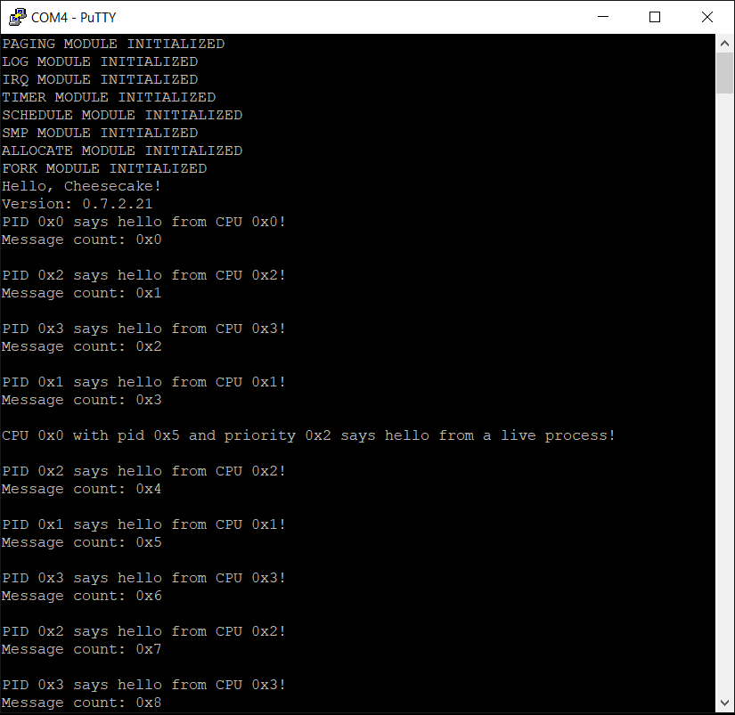

*Chapter Top* [Chapters[7]: Scheduling and Processes](chapter7.md) | *Next Chapter* [Chapters[8]: Working and Waiting](../chapter8/chapter8.md)  
*Previous Page* [Scheduling and Runqueues](scheduler.md) | *Next Page* [chapters[8]: Working and Waiting](../chapter8/chapter8.md)

## What the Fork!? ([chapter7/code2](code2))

#### Forking: An Amouse-bouche

In CheesecakeOS, our approach to forking will be multi-pronged. OK, OK, that's a joke. Enough with the fork puns, let's get down to brass hacks. Forking, well described by Wikipedia and others, is an operation whereby a process creates a copy of itself. It is the primary (only) method of process creating on Unix-like operating systems (CheesecakeOS). Forking turns out to be a rather simple operation. 

> See this note from the Linux Kernel fork module:
> Fork is rather simple, once you get the hang of it, but...

Forking envolves dynamic process creation. Therefore, both dynamic memory allocation, and scheduling come into play. In this section we will begin to see our sweet CheesecakeOS lift as the features have piled up.

#### Copying the CURRENT Process

We begin in the fork module, [src/fork.c](code2/src/fork.c) with the initalization function:

```C
#include "cake/allocate.h"

static struct cache *process_cache;

void fork_init()
{
    process_cache = alloc_cache("process", sizeof(struct process));
}
```

The `process_cache` will deliver us `struct process`es to meet our dynamic process-creation needs. Next, we make a `do_clone` function to implement the fork operation:

```C
#include "cake/schedule.h"

static long do_clone(unsigned long flags, unsigned long thread_input, unsigned long arg)
{
    struct process *p;
    p = copy_process(flags, thread_input, arg);
    if(!p) {
        return -1;
    }
    runqueue_process(p);
    return p->pid;
}
```

The `do_clone` function first generates a copy of the current process. If successful, the copy is placed on a runqueue to be scheduled, and the pid of the new process is returned. Perhaps you can already imagine how this function will be wrapped to create a system call.

```C
static struct process *copy_process(unsigned long flags,
    unsigned long thread_input,
    unsigned long arg)
{
    struct process *p;
    p = duplicate_current();
    if(!p) {
        goto err;
    }
    if(copy_arch_context(flags, thread_input, arg, p)) {
        goto freeprocess;
    }
    p->pid = allocate_pid(p);
    return p;
freeprocess:
    cake_free(p);
err:
    return 0;
}
```

The `copy_process` function duplicates the current (`CURRENT`) process, executes the architecture-specific `copy_arch_context` function (explained later). If these requests are succesful, a pid is assigned to the process. Most of the copying is delegated to the `duplicate_current` function.

```C
static struct process *duplicate_current()
{
    void *new_stack;
    struct process *p;
    struct process *current = CURRENT;
    p = alloc_obj(process_cache);
    if(!p) {
        goto nomem;
    }
    new_stack = PAGE_TO_PTR(alloc_pages((STACK_SHIFT)));
    if(!new_stack) {
        goto freeprocess;
    }
    memset(new_stack, 0, STACK_SIZE);
    *p = *current;
    p->stack = new_stack;
    return p;
freeprocess:
    cake_free(p);
nomem:
    return 0;
}
```

A new process is allocated from the `process_cache`, and a new stack area is allocated from the allocator. Two processes cannot share the same stack, even if all other resources are identical between them. Stack space has to be unique to avoid clobbering. If the allocations are successful, the newly allocated `struct process` is zeroed out, and the `CURRENT` process is copied into the new process. In order for this to work, we must supply our own memcpy function (recall we have no C library, and the compiler depends on this function to implement copies of structs). Our `memcpy` implementation is, just like `memset`, taken from the Linux Kernel. It can be found in [arch/arm64/memcpy.S](code2/arch/arm64/memcpy.S). After the copy, the current stack is overwritten in the new process by the fresh stack. That's it!

#### Creating a Cake Thread

We have not yet paid the dues necessary to have user space processes (also could be called threads) running on our CheesecakeOS. But we can add a bit of formality to the kernel's execution context by creating cake threads. The prototype for the `cake_thread` function, from [include/cake/fork.h](code2/include/cake/fork.h) looks like:

```C
#ifndef _CAKE_FORK_H
#define _CAKE_FORK_H

#define CLONE_CAKETHREAD    0b0001

int cake_thread(int (*fn)(void*), void *arg, unsigned long flags);

#endif
```

The `cake_thread` function simply calls `do_clone`, ensuring the `CLONE_CAKETHREAD` flag is set:

```C
int cake_thread(int (*fn)(void *), void *arg, unsigned long flags)
{
    return do_clone((flags | CLONE_CAKETHREAD), (unsigned long) fn, (unsigned long) arg);
}
```

Whether this flag is set will ultimately have an impact on how the `copy_arch_context` function behaves. For now, only cake threads are supported. User threads will come in Chapter 9. The function is defined in [arch/arm64/process.c](code2/arch/arm64/process.c):

```C
int copy_arch_context(unsigned long flags,
    unsigned long thread_input,
    unsigned long arg,
    struct process *p)
{
    struct stack_save_registers *ssr = PROCESS_STACK_SAVE_REGISTERS(p);
    memset(&(p->context), 0, sizeof(struct cpu_context));
    p->preempt_count = FORK_PREEMPT_COUNT;
    if(flags & CLONE_CAKETHREAD) {
        memset(ssr, 0, sizeof(*ssr));
        p->context.x19 = thread_input;
        p->context.x20 = arg;
    }
    else {
    }
    p->context.pc = (unsigned long) __ret_from_fork;
    p->context.sp = (unsigned long) ssr;
    return 0;
}
```

There are four notable components to this function. We will examine, in order:
1. The `__ret_from_fork` assembly routine
2. The assigning of `thread_input` to `x19` and of `arg` to `x20`
3. The `PROCESS_STACK_SAVE_REGISTERS` macro (and, by extension, the initalization of the saved context stack)
4. The `FORK_PREEMPT_COUNT` macro.

At the end of the `copy_arch_context` function, the newly forked `struct process`'s saved program counter is set to the address of the `__ret_from_fork` routine. The `__ret_from_fork` routine is defined in [arch/arm64/entry.S](code2/arch/arm64/entry.S):

```asm
.globl __ret_from_fork
__ret_from_fork:
    bl      schedule_tail
    mov     x0, x20
    blr     x19
    b       __exception_hang
```

All newly forked processes, when first scheduled, must begin by branching to the `schedule_tail` function, added in [src/schedule.c](code2/src/schedule.c):

```C
void schedule_tail(struct process *prev)
{
    finish_switch(prev);
    PREEMPT_ENABLE();
}
```

Finish switch is called with the previous process in `x0`. How does this work? Well, the only way for a forked process to run is to be scheduled in after a call to `CONTEXT_SWITCH`, or, specific to `arm64`, a call to `__cpu_switch_to`. We discussed in the last section that the previous process is maintained in x0. When `__cpu_switch_to` is called with a newly-forked process as next, the `__ret_from_fork` address is loaded into `x30` from the processes `context.pc` member. After the jump to `__ret_from_fork`, there is no update to `x0` before the branch to schedule tail. Thus, `finish_switch` can now be called. Consistent behavior is maintained between context switches that continue running a process that was previously schedule away, and those that schedule a newly-forked process for the first time. These are the only two options, the only possible return paths from `CONTEXT_SWITCH`/`__cpu_switch_to`. The `finish_switch` call, in the case of the newly-forked process path, will serve to unlock the spinlock held on the CPU's runqueue, and to move the previous process to a new runqueue if profitable.

Back in `__ret_from_fork`, when the call to `schedule_tail` returns, the value of `x1` is set from `x20`, and the processor branches to the address stored in `x19` (not by accident, the first two of the callee-saved registers). These were the registers initalized in the `CLONE_CAKETHREAD` path of `copy_arch_context`, and then loaded by `__cpu_switch_to`:

```C
    if(flags & CLONE_CAKETHREAD) {
        memset(ssr, 0, sizeof(*ssr));
        p->context.x19 = thread_input;
        p->context.x20 = arg;
    }
```
The third notable aspect of the `copy_arch_context` function is the `PROCESS_STACK_SAVE_REGISTERS` macro. This macro is used to generate the address of the stack for newly created process. The definition is found in [arch/arm64/include/arch/process.h](code2/arch/arm64/include/arch/process.h):

Cake threads ultimately no more than functions that, as the prototype of `cake_thread` imply, take a generic pointer, and return an integer. For this section, we setup a few cake threads during initalization in [src/cheesecake.c](code2/src/cheesecake.c):

```C
    cake_thread(schedule_test_task, (void *) 1, CLONE_CAKETHREAD);
    cake_thread(schedule_test_task, (void *) 2, CLONE_CAKETHREAD);
```

For these two cake threads, the address of `schedule_test_task` will first be saved in `x19`, while the values `1` and then `2` will be stored in `x20`. When `__ret_from_fork` runs, the effect will be to branch to `schedule_test_task` with a value of `1` or `2` as the argument to the `schedule_test_task` function, depending on which cake thread is executing. The `schedule_test_task` should not return, as, for now, the `__ret_from_fork` function will branch to `__exception_hang` after a cake thread returns.

The third notable aspect of the `copy_arch_context` function is the `PROCESS_STACK_SAVE_REGISTERS` macro. This macro is used to generate the address of the stack for newly created process. The definition is found in [arch/arm64/include/arch/process.h](code2/arch/arm64/include/arch/process.h):

```C
#define PROCESS_STACK_SAVE_REGISTERS(p) \
    (((struct stack_save_registers *) ((((unsigned long) p->stack) + STACK_SIZE))) - 1)
```

The macro gives the address computed as the top of the kernel stack minus the size of one `struct stack_save_registers`. This is the value you would get if you took the value of the stack pointer after exeucuting an `__ENTRY_SAVE` from [arch/arm64/entry.S](code0/arch/arm64/entry.S). In the given context, the detail is not profound. We will rexamine when we add user-space processes (or threads) in [Chapter 9](../chapter9/chapter9.md). For now, we can say the address of the stack to be assigned when the process first runs is calculated in this way. It is stored in the cpu context `sp` variable.

Finally, the `FORK_PREEMPT_COUNT` is defined in [arch/arm64/include/arch/schedule.h](code0/arch/arm64/include/arch/schedule.h):

```C
#ifndef _ARCH_SCHEDULE_H
#define _ARCH_SCHEDULE_H

#include "cake/process.h"

#define CONTEXT_SWITCH      __cpu_switch_to
#define CURRENT             __current()
#define SCHEDULE_CURRENT    __schedule_current_init
#define FORK_PREEMPT_COUNT  (2)

struct process *__cpu_switch_to(struct process *prev, struct process *next);
struct process *__current();
void __schedule_current_init();

#endif
```

Why set the initial `preempt_count` to two in `copy_arch_context`? The initial `preempt_count` must be greater than zero. It is assumed the `schedule` function will be called with preemption disabled. In the `timer_tick` function, preemption is disabled before calling `schedule` to avoid recursive calls. It is not advisable to allow a context switch to be interrupted. Thus, in `schedule_tail`, `PREEMPT_ENABLE` is executed to enable preemption before returning to branch to the cake thread function, mirroring the behavior of `timer_tick`. But if the initial preempt count is two, this will only reduce the preempt count from two to one. Preemption will remain disabled, preventing other processes from running.

Oh, but nay, it is essential to initalize the preempt count to two! Recall that executing `SPIN_LOCK` disables preemption (increments `preempt_count`), while `SPIN_UNLOCK` enables it (decrements `preempt_count`). The `finish_switch` function, also called from `scheudule_tail` decrements the `preempt_count` member by a call to `SPIN_UNLOCK`. Or by a call to `SPIN_LOCK` and two calls to `SPIN_UNLOCK` in the case of a runqueue rebalancing. Either way, the math checks out. An already running process will enter and exit `CONTEXT_SWITCH` with a `preempt_count` of two.

If thing haven't gone totally off the rails, building and running our CheesecakeOS will demonstrate the scintillation of cake threads:



*Chapter Top* [Chapters[7]: Scheduling and Processes](chapter7.md) | *Next Chapter* [Chapters[8]: Working and Waiting](../chapter8/chapter8.md)  
*Previous Page* [Scheduling and Runqueues](scheduler.md) | *Next Page* [chapters[8]: Working and Waiting](../chapter8/chapter8.md)
