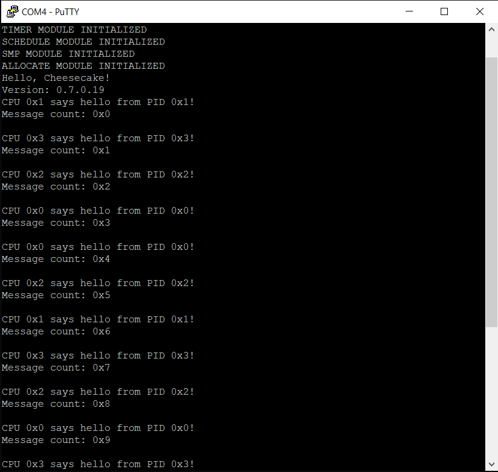

*Chapter Top* [Chapters[7]: Scheduling and Processes](chapter7.md) | *Next Chapter* [Chapters[8]: Working and Waiting](../chapter08/chapter8.md)  
*Previous Page* [Chapters[7]: Scheduling and Processes](chapter7.md) | *Next Page* [Scheduling with Runqueues](scheduler.md)

## Processes and PIDs ([chapter7/code0](code0))

#### Representing a Process

In [Computer Systems: A Programmer's Perspective](https://www.amazon.com/Computer-Systems-Programmers-Perspective-3rd/dp/013409266X), we learn the process, a running instance of a computer program, is one of the fundamental abstractions provided by the operating system. The OS, working with the hardware, provides each process the illusion it has exclusive access to the processor resource. Of course multiple processes often share access to a CPU, their execution contexts interleaved. In order to support the illusion the OS must be capable of suspending the execution of one process while launching the execution of another. It must also be able to resume execution of a previously suspended process - and must restore any system state on which the process depends. We have already toyed with saving and restoring system state when handling exceptions. The main focus of this chapter is to extend the concept to allow for multiple processes running (seemingly) simultaneously on a single CPU.

The operating system will need access to state for each process for use in scheduling and context switching. Our first representation of a process is defined in [include/cake/process.h](code0/include/cake/process.h):

```C
#define CPUMASK_SIZE                        BITMAP_SIZE(NUM_CPUS)
#define PROCESS_STATE_RUNNING               0b00000000
#define PROCESS_STATE_INTERRUPTIBLE         0b00000001
#define PROCESS_STATE_ZOMBIE                0b00000010
#define PROCESS_STATE_DEAD                  0b00000100

struct process {
    unsigned int state;
    unsigned int pid;
    unsigned long *stack;
    long preempt_count;
    struct list processlist;
    struct spinlock lock;
    unsigned long cpumask[CPUMASK_SIZE];
};
```

Thus there is now some embryonic state our CheesecakeOS can track for a process:
- The `state` member stores the execution state of a process, be it `PROCESS_STATE_RUNNING`, or another state indicating the process should not be scheduled
- The `pid` member maintains the process identifier of a process, which can prove particularly useful in the case processes want to communicate with each other
- The `stack` member stores the address of the top of the kernel stack
- The `preempt_count` is a counter variable indicating whether the process may be suspended (preempted) to make way for another process to utilize the CPU
  - A value of zero indicates the process may be preempted
  - A value of more than zero indicates the process should not be preempted
- The `processlist` member allows processes to be linked together in a list, for example, on a runqueue
- The `lock` member can be used to serialize concurrent access to the process's fields
- The `cpumask` bitmap indicates on which CPU(s) the process is allowed to execute

#### Runqueues and the CURRENT process

There must be some algorithm to select the next process to switch to when it is time to do so. The structure we will use for this is the `struct runqueue` defined in [include/cake/schedule.h](code0/include/cake/schedule.h):

```C
#include "arch/schedule.h"

#define PREEMPT_DISABLE()   do { \
                                    CURRENT->preempt_count++; \
                                    BARRIER(); \
                            } while(0)
#define PREEMPT_ENABLE()    do { \
                                BARRIER(); \
                                CURRENT->preempt_count--; \
                            } while(0)

struct runqueue {
    unsigned int switch_count;
    unsigned int weight;
    struct list queue;
    struct spinlock lock;
    struct process idle_task;
    struct process *current;
};
```

- The `switch_count` member tracks the number of switches for utility implementations
- The `weight` member keeps track of the process load on the runqueue
- The `queue` is the canonical head of a list linking together the `processlist` members of each process on the runqueue
- The `lock` protects the runqueue from concurrent access
- The `idle_task` member is process that will execute in the case no other processes are available to run
- The `current` member is a reference to the currently executing process on the runqueue, also helpful in utilities

Each CPU will have its own runqueue. The `weight` member is used to determine if it is profitable to move a process to another CPU's runqueue, balancing the load across multiple CPUs.

There is a `CURRENT` macro, which returns a reference to the currently running process. We use this reference ubiquitously to check and set the state of the currently running process. Already we can see the macro in use to disable and enable preemption. 

The `PREEMPT_ENABLE` and `PREEMPT_DISABLE` macros include a `BARRIER` macro, taken from Linux, which prevents the compiler from reordering the preemption state. `BARRIER` is defined in [include/cake/compiler.h](code0/include/cake/compiler.h):

```C
#define BARRIER()               __asm__ __volatile__("": : :"memory")
```

The implementation of the `CURRENT` macro is defined in [arch/arm64/include/arch/schedule.h](code0/arch/arm64/include/arch/scehdule.h):

```C
#define CURRENT             __current()
#define SCHEDULE_CURRENT    __schedule_current_init

struct process *__current();
void __schedule_current_init();
```

With the assembly code for the `__current` routine defined in [arch/arm64/schedule.S](code0/arch/arm64/schedule.S):

```C
.globl __current
__current:
    mrs     x0, tpidr_el1
    ret

.globl __schedule_current_init
__schedule_current_init:
    msr     tpidr_el1, x0
    ret
```

We choose to store a reference to the currently executing process in the `tpidr_el1` register, also known as the Software Thread ID Register, an ARM register available specifically for software use.

> Note: getting a reference to the currently running process still requires a function call, which is somewhat inefficient. Linux has a neat trick they use to avoid this in many instances:
```C
/*
 * We don't use read_sysreg() as we want the compiler to cache the value where
 * possible.
 */
static __always_inline struct task_struct *get_current(void)
{
	unsigned long sp_el0;

	asm ("mrs %0, sp_el0" : "=r" (sp_el0));

	return (struct task_struct *)sp_el0;
}

#define current get_current()
```
> The \_\_always\_inline function coupled with inline assembly allows the compiler to serve the pointer to the currently running process from a register where possible, and avoids function call overhead. Linux also stores the pointer in the sp\_el0 register. See [arch/arm64/kernel/entry.s](https://github.com/torvalds/linux/blob/v4.20/arch/arm64/kernel/entry.S#L249) and [arch/arm64/kernel/process.c](https://github.com/torvalds/linux/blob/v4.20/arch/arm64/kernel/process.c#L405) to see how Linux manages this.

Let's put our capability to use right away. Though we are not ready to implement context switching, we can already imagine a place we want to disable it - when holding a lock! It would be a disaster if a process holding a lock were to be preempted and replaced on a CPU by another process, perhaps not rescheduled for a long time. Meanwhile other processes may try to access the critical region and spin indefinitely. We update [arch/arm64/include/arch/lock.h](code0/arch/arm64/include/arch/lock.h) to disable preemption when about to acquire a lock, and enabling preemption when releasing a lock:

```C
#define SPIN_LOCK               spin_lock
#define SPIN_LOCK_BOOT          __spin_lock
#define SPIN_LOCK_IRQSAVE       spin_lock_irqsave
#define SPIN_UNLOCK             spin_unlock
#define SPIN_UNLOCK_BOOT        __spin_unlock
#define SPIN_UNLOCK_IRQRESTORE  spin_unlock_irqrestore

void __irq_restore(unsigned long flags);
unsigned long __irq_save();
void __spin_lock(struct spinlock *lock);
void __spin_unlock(struct spinlock *lock);

static inline void spin_lock(struct spinlock *lock)
{
    PREEMPT_DISABLE();
    __spin_lock(lock);
}

static inline unsigned long spin_lock_irqsave(struct spinlock *lock)
{
    unsigned long flags;
    PREEMPT_DISABLE();
    flags = __irq_save();
    __spin_lock(lock);
    return flags;
}

static inline void spin_unlock(struct spinlock *lock)
{
    __spin_unlock(lock);
    PREEMPT_ENABLE();
}

static inline void spin_unlock_irqrestore(struct spinlock *lock, unsigned long flags)
{
    __spin_unlock(lock);
    __irq_restore(flags);
    PREEMPT_ENABLE();
}
```

The original implementation without disabling prevention is still available with the `SPIN_LOCK_BOOT` and `SPIN_UNLOCK_BOOT` macros. This is for use during startup when `CURRENT` has not yet been initialized, or in rare cases where updating the preempt count is undesirable. [src/cheesecake.c](code0/src/cheesecake.c) is updated to reflect:

```C
void cheesecake_main(void)
{
    SPIN_LOCK_BOOT(&big_cake_lock);
    init();
    log("Hello, Cheesecake!\r\n");
    log("Version: 0.7.0.19\r\n");
    SPIN_UNLOCK_BOOT(&big_cake_lock);
    schedule_current();
    IRQ_ENABLE();
    do_idle();
}

void secondary_main()
{
    SPIN_LOCK_BOOT(&big_cake_lock);
    SPIN_UNLOCK_BOOT(&big_cake_lock);
    schedule_current();
    IRQ_ENABLE();
    do_idle();
}
```

#### Beginning with the Schedule Module

Previously, the `do_idle` function had a home in `src/cheesecake.c`. Now, it has relocated to [src/schedule.c](code0/src/schedule.c), and is protected from concurrent access of its critical region by the `idle_lock`:

```C
void do_idle()
{
    unsigned long cpuid = SMP_ID();
    while (1) {
        unsigned long flags = SPIN_LOCK_IRQSAVE(&idle_lock);
        log("CPU %x says hello from PID %x!\r\n", cpuid, CURRENT->pid);
        log("Message count: %x\r\n", count++);
        log("\r\n");
        SPIN_UNLOCK_IRQRESTORE(&idle_lock, flags);
        WAIT_FOR_INTERRUPT();
    }
}
```

Before enabling IRQs in the `cheesecake_main` and `secondary_main` functions, the `schedule_current` initializing function stores a valid process pointer in the `tpidr_el1` register. The current process on the runqueue is chosen:

```C
void schedule_current()
{
    unsigned long cpuid = SMP_ID();
    struct runqueue *rq = &(runqueues[cpuid]);
    struct process *p = rq->current;
    SCHEDULE_CURRENT(p);
}
```

Backing up further, the `schedule_init` function initializes the runqueues, and the idle process for each. The idle process is set as each runqueue's current process:

```C
void schedule_init()
{
    struct runqueue *rq;
    struct process *p;
    struct list *q;
    for(unsigned int i = 0; i < NUM_CPUS; i++) {
        rq = &(runqueues[i]);
        p = &(rq->idle_task);
        q = &(rq->queue);
        rq->switch_count = 0;
        rq->weight = 0;
        rq->current = p;
        p->state = PROCESS_STATE_RUNNING;
        p->pid = allocate_pid(p);
        p->stack = 0;
        p->preempt_count = 0;
        set_bit(p->cpumask, i);
        q->prev = q;
        q->next = q;
    }
}
```

Thus, the idle process becomes the the owning processes of the `do_idle` loop as execution progresses. Anytime there are no other processes to run (like right now as only the idle processes exist), the idle process will be selected to run, and it will continue interminably in the `do_idle` loop.

#### Allocating PIDs

In the `schedule_init` function, pids are assigned to each of the idle processes. The `allocate_pid` function is defined in [src/pid.c](code0/src/pid.c):

```C
unsigned long nextpid = 0;
unsigned long pidmap[PIDMAP_SIZE];
struct process *procmap[NUM_PIDS];

unsigned long allocate_pid(struct process *p)
{
    unsigned long pid;
    do {
        do {
            pid = READ_ONCE(nextpid);
        } while(pid != CMPXCHG_RELAXED(&nextpid, pid, pid + 1));
        pid &= PID_MASK;
    } while(test_and_set_bit(pidmap, pid));
    WRITE_ONCE(procmap[pid], p);
    return pid;
}

struct process *pid_process(unsigned int pid)
{
    return procmap[pid];
}
```

When entering the function, the value of the global variable `next_pid` is loaded into local `pid`. The atomic `CMPXCHG_RELAXED` (from [arch/arm64/include/arch/atomic.h](code0/arch/arm64/include/arch/atmomic.h) checks the value stored in nextpid, and, if it is equal to pid, increments the value by one. It does so atomically. If, when nextpid is compared to pid, the values are not equal, no increment occurs, and, instead, the loop restarts with pid reloaded. The `READ_ONCE` macro ensures that nextpid is loaded at each iteration, rather than remaining cached in a register where the value would not change. The _RELAXED_ in `COMPXCHG_RELAXED` indicates the atomic operation occurs with no ordering. This is ok, because the `test_and_set_bit` function is ordered, with a memory barrier, assuming a bit is set. The `test_and_set_bit`, as seen previously, ensures atomically that the pid is not already in use. If the pid is already in use, the loop continues again from the beginning. The `ATOMIC_LONG_FETCH_OR` within the `test_and_set_bit` function is what issues the memory barrier.

Recalling our introduction to [ordering and memory barriers](https://www.kernel.org/doc/html/latest/staging/index.html#memory-barriers), and how barriers must be paired, the `deallocate_pid` implementation looks like:

```C
void deallocate_pid(unsigned int pid)
{
    WRITE_ONCE(procmap[pid], 0);
    SMP_MB();
    clear_bit(pidmap, pid);
}
```

There is a memory barrier between the request to set the process map to zero for the given pid, and the request to clear the pid's bit in the pidmap. This ensures that _if_ another CPU views the bit as clear, that same CPU will also see the process map as not set. If this ordering were not in place, it would be possible for the other CPUs in the system to view the bitmap as clear, without seeing that the process map has been zeroed. It would then be possible for a different request to allocate that pid to succeed, before the process map had been properly cleared. The clear could come later, overwriting the allocation, and ruining our nice lockless implementation. Unlikely...but possible! The barrier also prevents the compiler from reordering the stores, which would almost certainly lead to disaster.

Assuming everything has gone alright, building and running now should lead to several messages from idle processes saying hello and announcing their PIDs:



*Previous Page* [Chapters[7]: Scheduling and Processes](chapter7.md) | *Next Page* [Scheduling with Runqueues](scheduler.md)  
*Chapter Top* [Chapters[7]: Scheduling and Processes](chapter7.md) | *Next Chapter* [Chapters[8]: Working and Waiting](../chapter08/chapter8.md)
