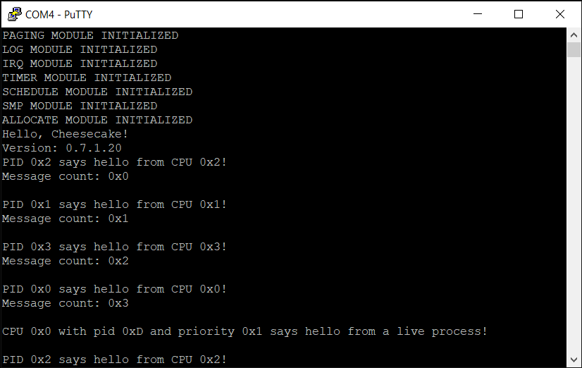

*Chapter Top* [Chapters[7]: Scheduling and Processes](chapter7.md) | *Next Chapter* [Chapters[8]: Working and Waiting](../chapter08/chapter8.md)  
*Previous Page* [Processes and PIDs](processes.md) | *Next Page* [What the Fork!?](fork.md)

## Scheduling with Runqueues ([chapter7/code1](code1))

#### Extending our Process Struct State (Context Switching!)

One of the coolest tricks an OS performs is to suspend execution of one process on a CPU, and begin the execution of another. In order for our OS to support such a feat, we must extend the `struct process` as in [include/cake/process.h](code1/include/cake/process.h):

```C
struct process {
    unsigned int state;
    unsigned int pid;
    unsigned int priority;
    int tick_countdown;
    unsigned long runtime_counter;
    unsigned long *stack;
    long preempt_count;
    struct list processlist;
    struct spinlock lock;
    struct cpu_context context;
    unsigned long cpumask[CPUMASK_SIZE];
};
```

Four members have been added:
1. The `priority` determines how important the process is, and practically, how much CPU time it is alloted relative to other processes
2. The `tick_countdown` clocks the remaining timer interrupts before the process is slated to be scheduled away
3. The `runtime_counter` is a count of timer interrupts the process has been on a CPU
4. The `context` stores architecture specific CPU context, for example, values stored in registers, to be saved and restored with switches

As our CheesecakeOS is not merely CheesecakeOS, but CheesecakeOS for RaspberryPi 4, our architecture specific `struct cpu_context` comes from the `arm64` architecture, and is found in [arch/arm64/include/arch/process.h](code1/arch/arm64/include/arch/process.h):


```C
struct cpu_context {
    unsigned long x19;
    unsigned long x20;
    unsigned long x21;
    unsigned long x22;
    unsigned long x23;
    unsigned long x24;
    unsigned long x25;
    unsigned long x26;
    unsigned long x27;
    unsigned long x28;
    unsigned long fp;
    unsigned long sp;
    unsigned long pc;
};
```

The assembly-level routine that will perform the switch itself, copied from the Linux kernel, is defined in [arch/arm64/schedule.S](code1/arch/arm64/schedule.S). It is surprisingly tidy relative to its stature:

```C
#define CONTEXT_SWITCH      __cpu_switch_to
struct process *__cpu_switch_to(struct process *prev, struct process *next);
```

```asm
#include "exec/asm-offsets.h"

.globl __cpu_switch_to
__cpu_switch_to:
    mov     x10, STRUCT_PROCESS_ARCH_CONTEXT_OFFSET
    add     x8, x0, x10
    mov     x9, sp
    stp     x19, x20, [x8], #16
    stp     x21, x22, [x8], #16
    stp     x23, x24, [x8], #16
    stp     x25, x26, [x8], #16
    stp     x27, x28, [x8], #16
    stp     x29, x9, [x8], #16
    str     x30, [x8]
    add     x8, x1, x10
    ldp     x19, x20, [x8], #16
    ldp     x21, x22, [x8], #16
    ldp     x23, x24, [x8], #16
    ldp     x25, x26, [x8], #16
    ldp     x27, x28, [x8], #16
    ldp     x29, x9, [x8], #16
    ldr     x30, [x8]
    mov     sp, x9
    msr     tpidr_el1, x1
    ret
```

The routine takes in the current process in the `x0` register, and the process to be switched to in the `x1` register. The macro `STRUCT_PROCESS_ARCH_CONTEXT_OFFSET` is the generated offset of the `struct cpu_context` in a `struct process`. The required update in [arch/arm64/exec/asm-offsets.c](code1/arch/arm64/exec/asm-offsets.c):

```C
    printf("#define %s \t\t\t%lu\n", "STRUCT_PROCESS_ARCH_CONTEXT_OFFSET",
        OFFSETOF(struct process, context));
```

The address of the current process context member is loaded into the `x8` register, and the stack pointer into `x9`. Then, each of the `x19`-`x28` registers, as well as the frame pointer (`x29`), stack pointer, and program counter (in the link register `x30`) are saved. Then, the saved register state from the _next_ process is loaded into the CPU registers, and the stack pointer and link register restored. When the routine returns, control jumps to the value in the `x30 register`, the program counter for the process that has taken over the CPU. The final step is to store the incoming process pointer in the `tpidr_el1` register. From this point, the CURRENT macro on this CPU will refer to the new process.

Notably, only registers `x19`-`x30` are saved. General purpose registers `x0`-`x18` are left out. This is because the `__cpu_switch_to` routine executes as a result of a function call. In the ARM Procedure Call Standard, registers `x0`-`x18` are _caller saved_ registers. Thus, if they are important, the caller of `__cpu_switch_to` must save these on the stack before performing the switch. When the OS has scheduled that process to resume, the context switch restores not only the _callee saved_ registers, but also the stack. This allows the caller saved registers to be restored from the stack, if necessary, upon resumption.

> Note: see the Linux `arm64` [context switching routine](https://github.com/torvalds/linux/blob/v4.20/arch/arm64/kernel/entry.S#L1047).

#### The Timer's Tick

We have an implementation that allows for processes to be scheduled on a CPU. But when and how will this feature be executed? In CheesecakeOS, there are two general cases by which the scheduler can be invoked.

First, a process can voluntarily request the scheduler to run in the case it no longer desires to be in the `PROCESS_STATE_RUNNING` state. For example, a process may be waiting on some event, such as user keystrokes. No need to take up CPU resources while it waits. The process can _sleep_ and allow other process to use the CPU instead. Or, with even greater finality, a process may be at the end of its life, with nothing more to execute. A process may then invoke the scheduler, never to be rescheduled.

Second, on each timer interrupt, the timer interrupt handler calls into the schedule module to check for a context switch! The Raspberry Pi 4 GIC driver is updated in [arch/arm64/board/raspberry-pi-4/irq.c](code1/arch/arm64/board/raspberry-pi-4/irq.c):

```C
            switch(irqid) {
                case SPID_SGI_TIMER:
                    timer_tick();
                    break;
                case SPID_TIMER3:
                    __irq_broadcast_sgi(SPID_SGI_TIMER);
                    timer_interrupt();
                    timer_tick();
                    break;
```

The `timer_tick` function is called at each timer interrupt. Let's examine its implementation from [src/schedule.c](code1/src/schedule.c):

```C
static inline int process_preemptable(struct process *current)
{
    int preemptable = current->preempt_count == 0;
    int countdown_complete = current->tick_countdown == 0;
    return preemptable && countdown_complete;
}

void timer_tick()
{
    struct process *current = CURRENT;
    current->runtime_counter++;
    current->tick_countdown = current->tick_countdown <= 0 ? 0 : current->tick_countdown - 1;
    if(process_preemptable(current)) {
        PREEMPT_DISABLE();
        IRQ_ENABLE();
        schedule();
        IRQ_DISABLE();
        PREEMPT_ENABLE();
    }
}
```

After the accounting at the top of the `timer_tick` function, the inline check `process_preemptable` decides whether to proceed with a call to the main scheduling routine, `schedule`. If the current process does not have preemption disabled, and the process's countdown has completed, scheduling proceeds. Because the `timer_tick` function is called from the timer interrupt handler, it is called with interrupts disabled. It is generally good form to have interrupts enabled whenever possible, so as to avoid their prolonged deferral. Before turning them back on, however, preemption is disabled. This protects against recursive entry into the critical scheduling section.

#### Selecting the Next Process

The primary scheduling function in [src/schedule.c](code1/src/schedule.c) is conceptually simple, consisting of two parts. First, the selection of the next process to run from the runqueue. Second, executing the context switch:

```C
static void schedule()
{
    unsigned long cpuid;
    struct runqueue *rq;
    struct process *prev, *next;
    struct spinlock *rqlock;
    IRQ_DISABLE();
    cpuid = SMP_ID();
    rq = &(runqueues[cpuid]);
    rqlock = &(rq->lock);
    SPIN_LOCK(rqlock);
    prev = rq->current;
    next = schedule_next(rq);
    if(next != prev) {
        rq->switch_count++;
        rq->current = next;
        context_switch(prev, next);
    }
    else {
        SPIN_UNLOCK(rqlock);
        IRQ_ENABLE();
    }
}
```

After disabling interrupts to avoid breaks during the sensitive switching code, the runqueue for the current CPU is selected and protected from concurrent access. The `schedule_next` function is responsible for selecting the next process to run on this CPU. If the selection algorithm returns the currently executing process, a context switch is not necessary.

```C
static struct process *schedule_next(struct runqueue *rq)
{
    unsigned long n, c = -1;
    struct process *p, *next = 0;
    struct list *q = &(rq->queue);
    LIST_FOR_EACH_ENTRY(p, q, processlist) {
        if(!p->state) {
            n = p->runtime_counter >> p->priority;
            if(!next || c > n) {
                next = p;
                c = n;
            }
        }
    }
    if(!next) {
        next = &(rq->idle_task);
    }
    next->tick_countdown = (1 << next->priority);
    return next;
}
```

Each process on the runqueue is examined. That process is eligible if its state is equal to `PROCESS_STATE_RUNNING`, and it has the least accounted CPU time, adjusted by the priority. Note an increase by one of the priority doubles the relative CPU time a process will receive relative to other processes. If no eligible process is found, the idle process is selected. Before returning, the countdown is reset. The higher the process priority, the longer a process will run before the `timer_tick` will execute the scheduler.

In the case a context switch is necessary: 
- Switch accounting proceeds
- The reference to the runqueue's current process is updated
- Context switching proceeds to the `context_switch` function

```C
static void context_switch(struct process *prev, struct process *next)
{
    prev = CONTEXT_SWITCH(prev, next);
    finish_switch(prev);
}
```

It is crucial to remember here, though mind-bending, that `CONTEXT_SWITCH` does not return immediately, at least not for the current executing process. When the `prev` process that entered `CONTEXT_SWITCH` is scheduled again, execution will resume and enter the `finish_switch` function. A subtlety of the implementation is concealed in the _C_ statement:

```C
    prev = CONTEXT_SWITCH(prev, next);
```

Does this statement set the `prev` pointer to the return value of the `CONTEXT_SWITCH` routine? Well, not really. Its aim is to preserve the value of `prev` in the `x0` register despite a context switch. Because of the ARM PCS where `x0` is a caller saved register, after the return of `CONTEXT_SWITCH`, the first argument of a function must be restored from the stack if it is to be reused. However, because of the context switch, a different stack space is in use. Restoring the caller saved registers overwrites the value cached in `x0`, a reference to the previous process. Reviewing `__cpu_switch_to`, the `x0` register is left untouched. Setting `prev` to be the return value of `CONTEXT_SWITCH` keeps our compiler from unfavorably interpreting the PCS and overwriting this reference. To develop a more intuitive sense of the state of the system when process execution is interleaved, let's step through an example.

Imagine two processes running on a single CPU, the first with a PID of 1, and the second with a PID of 2. They may exist in memory like:

```
┌──────────┬──────────────────┬───────────────┐    ┌──────────┬──────────────────┬───────────────┐
│ 0xA00000 │ PROCESS #1       │               │    │ 0xB00000 │ PROCESS #2       │               │
├──────────┼──────────────────┼───────────────┤    ├──────────┼──────────────────┼───────────────┤
│ 0xA00000 │ state            │ STATE_RUNNING │    │ 0xB00000 │ state            │ STATE_RUNNING │
├──────────┼──────────────────┼───────────────┤    ├──────────┼──────────────────┼───────────────┤
│ 0xA00004 │ pid              │ 1             │    │ 0xB00004 │ pid              │ 2             │
├──────────┼──────────────────┼───────────────┤    ├──────────┼──────────────────┼───────────────┤
│ 0xA00008 │ priority         │ 0             │    │ 0xB00008 │ priority         │ 0             │
├──────────┼──────────────────┼───────────────┤    ├──────────┼──────────────────┼───────────────┤
│ 0xA0000C │ tick_countdown   │ 0             │    │ 0xB0000C │ tick_countdown   │ 0             │
├──────────┼──────────────────┼───────────────┤    ├──────────┼──────────────────┼───────────────┤
│ 0xA00010 │ runtime_counter  │ 1             │    │ 0xB00010 │ runtime_counter  │ 1             │
├──────────┼──────────────────┼───────────────┤    ├──────────┼──────────────────┼───────────────┤
│ 0xA00018 │ *stack           │ 0x410000      │    │ 0xB00018 │ *stack           │ 0x418000      │
├──────────┼──────────────────┼───────────────┤    ├──────────┼──────────────────┼───────────────┤
│ 0xA00020 │ preempt_count    │ 0             │    │ 0xB00020 │ preempt_count    │ 0             │
├──────────┼──────────────────┼───────────────┤    ├──────────┼──────────────────┼───────────────┤
│ 0xA00028 │ processlist.next │ 0xB00028      │    │ 0xB00028 │ processlist.next │ 0xA00028      │
├──────────┼──────────────────┼───────────────┤    ├──────────┼──────────────────┼───────────────┤
│ 0xA00030 │ processlist.prev │ 0xB00028      │    │ 0xB00030 │ processlist.prev │ 0xA00028      │
├──────────┼──────────────────┼───────────────┤    ├──────────┼──────────────────┼───────────────┤
│ 0xA00038 │ lock.owner       │ 0             │    │ 0xB00038 │ lock.owner       │ 0             │
├──────────┼──────────────────┼───────────────┤    ├──────────┼──────────────────┼───────────────┤
│ 0xA0003C │ lock.ticket      │ 0             │    │ 0xB0003C │ lock.ticket      │ 0             │
├──────────┼──────────────────┼───────────────┤    ├──────────┼──────────────────┼───────────────┤
│ 0xA00040 │ context.x19      │ UNKNOWN       │    │ 0xB00040 │ context.x19      │ UNKNOWN       │
├──────────┼──────────────────┼───────────────┤    ├──────────┼──────────────────┼───────────────┤
│ 0xA00048 │ context.x20      │ UNKNOWN       │    │ 0xB00048 │ context.x20      │ UNKNOWN       │
├──────────┼──────────────────┼───────────────┤    ├──────────┼──────────────────┼───────────────┤
│ ******** │ ***************  │ ************  │    │ ******** │ **************** │ ************* │
├──────────┼──────────────────┼───────────────┤    ├──────────┼──────────────────┼───────────────┤
│ 0xA00098 │ context.sp       │ UNKNOWN       │    │ 0xB00098 │ context.sp       │ UNKNOWN       │
├──────────┼──────────────────┼───────────────┤    ├──────────┼──────────────────┼───────────────┤
│ 0xA000A0 │ context.pc       │ UNKNOWN       │    │ 0xB000A0 │ context.pc       │ UNKNOWN       │
├──────────┼──────────────────┼───────────────┤    ├──────────┼──────────────────┼───────────────┤
│ 0xA000A8 │ cpumask          │ 0b0001        │    │ 0xB000A8 │ cpumask          │ 0b0001        │
└──────────┴──────────────────┴───────────────┘    └──────────┴──────────────────┴───────────────┘

Note: Six least significant bytes of virtual addresses shown
```

Further, we can use the disassembled output of the build process to get a look at the assembly around the context switch:

```
ffff000000003fc8:   f9400ba1    ldr x1, [x29,#16]
ffff000000003fcc:   f9400fa0    ldr x0, [x29,#24]
ffff000000003fd0:   97fffc42    bl  ffff0000000030d8 <__cpu_switch_to>
ffff000000003fd4:   f9000fa0    str x0, [x29,#24]
ffff000000003fd8:   f9400fa0    ldr x0, [x29,#24]
ffff000000003fdc:   94000028    bl  ffff00000000407c <finish_switch>
```

Let's also suppose the values of
- 0x04 in register `x19`
- 0x300378 in register `x20`
- 0x40CF30 as the stack pointer

As the CPU is getting ready to execute our context switch, it loads `prev` - 0xA00000 - into `x0`, and `next` - 0xB00000 - into `x1`. Next, a `bl` instruction executes, with the side effect of moving 0xFFFF000000003FD4, the return address, into the link register `x30`.

When the `__cpu_switch_to` function runs, the values of the relevant registers are stored into the `struct cpu_context` of process with PID 1. After all of the stores:

```asm
    mov     x10, STRUCT_PROCESS_ARCH_CONTEXT_OFFSET
    add     x8, x0, x10
    mov     x9, sp
    stp     x19, x20, [x8], #16
    stp     x21, x22, [x8], #16
    stp     x23, x24, [x8], #16
    stp     x25, x26, [x8], #16
    stp     x27, x28, [x8], #16
    stp     x29, x9, [x8], #16
    str     x30, [x8]
```

The state of our process structs looks like:

```
┌──────────┬──────────────────┬───────────────┐    ┌──────────┬──────────────────┬───────────────┐
│ 0xA00000 │ PROCESS #1       │               │    │ 0xB00000 │ PROCESS #2       │               │
├──────────┼──────────────────┼───────────────┤    ├──────────┼──────────────────┼───────────────┤
│ 0xA00000 │ state            │ STATE_RUNNING │    │ 0xB00000 │ state            │ STATE_RUNNING │
├──────────┼──────────────────┼───────────────┤    ├──────────┼──────────────────┼───────────────┤
│ 0xA00004 │ pid              │ 1             │    │ 0xB00004 │ pid              │ 2             │
├──────────┼──────────────────┼───────────────┤    ├──────────┼──────────────────┼───────────────┤
│ 0xA00008 │ priority         │ 0             │    │ 0xB00008 │ priority         │ 0             │
├──────────┼──────────────────┼───────────────┤    ├──────────┼──────────────────┼───────────────┤
│ 0xA0000C │ tick_countdown   │ 0             │    │ 0xB0000C │ tick_countdown   │ 0             │
├──────────┼──────────────────┼───────────────┤    ├──────────┼──────────────────┼───────────────┤
│ 0xA00010 │ runtime_counter  │ 1             │    │ 0xB00010 │ runtime_counter  │ 1             │
├──────────┼──────────────────┼───────────────┤    ├──────────┼──────────────────┼───────────────┤
│ 0xA00018 │ *stack           │ 0x410000      │    │ 0xB00018 │ *stack           │ 0x418000      │
├──────────┼──────────────────┼───────────────┤    ├──────────┼──────────────────┼───────────────┤
│ 0xA00020 │ preempt_count    │ 0             │    │ 0xB00020 │ preempt_count    │ 0             │
├──────────┼──────────────────┼───────────────┤    ├──────────┼──────────────────┼───────────────┤
│ 0xA00028 │ processlist.next │ 0xB00028      │    │ 0xB00028 │ processlist.next │ 0xA00028      │
├──────────┼──────────────────┼───────────────┤    ├──────────┼──────────────────┼───────────────┤
│ 0xA00030 │ processlist.prev │ 0xB00028      │    │ 0xB00030 │ processlist.prev │ 0xA00028      │
├──────────┼──────────────────┼───────────────┤    ├──────────┼──────────────────┼───────────────┤
│ 0xA00038 │ lock.owner       │ 0             │    │ 0xB00038 │ lock.owner       │ 0             │
├──────────┼──────────────────┼───────────────┤    ├──────────┼──────────────────┼───────────────┤
│ 0xA0003C │ lock.ticket      │ 0             │    │ 0xB0003C │ lock.ticket      │ 0             │
├──────────┼──────────────────┼───────────────┤    ├──────────┼──────────────────┼───────────────┤
│ 0xA00040 │ context.x19      │ 0x4           │    │ 0xB00040 │ context.x19      │ UNKNOWN       │
├──────────┼──────────────────┼───────────────┤    ├──────────┼──────────────────┼───────────────┤
│ 0xA00048 │ context.x20      │ 0x300378      │    │ 0xB00048 │ context.x20      │ UNKNOWN       │
├──────────┼──────────────────┼───────────────┤    ├──────────┼──────────────────┼───────────────┤
│ ******** │ ***************  │ ************  │    │ ******** │ **************** │ ************* │
├──────────┼──────────────────┼───────────────┤    ├──────────┼──────────────────┼───────────────┤
│ 0xA00098 │ context.sp       │ 0x40CF30      │    │ 0xB00098 │ context.sp       │ UNKNOWN       │
├──────────┼──────────────────┼───────────────┤    ├──────────┼──────────────────┼───────────────┤
│ 0xA000A0 │ context.pc       │ 0x003FD4      │    │ 0xB000A0 │ context.pc       │ UNKNOWN       │
├──────────┼──────────────────┼───────────────┤    ├──────────┼──────────────────┼───────────────┤
│ 0xA000A8 │ cpumask          │ 0b0001        │    │ 0xB000A8 │ cpumask          │ 0b0001        │
└──────────┴──────────────────┴───────────────┘    └──────────┴──────────────────┴───────────────┘

Note: Six least significant bytes of virtual addresses shown
```

The remainder of the `__cpu_switch_to` function concerns itself with loading the previously saved state of process with PID 2 into the general purpose registers, setting up the `tpidr_el1` system register with reference 0xB00000, and jumping to where execution was previously interrupted. For now, we will act as if there are a variety of valid return addresses. In reality, there are a strictly finite number of possibilities for the return address, and we will exhaust them all by the end of the chapter.

Let's continue our example, but now imagine that the time has come for PID 2 to yield and for PID 1 to resume processing. `x0` will be loaded with 0xB00000, and `x1` will be loaded with 0xA00000. The CPU will branch to `__cpu_switch_to`. After saving the values of various registers for PID 2, the values of those same registers are restored for PID 1. PID 1's stack is restored. Address 0xFFFF000000003FD4 is moved into `x30` and 0xA00000 is stored in the `tpidr_el1` system register. After executing the `ret` instruction, control jumps to the instruction right after the `CONTEXT_SWITCH` (`__cpu_switch_to` routine call). Now, PID 1 is the `CURRENT` process. But also, 0xB00000, the previous process executing before the switch, remains in `x0` for the `finish_switch` call. The assembly shows it is simply saved to and reloaded from the stack:

```asm
ffff000000003fd0:   97fffc42    bl  ffff0000000030d8 <__cpu_switch_to>
ffff000000003fd4:   f9000fa0    str x0, [x29,#24]
ffff000000003fd8:   f9400fa0    ldr x0, [x29,#24]
ffff000000003fdc:   94000028    bl  ffff00000000407c <finish_switch>
```

If instead of 

```C
static void context_switch(struct process *prev, struct process *next)
{
    prev = CONTEXT_SWITCH(prev, next);
    finish_switch(prev);
}
```

We had coded

```C
static void context_switch(struct process *prev, struct process *next)
{
    CONTEXT_SWITCH(prev, next);
    finish_switch(prev);
}
```

We would have lost the reference to the previously running process. Note the difference in the assembly in the later case:

```asm
ffff000000003fc0:   f9000fa0    str x0, [x29,#24]
ffff000000003fc4:   f9000ba1    str x1, [x29,#16]
ffff000000003fc8:   f9400ba1    ldr x1, [x29,#16]
ffff000000003fcc:   f9400fa0    ldr x0, [x29,#24]
ffff000000003fd0:   97fffc42    bl  ffff0000000030d8 <__cpu_switch_to>
ffff000000003fd4:   f9400fa0    ldr x0, [x29,#24]
ffff000000003fd8:   94000028    bl  ffff000000004078 <finish_switch>
```

There is a missing `str` of `x0` to the stack after the `__cpu_switch_to`. Instead of using the value already in `x0` as intentioned, because of the ARM PCS, the `prev` pointer is retrieved from the stack of PID 1. But when PID 1 stored `x0` on the stack, it was before calling `__cpu_switch_to`, with itself, 0xA00000, in `x0`, and that is the value it will retrieve. This fine point is the difference between operating system software that works as expected, and an insidious bug, excruciating to reason about.

#### Rebalancing the Runqueue

We have established when a process returns from `__cpu_switch_to`, and calls `finish_switch`, the later function takes as an argument a reference to the previously executing `struct process`. The newly scheduled process has been stored into the `tpidr_el1` system register, securing its place as the `CURRENT` process. There is no longer any dependency on the previous process. As it turns out, this offers a nice opportunity to move the previous process to a different runqueue. This capability can be optimal if one CPU would otherwise have an outsized scheduling burden relative to another CPU. Load balancing across CPUs is one of the benefits of an SMP system, and there is no reason to let good CPU time go unused.

The `finish_switch` function begins by trying to find the optimal CPU to run the previous process, and, if necessary, moving it from the current runqueue to the best CPU's runqueue:

```C
static void finish_switch(struct process *prev)
{
    unsigned long cpuid, priority, threshold;
    struct runqueue *this_rq, *new_rq;
    cpuid = SMP_ID();
    this_rq = &(runqueues[cpuid]);
    if(prev != &(this_rq->idle_task)) {
        priority = 1 << prev->priority;
        threshold = this_rq->weight - priority;
        new_rq = select_runqueue(prev->cpumask, threshold);
        if(new_rq) {
            this_rq->weight -= priority;
            list_delete(&(prev->processlist));
            SPIN_UNLOCK(&(this_rq->lock));
            SPIN_LOCK(&(new_rq->lock));
            list_add(&(new_rq->queue), &(prev->processlist));
            new_rq->weight += priority;
            SPIN_UNLOCK(&(new_rq->lock));
            goto unlocked;
        }
    }
    SPIN_UNLOCK(&(this_rq->lock));
unlocked:
    IRQ_ENABLE();
}
```

The crucial first step is to ensure the previous process is _not_ the idle process. The idle process should not be scheduled on another CPU. Subsequently, we calculate the threshold a CPU must be below in order to qualify as a migratory CPU. This prevents thrashing between CPUs without true load balancing. If a valid runqueue reference is returned, the process is removed from the current runqueue, and the lock released. Then, the lock for the new CPU's runqueue is acquired, and the process added. 

This sequence of events, where the current runqueue's lock is released before the new runqueue's lock is acquired, is necessary to avoid the potential deadlock that could occur if we attempted to take the locks in a nested fashion. It is possible that multiple CPUs could enter this section of code at the same time, each holding the lock of their own runqueue, and each trying to gain access to the lock of the other. After rebalancing has completed, resources are released, and the schedule function returns.

The `select_runqueue` function simply selects the runqueue with the lowest weight below the threshold, if any such runqueue exists. Runqueues for CPUs within the provided CPU mask are eligible:

```C
static struct runqueue *select_runqueue(unsigned long *cpumask, unsigned long threshold)
{
    struct runqueue *rq = 0;
    unsigned long min = threshold;
    for(unsigned long cpu = 0; cpu < NUM_CPUS; cpu++) {
        if(test_bit(cpumask, cpu)) {
            struct runqueue *compare = &(runqueues[cpu]);
            if(compare->weight < min) {
                rq = compare;
                min = compare->weight;
            }
        }
    }
    return rq;
}
```

To round out the schedule module, we provide an interface for external modules to add processes to a runqueue, the `runqueue_process` function:

```C
void runqueue_process(struct process *process)
{
    unsigned long flags;
    struct runqueue *rq = select_runqueue(process->cpumask, -1UL);
    flags = SPIN_LOCK_IRQSAVE(&(rq->lock));
    list_add(&(rq->queue), &(process->processlist));
    rq->weight += (1 << process->priority);
    SPIN_UNLOCK_IRQRESTORE(&(rq->lock), flags);
}
```

A spin lock disabling IRQs is used here, of course, because these locks are used by the main schedule function, which is often called from IRQ context (from the `timer_tick` function).

#### New Problems

Now that we have added CPU migration capability for processes, a whole new class of problems will crop up. Barriers become that much more essential, given references to a process's  members can migrate between CPUs. Extra precautions must now be taken with per-CPU data. Take, for example, our starting implementation of the `alloc_obj` function:

```C
void *alloc_obj(struct cache *cache)
{
    unsigned long cpuid, err;
    struct cpucache *cpucache;
    cpuid = SMP_ID();
    cpucache = cache->cpucaches[cpuid];
    if(!(cpucache->free)) {
        SPIN_LOCK(&(cache->lock));
        err = fill_cpucache(cache, cpucache);
        SPIN_UNLOCK(&(cache->lock));
        if(err) {
            return 0;
        }
    }
    return CPUCACHE_DATA(cpucache)[--cpucache->free];
}
```

The correctness of this lockless implementation is not only based on the fact each CPU should only be able to access its own CPU cache, but it also assumes the access with be _atomic_. There can be no other process, even on the same CPU, that interrupts the allocation. Otherwise, catastrophe could ensue. Imagine two threads enter the function in serial. The final line:

```C
return CPUCACHE_DATA(cpucache)[--cpucache->free];
```

Is comprised of many loads and stores:

1. Load the cpucache pointer into a general purpose register
2. Get the offset of the `free` member
3. Load the value of that address into a general purpose register
4. Decrement and return that value, an index into the cpucache
5. Store the value of the index back into the `free` member offset
6. Return the pointer stored in this calculated index

If two threads were to interleave such that they calculated the same index, they would allocate the same object! In order to eliminate this possibility, we update both the `alloc_obj` and `cake_free` functions in [src/allocate.c](code1/src/allocate.c) to disable preemption before beginning their operations:

```C
void *alloc_obj(struct cache *cache)
{
    unsigned long cpuid, err;
    struct cpucache *cpucache;
    void *obj;
    PREEMPT_DISABLE();
    cpuid = SMP_ID();
    cpucache = cache->cpucaches[cpuid];
    if(!(cpucache->free)) {
        SPIN_LOCK(&(cache->lock));
        err = fill_cpucache(cache, cpucache);
        SPIN_UNLOCK(&(cache->lock));
        if(err) {
            return 0;
        }
    }
    obj = CPUCACHE_DATA(cpucache)[--cpucache->free];
    PREEMPT_ENABLE();
    return obj;
}

void cake_free(void *obj)
{
    unsigned long cpuid;
    struct cpucache *cpucache;
    struct cache *cache;
    PREEMPT_DISABLE();
    cpuid = SMP_ID();
    cache = OBJ_CACHE(obj);
    cpucache = cache->cpucaches[cpuid];
    CPUCACHE_DATA(cpucache)[cpucache->free++] = obj;
    if(cpucache->free == CPUCACHE_CAPACITY) {
        SPIN_LOCK(&cache->lock);
        for(unsigned int i = CPUCACHE_CAPACITY; i > CPUCACHE_FILL_SIZE; i--) {
            free_object_to_cache_pool(cache, cpucache);
        }
        SPIN_UNLOCK(&cache->lock);
    }
    PREEMPT_ENABLE();
}
```

In both cases IRQ processing is still enabled. However, because preemption is disabled, the `timer_tick` function will not call `schedule`, and another process will not be able to interleave with the `CURRENT` one executing in this path. We are careful to confirm memory allocation does not happen in IRQ context (it does not, and is not allowed).

At this point, assuming nothing has gone terribly wrong, building and running should show many processes on the system - all of them running infinite loops - which ultimately rebalance themselves until equilibrium:



*Previous Page* [Processes and PIDs](processes.md) | *Next Page* [What the Fork!?](fork.md)  
*Chapter Top* [Chapters[7]: Scheduling and Processes](chapter7.md) | *Next Chapter* [Chapters[8]: Working and Waiting](../chapter08/chapter8.md)
