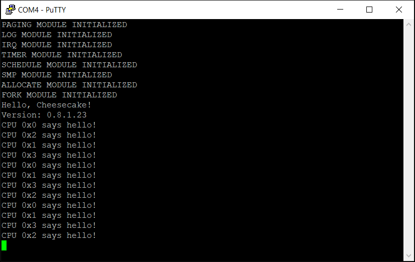

*Chapter Top* [Chapters[8]: Working and Waiting](chapter8.md) | *Next Chapter* [Chapters[9]: Virtual Memory and Fake Partition](../chapter9/chapter9.md)  
*Previous Page* [Waitqueues](waitqueues.md) | *Next Page* [Chapters[9]: Virtual Memory and Fake Partition](../chapter9/chapter9.md)

## The Kernel Workqueue ([chapter8/code1](code1))

#### The Need For Deferreral

Imagine a shell application. Shells run in a read-evaluate-print loop. When in the read phase, the shell has issued a read system call, and is waiting (sleeping on a waitqueue!) for user input. With each keystoke from the user, an IRQ is raised to handle the event. At this point, much processing is needed. Was the keystroke a normal character or a special character? Does it need to be added to a buffer? Was it a newline? Does a signal need to be sent? Should the shell wake up?

We know we want IRQ processing to be fast. While processing interrupts, often other interrupts cannot be processed, certainly not the same interrupt currently being handled. In the example of a user typing then, we can imagine that the IRQ handler may simply copy each character into a buffer, and then make a request of the kernel to process the buffer _later_. This request for deferred work (processing some function) will then rest on a queue managed by a cake thread, until that thread is scheduled, and requests from the queue satsified.

In the example, it is workable, though perhaps inadvisable, to do all the processing in the interrupt handler, and avoid the need for a workqueue. However, imagine an IRQ needs to perform some action that could result in a sleep. This is not workable, as it is not allowed to sleep from IRQ context! IRQs run by borrowing the context from a given process, they are not themselves schedulable entities. Sleeping in an IRQ would actually put the borrowed process to sleep. There is no reason to think this process will ever be awakened, effectively hanging the process if not the whole CPU. In these cases, some sort of deferred work in essential to proper processing of the system.

To handle the demand for a deferred work solution, we will setup our first real kernel cake thread.

#### Workqueue Implementation

The structure we will use to represent a request for deferred work is the `struct work` defined in [include/cake/work.h](code1/include/cake/work):

```C
struct work {
    struct list worklist;
    struct {
        unsigned long pending: 1;
        unsigned long reserved: 63;
    };
    void *data;
    void (*todo)(struct work *self);
};

void enqueue_work(struct work *work);
int perform_work(void *unused);
```

The members of `struct work` function like:
- The `worklist` member is used to add and remove the `struct work` from the workqueue
- The `pending` member is used to check if the given `struct work` is pending execution (can be used by both inside and outside the workqueue)
- The `data` memeber can be used to pass additional argument(s) used for processing
- The `todo` member is a function pointer, returning void, and taking a pointer to _this_ object as input

The workqueue API consits of only an `enqueue_work` function to add deferred work to the queue, and the `perform_work` function conforming to the `cake_thread` prototype. The implementation is contained in [src/work.c](code1/src/work.c). We begin with our statically defined workqueue:

```C
struct workqueue {
    struct list worklist;
    struct spinlock lock;
    struct waitqueue waitqueue;
};

static struct workqueue workqueue = {
    .worklist = {
        .prev = &(workqueue.worklist),
        .next = &(workqueue.worklist)
    },
    .lock = {
        .owner = 0,
        .ticket = 0
    },
    .waitqueue = {
        .waitlist = {
            .prev = &(workqueue.waitqueue.waitlist),
            .next = &(workqueue.waitqueue.waitlist),
        },
        .lock = {
            .owner = 0,
            .ticket = 0
        }
    }
};
```

The workqueue itself is comprised of three members:
- The `worklist` member is the queue itself
- The `lock` member is a spinlock to protect the workqueue from concurrent access (simultaneous adding and removing from the queue)
- The `waitqueue` member is a waitqueue that allows the workqueue process to sleep when the queue is empty

The `enqueue_work` function of the API:

```C
void enqueue_work(struct work *work)
{
    unsigned long flags;
    flags = SPIN_LOCK_IRQSAVE(&(workqueue.lock));
    if(!work->pending) {
        work->pending = 1;
        list_enqueue(&(workqueue.worklist), &(work->worklist));
    }
    SPIN_UNLOCK_IRQRESTORE(&(workqueue.lock), flags);
    wake_waiter(&(workqueue.waitqueue));
}
```

Because the `enqueue_work` function will certainly be called from IRQ contexts, IRQs must be disabled when acquiring the workqueue lock. If the `struct work` passed with the request is not already pending, the pending flag is set, and the work is enqueued. After releasing the lock, the call to `wake_waiter` will set the cake thread process state to `PROCESS_STATE_RUNNING` so that the requests may be exectued.

The `perform_work` function takes care of the queue processing:

```C
int perform_work(void *unused)
{
    for(;;) {
        unsigned long flags;
        struct wait wait;
        wait.sleeping = CURRENT;
        wait.waitlist.prev = &(wait.waitlist);
        wait.waitlist.next = &(wait.waitlist);
        enqueue_wait(&(workqueue.waitqueue), &wait, PROCESS_STATE_INTERRUPTIBLE);
        if(list_empty(&(workqueue.worklist))) {
            schedule_self();
        }
        dequeue_wait(&(workqueue.waitqueue), &wait);
        flags = SPIN_LOCK_IRQSAVE(&(workqueue.lock));
        while(!list_empty(&(workqueue.worklist))) {
            struct work *w;
            w = LIST_ENTRY(workqueue.worklist.next, struct work, worklist);
            list_delete(&(w->worklist));
            w->pending = 0;
            SPIN_UNLOCK_IRQRESTORE(&(workqueue.lock), flags);
            (w->todo)(w);
            flags = SPIN_LOCK_IRQSAVE(&(workqueue.lock));
        }
        SPIN_UNLOCK_IRQRESTORE(&(workqueue.lock), flags);
    }
    return 0;
}
```

The process runs in an infinite loop. A wait object is initialized with the CURRENT process as the sleeper. After priming the workqueue for sleeping by adding it to the waitqueue, we check to see if there is anything in the workqueue. If it is empty, we yield the processor with a call to `schedule_self`. If the queue is not empty, or if the workqueue process has been awakend and returned from `schedule_self`, the work in the queue can be processed.

After acquiring the lock before the beginning of the loop, each `struct work` object is removed from the queue. The lock is released so that other work may be enqueued. The function associated with the `struct work` object is then executed, passing the object itself as the argument. Finally, the lock is acquired again for the next iteration of the loop. When the loop finishes, the queue empty, the lock is released. The function includes a return statement at the end to keep the compiler happy, but the return should never be executed.

Note the cases where the `perform_work` function potentially handles state, but without the protection of a lock:
- When checking if the queue is empty before a call to `schedule_self`
- When executing the work functon with `(w->todo)(w)`, even though the workqueue manages the state of `w->pending`

See if you can convince yourself this is safe. Or, imagine a scenario where this might break.

A close look at the structure of the function reveals a deviation from the typical sleeping idiom. The function could be refactored to replace:

```C
        enqueue_wait(&(workqueue.waitqueue), &wait, PROCESS_STATE_INTERRUPTIBLE);
        if(list_empty(&(workqueue.worklist))) {
            schedule_self();
        }
        dequeue_wait(&(workqueue.waitqueue), &wait);
```

With:

```C
        while(1) {
            enqueue_wait(&(workqueue.waitqueue), &wait, PROCESS_STATE_INTERRUPTIBLE);
            if(!list_empty(&(workqueue.worklist))) {
                break;
            }
        schedule_self();
        }
        dequeue_wait(&(workqueue.waitqueue), &wait);
```

But this doesn't seem to make or break the algorithm.

#### Bona-fide Cake Thread!

We already know how to create cake threads, but this will be our first that exists for purposes beyond debugging. We update the `init` function in [src/cheescake.c](code1/src/cheesecake.c):

```C
    cake_thread(perform_work, (void *) 0, CLONE_CAKETHREAD);
```

We again hack the `do_idle` function in [src/schedule.c](code1/src/schedule.c):

```C
static void idle_todo(struct work *self);

void do_idle()
{
    unsigned long cpuid;
    struct work work;
    cpuid = SMP_ID();
    work.todo = idle_todo;
    work.data = (void *) cpuid;
    while (1) {
        WAIT_FOR_INTERRUPT();
        WAIT_FOR_INTERRUPT();
        enqueue_work(&work);
        WAIT_FOR_INTERRUPT();
        WAIT_FOR_INTERRUPT();
    }
}

static void idle_todo(struct work *self)
{
    log("CPU %x says hello!\r\n", self->data);
}
```

Now, when building and running, if your output looks anything like mine (and I do hope it looks a lot like mine), you will see something like:



*Chapter Top* [Chapters[8]: Working and Waiting](chapter8.md) | *Next Chapter* [Chapters[9]: Virtual Memory and Fake Partition](../chapter9/chapter9.md)  
*Previous Page* [Waitqueues](waitqueues.md) | *Next Page* [Chapters[9]: Virtual Memory and Fake Partition](../chapter9/chapter9.md)
