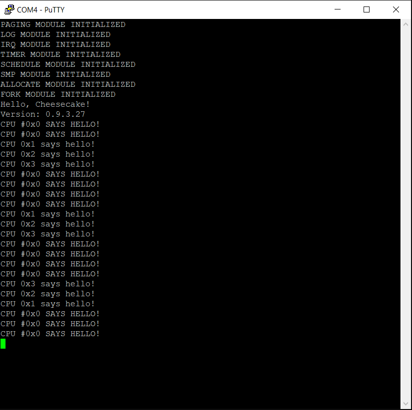

*Chapter Top* [Chapters[9]: Virtual Memory](chapter9.md) | *Next Chapter* [Chapters[10]: The TTY Driver and File Abstraction](../chapter10/chapter10.md)  
*Previous Page* [System Calls](syscall.md) | *Next Page* [Chapters[10]: The TTY Driver and File Abstraction](../chapter10/chapter10.md)

## Executing Into User Space ([chapter09/code3](code3))

#### The Second Cake Thread

Getting our first process in user space requires first setting up a cake thread, followed by calling an in-kernel exec-type call. This is how Linux handles things as well. If we trace though the [Linux startup code](https://github.com/torvalds/linux/blob/v4.20/init/main.c), the `kernel_init` kernel thread is created:

> pid = kernel\_thread(kernel\_init, NULL, CLONE\_FS);

When the thread is scheduled, `kernel_init` will run, and the function tries to run the `init` process:

> if (!try\_to\_run\_init\_process("/sbin/init") ||  
>     !try\_to\_run\_init\_process("/etc/init") ||  
>     !try\_to\_run\_init\_process("/bin/init") ||  
>     !try\_to\_run\_init\_process("/bin/sh"))  
>         return 0;  

Tracing through the `try_to_run_init_process` function, we eventually come to an exec call:

> return do\_execve(getname\_kernel(init\_filename),
>     (const char \_\_user *const \_\_user *)argv_init,
>     (const char \_\_user *const \_\_user *)envp_init);
> 

Recall that when the kernel thread runs the `return 0`, control will return to the `__ret_from_fork` routine, then fall through to `__ret_to_user`.

In [src/cheesecake.c](code3/src/cheesecake.c) we initialize a second cake thread:

```C
extern int startup_user(void *user_function);
extern int USER_STARTUP_FUNCTION();
    cake_thread(startup_user, USER_STARTUP_FUNCTION, CLONE_CAKETHREAD);
```

The `startup_user` function conforms to the cake thread interface, returning an integer, and taking a generic `void *` argument. The argument, `USER_STARTUP_FUNCTION`, is the kernel-range virtual address of the user space program we want to run. It is configured as `say_hello` in [cheesecake.conf](code3/cheescake.conf):

```
MEMORY_SIZE=MEMORY_SIZE_4GB
NUM_CPUS=4
PAGE_SHIFT=12
TEXT_OFFSET=0
USER_STARTUP_FUNCTION=say_hello
VA_BITS=48
```

The `startup_user` function is board-specific and defined in [arch/arm64/board/raspberry-pi-4/user.c](code3/arch/arm64/board/raspberry-pi-4/user.c):

```C
extern long do_exec(int (*user_function)(void), int init);

int startup_user(void *user_function)
{
    do_exec(user_function, 1);
    return 0;
}
```

For CheesecakeOS, like in Linux, `startup_user` will execute after `schedule_tail` in `__ret_from_fork` (from [arch/arm64/entry.S](code3/arch/arm64/entry.S)). When `startup_user` returns, control will fall through to `__ret_to_user`:

```asm
.globl __ret_from_fork
__ret_from_fork:
    bl                  schedule_tail
    cbz                 x19, __ret_to_user
    mov                 x0, x20
    blr                 x19
__ret_to_user:
    bl                  __irq_disable
    __ENTRY_RESTORE     0
```

#### Inter-Kernel Exec-Type Function

Exec-type functions are generally exported to user space as system calls, so users can load binary programs. As seen in the Linux example above, the kernel itself may call the underlying function in order to bootstrap the first user space process. Our call to `do_exec` in `startup_user` serves the same purpose. Before diving into `do_exec`, a refresher on the CheesecakeOS user space memory map:

```
                    ┌───────────────────────────────────────────┐
                    │    Cheesecake OS Kernel Virutal Memory    │                                ▲
 0xFFFF000000000000 ├───────────────────────────────────────────┤ User space cannot access above │
                    │              Private User Stack           │
                    │                      │                    │
                    │                      ▼                    │
                    ├───────────────────────────────────────────┤
                    │                      ▲                    │
                    │                      │                    │
                    │               Private User Heap           │
                    ├───────────────────────────────────────────┤
                    │    Private Copy of BSS Read/Write Data    │ *.bss
                    ├───────────────────────────────────────────┤
                    │       Private Copy of Read/Write Data     │ *.data
                    ├───────────────────────────────────────────┤
                    │         Reference of Read-only Data       │ *.rodata
                    ├───────────────────────────────────────────┤
                    │   Reference of Read-only Executable Code  │ *.text
 0x0000000000000000 └───────────────────────────────────────────┘
```

An operating system's exec-type system calls are loaders. They are responsible for taking binary from a disk, and loading it into memory with the correct virtual address mappings. In the [src/exec.c](code3/src/exec.c) module, `do_exec` should perform the same duty for CheesecakeOS. Let us step through:

```C
extern long _user_begin[];
extern long _user_text_begin[];
extern long _user_text_end[];
extern long _user_rodata_begin[];
extern long _user_rodata_end[];
extern long _user_data_begin[];
extern long _user_data_end[];
extern long _user_bss_begin[];
extern long _user_bss_end[];
extern long _user_end[];
extern long _end[];
```

The module makes reference to the linker script variables defining the user space boundaries of the image.

```C
long do_exec(int (*user_function)(void), int init)
{
    unsigned long heap_start, program_counter, flags;
    struct process *current;
    struct memmap *mm;
    struct stack_save_registers *ssr;
    struct virtualmem *user_text, *user_rodata, *user_data, *user_bss;
    struct virtualmem *heap, *stack;
```

In `do_exec`, six virtual memory pointers are setup on the stack, one for each of the regions in the user space memory map.

```C
    current = CURRENT;
    mm = alloc_memmap();
    if(!mm) {
        goto nomem;
    }
    ssr = PROCESS_STACK_SAVE_REGISTERS(current);
```

A new `struct memmap` is allocated (`alloc_memmap` is defined in [src/fork.c](code3/src/fork.c), as that is where the `memmap_cache` lives), and the `ssr` variable contains the address of the `struct stack_save_registers` containing the exception state stored on the kernel stack.

```C
    heap_start = VIRT_TO_PHYS((unsigned long) _user_end) + SECTION_SIZE - 1;
    heap_start &= SECTION_MASK;
    heap_start += FIRST_USER_ADDRESS;
```

The heap is placed at the first section boundary after the `.bss` section. All virtual addresses are then shifted up by the `FIRST_USER_ADDRESS`. In our implementation, the first user address is 0x0000000000000000, but the implementation should work with any value.

```C
    program_counter = (unsigned long) user_function;
    if(init) {
        program_counter -= (unsigned long) _user_text_begin;
        program_counter += FIRST_USER_ADDRESS;
    }
```

The program counter is initialized to be the virtual address of the `user_function` input. At the present, we are considering the case where `do_exec` is called in a cake thread to establish the first user space process. In this case, we set `init` to be true. In all other cases, `do_exec` will be executed from the system call interface, and `init` will be false. The adjustment of the program counter to an offset from `_user_text_begin` only needs to happen once, as user space callers will already have the correct address. To better understand, an example with the output from `.build/kernel8.map`:

```
***
ffff000000400000 T _user_text_begin
ffff000000400000 T say_hello
ffff000000400014 T sayhello
ffff000000400028 T usloopsleep
***
```

When `do_exec` is called from `startup_user`, it is passed the address of `say_hello`, 0xFFFF000000400000. This is a kernel range address, inaccessible to user space. Fortunately, we can calculate the virtual address user space should use by taking an offset from `_user_text_begin`, and the program counter is set to the valid user space address 0x000000000000. 

If the `say_hello` program were then to call `do_exec` for some reason, say on `usloopsleep`, no adjustment should be made, as `usloopsleep` should exist in the user space memory map at 0x0000000000000028, so no offset adjustment will be made after the first call to `do_exec`.

```C
    user_text = user_vm_segment((unsigned long) _user_text_begin,
        (unsigned long) _user_text_end, PAGE_USER_ROX,
        (VM_READ | VM_EXEC | VM_SHARED), mm, 0);
    if(!user_text) {
        goto freememmap;
    }
    user_rodata = user_vm_segment((unsigned long) _user_rodata_begin,
        (unsigned long) _user_rodata_end, PAGE_USER_RO,
        (VM_READ | VM_SHARED), mm, 0);
    if(!user_rodata) {
        goto freeusertext;
    }
    user_data = user_vm_segment((unsigned long) _user_data_begin,
        (unsigned long) _user_data_end, PAGE_USER_RW,
        (VM_READ | VM_WRITE | VM_SHARED), mm, 1);
    if(!user_data) {
        goto freeuserrodata;
    }
    user_bss = user_vm_segment((unsigned long) _user_bss_begin,
        (unsigned long) _user_bss_end, PAGE_USER_RW,
        (VM_READ | VM_WRITE | VM_SHARED), mm, 1);
    if(!user_bss) {
        goto freeuserdata;
    }
```

For each of the `.text`, `.rodata`, `.data`, and `.bss` sections, `user_vm_segment` is called with the start of the segment range, the end of the segment range, the protection flags, the software flags, the memory map pointer, and a flag to determine whether the memory for the segment should be copied into a newly allocated page. The `user_vm_segment` function:


```C
static struct virtualmem *user_vm_segment(unsigned long start_addr, unsigned long end_addr,
    unsigned long prot, unsigned long flags, struct memmap *mm, int copyinto)
{
    unsigned int page_order;
    struct page *page, *copypage;
    struct virtualmem *vm = alloc_virtualmem();
    if(!vm) {
        goto nomem;
    }
    unsigned long offset = FIRST_USER_ADDRESS - ((unsigned long) _user_begin);
```

The boundary ranges passed into `user_vm_segment` are all kernel addresses, as is the `_user_begin` linker script address. Calculating the offset from `_user_begin` converts all addresses to be in the valid user space range. Note that `offset` is an unsigned long, so it is a positive number. The math works because of overflow:

```C
    vm->mm = mm;
    vm->vm_start = offset + start_addr;
    vm->vm_end = offset + end_addr;
    vm->prot = prot;
    vm->flags = flags;
    page = &(PTR_TO_PAGE(start_addr));
```

We now have two categories of segments we need to consider. Read-only segments, and writable segments. For read-only segments, it is sufficient to share a reference to the image page. With writable segments, a copy of the data is necessary. Because all programs are loaded from the image. If the image page is written directly, it will impact all subsequently loaded programs. For writable segments, `.data` and `.bss`, the `copyinto` flag is set to true:

```C
    if(!copyinto) {
        ATOMIC_LONG_INC(&(page->refcount));
        vm->page = page;
    }
    else {
        page_order = LOG2_SAFE(end_addr - start_addr) - PAGE_SHIFT;
        if((end_addr - start_addr) > (1 << (PAGE_SHIFT + page_order))) {
            page_order += 1;
        }
        copypage = alloc_pages(page_order);
        if(!copypage) {
            goto freevirtualmem;
        }
        memcpy(PAGE_TO_PTR(copypage), PAGE_TO_PTR(page), (PAGE_SIZE << page_order));
        vm->page = copypage;
    }
    return vm;
freevirtualmem:
    cake_free(vm);
nomem:
    return 0;
}
```

After the user segments have been allocated in `do_exec`:

```C
    heap = anonymous_vm_segment(heap_start, heap_start + SECTION_SIZE, PAGE_USER_RW,
        (VM_READ | VM_WRITE | VM_GROWSUP | VM_SHARED), mm);
    if(!heap) {
        goto freeuserbss;
    }
    stack = anonymous_vm_segment(STACK_TOP - SECTION_SIZE - STACK_SIZE,
        STACK_TOP - SECTION_SIZE, PAGE_USER_RW, (VM_READ | VM_WRITE | VM_GROWSDOWN), mm);
    if(!stack) {
        goto freeheap;
    }
```

The anonymous segments, those not statically compiled into the kernel image, are initialized with a call to `anoymous_vm_segment`, similar to the user segments, but simpler:

```C
static struct virtualmem *anonymous_vm_segment(unsigned long start_addr,
    unsigned long end_addr, unsigned long prot, unsigned long flags, struct memmap *mm)
{
    unsigned int page_order;
    struct virtualmem *vm;
    struct page *page;
    page_order = LOG2_SAFE(end_addr - start_addr) - PAGE_SHIFT;
    vm = alloc_virtualmem();
    if(!vm) {
        goto nomem;
    }
    page = alloc_pages(page_order);
    if(!page) {
        goto freevirtualmem;
    }
    memset(PAGE_TO_PTR(page), 0, (PAGE_SIZE << page_order));
    vm->mm = mm;
    vm->vm_start = start_addr;
    vm->vm_end = end_addr;
    vm->prot = prot;
    vm->flags = flags;
    vm->page = page;
    return vm;
freevirtualmem:
    cake_free(vm);
nomem:
    return 0;
}
```

After the `struct virtualmems` have been allocated in `do_exec`:

```C
    list_enqueue(&(mm->vmems), &(user_text->vmlist));
    list_enqueue(&(mm->vmems), &(user_rodata->vmlist));
    list_enqueue(&(mm->vmems), &(user_data->vmlist));
    list_enqueue(&(mm->vmems), &(user_bss->vmlist));
    list_enqueue(&(mm->vmems), &(heap->vmlist));
    list_enqueue(&(mm->vmems), &(stack->vmlist));
    flags = SPIN_LOCK_IRQSAVE(&(mm->lock));
    exec_mmap(mm, current);
    SPIN_UNLOCK_IRQRESTORE(&(mm->lock), flags);
```

The VM regions are added in order to the memory map, and `exec_mmap` is called:

```C
static void exec_mmap(struct memmap *mm, struct process *p)
{
    struct memmap *old_mm, *active_mm;
    old_mm = p->memmap;
    active_mm = p->active_memmap;
    p->memmap = mm;
    p->active_memmap = mm;
    memmap_switch(active_mm, mm, p);
    if(old_mm) {
        put_memmap(old_mm);
    }
    else {
        drop_memmap(active_mm);
    }
}
```

The current process requests a memory map switch from the old `active_memmap` to the new. The new `struct memmap` is set as the reference to the current process for both the `memmap` and `active_memmap` fields (this is a user space process!). If the current process was already a user space process before entering `do_exec`, the `memmap` field will have had a valid reference, and the user space mappings are is use. For this case, `put_memmap` decrements the `users` count. Otherwise, `do_exec` was called from a cake thread, user space mappings are not in use, and `drop_memmap` decrements the `refcount` count.

Now, `do_exec` has created a new address map for the process, with sections pointing to user space mappings. The last step is to set the program counter and user stack, which is accomplished with a call to `start_thread`:

```C
    start_thread(ssr, program_counter, STACK_TOP - SECTION_SIZE);
    return
```


#### Bon Voyage Kernel Space and Bonjour User Space

The architecture-specific `start_thread` function is responsible for the final setup before entering (or returning to) user space. In CheesecakeOS, it is an inline function defined in [arch/arm64/include/arch/start.h](code3/arch/arm64/include/arch/start.h):

```C
#define PSR_MODE_EL0t   0b0000

extern void memset(void *dest, int c, unsigned long count);

static inline void start_thread(struct stack_save_registers *ssr, unsigned long pc,
    unsigned long sp)
{
    memset(ssr, 0, sizeof(*ssr));
    ssr->pc = pc;
    ssr->pstate = PSR_MODE_EL0t;
    ssr->sp = sp;
}
```

This small function has big impact. The saved register state in the `struct stack_save_registers` area is blown away. The program counter and stack are set, such that when `__ENTRY_RESTORE` runs, `ELR_EL1` and `SP_EL0` will take on the correct values. The `pstate` field is also updated, with the mode bits cleared (see `pg. C5-381` of ARM ARM). This value is loaded into `SPSR_EL1`. When the `eret` instruction runs, the processor will be restored into the `EL0` exception level. A user space process will be running!

The journey has been arduous. Building and running should at last demonstrate what we have been working on the entire chapter (notice the workqueue is still running):



*Previous Page* [System Calls](syscall.md) | *Next Page* [Chapters[10]: The TTY Driver and File Abstraction](../chapter10/chapter10.md)  
*Chapter Top* [Chapters[9]: Virtual Memory](chapter9.md) | *Next Chapter* [Chapters[10]: The TTY Driver and File Abstraction](../chapter10/chapter10.md)
