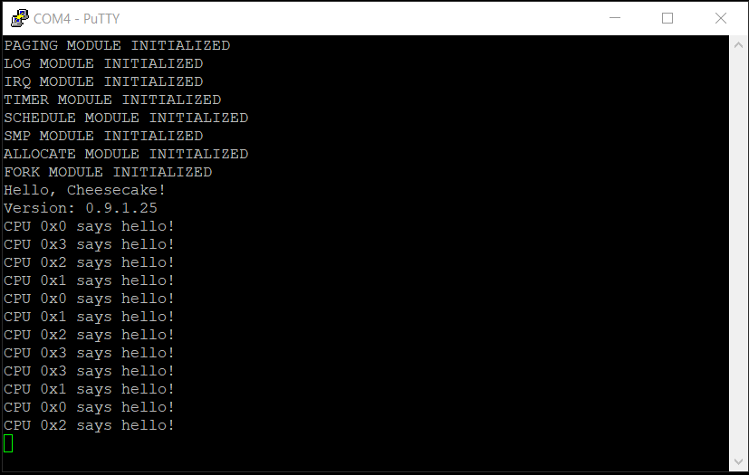

*Chapter Top* [Chapters[9]: Virtual Memory](chapter9.md) | *Next Chapter* [Chapters[10]: The TTY Driver and File Abstraction](../chapter10/chapter10.md)  
*Previous Page* [User Space Page Tables](pagetables.md) | *Next Page* [System Calls](syscall.md)

## The Page Fault Handler ([chapter09/code1](code1))

#### Demand Paging

As of the previous slice in this chapter, user space page tables are dynamically allocated. Realistically, this is not genuinely the case. The structures that represent the page tables are dynamically allocated, and the root of the table - the Page Global Directory - is as well. However, as soon as a program begins execution of an instruction or adjusts the value of a stack pointer, we will encounter a page fault exception as the intermediate translation levels - the _PUD_, _PMD_, _PTE_ - have not been allocated.

Fortunately, it is possible to catch a page fault exception, request information about the exception from the processor, and setup the translation tables _on demand_. Any approach has pros and cons, and this method of setting up virtual memory mappings is no exception. Though the world seems to have decided the pluses outweigh the minuses. 

On the negative side, each time an otherwise valid memory reference faults because translations have not been setup, the exception handler must run, enter into the kernel, perform some logic to fix-up the translation fault, allocate additional pages if needed, and return to the faulting instruction. If it were possible to know in advance all the necessary allocations, it would be more efficient to perform the allocations upfront.

Of course, on the plus side, it is generally impossible to know all the allocations up front. For example, in CheesecakeOS, the size of all stack region allocations is eight pages, or 32KB. If the application never uses more than 4KB of stack space, the work to set seven other PTE references for unused pages is saved. And, the fact an application's memory pages do not _have_ to be resident in memory, but can be dynamically swapped in when needed allows the system to use disk to greatly expand memory capacity.

We will step in-line with most of the world, and allocate translation pages on demand through handling a page fault exception.

#### Exceptions from EL0

Up to this point, we have only had to consider the case where exceptions are raised and handled while the processor is in the privileged `EL1` mode. Our first encounters with page faults, however, are likely to originate from `EL0`. We now have the opportunity to revisit our exception handling scheme.

To begin, the `vectors` table in [arch/arm64/entry.S](code1/arch/arm64/entry.S) is updated such that synchronous exceptions originating from 64-bit `EL0` are no longer invalid, but jump to `__sync_el064`:

```asm
.align 11
.globl vectors
vectors:
    __VECTABLE_ENTRY    __invalid_entry
    __VECTABLE_ENTRY    __invalid_entry
    __VECTABLE_ENTRY    __invalid_entry
    __VECTABLE_ENTRY    __invalid_entry
    __VECTABLE_ENTRY    __sync_el1h
    __VECTABLE_ENTRY    __irq_el1h
    __VECTABLE_ENTRY    __invalid_entry
    __VECTABLE_ENTRY    __invalid_entry
    __VECTABLE_ENTRY    __sync_el064
    __VECTABLE_ENTRY    __invalid_entry
    __VECTABLE_ENTRY    __invalid_entry
    __VECTABLE_ENTRY    __invalid_entry
    __VECTABLE_ENTRY    __invalid_entry
    __VECTABLE_ENTRY    __invalid_entry
    __VECTABLE_ENTRY    __invalid_entry
    __VECTABLE_ENTRY    __invalid_entry
```

The `__sync_el064` routine unveils a new requirement of our entry save and restore technique:

```asm
__sync_el064:
    __ENTRY_SAVE    0
    mrs             x25, esr_el1
    lsr             x24, x25, #ESR_ELx_EC_SHIFT
    cmp             x24, #ESR_ELx_EC_DABT_LOW
    b.eq            __el0_da
    cmp             x24, #ESR_ELx_EC_IABT_LOW
    b.eq             __el0_ia
    mrs              x0, esr_el1
    mrs              x1, far_el1
    bl              handle_sync
    b               __invalid_entry
```

The `__ENTRY_SAVE` macro now has an additional parameter, the exception level. The same is true for `__ENTRY_RESTORE`. The requirement originates from the different stack pointers we use for different exception levels. A user space application's kernel stack is distinct from its user space stack. Saving has been updated to reflect:

```asm
        .if \el == 0
        mrs     x21, sp_el0
        .else
        add     x21, sp, #STRUCT_STACK_SAVE_REGISTERS_SIZE
        .endif
        mrs     x22, elr_el1
        mrs     x23, spsr_el1
        stp     x30, x21, [sp, #16 * 15]
```

And similarly restoring:

```asm
        ldp     x30, x21, [sp, #16 * 15]
        .if \el == 0
        msr     sp_el0, x21
        .endif
```

The `ESR_ELx` macros used in `__sync_el064` are defined in [arch/arm64/include/arch/abort.h](code0/arch/arm64/include/arch/abort.h). Review `pg. D10-2436` of the ARM ARM to confirm their meaning. At this point, two types of exception can be handled. Either a data abort or an instruction abort originating from a lower exception level - `EL0`. In our implementation, instruction and data aborts are treated similarly:

```asm
__el0_ia:
__el0_da:
    mrs                 x0, far_el1
    mov                 x1, x25
    mov                 x2, sp
    bl                  __irq_enable
    bl                  mem_abort
    bl                  __irq_disable
    __ENTRY_RESTORE     0
```

The `FAR_EL1` system register (Fault Address Register) contains the virtual address that caused the page fault. This virtual address is loaded into `x0`. The Exception Syndrome Register was already loaded into `x25`, and is moved into `x1`. The current stack pointer is moved into `x2`. Before entering into the handler, the `mem_abort` function, interrupts are enabled as they are now safe.

#### Handling Page Faults

Implemented in [arch/arm64/fault.c](code1/arch/arm64/fault.c), the `mem_abort` function serves as the page fault handler entry point. Three arguments are taken:
1. The faulting virtual address from `FAR_EL1`
2. The type of exception with additional encoding from `ESR_EL1`
3. The stack pointer that points to the exception state saved on the stack - this argument remains unused in CheesecakeOS, but the interface is consistent with how Linux looks:

```C
void mem_abort(unsigned long addr, unsigned long esr, struct stack_save_registers *ssr)
{
    struct fault_handler *handler = &(fault_handlers[esr & ESR_ELx_FSC]);
    if(handler->fn(addr, esr, ssr)) {
        do_bad(addr, esr, ssr);
    }
}
```

The handler to run is determined by taking the `FSC` bits, the least significant six, from the exception syndrome. Most faults are fatal. Translation and access flag faults are the only fault types that will not result in termination of the current process. In the case of a fatal fault, the `do_bad` function executes:

```C
int do_bad(unsigned long addr, unsigned long esr, struct stack_save_registers *ssr)
{
    log("Faulting Address: %x\r\n", addr);
    log("ESR: %x\r\n", esr);
    return do_exit();
}
```

Basic information about the fault is logged to the screen, and `do_exit`, defined in [src/exit.c](code1/src/exit.c), runs:

```C
long do_exit()
{
    struct process *current = CURRENT;
    current->state = PROCESS_STATE_ZOMBIE;
    log("Exited process %x\r\n", current->pid);
    schedule_self();
    return 0;
}
```

As a placeholder for the time being, the process state is updated to `PROCESS_STATE_ZOMBIE`, so the process will not be rescheduled. Then `schedule_self` terminates the execution of this process.

For the cases where the page fault can be handled, `do_page_fault` runs:

```C
int do_page_fault(unsigned long addr, unsigned long esr, struct stack_save_registers *ssr)
{
    struct process *current;
    struct memmap *mm;
    if(addr > STACK_TOP) {
        return do_bad(addr, esr, ssr);
    }
    current = CURRENT;
    mm = current->memmap;
    if(!mm) {
        return do_bad(addr, esr, ssr);
    }
    if(populate_page_tables(addr, mm)) {
        return do_bad(addr, esr, ssr);
    }
    return 0;
}
```

The `STACK_TOP` macro represents the highest user space accessible address. If the faulting address is above `STACK_TOP`, the process exits through `do_bad`. The same is true if no valid `memmap` reference is available. Cake threads are not allowed to page fault. If these checks pass, the handler tries to populate the page tables. The `populate_page_tables` function is defined in [arch/arm64/vm.c](code0/arch/arm64/vm.c). Though long-ish, it is not a conceptually difficult function, but reminiscent of the similar operations to setup the kernel page tables in [arch/arm64/allocate.c](code0/arch/arm64/allocate.c) from [Chapter 3](../chapter03/chapter3.md). We will step through a bit at a time:

```C
int populate_page_tables(unsigned long addr, struct memmap *mm)
{
    unsigned int pgd_index, pud_index, pmd_index, pte_index;
    unsigned long pgd_raw_entry;
    unsigned long pud_phys_addr, *pud_virt_addr, pud_raw_entry;
    unsigned long pmd_phys_addr, *pmd_virt_addr, pmd_raw_entry;
    unsigned long pte_phys_addr, *pte_virt_addr, *pte_target, mapping_addr;
    unsigned long flags;
    unsigned long *pgd = mm->pgd;
    struct virtualmem *vm = 0;
    struct page *page, *ptable;
    flags = SPIN_LOCK_IRQSAVE(&(mm->lock));
    LIST_FOR_EACH_ENTRY(vm, &(mm->vmems), vmlist) {
        if(vm->vm_end > addr) {
            break;
        }
    }
```

Taking as inputs the faulting address and the current process's `struct memmap`, we begin by trying to find the relevant `struct virtualmem` that contains the faulting address. Because the `struct virtualmem`s are sorted from low to high, and valid user space addresses range from 0x0000000000000000 to 0xFFFF000000000000, we can iterate through the list of `struct virtualmem` objects for a given `struct memmap`, and stop when we have found one where the end of the represented range is greater than the faulting address.

```C
    if(!vm) {
        goto failure;
    }
    if(addr < vm->vm_start && grow_stack(addr, &vm)) {
        goto failure;
    }
```

If no `struct virtualmem` can be found, the fault is unrecoverable, and the function will return to the page fault handler and exit. If a valid `struct virtualmem` has been found, and the faulting address is greater than or equal to the starting address of the represented range, the page tables can be populated. If, however, the faulting address is outside the range of `vm`, it may be an error, or it may be that more space needs to be allocated for an expanding stack. The call to `grow_stack` checks if this is the case:

```C
static int grow_stack(unsigned long addr, struct virtualmem **vm)
{
    struct list *insert;
    struct page *page;
    struct virtualmem *new, *check = *vm;
    int isstack = VM_ISSTACK(check);
    int address_in_stack_range = addr >= (STACK_TOP - MAX_STACK_AREA);
    int address_in_next_stack_allocation = addr >= (check->vm_start - STACK_SIZE);
    if(isstack && address_in_stack_range && address_in_next_stack_allocation) {
        new = alloc_virtualmem();
        if(!new) {
            goto failure;
        }
        page = alloc_pages(STACK_SHIFT);
        if(!page) {
            goto freevirtualmem;
        }
        memset(page, 0, STACK_SIZE);
        new->vm_end = check->vm_end - STACK_SIZE;
        new->vm_start = new->vm_end - STACK_SIZE;
        new->mm = check->mm;
        new->prot = check->prot;
        new->flags = check->flags;
        new->page = page;
        insert = check->vmlist.prev;
        list_add(insert, &(new->vmlist));
        *vm = new;
        return 0;
    }
    goto failure;
freevirtualmem:
    cake_free(new);
failure:
    return 1;
}
```

The following conditions must be met in order for more stack space to be allocated:
- The adjacent `struct virtualmem` must be a stack, which is allowed to grow down
- The faulting address must be a valid stack address, as stacks can grow down but their is a maximum stack size
- The faulting address must be within the range of the previously valid stack area, in CheesecakeOS, this is 32KB

If all of these conditions are met, more stack space is allocated. First, a call to `alloc_virtualmem`, which is defined in [src/fork.c](code1/src/fork.c), as that is where the `virtualmem_cache` lives:

```C
struct virtualmem *alloc_virtualmem()
{
    struct virtualmem *vm = alloc_obj(virtualmem_cache);
    if(!vm) {
        return 0;
    }
    memset(vm, 0, sizeof(*vm));
    vm->vmlist.prev = &(vm->vmlist);
    vm->vmlist.next = &(vm->vmlist);
    return vm;
}
```

Then, a stack block is allocated. If the allocations are successful, the bounds of the new `struct virtualmem` are set to be the descending contiguous stack length. The new VM object is added to the list in front of the next stack VM object, and the pointer to the `struct virtualmem *` that was passed into the function is updated so that the `vm` reference back in `populate_page_tables` contains the address of the new `struct virtualmem`. Now, back in `populate_page_tables`, it is time to start filling in the translations:

```C
    page = vm->page;
    pgd_index = (addr >> PGD_SHIFT) & (TABLE_INDEX_MASK);
    pgd_raw_entry = *(pgd + pgd_index);
    pud_phys_addr = pgd_raw_entry & (RAW_PAGE_TABLE_ADDR_MASK);
    pud_virt_addr = (unsigned long *) PHYS_TO_VIRT(pud_phys_addr);
    if(!pud_phys_addr) {
        DMB(ishst);
        ptable = alloc_pages(0);
        if(!ptable) {
            goto unlock;
        }
        pud_virt_addr = (unsigned long *) PFN_TO_PTR((ptable->pfn));
        memset(pud_virt_addr, 0, PAGE_SIZE);
        pud_phys_addr = VIRT_TO_PHYS((unsigned long) pud_virt_addr);
        WRITE_ONCE(*(pgd + pgd_index), pud_phys_addr | PAGE_TABLE_TABLE);
        DSB(ishst);
    }
```

As when filling out the kernel page tables, the first step is to calculate at what index in the _PGD_ the address of the _PUD_ should be stored. This is done by shifting the virtual address by the `PGD_SHIFT` (39 bits), and masking off all but the nine least significant bits. Recall the raw entry is the physical address of a _PUD_, bitwise `orr`ed with upper attributes in bits 64-48, and lower attributes in bits 11-0. Doing a bitwise `and` of the raw entry with the `RAW_PAGE_TABLE_ADDR_MASK` gives the physical address of the _PUD_, and the virtual address can be calculated using the `PHYS_TO_VIRT` macro. If there is no physical address set at the calculated index, the _PUD_ is allocated, surrounded by barriers to ensure correct ordering on other CPUs.

```C
    pud_index = (addr >> PUD_SHIFT) & (TABLE_INDEX_MASK);
    pud_raw_entry = *(pud_virt_addr + pud_index);
    pmd_phys_addr = pud_raw_entry & (RAW_PAGE_TABLE_ADDR_MASK);
    pmd_virt_addr = (unsigned long *) PHYS_TO_VIRT(pmd_phys_addr);
    if(!pmd_phys_addr) {
        DMB(ishst);
        ptable = alloc_pages(0);
        if(!ptable) {
            goto unlock;
        }
        pmd_virt_addr = (unsigned long *) PFN_TO_PTR((ptable->pfn));
        memset(pmd_virt_addr, 0, PAGE_SIZE);
        pmd_phys_addr = VIRT_TO_PHYS((unsigned long) pmd_virt_addr);
        WRITE_ONCE(*(pud_virt_addr + pud_index), pmd_phys_addr | PAGE_TABLE_TABLE);
        DSB(ishst);
    }
    pmd_index = (addr >> PMD_SHIFT) & (TABLE_INDEX_MASK);
    pmd_raw_entry = *(pmd_virt_addr + pmd_index);
    pte_phys_addr = pmd_raw_entry & (RAW_PAGE_TABLE_ADDR_MASK);
    pte_virt_addr = (unsigned long *) PHYS_TO_VIRT(pte_phys_addr);
    if(!pte_phys_addr) {
        DMB(ishst);
        ptable = alloc_pages(0);
        if(!ptable) {
            goto unlock;
        }
        pte_virt_addr = (unsigned long *) PFN_TO_PTR((ptable->pfn));
        memset(pte_virt_addr, 0, PAGE_SIZE);
        pte_phys_addr = VIRT_TO_PHYS((unsigned long) pte_virt_addr);
        WRITE_ONCE(*(pmd_virt_addr + pmd_index), pte_phys_addr | PAGE_TABLE_TABLE);
        DSB(ishst);
    }
```

The same procedure used to allocate a _PUD_ in the _PGD_ is used to walk and allocate a _PMD_ in the _PUD_, followed by a _PTE_ in the _PMD_.

```C
    pte_index = (addr >> PAGE_SHIFT) & (TABLE_INDEX_MASK);
    pte_target = pte_virt_addr + pte_index;
    if(!(*pte_target)) {
        DMB(ishst);
        mapping_addr = VIRT_TO_PHYS((unsigned long) PAGE_TO_PTR(page));
        mapping_addr += (addr - vm->vm_start);
        mapping_addr &= PAGE_MASK;
        WRITE_ONCE(*pte_target, mapping_addr | vm->prot);
        DSB(ishst);
    }
```

After the _PTE_ has been allocated, a reference to the physical page must be stored at the correct index. The mapping address to store is calculated from the offset of the faulting virtual address from the start of the `struct virtualmem` section, as the backing page begins from this point. For example, if a VM object represents a range between 0x0000 and 0x2000, or 8KB, the backing page is of order one, and two contiguous pages can be mapped. If the faulting address is 0x1008, this address is located in the second 4KB block, and the page at offset 0x1000 from the start of the contiguous block should be mapped in. This physical mapping address is then bitwise `orr`ed with the protection flags indicated in the `prot` field of the `struct virtual mem`. The possible values are defined in [arch/arm64/include/arch/prot.h](code1/arch/arm64/include/arch/prot.h):

```C
#define PTE_VALID           BIT_SET(0)
#define PTE_DIRTY           BIT_SET(51)
#define PTE_WRITE           BIT_SET(55)
#define PTE_SPECIAL         BIT_SET(56)
#define PTE_NONE            BIT_SET(58)
#define PTE_USER            BIT_SET(6)
#define PTE_RDONLY          BIT_SET(7)
#define PTE_SHARED          BIT_SET(8) | BIT_SET(9)
#define PTE_AF              BIT_SET(10)
#define PTE_NG              BIT_SET(11)
#define PTE_DBM             PTE_DIRTY
#define PTE_CONT            BIT_SET(52)
#define PTE_PXN             BIT_SET(53)
#define PTE_UXN             BIT_SET(54)
#define PTE_TYPE_PAGE       (PTE_VALID | BIT_SET(1))
#define PROT_PAGE_DEFAULT   (PTE_TYPE_PAGE | PTE_AF | PTE_SHARED)

#define PAGE_NORMAL         (PROT_PAGE_DEFAULT | PAGE_TABLE_ATTR(MT_NORMAL))

#define PAGE_USER_NONE      ((PAGE_NORMAL ^ PAGE_VALID) | PTE_NONE | \
                                PTE_RDONLY | PTE_NG | PTE_PXN | PTE_UXN)
#define PAGE_USER_RW        (PAGE_NORMAL | PTE_USER | PTE_NG | PTE_PXN | PTE_UXN | PTE_WRITE)
#define PAGE_USER_RWX       (PAGE_NORMAL | PTE_USER | PTE_NG | PTE_PXN | PTE_WRITE)
#define PAGE_USER_RO        (PAGE_NORMAL | PTE_USER | PTE_NG | PTE_PXN | PTE_UXN |PTE_RDONLY)
#define PAGE_USER_ROX       (PAGE_NORMAL | PTE_USER | PTE_NG | PTE_PXN | PTE_RDONLY)
#define PAGE_USER_XO        (PAGE_NORMAL | PTE_NG | PTE_PXN | PTE_READONLY)
```

These values define the protections for the `Page Table Entries` by setting upper and lower table descriptor attributes - whether they are read-only, executable, privileged, etc. The `populate_page_tables` function completes with:

```C
    PREEMPT_DISABLE();
    SPIN_UNLOCK_IRQRESTORE(&(mm->lock), flags);
    if(USER_EXEC(vm)) {
        __flush_icache_range(PAGE_TO_PTR(page), (PAGE_SIZE << page->current_order));
    }
    PREEMPT_ENABLE();
    return 0;
```

After disabling preemption, the lock is released. If the virtual memory region maps user space executable code:

```C
#define USER_EXEC(vm)   (!(((vm)->prot) & PTE_UXN))
```

Then, in order to maintain cache coherency, the instruction cache must be flushed to ensure future instruction fetches are made correctly, as the ARM architecture does not require coherency between instruction fetches and main memory, even in shared locations. The effects of this will not be seen in this volume of CheesecakeOS for Raspberry Pi 4, as we do not have a filesystem. All code is statically located in RAM from the kernel image, so there is no incoherency. But if we wanted to add a file system, and binary code was loaded through the data cache into RAM memory, the `__flush_icache_range` routine will take care to write back the instructions to RAM, and invalidate the cache for the given virtual address range.

Assuming page tables have been successfully populated, the `do_page_fault` will return peacefully to `mem_abort`. The `__ENTRY_RESTORE` macro in `arch/arm64/entry.S` will run after `mem_abort` returns. The address that previously caused the page fault will be accessed again, but this time should be properly mapped. Execution of the user space application should continue on, dynamically adding other translations as necessary.

#### Freeing Populated Page Tables

In the previous slice on [user space page tables](pagetables.md), we left the `free_user_memmap` implementation empty, claiming we would implement it in this slice along with the populate function for symmetry. Let's make good on that promise, and walk through the function to release the user space mappings:

```C
void free_user_memmap(struct memmap *mm)
{
    int g, g_start, g_end, u, u_start, u_end, m, m_start, m_end;
    unsigned long start, end;
    unsigned long pgd_raw_entry;
    unsigned long pud_phys_addr, *pud_virt_addr, pud_raw_entry;
    unsigned long pmd_phys_addr, *pmd_virt_addr, pmd_raw_entry;
    unsigned long pte_phys_addr, *pte_virt_addr;
    struct page *page, *pgtable;
    struct virtualmem *vm, *next;
    unsigned long *pgd = mm->pgd;
    LIST_FOR_EACH_ENTRY_SAFE(vm, next, &(mm->vmems), vmlist) {
```

We are going to perform the same operation for each of the `struct virtualmem` objects in this memory map. We can do so without locking, because we know there are no processes using the user space mappings. Note the use of the `LIST_FOR_EACH_ENTRY_SAFE` version of the iterator macro, indicating we will be deleting the objects from the list as we go through.

```C
        start = vm->vm_start;
        end = vm->vm_end - 1;
        page = vm->page;
        g_start = (start >> PGD_SHIFT) & (TABLE_INDEX_MASK);
        g_end = (end >> PGD_SHIFT) & (TABLE_INDEX_MASK);
```

For the _PGD_, we calculate the bounds of the indexes covered by the `struct virtualmem` for the given iteration.

```C
        for(g = g_start; g <= g_end; g++) {
            pgd_raw_entry = *(pgd + g);
            pud_phys_addr = pgd_raw_entry & (RAW_PAGE_TABLE_ADDR_MASK);
            pud_virt_addr = (unsigned long *) PHYS_TO_VIRT(pud_phys_addr);
            if(!pud_phys_addr) {
                continue;
            }
```

For each index, we calculate the physical and virtual address of the _PUD_ in that index. If there is no _PUD_, there is nothing to be freed in this iteration of the loop.

```C
            u_start = (start >> PUD_SHIFT) & (TABLE_INDEX_MASK);
            u_end = (end >> PUD_SHIFT) & (TABLE_INDEX_MASK);
            for(u = u_start; u <= u_end; u++) {
                pud_raw_entry = *(pud_virt_addr + u);
                pmd_phys_addr = pud_raw_entry & (RAW_PAGE_TABLE_ADDR_MASK);
                pmd_virt_addr = (unsigned long *) PHYS_TO_VIRT(pmd_phys_addr);
                if(!pmd_phys_addr) {
                    continue;
                }
```

If there is a valid _PUD_, we calculate the bounds of the indexes to search for _PMD_ references for the given `struct virtualmem`. Similarly here, if there is no _PMD_ reference, there is no cleanup, and the loop continues on to the next iteration.

```C
               for(m = m_start; m <= m_end; m++) {
                    pmd_raw_entry = *(pmd_virt_addr + m);
                    pte_phys_addr = pmd_raw_entry & (RAW_PAGE_TABLE_ADDR_MASK);
                    pte_virt_addr = (unsigned long *) PHYS_TO_VIRT(pte_phys_addr);
                    if(!pte_phys_addr) {
                        continue;
                    }
```

The walk continues to find _PTEs_. If there is no _PTE_ for a given index in a _PMD_, again the loop continues to the next iteration.

```C
                    if(freeable_page_table(m, m_end, mm, next, PMD_SHIFT)) {
                        DMB(ishst);
                        pgtable = &(PTR_TO_PAGE(pte_virt_addr));
                        free_pages(pgtable);
                        DSB(ishst);
                    }
```

If a _PTE_ is found, however, we determine if the page can be freed:

```C
static inline int freeable_page_table(int index, int end, struct memmap *mm,
    struct virtualmem *next, unsigned int shift)
{
    return (
        index < end ||
        &(next->vmlist) == &(mm->vmems) ||
        index < ((next->vm_start >> shift) & (TABLE_INDEX_MASK))
    );
}
```

The page table can be freed as long as the index does not overlap with the next `struct virtualmem`, which would lead to a premature or double free. The overlapping frees are saved until the last possible moment to avoid this bug. After all the _PTE_ references for a _PMD_ are checked, the same goes for the _PMD_ references for a _PUD_, and the _PUD_ references for a _PGD_:

```C
                if(freeable_page_table(u, u_end, mm, next, PUD_SHIFT)) {
                    DMB(ishst);
                    pgtable = &(PTR_TO_PAGE(pmd_virt_addr));
                    free_pages(pgtable);
                    DSB(ishst);
                }
            }
            if(freeable_page_table(g, g_end, mm, next, PGD_SHIFT)) {
                DMB(ishst);
                pgtable = &(PTR_TO_PAGE(pud_virt_addr));
                free_pages(pgtable);
                DSB(ishst);
            }
        }
        free_pages(page);
        list_delete(&(vm->vmlist));
        cake_free(vm);
    }
    __tlbi_aside1is(TLBI_ASID(mm->context.id));
```

After all intermediate translations have been freed, the VM's backing page can be freed as well. If it is the last reference to that page, the page will be returned to the allocator. The `struct virtualmem` is also removed from the list and returned to the cache. After all the user space tables have been torn down, the TLB is cleared of all references to the process's ASID.

At this point we will break to build and run our CheesecakeOS. Again, no change in the output. We still need system calls in order for user space applications to produce output. This will be the subject of the next slice. For now, enjoy the additional features can be compiled in without turning our software into a steaming curd:



*Previous Page* [User Space Page Tables](pagetables.md) | *Next Page* [System Calls](syscall.md)  
*Chapter Top* [Chapters[9]: Virtual Memory](chapter9.md) | *Next Chapter* [Chapters[10]: The TTY Driver and File Abstraction](../chapter10/chapter10.md)
