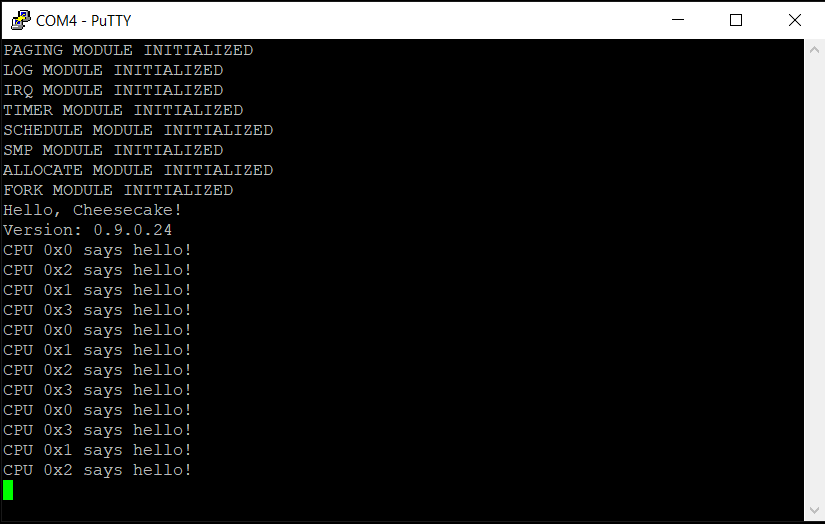

*Chapter Top* [Chapters[9]: Virtual Memory](chapter9.md) | *Next Chapter* [Chapters[10]: The TTY Driver and File Abstraction](../chapter10/chapter10.md)  
*Previous Page* [Chapters[9]: Virtual Memory](chapter9.md) | *Next Page* [The Page Fault Handler](pagefault.md)

## User Space Page Tables ([chapter09/code0](code0))

#### The arm64 Process Virtual Address Space

Our CheesecakeOS, like any OS, must coordinate with the processor and the Memory Management Unit to implement the virtual memory abstraction. The virtual memory abstraction allows each process to view the memory of the system as if it alone has exclusive use of the memory resource. The idea is to allow multiple processes to run simultaneously, use similar virtual addresses, but avoid collisions or security hazards. 

The implementation is accomplished through the use of page tables, with hardware support. The theory and mechanism has been described previously in [Chapter 3](../chapter3/arm-page-tables.md). We have already setup the kernel page tables as part of the boot process. Implementing virtual memory for user space applications is the subject of this section.

Ideally, we would like each user space process to see an address map something like:

```
                    ┌─────────────────────────────────────┐ 
                    │ Cheesecake OS Kernel Virtual Memory │                                ▲ 
 0xFFFF000000000000 ├─────────────────────────────────────┤ User space cannot access above │
                    │          Private User Stack         │
                    │                  │                  │
                    │                  ▼                  │
                    ├─────────────────────────────────────┤
                    │                  ▲                  │ 
                    │                  │                  │ C Library, STL, Boost
                    │           Shared Libraries          │
                    ├─────────────────────────────────────┤
                    │                  ▲                  │ 
                    │                  │                  │ 
                    │           Private User Heap         │
                    ├─────────────────────────────────────┤
                    │  Private BSS/Common Read/Write Data │ *.bss
                    ├─────────────────────────────────────┤
                    │       Private Read/Write Data       │ *.data
                    ├─────────────────────────────────────┤
                    │        Private Read-only Data       │ *.rodata
                    ├─────────────────────────────────────┤
                    │  Private Read Only Executable Code  │ *.text
 0x0000000000400000 └─────────────────────────────────────┘
```

This is the user process memory map employed by the Linux Kernel, and described in [Computer Systems: A Programmer's Perspective](https://www.amazon.com/Computer-Systems-Programmers-Perspective-3rd/dp/013409266X). Unfortunately, the world is not an ideal place. We will complete the remainder of this volume with no file system, and no shared libraries. We will instead angle towards a slightly adjusted memory map:

```
                    ┌───────────────────────────────────────────┐ 
                    │    Cheesecake OS Kernel Virtual Memory    │                                ▲ 
 0xFFFF000000000000 ├───────────────────────────────────────────┤ User space cannot access above │
                    │              Private User Stack           │
                    │                      │                    │
                    │                      ▼                    │
                    ├───────────────────────────────────────────┤
                    │                      ▲                    │ 
                    │                      │                    │ 
                    │               Private User Heap           │
                    ├───────────────────────────────────────────┤
                    │    Private Copy of BSS Read/Write Data    │ *.bss
                    ├───────────────────────────────────────────┤
                    │       Private Copy of Read/Write Data     │ *.data
                    ├───────────────────────────────────────────┤
                    │       Private Copy of Read-only Data      │ *.rodata
                    ├───────────────────────────────────────────┤
                    │ Private Copy of Read Only Executable Code │ *.text
 0x0000000000000000 └───────────────────────────────────────────┘
```

To solve for a missing file system, we will compile the user space sections into the kernel image, then copy the binary into pages for each user space process.

#### Virtual Memory Structures

Up to this point, there has been no need to represent a process memory map in the kernel. We have only used kernel threads, threads exclusively accessing the kernel translation table, the root of which is stored in `TTBR1_EL1`. As we know, the kernel map in `TTBR1_EL1` never changes. This gives each process access to the kernel page tables when the processor is in the privileged `EL1` state. However, each user space process needs its own unique translation table for user space mappings. The table will have a physical base address stored in `TTBR0_EL1`. Whenever the scheduler schedules in a user space process, the `TTBR0_EL1` system register must be updated with the base address _for that process_. In order to track the necessary state required to implement virtual memory, we introduce the structures in [include/cake/vm.h](code0/include/cake/vm.h):

```C
#define VM_READ         (0b00000001)
#define VM_WRITE        (0b00000010)
#define VM_EXEC         (0b00000100)
#define VM_SHARED       (0b00001000)
#define VM_GROWSUP      (0b00010000)
#define VM_GROWSDOWN    (0b00100000)

#define VM_ISCODE(x)    (((x)->flags) == (VM_READ | VM_EXEC | VM_SHARED))
#define VM_ISDATA(x)    (((x)->flags) == (VM_READ | VM_WRITE | VM_SHARED))
#define VM_ISRODATA(x)  (((x)->flags) == (VM_READ | VM_SHARED))
#define VM_ISHEAP(x)    (((x)->flags) == (VM_READ | VM_WRITE | VM_GROWSUP | VM_SHARED))
#define VM_ISSTACK(x)   (((x)->flags) == (VM_READ | VM_WRITE | VM_GROWSDOWN))

struct virtualmem {
    struct memmap *mm;
    unsigned long vm_start;
    unsigned long vm_end;
    unsigned long prot;
    unsigned long flags;
    struct spinlock lock;
    struct list vmlist;
    struct page *page;
};

struct memmap {
    struct list vmems;
    unsigned long vmem_low;
    unsigned long vmem_high;
    unsigned long users;
    unsigned long refcount;
    unsigned long flags;
    void *pgd;
    unsigned long start_stack;
    unsigned long start_heap;
    unsigned long end_heap;
    struct spinlock lock;
    struct mem_context context;
};
```

The `struct memmap` is the queen of the virtual memory accounting, with members:
- The `vmems` list is the canonical head of a linked list of `struct virtualmem` structures, each representing a virtual mapping, in ascending order by address
  - Based on our process virtual address map, it is reasonable to conclude the first `struct virtualmem` in the list will represent the code mapping
  - Similarly, the last in the list will represent the stack, or at least a the top portion of it  
- Members `vmem_low` and `vmem_high` store the lowest and highest allowable address for the entire address space
- The counters `users` and `refcount` both track the number of outstanding references (see [Mel Gorman's Description](https://www.kernel.org/doc/gorman/html/understand/understand007.html#toc30) of the Linux Kernel's Address Space Descriptor)
  - The `users` counter tracks how many processes are using the user space page tables for this `struct memmap`
  - The `refcount` is a count of the number of processes with references to this `struct memmap` and this can include kernel space cake threads
- The `*pgd` pointer stores the _virtual address_ corresponding to the linear mapped physical page table base address
  - The corresponding physical page address is what gets loaded into `TTBR0_EL1` to use the page table
- Address bounds for sections are stored in `start_stack`, `start_heap`, and `end_heap`
- The `lock` serves primarily to protect the `vmems` list from concurrent access
- The `context` member of type `struct mem_context` stores architecture-specific state, and is explored later in this slice

So each region in the memory map is represented by one or more `struct virtualmem` objects. Descriptions of this structure's members:
- The `mm` is a back-pointer to the containing `struct memmap`
- The `vm_start` and `vm_end` addresses give the bounds of the this virtual memory section
- The `prot` member stores state defining the permissions, or _protections_ of the region, and is used to set corresponding bits in the virtual address for the hardware
- The `flags` members stores state defining the function of the region, and is used by the software for logical determinations
- The `lock` protects the members from concurrent access
- The `vmlist` connects the `struct virtualmem`s together under the containing `struct memmap`'s `vmems`
- Each `struct virtualmem` keeps a reference in the `page` member to the actual backing page for the virtual memory region
  - Used to populate the user space page table with the correct physical address
  - Can also be the case that multiple virtual memory sections, and therefore multiple `struct virtualmem`s are backed by the same page, as in the case of a shared library
  
Given a page size of 4KB, and a maximum page order of nine, each `struct virtualmem` can then represent a slice of memory between 4KB and 2MB in size.

#### Setting Up A Process Virtual Memory Map

The `struct memmap` represents a virtual address map, and is referenced by a process. Our `struct process` has been updated in [include/cake/process.h](code0/include/cake/process.h) with two references in which to store `struct memmap`s:

```C
struct process {
    unsigned int state;
    unsigned int pid;
    unsigned int priority;
    int tick_countdown;
    unsigned long runtime_counter;
    unsigned long *stack;
    long preempt_count;
    struct memmap *memmap;
    struct memmap *active_memmap;
    struct list processlist;
    struct spinlock lock;
    struct cpu_context context;
    unsigned long cpumask[CPUMASK_SIZE];
};
```

There are pointers to both a `memmap` and an `active_memmap`. In case of a user space process, `memmap` and `active_memmap` point to the same object. Cake threads, however, will have only an `active_memmap`. Kernel threads, executing only kernel code, a cake thread has no use for user space mappings. A cake thread will merely borrow an `active_memmap` to have a valid reference, but without needing to go through the process of a context switch.

All processes will need to run with an `active_memmap`, and this includes the idle processes we setup at boot-time. A statically allocated, global `idle_memmap` is defined in [src/vm.c](code0/src/vm.c):

```C
struct memmap idle_memmap = {
    .users = NUM_CPUS + 1,
    .refcount = NUM_CPUS + 1,
    .pgd = page_global_dir,
    .lock = {
        .owner = 0,
        .ticket = 0
    }
};
```

The value of the `users` and `refcount` fields are initialized to one greater than the number of CPUs. Also one greater than the number of idle processes. Since these counters will rise and fall as processes grab and drop references to the `struct memmap`, the initial values of the reference counters are set to ensure the mapping will persist and never be freed. The kernel memory map stored in `page_global_dir` is set as the value of the `pgd` field. Practically speaking, the `idle_memmap` represents the kernel mappings. Freeing it would be a disastrous bug. As the kernel mappings are statically mapped for life, no other initialization of the structure is necessary.

The `schedule_init` function in [src/schedule.c](code0/src/schedule.c) has been extended to assign the `idle_memmap` as the `active_memmap` for all idle processes:

```C
extern struct memmap idle_memmap;

    for(unsigned int i = 0; i < NUM_CPUS; i++) {
        rq = &(runqueues[i]);
        p = &(rq->idle_task);
        p->memmap = 0;
        p->active_memmap = &idle_memmap;
    }
```

Having setup the references to the `struct memmap` in the `struct process`, and done the work to assign the static `idle_memmap` to our idle processes, we are now in position to extend the existing process creation mechanism to include dynamic virtual memory structures.

#### Dynamically Creating Process Virtual Memory Maps For User Space

Processes are created through the forking operation with the `do_clone` function in [src/fork.c](code0/src/fork.c). We are now able to extend the functionality to accommodate creating a process's `struct memmap`. We create new caches to allocate `struct memmap` and `struct virtualmem` objects. We then add the `copy_memmap` function to `copy_process` to achieve the setup:

```C
static struct cache *memmap_cache;
static struct cache *process_cache;
static struct cache *virtualmem_cache;

void fork_init()
{
    memmap_cache = alloc_cache("memmap", sizeof(struct memmap));
    process_cache = alloc_cache("process", sizeof(struct process));
    virtualmem_cache = alloc_cache("virtualmem", sizeof(struct virtualmem));
}

static struct process *copy_process(unsigned long flags,
    unsigned long thread_input,
    unsigned long arg)
{
    struct process *p;
    p = duplicate_current();
    if(!p) {
        goto err;
    }
    if(copy_memmap(p)) {
        goto freeprocess;
    }
    if(copy_arch_context(flags, thread_input, arg, p)) {
        goto freememmap;
    }
    p->pid = allocate_pid(p);
    return p;
freememmap:
    if(p->memmap) {
        put_memmap(p->memmap);
    }
freeprocess:
    cake_free(p);
err:
    return 0;
}
```

The `copy_memmap` function determines if any further virtual memory actions are necessary:

```C
static int copy_memmap(struct process *p)
{
    struct memmap *new, *old;
    p->memmap = 0;
    p->active_memmap = 0;
    old = CURRENT->memmap;
    if(old) {
        new = duplicate_memmap(old, p);
        if(!new) {
            return -ENOMEM;
        }
        p->memmap = new;
        p->active_memmap = new;
    }
    return 0;
}
```

Cake threads have a valid reference in the `active_memmap` member of their `struct process`. However, the `memmap` field is kept at the null value. A user space process can never be cloned from a cake thread. Cake threads are cloned from other cake threads, and user space processes are cloned from other user space processes. Since cake threads can all share the same kernel address mapping, and have no need for a private address space, if the `CURRENT->memmap` is not set to a valid reference, the function can return immediately.

Otherwise, in the case of forking a user space process, `duplicate_memmap` is called to allocate and setup the memory map, and the result is used to initialize the forked process's `memmap` and `active_memmap` fields. Note in the case of a cake thread, both the `memmap` and `active_memmap` fields are left undefined, though we have stated every process needs to run with a valid `active_memmap`. As we will see a bit later, when the thread is scheduled to run, it will temporarily borrow a valid reference.

```C
static struct memmap *duplicate_memmap(struct memmap *old, struct process *p)
{
    struct memmap *new;
    struct virtualmem *old_vm, *new_vm, *dup_vm;
    struct page *pgd;
    new = alloc_obj(memmap_cache);
    if(!new) {
        goto nomem;
    }
    pgd = alloc_pages(0);
    if(!pgd) {
        goto freememmap;
    }
    *new = *old;
    new->users = 1;
    new->refcount = 1;
    new->lock.owner = 0;
    new->lock.ticket = 0;
    new->pgd = PAGE_TO_PTR(pgd);
    memset(new->pgd, 0, PAGE_SIZE);
    new->vmems.prev = &(new->vmems);
    new->vmems.next = &(new->vmems);
    init_mem_context(new);
    LIST_FOR_EACH_ENTRY(old_vm, &(old->vmems), vmlist) {
        dup_vm = copy_virtualmem(old_vm);
        if(!dup_vm) {
            goto freevirtualmems;
        }
        dup_vm->mm = new;
        list_enqueue(&(new->vmems), &(dup_vm->vmlist));
    }
    return new;
freevirtualmems:
    LIST_FOR_EACH_ENTRY_SAFE(dup_vm, new_vm, &(new->vmems), vmlist) {
        cake_free(dup_vm);
    }
freememmap:
    cake_free(new);
nomem:
    return 0;
}
```

After ensuring the `struct memmap` object, and the Page Global Directory are successfully allocated, the old object is copied into the new, and relevant fields are overwritten. The `vmems` list is reset to the empty state, and each `struct virtualmem` from the old memory map is copied into the new in the `copy_virtualmem` function:

```C
static struct virtualmem *copy_virtualmem(struct virtualmem *old)
{
    unsigned long copy_count;
    struct page *page, *copy_page;
    struct virtualmem *new = alloc_obj(virtualmem_cache);
    if(!new) {
        goto failure;
    }
    page = old->page;
    *new = *old;
    new->lock.owner = 0;
    new->lock.ticket = 0;
    new->vmlist.prev = &(new->vmlist);
    new->vmlist.next = &(new->vmlist);
    if(VM_ISSTACK(old)) {
        copy_page = alloc_pages(page->current_order);
        if(!copy_page) {
            goto freevirtualmem;
        }
        copy_count = PAGE_SIZE << (page->current_order);
        memcpy(PAGE_TO_PTR(copy_page), PAGE_TO_PTR(page), copy_count);
        new->page = copy_page;
    }
    else {
        ATOMIC_LONG_INC(&(page->refcount));
    }
    return new;
freevirtualmem:
    cake_free(new);
failure:
    return 0;
}
```

In `copy_virtualmem`, a new `struct virtualmem` object is allocated from the cache, and the old object is queried to determine if the underlying `struct page` should be shared, or if a new one should be allocated, and the data from the old copied in. In CheesecakeOS, there is no copy-on-write. In most cases, there is no need. The determining factor of whether a page should be shared or copied depends on if the virtual memory region is a stack region. In the case of a stack region, a new page block is allocated, and the data is copied from the original page into the fresh one. All stacks must be private and separate to avoid stack clobbering. The heap and other memory resources are shared between the forking and forked processes.


#### Cleaning Up the Dynamically Allocated Structures

While the fork operation is able to dynamically allocate memory maps, we need some way to track the references of our virtual memory objects, and ultimately clean them up when no longer needed. If we want to get a reference to another process's memory map, we do so along with a call to `ATOMIC_LONG_INC`, depending on the reference we want:

```C
    ATOMIC_LONG_INC(&(my_memmap->refcount));
```

or

```C
    ATOMIC_LONG_INC(&(my_memmap->users));
```

`ATOMIC_LONG_INC` is defined in [arch/arm64/include/arch/atomic.h](code0/arch/arm64/include/arch/atomic.h):

```C
#define ATOMIC_LONG_ADD                 __atomic64_add
#define ATOMIC_LONG_INC(var)            ATOMIC_LONG_ADD(var, 1)
```

The assembly routine `__atomic64_add` is implemented in [arch/arm64/atomic.S](code0/arch/arm64/atomic.S), and follows a familiar atomic pattern:

```asm
.globl __atomic64_add
__atomic64_add:
    prfm    pstl1strm, [x0]
1:
    ldxr    x2, [x0]
    add     x2, x2, x1
    stxr    w3, x2, [x0]
    cbnz    w3, 1b
    ret
```

Recall that the `refcount` member is for all processes, user space and cake threads, that are borrowing a reference to the `struct memmap` just to have a valid reference. The `users` counts how many processes are actually using the user space mapping. There are two functions that handle the case where `struct memmap`s are no longer needed: `put_memmap` and `drop_memmap`. Both are implemented in [src/vm.c](code0/src/vm.c):

```C
void drop_memmap(struct memmap *mm)
{
    if(atomic_dec_and_test(&(mm->refcount))) {
        free_pages(&(PTR_TO_PAGE(mm->pgd)));
        cake_free(mm);
    }
}

void put_memmap(struct memmap *mm)
{
    if(atomic_dec_and_test(&(mm->users))) {
        free_user_memmap(mm);
        drop_memmap(mm);
    }
}
```

If a process is no longer using the user space mappings of a `struct memmap`, the `put_memmap` function is used to decrement the `users` count. The `drop_memmap` function is used in case of a borrowed reference. Both functions use `atomic_dec_and_test`, which decrements the reference counter, and then returns true if the counter is equal to zero. The function is included from [include/cake/atomic.h](code0/include/cake/atomic.h):

```C
static inline int atomic_dec_and_test(volatile unsigned long *var)
{
    return ATOMIC_LONG_SUB_RETURN(var, 1) == 0;
}
```

The `ATOMIC_LONG_SUB_RETURN` macro defines an atomic function that reduces a counter by a quantity, and returns the result. Ordering is implied, and the implementation includes a barrier:

```asm
.globl __atomic64_sub_return
__atomic64_sub_return:
    prfm    pstl1strm, [x0]
1:
    ldxr    x2, [x0]
    sub     x2, x2, x1
    stlxr   w3, x2, [x0]
    cbnz    w3, 1b
    dmb     ish
    mov     x0, x2
    ret
```

When the `users` counter of a `struct memmap` reaches zero, no processes are interested in the page table mappings, and these can be freed with a call to `free_user_memmap`. We leave this as an empty function is this slice, as we have not yet allocated the user space page tables we will want to free. This happens in the next slice in the [page fault handler](pagefault.md).

Even though the user space mappings are no longer needed, there may still be outstanding references to the `struct memmap`, in the case it was borrowed by a cake thread. The structure and `pgd` persist until the `refcount` field drops to zero in the `drop_memmap` function, at which point these memory allocations are freed.

#### Context Switching

Context switching with user space page tables is a fraught exercise. We will use the [Linux implemenation](https://github.com/torvalds/linux/blob/v4.20/arch/arm64/mm/context.c) as a reference guide to help us through the maze. Changing page table references in hardware is an architecture-dependent operation. Before diving into the details, the architecture specific component of the `struct memmap` is defined in [arch/arm64/include/arch/vm.h](code0/arch/arm64/include/arch/vm.h):

```C
#define MEMMAP_SWITCH   memmap_switch

struct mem_context {
    unsigned long id;
};

void memmap_switch(struct memmap *old, struct memmap *new, struct process *p);
```

The architecture specific portion of the `struct memmap` has one field, an ID. This ID will be used to form the Address Space ID (ASID) of the `TTBR0_EL1` entry. The ASID allows the Translation Lookaside Buffer (TLB) to maintain multiple mappings with the same virtual address. The ASID is a tag by which addresses are distinguished. The TLB is a cache of virtual to physical mappings that allows for faster translations by avoiding page table walks for cached lookups. There are times throughout the course of normal hardware operation where software maintenance of the TLB is required. As a part of managing the switching of memory maps or page tables during a context switch, it will be our responsibility to perform these procedures when necessary.

The real McCoy begins in the [src/schedule.c](code0/src/schedule.c) module, where, in the `context_switch` function, new memory map switching logic is executing:

```C
static void context_switch(struct runqueue *rq, struct process *prev, struct process *next)
{
    struct memmap *mm, *old;
    mm = next->memmap;
    old = prev->active_memmap;
    if(!mm) {
        next->active_memmap = old;
        ATOMIC_LONG_INC(&(old->refcount));
    }
    else {
        MEMMAP_SWITCH(old, mm, next);
    }
    if(!(prev->memmap)) {
        prev->active_memmap = 0;
        rq->saved_memmap = old;
    }
    prev = CONTEXT_SWITCH(prev, next);
    finish_switch(prev);
}
```

If the process we are switching to does not have a reference stored in it's `memmap` field, no context switch is necessary. Instead, the process borrows a reference to the current process's active memmap. This is the path taken when scheduling a cake thread. In the alternate case, when a user space process is about to be scheduled, the `MEMMAP_SWITCH` function runs. Before diving into `MEMMAP_SWITCH`, note that in the case the previous process does not have a `memmap` defined (it is a cake thread), a reference to the previous `active_memmap` is saved to the runqueue. This is so the reference can be dropped in the call to `finish_switch`. The reason for the delay is to avoid expensive freeing operations while holding on to the runqueue lock.

The `MEMMAP_SWITCH` macro resolves to `memmap_switch`, the architecture specific switching function defined in [arch/arm64/vm.c](code0/arch/arm64/vm.c). As mentioned, the implementation is taken from Linux:

```C
#define ASID_BITS           (16)
#define ASID_MASK           (((1UL) << (ASID_BITS)) - 1)
#define ASID_FIRST_VERSION  ((1UL) << (ASID_BITS))

static unsigned long active_asids[NUM_CPUS];
static unsigned long asid_generation = ASID_FIRST_VERSION;
static struct spinlock asid_lock = {
    .owner = 0,
    .ticket = 0
};

void memmap_switch(struct memmap *old, struct memmap *new, struct process *p)
{
    unsigned long cpuid, flags, asid, oldasid;
    if(old != new && new != &idle_memmap) {
        cpuid = SMP_ID();
        asid = READ_ONCE(new->context.id);
        oldasid = READ_ONCE(active_asids[cpuid]);
        if(!can_switch_fast(cpuid, asid, oldasid)) {
            flags = SPIN_LOCK_IRQSAVE(&asid_lock);
            if((asid ^ READ_ONCE(asid_generation)) >> ASID_BITS) {
                asid = new_asid_context(new);
                WRITE_ONCE(new->context.id, asid);
            }
            if(test_and_clear_bit(tlb_flush_bitmap, cpuid)) {
                __tlbi_vmalle1();
            }
            WRITE_ONCE(active_asids[cpuid], asid);
            SPIN_UNLOCK_IRQRESTORE(&asid_lock, flags);
        }
        __memmap_switch(VIRT_TO_PHYS((unsigned long) (new->pgd)), asid);
    }
}
```

The ASID field in `TTBR0_EL1` is sixteen bits wide. It is possible for an ARMv8 implementation to support either eight or sixteen bit ASIDs. The Raspberry Pi 4 implementation with the Cortex-A72 supports sixteen bit ASIDs. We assume most processors will use sixteen bits, and the eight-bit case is ignored. 65535 ASIDS are available to be assigned to applications at any given time (ASID zero is reserved for the kernel mapping). As new processes are created, these ASIDs are assigned. Eventually, all ASIDs will have been allocated to various processes, and ASIDs will have to be reused. The global `asid_generataion` variable is incremented whenever the ASIDs values roll. The roll is when TLB maintenance is required.

Into the switching function, in the case the current memory map and the memory map to switch to are the same, no switch is needed. A switch to the `idle_memmap` is also not necessary. Things start to get hairy for the normal case. The ASID of the currently running process and the ASID currently active on the CPU are loaded. Both are initialized to zero, and will have those values on the first context switch. A call to the inline `can_switch_fast` test first determines if an immediate switch is possible.

Before checking out the `can_switch_fast` test, we will assume failure and trace the slow path. The module's `asid_lock` is acquired. If the ASID is from a previous generation (or equal to zero, is which case the `xor` test will also result in a truthy value), a new ASID is allocated in the `new_asid_context` function:

```C
#define NUM_USER_ASIDS      (ASID_FIRST_VERSION)
#define ASID_BITMAP_SIZE    BITMAP_SIZE(NUM_USER_ASIDS)
#define ASID2IDX(asid)      ((asid) & ASID_MASK)
#define IDX2ASID(idx)       ASID2IDX(idx)

static unsigned long asid_bitmap[ASID_BITMAP_SIZE];
static unsigned long reserved_asids[NUM_CPUS];

static unsigned long new_asid_context(struct memmap *new)
{
    static unsigned int index = 1;
    unsigned long asid = READ_ONCE(new->context.id);
    unsigned long generation = READ_ONCE(asid_generation);
    if(asid) {
        unsigned long newasid = generation | (asid & ASID_MASK);
        if(check_update_reserved_asid(asid, newasid)) {
            return newasid;
        }
        if (!test_and_set_bit(asid_bitmap, ASID2IDX(asid))) {
            return newasid;
        }
    }
    asid = find_next_zero_bit(asid_bitmap, index, NUM_USER_ASIDS);
    if (asid == NUM_USER_ASIDS) {
        generation = ATOMIC_LONG_ADD_RETURN_RELAXED(&generation, ASID_FIRST_VERSION);
        flush_context();
        asid = find_next_zero_bit(asid_bitmap, NUM_USER_ASIDS, 1);
    }
    set_bit(asid_bitmap, asid);
    index = asid;
    return IDX2ASID(asid) | generation;
}

static int check_update_reserved_asid(unsigned long asid, unsigned long newasid)
{
    int hit = 0;
    for(unsigned int i = 0; i < NUM_CPUS; i++) {
        if(reserved_asids[i] == asid) {
            hit = 1;
            reserved_asids[i] = newasid;
        }
    }
    return hit;
}

```

If an ASID is already defined for the `struct memmap`, the `reserved_asids` are checked to see if the same ASID was reserved from a previous generation. Each CPU has one reserved ASID, initialized to zero, and updated when the ASID value rolls over and the context is flushed. If the ASID was saved as a reserved ASID, the ASID with an updated generation is returned. Otherwise, the `asid_bitmap` which tracks available ASIDs is checked to determine if the ASID has already been allocated for this generation. If not, the ASID with an updated generation is returned.

If the ASID began with a zero value, or the reserved and available tests fail, a new ASID is allocated. The `find_next_zero_bit` function (from [include/cake/bitops.h](code0/include/cake/bitops.h)) searches for an ASID in the range `index` to `NUM_USER_ASIDS`. If no bit is unset in that range, i.e., no ASIDs are available, the generation increments, and context flushing commences. This is where the roll happens:

```C
#define FLUSH_BITMAP_SIZE   BITMAP_SIZE(NUM_CPUS)

static unsigned long tlb_flush_bitmap[FLUSH_BITMAP_SIZE];

static void flush_context()
{
    unsigned long asid;
    bitmap_zero(asid_bitmap, NUM_USER_ASIDS);
    for(unsigned int i = 0; i < NUM_CPUS; i++) {
        asid = XCHG_RELAXED(&(active_asids[i]), 0);
        if(!asid) {
            asid = reserved_asids[i];
        }
        set_bit(asid_bitmap, ASID2IDX(asid));
        reserved_asids[i] = asid;
    }
    bitmap_fill(tlb_flush_bitmap, NUM_CPUS);
}
```

During the flush, the `asid_bitmap` is zeroed out with a call to `bitmap_zero`. For each CPU, zero is set as the `active_asid` for that CPU with a call to `XCHG_RELAXED`. The `xchg` operation is distinct from the `cmpxchg` operation. With `cmpxchg`, a test value is given as a comparison, and, if the comparison is equal, a new value is stored and the old value returned. With `xchg`, the value is stored without a test, and the old value returned. The returned value is reserved, and the corresponding bit set in the `asid_bitmap`. As we will see, this helps avoid race conditions. The function concludes with a call to fill the `tlb_flush_bitmap`. Both `bitmap_zero` and `bitmap_fill` functions are defined in [include/cake/bitops.h](code0/include/cake/bitops.h):

```C
#define BITS_PER_BYTE                   (BYTE_SIZE)
#define BITS_PER_LONG                   (BITS_PER_BYTE * sizeof(unsigned long))
#define BITS_TO_LONGS(nr)               (DIV_ROUND_UP(nr, (BITS_PER_LONG)))

static inline void bitmap_fill(unsigned long *bitmap, unsigned long size)
{
    unsigned int len = BITS_TO_LONGS(size) * sizeof(unsigned long);
    memset(bitmap, 0xFF, len);
}

static inline void bitmap_zero(unsigned long *bitmap, unsigned long size)
{
    unsigned int len = BITS_TO_LONGS(size) * sizeof(unsigned long);
    memset(bitmap, 0, len);
}
```

Resuming our analysis of the `new_asid_context` function:

```C
    asid = find_next_zero_bit(asid_bitmap, index, NUM_USER_ASIDS);
    if (asid == NUM_USER_ASIDS) {
        generation = ATOMIC_LONG_ADD_RETURN_RELAXED(&generation, ASID_FIRST_VERSION);
        flush_context();
        asid = find_next_zero_bit(asid_bitmap, NUM_USER_ASIDS, 1);
    }
    set_bit(asid_bitmap, asid);
    index = asid;
    return IDX2ASID(asid) | generation;
```

Either an ASID is found on the first attempt to find a zero bit, or the context is flushed, the bitmap is cleared, and a new ASID allocated. The bit is set in the `asid_bitmap`, the static index variable is updated, and the final ASID value returned to the `memmap_switch` function. The complicated aspect of the slow path now complete, the `memmap_switch` function proceeds:

```C
            if(test_and_clear_bit(tlb_flush_bitmap, cpuid)) {
                __tlbi_vmalle1();
            }
            WRITE_ONCE(active_asids[cpuid], asid);
            SPIN_UNLOCK_IRQRESTORE(&asid_lock, flags);
        }
        __memmap_switch(VIRT_TO_PHYS((unsigned long) (new->pgd)), asid);
```

If a `flush_context` was needed while assigning a fresh ASID, the `tlb_flush_bitmap` bit will be set for this CPU. It is cleared, and the entire TLB for the processor is invalidated. The ASID value is stored as the `active_asid`, and the lock released. Finally, the actual switch happens in the `__memmap_switch` assembly routine from [arch/arm64/schedule.S](code0/arch/arm64/schedule.S). The routine takes as input the physical base address of the new `pgd` in `x0`, and the ASID in `x1`.


```asm
.globl __memmap_switch
__memmap_switch:
    __MOV_Q     x3, LINEAR_ADDR_MASK
    adrp        x2, empty_zero_page
    and         x2, x3, x2
    msr         ttbr0_el1, x2
    isb
    bfi         x0, x1, #48, #16
    msr         ttbr0_el1, x0
    isb
    ret
```

The `empty_zero_page` is stored in `TTBR0_EL1` to conform with system requirements. After an instruction barrier, a `bfi` instruction moves the least significant sixteen bits of the ASID value into the sixteen most significant bits of `x0`, thus creating the final value to be stored in `TTBR0_EL1`, before issuing another instruction barrier and returning. The slow path is complete.

Let us return to the fast path, which avoids locking and additional tests. If the fast path test is satisfactory, we can skip straight to `__memmap_switch`.

```C
static inline int can_switch_fast(unsigned long cpuid,
    unsigned long asid,
    unsigned long oldasid)
{
    return oldasid &&
        !((asid ^ READ_ONCE(asid_generation)) >> ASID_BITS) &&
        CMPXCHG_RELAXED(&(active_asids[cpuid]), oldasid, asid);
}
```

Before dissecting what exactly this strange test is all about, let us keep in mind the comment from the Linux source:

>   /\*  
>    \* The memory ordering here is subtle.  
>    \* If our active\_asids is non-zero and the ASID matches the current  
>    \* generation, then we update the active\_asids entry with a relaxed  
>    \* cmpxchg. Racing with a concurrent rollover means that either:  
>    \*  
>    \* \- We get a zero back from the cmpxchg and end up waiting on the  
>    \*   lock. Taking the lock synchronises with the rollover and so  
>    \*   we are forced to see the updated generation.  
>    \*  
>    \* \- We get a valid ASID back from the cmpxchg, which means the  
>    \*   relaxed xchg in flush\_context will treat us as reserved  
>    \*   because atomic RmWs are totally ordered for a given location.  
>    \*/  

In the following cases, the `can_switch_fast` test will fail, and the `memmap_switch` function will have to take the slow path:
- If `oldasid` is zero, which as we saw, can happen because this is the first context switch, or because of a roll in the ASID generation resetting the `active_asid`
- If the generation has rolled, the test `!((asid ^ READ_ONCE(asid_generation)) >> ASID_BITS)` evaluates to false and the test fails
- If there is a race between the previous check of the generation and a rollover, the `cmpxchg` to set this memory map's ASID as the current one, could return zero

As the Linux comment mentions, there is a race condition with the unlocked check of the generation. Another CPU could concurrently flush the context, which also clears the bitmap. In the case a valid ASID were to be returned from the `CMPXCHG_RELAXED`, the fear is that an ASID would be in use, but the bit in the `asid_bitmap` left unset - leading to two memory maps having the same ASID down the road, a disaster. Fortunately, in the case of this particular race, the `flush_context` will return our ASID from the `XHCG_RELAXED` call in that function, and set it as reserved.

This section is difficult to understand and explain. It is made more difficult by the circular nature of the ASID allocation, and of the algorithm itself. This algorithm brings together many key operating system concepts. Concurrency, ordering, low level hardware management, context switching - all are involved. If your desire is to understand the details of operating system development, study the CheesecakeOS and Linux source carefully. If you are at all sane, skip that - just build and run the image! You shouldn't see much change in the output yet. We still have a ways to go before we are able to run a real user space process. But for now we can confirm our CheesecakeOS has at least not been burned:



*Previous Page* [Chapters[9]: Virtual Memory](chapter9.md) | *Next Page* [The Page Fault Handler](pagefault.md)  
*Chapter Top* [Chapters[9]: Virtual Memory](chapter9.md) | *Next Chapter* [Chapters[10]: The TTY Driver and File Abstraction](../chapter10/chapter10.md)
