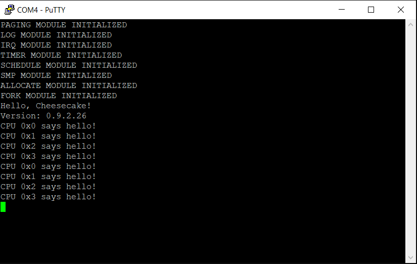

*Chapter Top* [Chapters[9]: Virtual Memory](chapter9.md) | *Next Chapter* [Chapters[10]: The TTY Driver and File Abstraction](../chapter10/chapter10.md)  
*Previous Page* [The Page Fault Handler](pagefault.md) | *Next Page* [Executing Into User Space](exec.md)

## System Calls ([chapter09/code2](code2))

#### The System Call Interface 

Admittedly, it is a bit strange to stick a section on system calls into the virtual memory chapter. However, the division of user space and kernel space, and their separate address spaces, depends on system calls. The interface allows a mini-context switch of sorts from user mode to kernel mode. The stack pointer changes, as does the active page table, from `TTBR0_EL1` to `TTBR1_EL1`. The virtual memory idea cannot be demonstrated without system calls so that user space can access the hardware the kernel manages for output. Finally, the system call interface is a bit simple to justify its own chapter. So, here it is, smack in the middle of virtual memory.

#### C Library

On a typical GNU Linux system, system calls are generally provided by the _C_ library. The library will, under the covers, wrap system calls, hiding the details from the user. The `printf` function, for example, will wrap the `write` system call, possibly using STDOUT as the file descriptor. It is also possible to call `write` directly, if you 

```C
#include <unistd.h>
```

The compiler needs to know how to convert the function name to the proper assembly to invoke the correct system call. 

From the kernel's perspective, a system call is represented simply by a number. That number serves as an index into an array of functions. All we need is for a user program to invoke a system call like:

```asm
#define SYSCALL_MYSCALL     SOME_NOMINAL_INTEGER
.globl __mysyscall
__mysyscall:
    mov     w8, SYSCALL_MYSYSCALL
    svc     0x0
    ret
```

The `svc` call will generate an exception, a transition between `EL0` and `EL1`. The kernel can access the system call number from the `w8` register, and assumes the first eight arguments, those in registers `x0`-`x7` are input parameters. For CheesecakeOS, we will implement system calls from a _mini-C_ library in just this way.

For the purpose of getting started, we will create our first user space program, `sayhello`, with source located in [arch/arm64/user/sayhello.c](code2/arch/arm64/user/sayhello.c):

```C
extern long sayhello();
extern long usloopsleep();

unsigned long user_bss = 0;
unsigned long user_data = 5;
const long user_rodata = 7;

int say_hello()
{
    while(1) {
        sayhello();
        usloopsleep();
    }
    return 0;
}
```

While user space programs can do loads of CPU processing without system calls, none of this action is visible to the user until some output appears. In the case of the `say_hello` function, two system calls are invoked, `sayhello`, and `usloopsleep`. Both system calls are implemented in our _mini-C_ library, [arch/arm64/user/libc.c](code2/arch/arm64/user/libc.c):

```C
extern long __sayhello();
extern long __usloopsleep();

long sayhello()
{
    return __sayhello();
}

long usloopsleep()
{
    return __usloopsleep();
}
```

Both `sayhello` and `usloopsleep` pass through to assembly functions defined in [arch/arm64/user/libc.S](code2/arch/arm64/user/libc.S):

```asm
#include "user/syscall.h"

.globl __sayhello
__sayhello:
    mov w8, SYSCALL_SAYHELLO
    svc 0x0
    ret

.globl __usloopsleep
__usloopsleep:
    mov w8, SYSCALL_USLOOPSLEEP
    svc 0x0
    ret
```

The system call numbers are defined in the user space include file [arch/arm64/user/include/user/syscall.h](code2/arch/arm64/user/include/user/syscall.h):

```C
#ifndef _USER_SYSCALL_H
#define _USER_SYSCALL_H

#define SYSCALL_ZERO_RESERVED   (0)
#define SYSCALL_SAYHELLO        (1)
#define SYSCALL_USLOOPSLEEP     (2)
#define NUM_SYSCALLS            (3)

#endif
```

The kernel source file [arch/arm64/syscall.c](code2/arch/arm64/syscall.c) includes the user space system call numbers in order to build a table of kernel functions:

```C
#include "arch/page.h"
#include "arch/syscall.h"

extern long sys_sayhello();
extern long sys_usloopsleep();

void * sys_call_table [NUM_SYSCALLS] __attribute__((__aligned__(PAGE_SIZE))) = {
    [0 ... NUM_SYSCALLS - 1] = 0,
    [SYSCALL_SAYHELLO] = sys_sayhello,
    [SYSCALL_USLOOPSLEEP] = sys_usloopsleep
};
```

Both of the kernel functions `sys_sayhello` and `sys_usloopsleep` are implemented in [src/sayhello.c](code2/src/sayhello.c):

```C
#include "cake/log.h"
#include "arch/smp.h"
#include "arch/irq.h"

long sys_sayhello()
{
    unsigned long cpuid = SMP_ID();
    log("CPU #%x SAYS HELLO!\r\n", cpuid);
    return 0;
}

long sys_usloopsleep()
{
    WAIT_FOR_INTERRUPT();
    return 0;
}
```

So it is quite clear the user space `sayhello` program will run in a loop, printing `CPU #0 SAYS HELLO!`, and then waiting for an interrupt. Whenever we need to add a system call, we will follow the procedure here. The _C_ library wrapper function is implemented in `arch/arm64/user/libc.c`, and the `svc` with the correct system call number is defined in `arch/arm64/user/libc.S`. The system call number is added to the user space system call include file in `arch/arm64/user/include/user/syscall.h`, and a corresponding entry added to the system call table in `arch/arm64/syscall.c`. That table entry will reference the system call name, `sys_` prepended, a function implemented somewhere in the kernel code.

#### System Call Entry

The system call interface is set, from the perspective of user space. From the kernel, we still need to handle the exception generated by the `svc` call. In [arch/arm64/entry.S](code2/arch/arm64/entry.S), in the `__sync_el064` routine, there is now an additional synchronous abort handler, for the case of an `svc` call:

```asm
__sync_el064:
    __ENTRY_SAVE    0
    mrs             x25, esr_el1
    lsr             x24, x25, #ESR_ELx_EC_SHIFT
    cmp             x24, #ESR_ELx_EC_SVC64
    b.eq            __el0_svc
    cmp             x24, #ESR_ELx_EC_DABT_LOW
    b.eq            __el0_da
    cmp             x24, #ESR_ELx_EC_IABT_LOW
    b.eq             __el0_ia
    mrs              x0, esr_el1
    mrs              x1, far_el1
    bl              handle_sync
    b               __invalid_entry
```

When a system call is executed, this handler will run, and jump to the `__el0_svc` routine:

```asm
__el0_svc:
    adrp    x27, sys_call_table
    uxtw    x26, w8
    mov     x25, #NUM_SYSCALLS
    bl      __irq_enable
    cmp     x26, x25
    b.hs    1f
    ldr     x16, [x27, x26, lsl #3]
    blr     x16
    b       __ret_from_syscall
1:
    b       __invalid_entry
```

The assembly system call handler:
1. Loads the system call table (which is page aligned) into `x27` 
2. Zero extends the system call number from `w8` into `x26`
3. Moves the number of system calls into `x25`
4. Enables IRQs
5. If the system call number provided is larger than the number of system calls, an invalid system call number was given
6. Otherwise, loads the address of the system call function into `x16`
7. Branches to the system call function

Registers `x0` through `x7` are left untouched. These registers hold the arguments for a system call. Up to eight arguments are supported. When the system call returns, control branches to the `__ret_from_syscall` routine:

```asm
__ret_from_syscall:
    str     x0, [sp, #SSR_X0]
    b       __ret_to_user

.globl __ret_from_fork
__ret_from_fork:
    bl                  schedule_tail
    cbz                 x19, __ret_to_user
    mov                 x0, x20
    blr                 x19
__ret_to_user:
    bl                  __irq_disable
    __ENTRY_RESTORE     0
```

The routine replaces the value of the `x0` register saved on the stack with the return value from the system call. Thus, when `__ENTRY_RESTORE` runs, returning to user space, the application will have the return value of the system call available in the architecturally correct register. This is how the kernel communicates back to user space.

After updating the return value, control branches to `__ret_to_user`, IRQs are disabled, and `__ENTRY_RESTORE` restores state before returning to user space.

It is not a coincidence `__ret_to_user` appears directly after `__ret_from_fork`. In the next slice, we will finally create our first user space process. We do this by first creating a cake thread that begins at `__ret_from_fork`, as all other threads. After we have carefully manipulated the process state, we will return from the cake thread function, and fall through. Then `__ret_to_user` will take the process into user mode.

Now the system call interface has been established from both kernel and user perspectives, we may go back and fill in the `copy_arch_context` function from [arch/arm64/process.c](code2/arch/arm64/process.c). Previously, we left the `else` clause empty, the case where the flags do _not_ indicate a kernel thread. Now we fill in:

```C
#define PROCESS_STACK_SAVE_REGISTERS(p) \
    (((struct stack_save_registers *) ((((unsigned long) p->stack) + STACK_SIZE))) - 1)

int copy_arch_context(unsigned long flags,
    unsigned long thread_input,
    unsigned long arg,
    struct process *p)
{
    struct stack_save_registers *ssr = PROCESS_STACK_SAVE_REGISTERS(p);
    memset(&(p->context), 0, sizeof(struct cpu_context));
    p->preempt_count = FORK_PREEMPT_COUNT;
    if(flags & CLONE_CAKETHREAD) {
        memset(ssr, 0, sizeof(*ssr));
        p->context.x19 = thread_input;
        p->context.x20 = arg;
    }
    else {
        *ssr = *PROCESS_STACK_SAVE_REGISTERS(CURRENT);
        ssr->regs[0] = 0;
        if(arg) {
            ssr->sp = arg;
        }
    }
    p->context.pc = (unsigned long) __ret_from_fork;
    p->context.sp = (unsigned long) ssr;
    return 0;
}
```

Let us see if we can make sense of this function as a whole. Whenever a new process is created, it has a fresh kernel stack allocated, saved in the `stack` field. All new processes are birthed into the `__ret_from_fork` routine, and all have the kernel stack pointer set to the top of the stack, minus the size of one `struct stack_save_registers`, the value captured in the `ssr` pointer by the `PROCESS_STACK_SAVE_REGISTERS` macro. When one cake thread ultimately returns to become the first user space process, `__ENTRY_RESTORE` will be executed. The process will then enter user space with the kernel stack empty, pointing to the very top address, as `__ENTRY_RESTORE` will increment the stack pointer by the size of one `struct stack_save_registers`. 

The only way for a user process to be created after that point is by using a system call to enter the kernel and run the `do_clone` function. At entry into the system call, the user space process's registers and state will be saved on the stack, starting from the very top, in a space the size of one `struct stack_save_registers`. The stack pointer will be decremented by this amount. In the `copy_arch_process` function that saved state is accessed and copied in the line

```C
        *ssr = *PROCESS_STACK_SAVE_REGISTERS(CURRENT);
```

We know the state exists at that exact location - we set it up to be so. The cloned child process will be initialized with the exact state as the forked parent, including general purpose registers and the value to be placed in the `Exception Link Register`. Finally, because this is a forking operation, where the parent receives the PID of the child, but the child receives the value zero, the stack is updated so that when a newly forked process does return, the value zero appears in `x0`:

```C
        ssr->regs[0] = 0;
```

So the logic hangs together nicely. Reason about it for a while, and see if you agree.

#### Building

System calls only make sense from user space. The system call handler only handles synchronous aborts from a lower exception level. So, though our CheesecakeOS has no file system, we need a way to partition our user space applications and _C_-library responsible for making user space calls away from the rest of the kernel. In order to do this, we add special partitioning variables to the [arch/arm64/linker.template](code2/arch/arm64/linker.template) linker file, so that all source files in the `arch/arm64/user` directory will be located in their own special space:

```
OUTPUT_ARCH(aarch64)
ENTRY(_start)
SECTIONS
{
    . = VADDR_START + TEXT_OFFSET;
    .text.boot : {
        _start = .;
        *(.text.boot)
    }
    .text : {
        . = ALIGN(PAGE_SIZE);
        _idmap_text_start = .;
        *(.idmap.text)
        _idmap_text_end = .;
        *(EXCLUDE_FILE (.build/user/.*) .text)
    }
    . = ALIGN(SECTION_SIZE);
    _kernel_text_end = .;
    .rodata : {
        *(EXCLUDE_FILE (.build/user/.*) .rodata)
    }
    .data : {
        *(EXCLUDE_FILE (.build/user/.*) .data)
    }
    . = ALIGN(PAGE_SIZE);
    page_global_dir = .;
    . += PAGE_GLOBAL_DIR_SIZE;
    end_page_global_dir = .;
    . = ALIGN(0x8);
    bss_begin = .;
    .bss : {
        *(EXCLUDE_FILE (.build/user/.*) .bss)
    }
    . = ALIGN(PAGE_SIZE);
    empty_zero_page = .;
    bss_end = .;
    . = ALIGN(PAGE_SIZE);
    init_stack = .;
    . += INIT_STACK_SIZE;
    . = ALIGN(SECTION_SIZE);
    _user_begin = .;
    _user_text_begin = .;
    .text.user : {
        .build/user/.* (.text)
    }
    . = ALIGN(SECTION_SIZE);
    _user_text_end = .;
    _user_rodata_begin = .;
    . = ALIGN(PAGE_SIZE);
    .rodata.user : {
        .build/user/.* (.rodata)
    }
    . = ALIGN(PAGE_SIZE);
    _user_rodata_end = .;
    _user_data_begin = .;
    .data.user : {
        .build/user/.* (.data)
    }
    . = ALIGN(PAGE_SIZE);
    _user_data_end = .;
    _user_bss_begin = .;
    .bss.user : {
        .build/user/.* (.bss)
    }
    . = ALIGN(PAGE_SIZE);
    _user_bss_end = .;
    _user_end = .;
    . = ALIGN(SECTION_SIZE);
    _end_permenant_image = .;
    init_overwrite_storage = .;
    page_idmap_dir = .;
    . += IDMAP_DIR_SIZE;
    end_page_idmap_dir = .;
    . = ALIGN(PAGE_SIZE);
    cpu_spin_pen = .;
    . += (0x8 * NUM_CPUS);
    end_cpu_spin_pen = .;
    . = ALIGN(SECTION_SIZE);
    _end = .;
}
```

It isn't especially elegant, but the kernel `.text`, `.rodata`, `.data` and `.bss` sections all exclude inputs from the user directory. Instead, those inputs are included in the special partition, bounded by a number of linker variables accessible to the kernel. The [Makefile](code2/Makefile) has updates to accommodate. Building the project gives the address map of the image in `.build/kernel8.map` , where we can verify the partitioning:

```
ffff000000400000 T _user_begin
ffff000000400000 T _user_text_begin
ffff000000400000 T say_hello
ffff000000400014 T sayhello
ffff000000400028 T usloopsleep
ffff00000040003c T __sayhello
ffff000000400048 T __usloopsleep
ffff000000600000 R _user_rodata_begin
ffff000000600000 R _user_text_end
ffff000000600000 R user_rodata
ffff000000601000 D _user_data_begin
ffff000000601000 D _user_rodata_end
ffff000000601000 D user_data
ffff000000602000 B _user_bss_begin
ffff000000602000 B _user_data_end
ffff000000602000 B user_bss
ffff000000603000 B _user_bss_end
ffff000000603000 B _user_end
```

Check the variables `user_rodata`, `user_data`, and `user_bss` that were defined in [arch/arm64/user/say\_hello.c](code2/arch/arm64/user/say_hello.c) and faithfully linked into the correct sections. Loading our Raspberry Pi 4 with this image and running still won't show any updated behavior. We will only complete our mission in the next slice:



*Previous Page* [The Page Fault Handler](pagefault.md) | *Next Page* [Executing Into User Space](exec.md)  
*Chapter Top* [Chapters[9]: Virtual Memory](chapter9.md) | *Next Chapter* [Chapters[10]: The TTY Driver and File Abstraction](../chapter10/chapter10.md)
