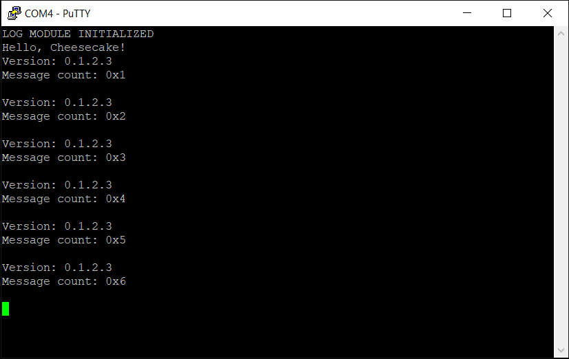

*Chapter Top* [Chapters[1]: Hello, Cheesecake!](chapter1.md)  |  *Next Chapter* [Chapters[2]: Processor Initialization and Exceptions](../chapter2/chapter2.md)
*Previous Page* [Building and Linking](building-linking.md)  |  *Next Page* [Chapters[2]: Processor Initialization and Exceptions](../chapter2/chapter2.md)

## Logging([chapter1/code2](code2))

#### Some Useful Definitions

Having explicit control over the size of variables is crucial in some cases. It is therefore a decent idea to steal some macros from Linux and keep them in a a [header file](include/cake/types.h) for whenever we need them:

```C
#ifndef _CAKE_TYPES_H
#define _CAKE_TYPES_H

typedef __signed__ char __s8;
typedef unsigned char __u8;

typedef __signed__ short __s16;
typedef unsigned short __u16;

typedef __signed__ int __s32;
typedef unsigned int __u32;

__extension__ typedef __signed__ long long __s64;
__extension__ typedef unsigned long long __u64;

typedef __s8  s8;
typedef __u8  u8;
typedef __s16 s16;
typedef __u16 u16;
typedef __s32 s32;
typedef __u32 u32;
typedef __s64 s64;
typedef __u64 u64;

#endif
```

#### Some Useful Logging

Currently, our log function takes a null-terminated string, and outputs it to the console. How dull! We want to be able to log some formatted output. If we want to know the address of a variable (a pointer), or the value stored at that address (dereferencing a pointer), we need some hex-logging capability. We are going to add that to our [src/log.c](code2/src/log.c) module now:

```C
#include <stdarg.h>
#include "cake/log.h"
#include "cake/types.h"

#define BUFFER_SIZE                     (255)
#define MAX_BUFFER_DATA_FOR_NULL_TERM   (BUFFER_SIZE - 1)

extern void console_init();

struct writebuf {
    u8 pos;
    char s[BUFFER_SIZE];
};
```
We start by extending our module with the `writebuf` struct - size `256` bytes, a nice power of `2`! It is now possible to use an integer sized to exactly `1`-byte, with the `u8` type. This works better than the `char` type for our purposes, as we can use it to index our `255`-byte buffer without the compiler complaining. You can already guess that we are going to use this buffer to store the results of formatted input.
```C
static void flush(struct writebuf *w)
{
    if(w->pos) {
        console->write(w->s);
    }
}
```
The static `flush` function is responsible for sending the characters we wish to log to the console object, initalized as before.

```C
static int check_flush(struct writebuf *w)
{
    if(w->pos == MAX_BUFFER_DATA_FOR_NULL_TERM) {
        flush(w);
        return 1;
    }
    return 0;
}
```
At necessary intervals, there is a boolean check to determine if it is necessary to flush the buffer. The function will return true and perform the flush if `254` characters - the resolution of the `MAX_BUFFER_DATA_FOR_NULL_TERM` macro - have been stored in the buffer.
```C
static void cleanbuf(struct writebuf *w)
{
    w->pos = 0;
    for(unsigned int i = 0; i < BUFFER_SIZE; i++) {
        w->s[i] = 0;
    }
}
```
The convenient `cleanbuf` function is used to initalize a buffer on the stack.
```C
void log(char *fmt, ...)
{
    char c;
    va_list va;
    va_start(va, fmt);
    struct writebuf w;
    cleanbuf(&w);
    while((c = *(fmt++)) != '\0') {
        if(c != '%') {
            w.s[w.pos++] = c;
            if(check_flush(&w)) {
                va_end(va);
                return;
            }
        }
        else {
            int ret;
            c = *(fmt++);
            switch(c)
            {
                case 's':
                    ret = putstr(va_arg(va, char*), &w);
                    if(ret) {
                        va_end(va);
                        return;
                    }
                    break;
                case 'x':
                    ret = puthex(va_arg(va, unsigned long), &w);
                    if(ret) {
                        va_end(va);
                        return;
                    }
                    break;
                default:
                    break;
            }
        }
    }
    flush(&w);
    va_end(va);
}
```
The public logging function begins by declaring a `writebuf` on the stack, cleaning it, and starting the variable arugments list. It then loops through each character of the given format string `fmt`. If the special `%` character is encountered, it grabs the next variable argument, and calls a corresponding function to write that argument into the `writebuf`. As each character is written to the buffer, we ask if the buffer is full. After the buffer has filled up, or after all the input has been processed into the buffer, the buffer is flushed, and the variable args list ended.
```C
static int putstr(char *s, struct writebuf *w)
{
    char c;
    while((c = *s++)  != '\0') {
        w->s[w->pos++] = c;
        if(check_flush(w)) {
            return 1;
        }
    }
    return 0;
}
```
No surprises for string formatting!
```C
static int puthex(unsigned long x, struct writebuf *w)
{
    char c;
    int d = 0;
    char temp[27];
    xintos(x, temp);
    while((c = temp[d++]) != '\0') {
        w->s[w->pos++] = c;
        if(check_flush(w)) {
            return 1;
        }
    }
    return 0;
}
```
For creating a formatted hex-string, a temporary buffer of `27` characters (at most `18` would be needed) is allocated on the stack and passed to the `xintos` function to do the work.
```C
static void xintos(unsigned long x, char *t)
{
    int temp_size = 0;
    char c, temp[16];
    *(t++) = '0';
    *(t++) = 'x';
    do {
        c = x % 16;
        if(c < 10) {
            c = c + 0x30;
        } else {
            c = c + 0x37;
        }
        temp[temp_size++] = c;
        x /= 16;
    } while(x);
    while(temp_size--) {
        *(t++) = temp[temp_size];
    }
    *(t++) = '\0';
    return;
}
```
Another temporary buffer of `16` bytes is allocated on the stack. This is to hold the reverse of the hex string as we chop of the modulo `16` until we exhaust the value of the `unsigned long` `x`. A do-while loop is the correct choice in case the value of `x` is `0`, we will end with `0x0` instead of just `0x`.

We can now update our `cheesecake_main` function to make use of our spiffy new functionality:

```C
void cheesecake_main(void)
{
    unsigned long count = 1;
    char *version = "0.1.2.3";
    init();
    log("Hello, Cheesecake!\r\n");
    while (1) {
        log("Version: %s\r\n", version);
        log("Message count: %x\r\n", count++);
        log("\r\n");
        DELAY(20000000);
    }
}
```

After building and loading, if everything has gone right, you might see something that looks a little bit like:



*Chapter Top* [Chapters[1]: Hello, Cheesecake!](chapter1.md)  |  *Next Chapter* [Chapters[2]: Processor Initialization and Exceptions](../chapter2/chapter2.md)
*Previous Page* [Building and Linking](building-linking.md)  |  *Next Page* [Chapters[2]: Processor Initialization and Exceptions](../chapter2/chapter2.md)
