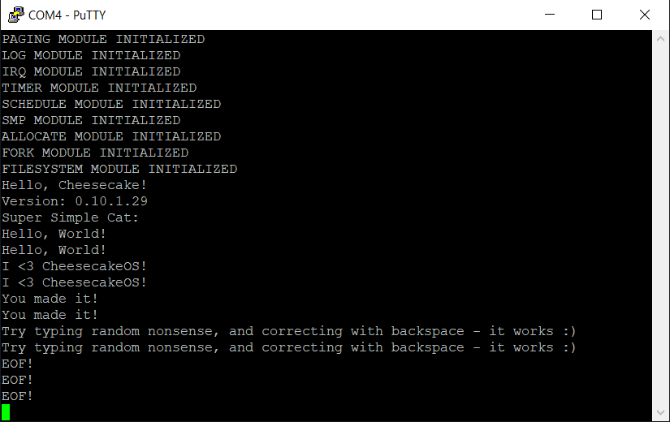

*Chapter Top* [Chapters[10]: The TTY Driver with File Abstraction](chapter10.md) | *Next Chapter* [Chapters[11]: Signals](../chapter11/chapter11.md)  
*Previous Page* [Writing](write.md) | *Next Page* [Embryonic Shell](shell.md)

## Reading ([chapter10/code1](code1))

#### TTY Driver Structures Part Deux

Imagine an application, such as a shell, issuing a `read` system call, expecting input from a user at the terminal. The implementation of such an application requires buffers. There must be a buffer to hold the incoming characters until the user hits the newline key and the system call can return. There must be a buffer to handle the characters echoed back to the user as the user is typing. There may be more buffers in between. We are going to extend both the low-level board-specific mini UART driver, and the line discipline with buffers.

> Note: Before continuing with this section, check out [The TTY demystified](https://www.linusakesson.net/programming/tty/).

In [arch/arm64/board/raspberry-pi-4/mini-uart.c](code1/arch/arm64/board/raspberry-pi-4/mini-uart.c) we define a new structure, the `rpi4_miniuart_receive_buffer`:

```C
#define READBUF_SIZE    (128)

struct rpi4_miniuart_receive_buffer {
    char readbuf[READBUF_SIZE];
    unsigned long head;
    unsigned long tail;
    struct spinlock lock;
    struct work work;
};

struct rpi4_miniuart {
    struct tty *tty;
    struct rpi4_miniuart_receive_buffer buffer;
} rpi4_miniuart;
```

The receive buffer is composed within the `rpi4_miniuart` object. When a keystroke is detected, an interrupt handler runs. The character will be pulled from the mini UART receive FIFO, and placed in the buffer.

The `N_TTY` line discipline structure created in [src/tty.c](code1/src/tty.c) supports heavy-duty terminal buffer manipulation:

```C
struct n_tty_data {
    unsigned long read_head;
    unsigned long commit_head;
    unsigned long canon_head;
    unsigned long echo_head;
    unsigned long echo_commit;
    unsigned long echo_mark;
    unsigned long char_map[BITMAP_SIZE(256)];
    unsigned char read_buf[N_TTY_BUF_SIZE];
    unsigned char echo_buf[N_TTY_BUF_SIZE];
    unsigned long read_flags[BITMAP_SIZE(N_TTY_BUF_SIZE)];
    unsigned long read_tail;
    unsigned long line_start;
    unsigned int column;
    unsigned int canon_column;
    unsigned long echo_tail;
};
```

Such a structure deserves an exposition:
- The `read_head` member is the index at the head of `read_buf`, and is incremented at insertion, or decremented at deletion
- The `canon_head` keeps track of the canonical TTY head index, and is snapped to `read_head` when the user inserts a newline
- The `echo_head` member is the index at the head of `echo_buf`, and is incremented at insertion, or decremented at deletion
- The `echo_commit` member index keeps track of the echo characters that have been committed to the terminal
- The `charmap` bitmap maintains which characters we consider special characters for processing, such as newline and signal characters
- The `read_buf` and `echo_buf` arrays are storage buffers for reading and echoing characters
- The `read_flags` bitmap is used to mark where in the `read_buf` special characters such as newlines are located
- The `read_tail` member is the index at the tail of `read_buf`, and is snapped to the head when the buffer is emptied
- The `echo_tail` member is the index at the tail of `echo_buf`, and is incremented as echo characters are flushed to the terminal

Buffer queues begin at tail and end at head indexes. The `n_tty_data` structure is allocated and initialized in an updated `n_tty_open` function:

```C
static int n_tty_open(struct tty *tty)
{
    unsigned long *marked_chars;
    struct n_tty_data *ldata;
    ldata = cake_alloc(sizeof(*ldata));
    memset(ldata, 0, sizeof(*ldata));
    marked_chars = ldata->char_map;
    tty->disc_data = ldata;
    bitmap_zero(marked_chars, 256);
    set_bit(marked_chars, TTY_NEWLINE_CHAR(tty));
    set_bit(marked_chars, TTY_ERASE_CHAR(tty));
    set_bit(marked_chars, TTY_INTR_CHAR(tty));
    set_bit(marked_chars, TTY_EOF_CHAR(tty));
    return 0;
}
```

After allocating an `n_tty_data` object, `ldata`, and saving it in the `disc_data` member, the `char_map` bitmap is initialized with the TTY's special characters. These macros are defined in [include/cake/tty.h](code1/include/cake/tty.h):

```C
#define TERMIOS_NEWLINE         (0)
#define TERMIOS_ERASE           (1)
#define TERMIOS_INTR            (2)
#define TERMIOS_EOF             (3)
#define TERMIOS_MAX             (8)

#define TTY_NEWLINE_CHAR(tty)   ((tty)->termios[TERMIOS_NEWLINE])
#define TTY_ERASE_CHAR(tty)     ((tty)->termios[TERMIOS_ERASE])
#define TTY_INTR_CHAR(tty)      ((tty)->termios[TERMIOS_INTR])
#define TTY_EOF_CHAR(tty)       ((tty)->termios[TERMIOS_EOF])
```

The `rpi4_miniuart_open` function, called from `tty_open`, assigns the characters from the driver side:

```C
static char rpi4_miniuart_termios[TERMIOS_MAX] = {
    [TERMIOS_NEWLINE] = '\r',
    [TERMIOS_ERASE] = 0x7F,
    [TERMIOS_INTR] = 0x3,
    [TERMIOS_EOF] = 0x4
};

static int rpi4_miniuart_open(struct tty *tty, struct file *file)
{
    rpi4_miniuart.tty = tty;
    tty->driver_data = &rpi4_miniuart;
    for(int i = 0; i < TERMIOS_MAX; i++) {
        tty->termios[i] = rpi4_miniuart_termios[i];
    }
    return 0;
}
```

Our structures buffered, we can proceed with the business of processing user input. By the end of the slice, we will boost our `struct tty_file_ops` and `n_tty_ldisc_ops` structures with new concrete capabilities:

```C
static struct tty_ldisc_ops n_tty_ldisc_ops = {
    .close = n_tty_close,
    .open = n_tty_open,
    .read = n_tty_read,
    .receive_buf = n_tty_receive_buf,
    .write = n_tty_write
};
static struct file_ops tty_file_ops = {
    .close = tty_close,
    .open  = tty_open,
    .read  = tty_read,
    .write = tty_write
};
```

#### Auxiliary Keyboard Interrupt

Filling the kernel buffers with user keystrokes is our present goal. When a key is pressed at the terminal connected by USB to the Raspberry Pi 4's serial mini UART, an auxiliary interrupt is triggered. The aux interrupt handling registers are described in the [BCM2711 ARM Peripherals](https://www.raspberrypi.org/documentation/hardware/raspberrypi/bcm2711/rpi_DATA_2711_1p0.pdf), `pg. 11-12`. The `AUX_MU_IER_REG` register and `AUX_MU_IIR_REG` register are of immediate interest.

The `AUX_MU_IER_REG` is used to enable auxiliary interrupts. The documentation shows that bit zero should be set to raise an interrupt whenever the transmit FIFO is empty, while bit one enables receive interrupts. The documentation happens to have this backwards - receive interrupts are enabled from bit zero. This informs how we write in `__uart_irqenable` from [arch/arm64/board/raspberry-pi-4/mini-uart.S](code1/arch/arm64/board/raspberry-pi-4/mini-uart.S):

```asm
.globl __uart_irqenable
__uart_irqenable:
    __MOV_Q         x1, PHYS_TO_VIRT(AUX_MU_IER_REG)
    mov             w0, #0b01
    __dev_write_8   w0, x1
    ret
```

By setting bit number zero, an interrupt will be generated whenever the user hits a key and a character enters the receive FIFO. The receive interrupt is the only interrupt enabled, though we will still want to check which interrupt is received from the `AUX_MU_IIR_REG`:

```asm
.globl __uart_irqstatus
__uart_irqstatus:
    __MOV_Q         x0, PHYS_TO_VIRT(AUX_MU_IIR_REG)
    __dev_read_32   w0, x0
    and             w0, w0, #0xFF
    ret
```

If the three least significant bits of `AUX_MU_IIR_REG` are 0b100, the receiver holds a byte we can pull in. Bytes are pulled from the receive FIFO with calls to `__uart_getchar`, which acesses `AUX_MU_IO_REG`, just as in `__uart_putchar`, only by reading instead of writing:

```asm
.globl __uart_getchar
__uart_getchar:
    __MOV_Q         x0, PHYS_TO_VIRT(AUX_MU_IO_REG)
    __dev_read_32   w0, x0
    and             w0, w0, #0xFF
    ret
```

The low level assembly functions are accessed by the mini UART driver in [arch/arm64/board/raspberry-pi-4/mini-uart.c](code1/arch/arm64/board/raspberry-pi-4/mini-uart.c). The `rpi4_miniuart_init` driver initialization responsibilities increase:

```C
int rpi4_miniuart_init(int reserved_file)
{
    struct work *work;
    rpi4_miniuart_tty_driver.basefile = reserved_file;
    register_tty_driver(&rpi4_miniuart_tty_driver);
    work = &(rpi4_miniuart.buffer.work);
    work->worklist.prev = &(work->worklist);
    work->worklist.next = &(work->worklist);
    work->todo = rpi4_miniuart_collect;
    __uart_irqenable();
    return 0;
}
```

Now, in addition to registering the driver with the TTY module, the `rpi4_miniuart`'s buffer's work struct is initialized, and auxiliary receive interrupts are enabled. In our system as it is the auxiliary interrupts still won't be received. The line must be enabled in the _GIC_. We take care to update [arch/arm64/board/raspberry-pi-4/irq.c](code1/arch/arm64/board/raspberry-pi-4/irq.c):

```C
#define SPID_AUX            (0x7D)

static void enable_irq_target_cpu()
{
    __irq_target_cpumask(SPID_TIMER3, CPU0_MASK);
    __irq_target_cpumask(SPID_AUX, CPU0_MASK);
}

static void init_irq_registers()
{
    __irq_enable_spid(SPID_TIMER3);
    __irq_enable_spid(SPID_AUX);
}
```

Reviewing `pg. 85` of the `BCM2711 Peripherals` Guide, the `SPID_AUX` interrupt is video core interrupt 29. Video core interrupts begin at SPI 96 in the Raspberry Pi 4 _GIC_. Thus, the `SPID_AUX` interrupt is number 125. Interrupt 125 is enabled in the distributor, and then enabled on CPU 0. Now, when an IRQ is received, we can add the `SPID_AUX` interrupt as a valid trigger:

```C
void handle_irq()
{
    do {
        unsigned int irq = __irq_acknowledge();
        unsigned int irqid = IRQ_IRQID_VALUE(irq);
        if(irqid < 1020) {
            __irq_end(irq);
            switch(irqid) {
                case SPID_SGI_TIMER:
                    timer_tick();
                    break;
                case SPID_TIMER3:
                    __irq_broadcast_sgi(SPID_SGI_TIMER);
                    timer_interrupt();
                    timer_tick();
                    break;
                case SPID_AUX:
                    rpi4_miniuart_interrupt();
                    break;
                default:
                    log("Encountered Undefined Interrupt: %x\r\n", irqid);
                    break;
            }
        }
        else {
            break;
        }
    } while(1);
}
```

When the user presses a key, the IRQ entry will take us to the `handle_irq` function, which will call `rpi4_miniuart_interrupt`, defined back in [arch/arm64/board/raspberry-pi-4/mini-uart.c](code1/arch/arm64/board/raspberry-pi-4/mini-uart.c) in response:

```C
void rpi4_miniuart_interrupt()
{
    char c;
    unsigned long space;
    unsigned long head;
    struct spinlock *lock = &(rpi4_miniuart.buffer.lock);
    SPIN_LOCK(lock);
    head = rpi4_miniuart.buffer.head;
    space = READBUF_SIZE - (head - rpi4_miniuart.buffer.tail);
    if(space) {
        while(__uart_irqstatus() == IRQ_READ_PENDING) {
            c = __uart_getchar();
            rpi4_miniuart.buffer.readbuf[MASK(head++)] = c;
        }
    }
    rpi4_miniuart.buffer.head = head;
    SPIN_UNLOCK(lock);
    enqueue_work(&(rpi4_miniuart.buffer.work));
}
```

The `rpi4_miniuart` buffer is protected from concurrent access by a lock. After acquiring the lock, if there is still space, characters are pulled from the receive FIFO, and placed in the buffer. After the characters are saved, the head pointer is updated. The lock is released. Before returning, the `rpi4_miniuart`'s buffer's work is queued, to be executed when the kernel workqueue is next scheduled (remembering from [Chapter 8](../chapter8/workqueue.md), enqueuing a task will wake the workqueue cake thread).

The work's `todo` function was initialized in `rpi4_miniuart_init` to be the `rpi4_miniuart_collect` function:

```C
static void rpi4_miniuart_collect(struct work *work)
{
    unsigned long count, tail, flags, size;
    char *buf;
    struct tty *tty = rpi4_miniuart.tty;
    struct spinlock *lock = &(rpi4_miniuart.buffer.lock);
    flags = SPIN_LOCK_IRQSAVE(lock);
    count = rpi4_miniuart.buffer.head - rpi4_miniuart.buffer.tail;
    tail = MASK(rpi4_miniuart.buffer.tail);
    size = READBUF_SIZE - tail;
    rpi4_miniuart.buffer.tail += count;
    SPIN_UNLOCK_IRQRESTORE(lock, flags);
    buf = &(rpi4_miniuart.buffer.readbuf[tail]);
    if(count > size) {
        tty->ldisc->ops->receive_buf(tty, buf, size);
        count -= size;
        buf = rpi4_miniuart.buffer.readbuf;
    }
    tty->ldisc->ops->receive_buf(tty, buf, count);
}
```

The `rpi4_miniuart_collect` function's job is to set the parameters for a call to the TTY line discipline's `receive_buf` function. The `rpi4_miniuart` buffer is first protected against concurrent access, while disabling interrupts. The buffer can wrap around itself, like a queue. If the buffer wraps, two calls to `receive_buf` are necessary. The `tty` reference saved with the call to `rpi4_miniuart_open` finally finds a use!

#### Receiving The Mini UART Buffer

We have seen the interrupt handler notify the low level `rpi4_miniuart` driver characters are available in the receive FIFO. We have also seen the characters pulled from the receive FIFO into the mini UART buffer, and work scheduled. The line discipline's `receive_buf` function processes these characters using the formatting logic of the line discipline, and, when ready, wakes a sleeping reader. The `n_tty_recieve_buf` logic is intense, and we walk through the implementation from [src/tty.c](code1/src/tty.c) in steps:

```C
static int n_tty_receive_buf(struct tty *tty, char *buffer, unsigned int count)
{
    char c;
    struct n_tty_data *ldata = tty->disc_data;
    unsigned long tail;
    int room, n, t, rcvd;
    rcvd = 0;
    while(1) {
        tail = ldata->read_tail;
        room = N_TTY_BUF_SIZE - (ldata->read_head - tail);
        room--;
```

The amount of room in the line discipline's `read_buf` is equal to the buffer size, reduced by the number of characters in the buffer, minus one. 

```C
        if(room <= 0) {
            break;
        }
```

If there is no room in the buffer, the loop terminates immediately, as nothing more can be received.

> Note: This mean no room in the buffer results in a stuck system with no way to progress. Yikes! Would it be better to update `canon_head` and wake a sleeper first?

```C
        n = room > count ? count : room;
        if(!n) {
            break;
        }
```

The variable `n` holds the number of characters to be copied. It is set equal to either the `count` given as an argument, or the amount of `room` left in the buffer, whichever is lesser. When `n` has been depleted, the loop terminates.

```C
        while(t--) {
            c = *buffer++;
            if(test_bit(ldata->char_map, c)) {
                n_tty_receive_marked_char(tty, c);
            }
            else {
                n_tty_receive_normal_char(tty, c);
            }
        }
```

Each character in the buffer passed into `n_tty_receive_buf`, is checked against the registered special characters. Special characters take one path, normal characters take another. We examine first the normal case:

```C
static const unsigned char ctype[] = {
    _C,     _C,    _C,    _C,    _C,    _C,    _C,    _C,
    _C,     _C|_S, _C|_S, _C|_S, _C|_S, _C|_S, _C,    _C,
    _C,     _C,    _C,    _C,    _C,    _C,    _C,    _C,
    _C,     _C,    _C,    _C,    _C,    _C,    _C,    _C,
    _S|_SP, _P,    _P,    _P,    _P,    _P,    _P,    _P,
    _P,     _P,    _P,    _P,    _P,    _P,    _P,    _P,
    _D,     _D,    _D,    _D,    _D,    _D,    _D,    _D,
    _D,     _D,    _P,    _P,    _P,    _P,    _P,    _P,
    _P,     _U|_X, _U|_X, _U|_X, _U|_X, _U|_X, _U|_X, _U,
    _U,     _U,    _U,    _U,    _U,    _U,    _U,    _U,
    _U,     _U,    _U,    _U,    _U,    _U,    _U,    _U,
    _U,     _U,    _U,    _P,    _P,    _P,    _P,    _P,
    _P,     _L|_X, _L|_X, _L|_X, _L|_X, _L|_X, _L|_X, _L,
    _L,     _L,    _L,    _L,    _L,    _L,    _L,    _L,
    _L,     _L,    _L,    _L,    _L,    _L,    _L,    _L,
    _L,     _L,    _L,    _P,    _P,    _P,    _P,    _C,
     0,      0,     0,     0,     0,     0,     0,     0,
     0,      0,     0,     0,     0,     0,     0,     0,
     0,      0,     0,     0,     0,     0,     0,     0,
     0,      0,     0,     0,     0,     0,     0,     0,
    _S|_SP, _P,    _P,    _P,    _P,    _P,    _P,    _P,
    _P,     _P,    _P,    _P,    _P,    _P,    _P,    _P,
    _P,     _P,    _P,    _P,    _P,    _P,    _P,    _P,
    _P,     _P,    _P,    _P,    _P,    _P,    _P,    _P,
    _U,     _U,    _U,    _U,    _U,    _U,    _U,    _U,
    _U,     _U,    _U,    _U,    _U,    _U,    _U,    _U,
    _U,     _U,    _U,    _U,    _U,    _U,    _U,    _P,
    _U,     _U,    _U,    _U,    _U,    _U,    _U,    _L,
    _L,     _L,    _L,    _L,    _L,    _L,    _L,    _L,
    _L,     _L,    _L,    _L,    _L,    _L,    _L,    _L,
     0,      0,     0,     0,     0,     0,     0,     0,
     0,      0,     0,     0,     0,     0,     0,     0
};

#define _U                  (0b00000001)
#define _L                  (0b00000010)
#define _D                  (0b00000100)
#define _C                  (0b00001000)
#define _P                  (0b00010000)
#define _S                  (0b00100000)
#define _X                  (0b01000000)
#define _SP                 (0b10000000)
#define IS_CHAR_MASK(x)     (ctype[(int)(unsigned char)(x)])
#define ISCTRL(c)           ((IS_CHAR_MASK(c) & (_C)))

static inline unsigned char *echo_buf_addr(struct n_tty_data *ldata, unsigned long i);
static inline unsigned char *read_buf_addr(struct n_tty_data *ldata, unsigned long i);

static inline void add_echo_byte(struct n_tty_data *ldata, unsigned char c)
{
    *echo_buf_addr(ldata, ldata->echo_head) = c;
    SMP_WMB();
    ldata->echo_head++;
}

static inline void add_read_byte(struct n_tty_data *ldata, unsigned char c)
{
    *read_buf_addr(ldata, ldata->read_head) = c;
    ldata->read_head++;
}

static inline unsigned char echo_buf(struct n_tty_data *ldata, unsigned long i)
{
    SMP_RMB();
    return ldata->echo_buf[MASK(i)];
}

static inline unsigned char *echo_buf_addr(struct n_tty_data *ldata, unsigned long i)
{
    return &ldata->echo_buf[MASK(i)];
}

static inline unsigned char read_buf(struct n_tty_data *ldata, unsigned long i)
{
    return ldata->read_buf[MASK(i)];
}

static inline unsigned char *read_buf_addr(struct n_tty_data *ldata, unsigned long i)
{
    return &ldata->read_buf[MASK(i)];
}

static void n_tty_receive_normal_char(struct tty *tty, char c)
{
    struct n_tty_data *ldata = tty->disc_data;
    if(ISCTRL(c)) {
        add_echo_byte(ldata, ECHO_OP_START);
    }
    add_echo_byte(ldata, c);
    add_read_byte(ldata, c);
}
```

An annoying tangle of state and inline functions make up the `n_tty_receive_normal_char` routine. The somewhat ominous static `ctype` array exists to determine if the input character is a control character. If the input character is a control-type character, a special sentinal character is entered into the `echo_buf`. This allows later processing to output the famous `^` preceding output of the character to get the nice `^C^C^C^C` vibe on the terminal. The character is also put in the read buffer. 

For special marked characters, there are four possibilities:
- A newline character
- An end-of-file marker
- A backspace
- An interrupt character

The first three are implemented here and now:

```C
static void n_tty_receive_marked_char(struct tty *tty, char c)
{
    struct n_tty_data *ldata = tty->disc_data;
    if(c == TTY_NEWLINE_CHAR(tty)) {
        add_echo_byte(ldata, '\n');
        flush_echoes(tty);
        set_bit(ldata->read_flags, MASK(ldata->read_head));
        add_read_byte(ldata, '\n');
        STORE_RELEASE(&(ldata->canon_head), ldata->read_head);
        wake_waiter(&(tty->waitqueue));
    }
```

A newline character signals the end of input. The newline byte is sent to the echo buffer, and all echoes are flushed. The current bit in `read_flags` is set. The newline is sent to the read buffer, and the `canon_head` updated with a `STORE_RELEASE`. The `STORE_RELEASE` is to ensure the sleeping reader does not see an update to `canon_head` without also seeing the `read_buf` stores, as well as the `read_flags` update. At the end, a sleeper is awakened to process the new line.

```C
    else if(c == TTY_EOF_CHAR(tty)) {
        c = DISABLED_CHAR;
        set_bit(ldata->read_flags, MASK(ldata->read_head));
        add_read_byte(ldata, c);
        STORE_RELEASE(&(ldata->canon_head), ldata->read_head);
        wake_waiter(&(tty->waitqueue));
    }
```

In the case the EOF character is received, flow continues in a similar manner. No newline character is echoed, and a null character is added to the `read_buf`.

```C
    else if(c == TTY_ERASE_CHAR(tty)) {
        erase(tty, c);
        flush_echoes(tty);
    }
```

If a backspace is received, the `erase` function is called:

```C
static void erase(struct tty *tty, unsigned char c)
{
    struct n_tty_data *ldata = tty->disc_data;
    unsigned long head;
    if (ldata->read_head == ldata->canon_head) {
        return;
    }
    head = ldata->read_head;
    head--;
    c = read_buf(ldata, head);
    ldata->read_head = head;
    if (ISCTRL(c)) {
        add_echo_byte(ldata, '\b');
        add_echo_byte(ldata, ' ');
        add_echo_byte(ldata, '\b');
    }
    add_echo_byte(ldata, '\b');
    add_echo_byte(ldata, ' ');
    add_echo_byte(ldata, '\b');
}
```

The `erase` function accounts for the case where a control character was received, and two characters were echoed to the output, such as `^Z`. The adjustment for the read buffer is simply to decrement the head pointer one index. In the special case a backspace character is received when the `read_buf` is empty, signified by the equality of `read_head` and `canon_head`, no action is taken.

```C
    else if(c == TTY_INTR_CHAR(tty)) {
    }
```

The interrupt character implementation is saved for [Chapter 11](../chapter11/chapter11.md), when we discuss signals.

Circling back to the `n_tty_receive_buf` function, after all characters from the input buffer are processed, echoes are flushed, and control returns to beginning of the loop. If there is nothing left to process, `n` will equal zero, and the loop will terminate, returning the number of characters received.

The `flush_echoes` function is responsible for sending the typed characters to the screen so the user can see:

```C
static void flush_echoes(struct tty *tty)
{
    unsigned char c, op, caret;
    struct n_tty_data *ldata = tty->disc_data;
    unsigned long head, tail;
    caret = '^';
    head = ldata->echo_head;
    ldata->echo_mark = head;
    ldata->echo_commit = head;
    tail = ldata->echo_tail;
    while(MASK(ldata->echo_commit) != MASK(tail)) {
        c = echo_buf(ldata, tail);
        if(c == ECHO_OP_START) {
            op = echo_buf(ldata, tail + 1);
            op ^= 0100;
            tty->ops->write(tty, &caret, 1);
            tty->ops->write(tty, &op, 1);
            tail += 2;
        }
        else {
            tty->ops->write(tty, &c, 1);
            tail += 1;
        }
    }
    ldata->echo_tail = tail;
}
```

Here, the caret `^` output is implemented in the special case of a control character. The second character output is 64 greater than the actual control character. Pressing C-c at the keyboard gives the decimal value three. Adding 64 yields 67, the decimal number representing ascii `C`.

#### Read Requests

Will full buffer filling powers, we get to the yolk of the reading matter. TTY read requests land in `tty_read`, which serves as nothing more than a pass through to `n_tty_read`:

```C
static long tty_read(struct file *file, char *user, unsigned long n)
{
    unsigned long count;
    struct tty *tty = file->extension;
    struct tty_ldisc *ld = tty->ldisc;
    count = ld->ops->read(tty, user, n);
    return count;
}
```

The `n_tty_read` function handles all the floury details. It is not a simple function, but we will step through it slowly:

```C
static long n_tty_read(struct tty *tty, char *buffer, unsigned long count)
{
    void *copy_from_buf;
    unsigned long n, size, more, c, t;
    unsigned long eol, found;
    unsigned long tail;
    struct wait wait;
    struct n_tty_data *ldata = tty->disc_data;
    wait.sleeping = CURRENT;
    wait.waitlist.prev = &(wait.waitlist);
    wait.waitlist.next = &(wait.waitlist);
```

A `struct wait` object is initialized on the stack. The waitlist is initialized and the `CURRENT` process set as the sleeper.

```C
    while(1) {
        enqueue_wait(&(tty->waitqueue), &wait, PROCESS_STATE_INTERRUPTIBLE);
        if(READ_ONCE(ldata->canon_head) != READ_ONCE(ldata->read_tail)) {
            break;
        }
        schedule_self();
    }
    dequeue_wait(&(tty->waitqueue), &wait);
```

When there is a full line available, the `canon_head` counter will advance. Until that time, `n_tty_read` follows the sleep idiom from [Chapter 8](../chapter08/waiting.md). Unlike our workqueue example, the waitqueue's `waitlist` is initialized _outside_ the loop. This will lead to trouble because the `list_delete` function sets the `next` and `prev` pointers of a list element to zero. When `n_tty_read` wakes up, and enqueues the `wait` struct again, `list_enqueue` will not work properly. In order to fix this, `wake_waiter` in [src/wait.c](code1/src/wait.c) has been updated with a call to `list_delete_reset` which reinitializes a list element after deletion:

```C
void wake_waiter(struct waitqueue *waitqueue)
{
    struct wait *wait;
    SPIN_LOCK(&(waitqueue->lock));
    if(!list_empty(&(waitqueue->waitlist))) {
        wait = LIST_FIRST_ENTRY(&(waitqueue->waitlist), struct wait, waitlist);
        list_delete_reset(&(wait->waitlist));
        SMP_MB();
        WRITE_ONCE(wait->sleeping->state, PROCESS_STATE_RUNNING);
    }
    SPIN_UNLOCK(&(waitqueue->lock));
}
```

In [include/cake/list.h](code1/include/cake/list.h), `list_delete_reset` is another inline method:

```C
static inline void list_delete_reset(struct list *element)
{
    struct list *next, *prev;
    next = element->next;
    prev = element->prev;
    prev->next = next;
    WRITE_ONCE(next->prev, prev);
    element->next = element;
    element->prev = element;
}
```

After `n_tty_read` breaks out from the sleep idiom loop, it proceeds with the main read logic. Before diving in, let us setup some example inputs to trace through in order to gain a solid intuition of the algorithm:

```
EXAMPLE #0:
read_buf:
┌───────────┐
│ INDEX ... │
├─────┬─────┼─────┬─────┬─────┬─────┬─────┬─────┐
│  0  │  1  │  2  │  3  │  4  │  5  │  6  │  7  │ 
├─────┼─────┼─────┼─────┼─────┼─────┼─────┼─────┤
│  H  │  I  │  !  │  \n │  *  │  *  │  *  │  *  │
└─────┴─────┴─────┴─────┴─────┴─────┴─────┴─────┘

read_flags:
┌───────────┐
│  BIT  ... │
├─────┬─────┼─────┬─────┬─────┬─────┬─────┬─────┐
│  0  │  1  │  2  │  3  │  4  │  5  │  6  │  7  │ 
├─────┼─────┼─────┼─────┼─────┼─────┼─────┼─────┤
│  0  │  0  │  0  │  1  │  0  │  0  │  0  │  0  │
└─────┴─────┴─────┴─────┴─────┴─────┴─────┴─────┘

EXAMPLE #1:
read_buf:
┌───────────┐
│ INDEX ... │
├─────┬─────┼─────┬─────┬─────┬─────┬─────┬─────┐
│  0  │  1  │  2  │  3  │  4  │  5  │  6  │  7  │ 
├─────┼─────┼─────┼─────┼─────┼─────┼─────┼─────┤
│  *  │  *  │  H  │  I  │  !  │  \n │  *  │  *  │
└─────┴─────┴─────┴─────┴─────┴─────┴─────┴─────┘

read_flags:
┌───────────┐
│  BIT  ... │
├─────┬─────┼─────┬─────┬─────┬─────┬─────┬─────┐
│  0  │  1  │  2  │  3  │  4  │  5  │  6  │  7  │ 
├─────┼─────┼─────┼─────┼─────┼─────┼─────┼─────┤
│  0  │  0  │  0  │  0  │  0  │  1  │  0  │  0  │
└─────┴─────┴─────┴─────┴─────┴─────┴─────┴─────┘

EXAMPLE #2:
read_buf:
┌───────────┐
│ INDEX ... │
├─────┬─────┼─────┬─────┬─────┬─────┬─────┬─────┐
│  0  │  1  │  2  │  3  │  4  │  5  │  6  │  7  │ 
├─────┼─────┼─────┼─────┼─────┼─────┼─────┼─────┤
│  O  │  \n │  *  │  *  │  H  │  E  │  L  │  L  │
└─────┴─────┴─────┴─────┴─────┴─────┴─────┴─────┘

read_flags:
┌───────────┐
│  BIT  ... │
├─────┬─────┼─────┬─────┬─────┬─────┬─────┬─────┐
│  0  │  1  │  2  │  3  │  4  │  5  │  6  │  7  │ 
├─────┼─────┼─────┼─────┼─────┼─────┼─────┼─────┤
│  0  │  1  │  0  │  0  │  0  │  0  │  0  │  0  │
└─────┴─────┴─────┴─────┴─────┴─────┴─────┴─────┘

EXAMPLE #3:
read_buf:
┌───────────┐
│ INDEX ... │
├─────┬─────┼─────┬─────┬─────┬─────┬─────┬─────┐
│  0  │  1  │  2  │  3  │  4  │  5  │  6  │  7  │ 
├─────┼─────┼─────┼─────┼─────┼─────┼─────┼─────┤
│  *  │  E  │  O  │  F  │  \0 │  *  │  *  │  *  │
└─────┴─────┴─────┴─────┴─────┴─────┴─────┴─────┘

read_flags:
┌───────────┐
│  BIT  ... │
├─────┬─────┼─────┬─────┬─────┬─────┬─────┬─────┐
│  0  │  1  │  2  │  3  │  4  │  5  │  6  │  7  │ 
├─────┼─────┼─────┼─────┼─────┼─────┼─────┼─────┤
│  0  │  0  │  0  │  0  │  1  │  0  │  0  │  0  │
└─────┴─────┴─────┴─────┴─────┴─────┴─────┴─────┘

EXAMPLE #4:
read_buf:
┌───────────┐
│ INDEX ... │
├─────┬─────┼─────┬─────┬─────┬─────┬─────┬─────┐
│  0  │  1  │  2  │  3  │  4  │  5  │  6  │  7  │ 
├─────┼─────┼─────┼─────┼─────┼─────┼─────┼─────┤
│  T  │  o  │  o  │     │  B  │  i  │  g  │  \n │
└─────┴─────┴─────┴─────┴─────┴─────┴─────┴─────┘

read_flags:
┌───────────┐
│  BIT  ... │
├─────┬─────┼─────┬─────┬─────┬─────┬─────┬─────┐
│  0  │  1  │  2  │  3  │  4  │  5  │  6  │  7  │ 
├─────┼─────┼─────┼─────┼─────┼─────┼─────┼─────┤
│  0  │  0  │  0  │  0  │  0  │  0  │  0  │  1  │
└─────┴─────┴─────┴─────┴─────┴─────┴─────┴─────┘
```

| EXAMPLE # | `count` | `canon_head` | `read_tail` |
| :---:     | :---:   | :---:        | :---:       |
| 0         |   8     | 4            | 0           |
| 1         |   8     | 6            | 2           |
| 2         |   8     | 10           | 4           |
| 3         |   8     | 5            | 1           |
| 4         |   4     | 8            | 0           |

In all examples, `N_TTY_BUF_SIZE` is assumed to be eight. Examples `#0` and `#1` contain the line "Hi!\n". Example `#2` contains "Hello\n", but wraps around the buffer. Example `#3` Contains "EOF\0". Example `#4` has the line "Too big\n" in the buffer, but we will assume the `count` input to be only four. Though all examples have `read_tail` starting at less than `N_TTY_BUF_SIZE`, it is a monotonically increasing counter, and the index we want is calculated with the `MASK` macro:

```C
#define N_TTY_SIZE_MASK     (N_TTY_BUF_SIZE - 1)
#define MASK(x)             ((x) & (N_TTY_SIZE_MASK))
```

For our purposes, what we are truly interested in is the difference between `canon_head` and `read_tail`. Invariantly, the former will always be greater than or equal to the latter. When a newline or `EOF` character is entered by the user, a bit is set in the `read_flags` bitmap. The `canon_head` pointer then gets set to the _next_ index after the set bit. In Example `#0`, bit three is set to indicate a special character, while `canon_head` is set to index four.

```C
    n = LOAD_ACQUIRE(&(ldata->canon_head)) - ldata->read_tail;
```

The `LOAD_AQUIRE` here is paired with the `STORE_RELEASE` in the receive functions above. After the expression, our variables look like:

| EXAMPLE # | `count` | `n`   |
| :---:     | :---:   | :---: |
| 0         |   8     | 4     |
| 1         |   8     | 4     |
| 2         |   8     | 6     |
| 3         |   8     | 4     |
| 4         |   4     | 8     |

```C
    n = count + 1 > n ? n : count + 1;
```

If the difference between the `canon_head` and `read_tail` indexes is greater than `count + 1`, `n` is reset to `count + 1`. Only example `#4` is impacted by this, where the buffer contains eight characters ("Too Big\n"), but the input only allows for four:

| EXAMPLE # | `count` | `n`   |
| :---:     | :---:   | :---: |
| 0         |   8     | 4     |
| 1         |   8     | 4     |
| 2         |   8     | 6     |
| 3         |   8     | 4     |
| 4         |   4     | 5     |

```C
    tail = MASK(ldata->read_tail);
```

The `read_tail` index is masked to find the index in the `read_buf` where the line begins:

| EXAMPLE # | `count` | `n`   | `tail` |
| :---:     | :---:   | :---: | :---:  |
| 0         |   8     | 4     | 0      |
| 0         |   8     | 4     | 2      |
| 2         |   8     | 6     | 4      |
| 3         |   8     | 4     | 1      |
| 4         |   4     | 5     | 0      |

```C
    size = tail + n > N_TTY_BUF_SIZE ? N_TTY_BUF_SIZE : tail + n;
```

Here, size is a calculation of the final index into `read_buf` for a line, truncated to one passed the last index of the buffer, even if the relevant segment of the buffer wraps around to index zero. Of our examples, only Example `#2` wraps, so it takes on a size of eight. The remaining examples end at valid buffer indexes:

| EXAMPLE # | `count` | `n`   | `tail` | `size` |
| :---:     | :---:   | :---: | :---:  | :---:  |
| 0         |   8     | 4     | 0      | 4      |
| 1         |   8     | 4     | 2      | 6      |
| 2         |   8     | 6     | 4      | 8      |
| 3         |   8     | 4     | 1      | 5      |
| 4         |   4     | 5     | 0      | 5      |

```C
    eol = find_next_bit(ldata->read_flags, tail, size);
```

A never-before-seen function, `find_next_bit` does much like its sister function, `find_next_zero_bit`, only the inverse. Defined in [include/cake/bitops.h](code1/include/cake/bitops.h), the function takes as input a bitmap, a lesser index to start the search, and a greater index to return in case of failure:

```C
static inline unsigned long find_next_bit(volatile unsigned long *bitmap,
    unsigned long start, unsigned long nbits)
{
    unsigned long tmp;
    if (start >= nbits) {
        return nbits;
    }
    tmp = bitmap[start / BITS_PER_LONG];
    tmp &= BITMAP_FIRST_WORD_MASK(start);
    start = ROUND_DOWN(start, BITS_PER_LONG);
    while (!tmp) {
        start += BITS_PER_LONG;
        if (start >= nbits) {
            return nbits;
        }
        tmp = bitmap[start / BITS_PER_LONG];
    }
    tmp = start + __builtin_ctzl(tmp);
    return tmp < nbits ? tmp : nbits;
}
```

Because `find_next_bit` returns the greater bit in the event no bit is set, `n` was conditionally set to _one greater than the_ `count`, so as to consider all possible bits before failure.

When searching for the next bit in `n_tty_read`, `size` is given as the greater bit. We known that size is one of
- `N_TTY_BUF_SIZE` if a line wraps around the end of `read_buf` (example `#2`)
- The index before `canon_head` in simple cases (examples `#0`, `#1`, and `#3`)
- One greater than one greater than the sum of `count` the user provided and the `read_tail` pointer (example `#4`)

These possibilities are reflected in the `eol` variable in our variable table:

| EXAMPLE # | `count` | `n`   | `tail` | `size` | `eol` |
| :---:     | :---:   | :---: | :---:  | :---:  | :---: |
| 0         |   8     | 4     | 0      | 4      | 3     |
| 1         |   8     | 4     | 2      | 6      | 5     |
| 2         |   8     | 6     | 4      | 8      | 8     |
| 3         |   8     | 4     | 1      | 5      | 4     |
| 4         |   4     | 5     | 0      | 5      | 5     |

```C
    more = n - (size - tail);
```

If the line wraps around the end of the buffer, more is greater than zero, which we only show in example `#2`:

| EXAMPLE # | `count` | `n`   | `tail` | `size` | `eol` | `more` |
| :---:     | :---:   | :---: | :---:  | :---:  | :---: | :---:  |
| 0         |   8     | 4     | 0      | 4      | 3     | 0      |
| 1         |   8     | 4     | 2      | 6      | 5     | 0      |
| 2         |   8     | 6     | 4      | 8      | 8     | 2      |
| 3         |   8     | 4     | 1      | 5      | 4     | 0      |
| 4         |   4     | 5     | 0      | 5      | 5     | 0      |

```C
    if((eol == N_TTY_BUF_SIZE) && more) {
        eol = find_next_bit(ldata->read_flags, 0, more);
        found = (eol != more);
    }
    else {
        found = (eol != size);
    }
```

If the line wraps around the buffer, `find_next_bit` will have found no set bit, and returned a value equal to `N_TTY_BUF_SIZE`. In addition, `more` will be non-zero. In this case, the `read_flags` are searched for a set bit between zero and the additional amount of the wrap. In example `#2`, the search will be between bits zero and two, and bit one is set. For the other examples, `size` represents failure, so if a bit is set in the bitmap, `eol` will not be equal to size:

| EXAMPLE # | `count` | `n`   | `tail` | `size` | `eol` | `more` | `found` |
| :---:     | :---:   | :---: | :---:  | :---:  | :---: | :---:  | :---:   |
| 0         |   8     | 4     | 0      | 4      | 3     | 0      | 1       |
| 1         |   8     | 4     | 2      | 6      | 5     | 0      | 1       |
| 2         |   8     | 6     | 4      | 8      | 1     | 2      | 1       |
| 3         |   8     | 4     | 1      | 5      | 4     | 0      | 1       |
| 4         |   4     | 5     | 0      | 5      | 5     | 0      | 0       |

```C
    n = eol - tail;
    if(n > N_TTY_BUF_SIZE) {
        n += N_TTY_BUF_SIZE;
    }
```

The above sticky widget sets `n` to the difference between `eol` and `tail`, adjusted for wraps. If `eol` - `tail` would otherwise be less than zero, it is actually much bigger than `N_TTY_BUF_SIZE` (always a relatively small number), because n is an unsigned integer. Adding back `N_TTY_BUF_SIZE` rolls back above zero to produce a sane value:

| EXAMPLE # | `count` | `n`   | `tail` | `size` | `eol` | `more` | `found` |
| :---:     | :---:   | :---: | :---:  | :---:  | :---: | :---:  | :---:   |
| 0         |   8     | 3     | 0      | 4      | 3     | 0      | 1       |
| 1         |   8     | 3     | 2      | 6      | 5     | 0      | 1       |
| 2         |   8     | 5     | 4      | 8      | 1     | 2      | 1       |
| 3         |   8     | 3     | 1      | 5      | 4     | 0      | 1       |
| 4         |   4     | 5     | 0      | 5      | 5     | 0      | 0       |

```C
    c = n + found;
```

In the case a bit in `read_flags` was set, `c` is one greater than `n`. In our examples, this is the case for all but example `#4` where `c` is set equal to `n`:

| EXAMPLE # | `count` | `n`   | `tail` | `size` | `eol` | `more` | `found` | `c`   |
| :---:     | :---:   | :---: | :---:  | :---:  | :---: | :---:  | :---:   | :---: |
| 0         |   8     | 3     | 0      | 4      | 3     | 0      | 1       | 4     |
| 1         |   8     | 3     | 2      | 6      | 5     | 0      | 1       | 4     |
| 2         |   8     | 5     | 4      | 8      | 1     | 2      | 1       | 6     |
| 3         |   8     | 3     | 1      | 5      | 4     | 0      | 1       | 4     |
| 4         |   4     | 5     | 0      | 5      | 5     | 0      | 0       | 5     |


```C
    if (!found || read_buf(ldata, eol) != DISABLED_CHAR) {
        c = c > count ? count : c;
        n = c;
    }
```

For the cases where no set bit was found, or the set bit corresponds to an index in the `read_buf` set to `DISABLED_CHAR` ('\0', used also as the EOF character), `c` is adjusted to be no greater than `count`, and `n` is set equal to `c`. This if-clause executes for all examples except for example `#3`, where the '\0' is the char in `eol` bit four. For this example, `n` remains at three, while in examples `#1`, `#2`, and `#3` `n` is incremented by one. In example `#4` both `n` and `c` are adjusted downward to the original `count` input of the function:

| EXAMPLE # | `count` | `n`   | `tail` | `size` | `eol` | `more` | `found` | `c`   |
| :---:     | :---:   | :---: | :---:  | :---:  | :---: | :---:  | :---:   | :---: |
| 0         |   8     | 4     | 0      | 4      | 3     | 0      | 1       | 4     |
| 1         |   8     | 4     | 2      | 6      | 5     | 0      | 1       | 4     |
| 2         |   8     | 6     | 4      | 8      | 1     | 2      | 1       | 6     |
| 3         |   8     | 3     | 1      | 5      | 4     | 0      | 1       | 4     |
| 4         |   4     | 4     | 0      | 5      | 5     | 0      | 0       | 4     |

```C
    t = n;
```

Because `n` will act as our return value, before the user copy operation the value is saved, while `t` can be manipulated freely:

| EXAMPLE # | `count` | `n`   | `tail` | `size` | `eol` | `more` | `found` | `c`   | `t`   |
| :---:     | :---:   | :---: | :---:  | :---:  | :---: | :---:  | :---:   | :---: | :---: |
| 0         |   8     | 4     | 0      | 4      | 3     | 0      | 1       | 4     | 4     |
| 1         |   8     | 4     | 2      | 6      | 5     | 0      | 1       | 4     | 4     |
| 2         |   8     | 6     | 4      | 8      | 1     | 2      | 1       | 6     | 6     |
| 3         |   8     | 3     | 1      | 5      | 4     | 0      | 1       | 4     | 3     |
| 4         |   4     | 4     | 0      | 5      | 5     | 0      | 0       | 4     | 4     |

```C
    size = N_TTY_BUF_SIZE - tail;
```

Here, `size` is used to determine if the number of bytes to be copied wraps around the end of the buffer:

| EXAMPLE # | `count` | `n`   | `tail` | `size` | `eol` | `more` | `found` | `c`   | `t`   |
| :---:     | :---:   | :---: | :---:  | :---:  | :---: | :---:  | :---:   | :---: | :---: |
| 0         |   8     | 4     | 0      | 8      | 3     | 0      | 1       | 4     | 4     |
| 1         |   8     | 6     | 2      | 6      | 5     | 0      | 1       | 4     | 4     |
| 2         |   8     | 6     | 4      | 4      | 1     | 2      | 1       | 6     | 6     |
| 3         |   8     | 3     | 1      | 7      | 4     | 0      | 1       | 4     | 3     |
| 4         |   4     | 4     | 0      | 8      | 5     | 0      | 0       | 4     | 4     |

```C
    copy_from_buf = read_buf_addr(ldata, tail);
    if(t > size) {
        copy_to_user(buffer, copy_from_buf, size);
        buffer += size;
        t -= size;
        copy_from_buf = ldata->read_buf;
    }
    copy_to_user(buffer, copy_from_buf, t);
```

In the case of a wrap, as in example `#2`, two copies are needed. First, `size` bytes, four bytes, eight minus four bytes, are copied. After `t` has been adjusted, to two in this case, the second copy completes. Only one copy is needed in the remaining cases, the if-clause is skipped.

```C
    if (found)
        clear_bit(ldata->read_flags, eol);
    ldata->read_tail += c;
    return n;
```

Before the function exits returning `n`, the `eol` bit is cleared, and `read_tail` is incremented by `c`. Only in example `#3` is `c` not equal to `n`. This is the example with `DISABLED_CHAR`. In that case, `read_tail` is advanced to `canon_head`, one position beyond `eol` and `n`. The `DISABLED_CHAR` itself is not copied to the user buffer, or counted in the number of bytes read. 

This is what happens when you type C-d at an empty terminal. A `DISABLED_CHAR` is received, the `canon_head` advanced, and a `read_flags` bit set. However, the character itself is not counted, and the `read` system call returns zero. This often ends a loop and exits a program.

The `n_tty_read` function is not easy. While tracing the examples, view it uninterrupted in [src/tty.c](code1/src/tty.c).

> Note: see also the Linux [canon\_copy\_from\_read\_buf](https://github.com/torvalds/linux/blob/v4.20/drivers/tty/n_tty.c#L2016) function.

#### Super Simple Cat Program

After wiring in the read system call, we build a super simple `cat` application:

```C
#define STDIN       (0)
#define STDOUT      (1)
#define BUF_LEN     (0x100)

extern long read(int fd, char *buffer, unsigned long count);
extern long write(int fd, char *buffer, unsigned long count);

int cat()
{
    char buf[BUF_LEN];
    unsigned long len;
    write(STDOUT, "Super Simple Cat:\n", 19);
    while(1) {
        while((len = read(STDIN, buf, BUF_LEN)) > 0) {
            write(STDOUT, buf, len);
        }
        write(STDOUT, "EOF!\n", 6);
    }
    return 0;
}
```

The program runs in a loop, waiting for a line of user input and echoing it back. Typing C-d will also cause `read` to return. Typing C-d at the beginning of a line will cause `read` to return the value zero. The user is notified of the end of file condition, and is taken to the beginning of the infinite while-loop.

This has been a long and grueling chapter. But the pieces were interconnected. And the only way through it was through it. This build of CheesecakeOS will finally listen to what _you_ have to say!:



*Previous Page* [Writing](write.md) | *Next Page* [Embryonic Shell](shell.md)  
*Chapter Top* [Chapters[10]: The TTY Driver with File Abstraction](chapter10.md) | *Next Chapter* [Chapters[11]: Signals](../chapter11/chapter11.md)
