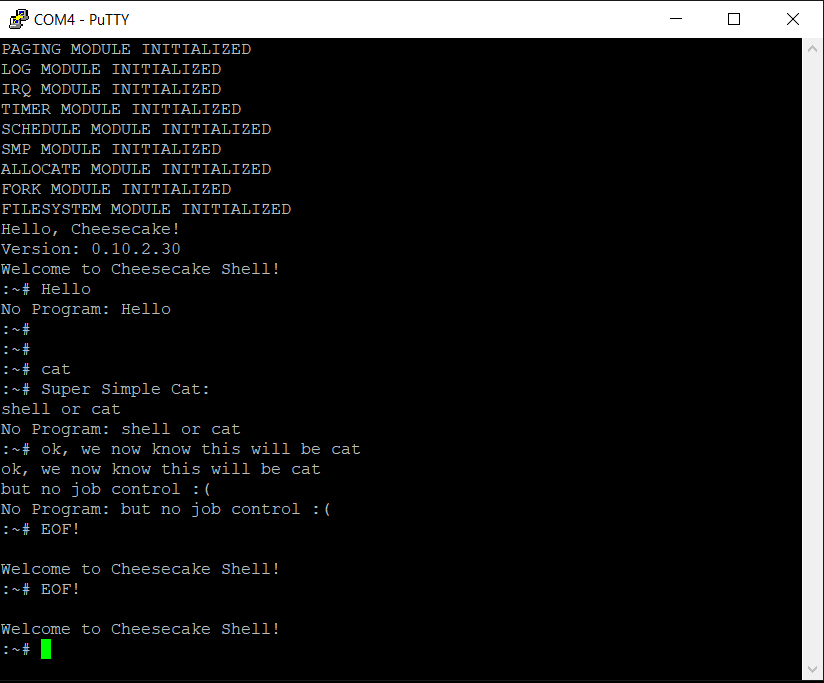

*Chapter Top* [Chapters[10]: The TTY Driver with File Abstraction](chapter10.md) | *Next Chapter* [Chapters[11]: Signals](../chapter11/chapter11.md)  
*Previous Page* [Reading](read.md) | *Next Page* [Chapters[11]: Signals](../chapter11/chapter11.md)

## Embryonic Shell ([chapter10/code2](code2))

#### Adding In More CPUs

The two cake threads we create during startup - one for the workqueue, and one for the user startup function - are both forked from the idle process on CPU 0. This process has a CPU mask of 0b0001, so it only runs on CPU 0. The workqueue and user startup function have the same CPU mask, and also run only on CPU 0. Let's consider these two processes to be _kernel services_. All other processes will be forked from the user startup process. We will leave CPU 0 for kernel services, but would like newly created processes to run on CPU 1, CPU 2, and CPU 3. This policy is coded into the `copy_arch_context` function from [arch/arm64/process.c](code2/arch/arm64/process.c):

```C
int copy_arch_context(unsigned long flags,
    unsigned long thread_input,
    unsigned long arg,
    struct process *p)
{
    struct stack_save_registers *ssr = PROCESS_STACK_SAVE_REGISTERS(p);
    memset(&(p->context), 0, sizeof(struct cpu_context));
    p->preempt_count = FORK_PREEMPT_COUNT;
    if(flags & CLONE_CAKETHREAD) {
        memset(ssr, 0, sizeof(*ssr));
        p->context.x19 = thread_input;
        p->context.x20 = arg;
        bitmap_zero(p->cpumask, NUM_CPUS);
        set_bit(p->cpumask, 0);
    }
    else {
        *ssr = *PROCESS_STACK_SAVE_REGISTERS(CURRENT);
        ssr->regs[0] = 0;
        if(arg) {
            ssr->sp = arg;
        }
        bitmap_fill(p->cpumask, NUM_CPUS);
        clear_bit(p->cpumask, 0);
    }
    p->context.pc = (unsigned long) __ret_from_fork;
    p->context.sp = (unsigned long) ssr;
    return 0;
}
```

As we are preparing for more processes to run on various CPUs, it is becoming more likely a user space process will be running when a timer or keyboard interrupt is triggered. With our super simple `cat` program, the user space process executes quickly, or sleeps in kernel space. We can't count on all programs to be so kind. We must update the `vectors` table to handle interrupts from `EL0`:

```C
.align 11
.globl vectors
vectors:
    __VECTABLE_ENTRY    __invalid_entry
    __VECTABLE_ENTRY    __invalid_entry
    __VECTABLE_ENTRY    __invalid_entry
    __VECTABLE_ENTRY    __invalid_entry
    __VECTABLE_ENTRY    __sync_el1h
    __VECTABLE_ENTRY    __irq_el1h
    __VECTABLE_ENTRY    __invalid_entry
    __VECTABLE_ENTRY    __invalid_entry
    __VECTABLE_ENTRY    __sync_el064
    __VECTABLE_ENTRY    __irq_el064
    __VECTABLE_ENTRY    __invalid_entry
    __VECTABLE_ENTRY    __invalid_entry
    __VECTABLE_ENTRY    __invalid_entry
    __VECTABLE_ENTRY    __invalid_entry
    __VECTABLE_ENTRY    __invalid_entry
    __VECTABLE_ENTRY    __invalid_entry
```

The `__irq_el064` implementation has no surprises:

```C
__irq_el064:
    __ENTRY_SAVE        0
    bl                  handle_irq
    __ENTRY_RESTORE     0
```

#### Clone And Exec System Calls

Creating more user space processes from our existing user startup process requires the `clone` and `exec` system calls to be available. Just as in the initalization of CheesecakeOS, clone is used to dynamically allocated a child process. The child will enter existence at `__ret_from_fork`, branch to `schedule_tail` for coherency, and then jump to the same location where the parent is continuing execution. At this point, execution can continue in the parent process. Or, the child can issue an `exec` on itself to provide itself with an entirely new execution context, and to run a seperate program.

In keeping with convention, the clone functionality is exposed with the `sys_clone` function, and `exec` functionality exposed with `sys_exec`. The functions are added to the `sys_call_table` in [arch/arm64/syscall.c](arch/arm64/syscall.c):

```C
#include "arch/syscall.h"

extern int sys_clone(unsigned long flags, unsigned long thread_input, unsigned long arg);
extern int sys_exec(void *user_function);
extern long sys_read(int fd, char *buffer, unsigned long count);
extern long sys_write(unsigned int fd, char *user, unsigned long count);

void * sys_call_table [NUM_SYSCALLS] __attribute__((__aligned__(PAGE_SIZE))) = {
    [0 ... NUM_SYSCALLS - 1] = 0,
    [SYSCALL_READ] = sys_read,
    [SYSCALL_WRITE] = sys_write,
    [SYSCALL_CLONE] = sys_clone,
    [SYSCALL_EXEC] = sys_exec
};
```

The `sys_` functions for `clone` and `exec` are simply wrappers around their `do_` siblings. The `clone` wrapper is provided in [src/fork.c](code2/src/fork.c):

```C
int sys_clone(unsigned long flags, unsigned long thread_input, unsigned long arg)
{
    return do_clone(flags, thread_input, arg);
}
```

While the `exec` wrapper lives in [src/exec.c](code2/src/exec.c):

```C
long sys_exec(int (*user_function)(void))
{
    return do_exec(user_function, 0);
}
```

The `exec` wrapper sets the `init` parameter to false, as discussed in the introduction to the exec function in [Chapter 8](../chapter08/exec.md).

#### C Library Utilities

If our objective is to create a shell-like program that can take input from a user and generate further actions, we need some basic parsing functionality. At the very least we will need to compare input strings to staticly allocated keys. In [arch/arm64/user/libc.c](code2/arch/arm64/user/libc.c), the `libc_strcmp` function will help us do just that:

```C
int libc_strcmp(const char *a, const char *b)
{
    while(*a && (*a == *b)) {
        a++;
        b++;
    }
    return *((const unsigned char *) a) - *((const unsigned char *) b);
}
```

The `libc_` is included in the name because the function is a part of the kernel image, and `C` programming language does not have namespaces. It avoids any potential conflicts with kernel function names.

```C
unsigned long libc_strlen(const char *s)
{
    unsigned long n;
    while(*s++) {
        n++;
    }
    return n;
}
```

The `libc_strlen` is another nice utility, especially for locating where to insert or remove a new line from the end of a string.

#### First Shell

This chapter ends with our first (and most basic) attempt at a shell application. Some of the features we have built up over the last several chapters that are required:
- IRQs
- Multiple CPUs and spin locks
- Dynamic allocation
- Scheduling
- Forking
- User space page tables
- System calls
- The TTY driver and line discipline

How far we've come! The `shell` function is implemented in [arch/arm64/user/shell.c](code2/arch/arm64/user/shell.c):

```C
#define STDIN       (0)
#define STDOUT      (1)
#define BUF_LEN     (0x100)

#define SHELL_PROMPT ":~# "

int libc_strcmp(const char *a, const char *b);
long libc_strlen(const char *s);

int clone(unsigned long flags);
int exec(void *user_function);
long read(int fd, char *buffer, unsigned long count);
long write(int fd, char *buffer, unsigned long count);

int cat();

int shell()
{
    int pid;
    unsigned int shell_prompt_len;
    char buf[BUF_LEN];
    char *shell_prompt;
    unsigned long len;
    shell_prompt = SHELL_PROMPT;
    shell_prompt_len = libc_strlen(shell_prompt) + 1;
    while(1) {
        write(STDOUT, "Welcome to Cheesecake Shell!\n", 30);
```

The `Cheesecake Shell` loudly and proudly welcomes the user at the top of the loop.

```C
        while(1) {
            write(STDOUT, shell_prompt, shell_prompt_len);
            len = read(STDIN, buf, BUF_LEN - 1);
```

In an inner loop, the shell emits the shell prompt, and issues a read to `STDIN`, where it will sleep waiting for user input.

```C
            if(!len) {
                write(STDOUT, "\n", 2);
                break;
            }
```

If read returns a length of zero (which happens if the user enters C-d at the beginning of a line), the shell prints a blank line and breaks out of the inner loop. In this case, control will return to the top of the out loop, and the user will be welcomed, again, to the Cheesecake Shell.

```C
            else {
                buf[len - 1] = '\0';
                if(!libc_strcmp(buf, "")) {
                    continue;
                }
```

If read returns with a string of some length, the user should have entered a line, and the newline character is replaced with the null terminator to faciliate comparision. If the user entered a empty newline, by just pressing enter, control simply returns to the top of the loop, as the newline will already have been echoed.

```C
                else if(!libc_strcmp(buf, "exit")) {
                    break;
                }
```

If the user types "exit\n" at the command line, the shell behaves the same as in the case of an EOF (C-d), the inner loop terminates, and the shell starts from the beginning of the outer loop, welcoming the user.

```C
                else if(!libc_strcmp(buf, "cat")) {
                    if((pid = clone(0)) == 0) {
                        exec(cat);
                    }
                    else if(pid < 0) {
                        write(STDOUT, "ERROR!\n", 8);
                    }
                }
```

The steak and potatoes of the shell function is executed in the case the user enters "cat\n" at the command line. In this case, the pid variable is assigned to the return value of the `clone` system call, called with empty flags. Remember, clone returns twice, once in the parent, once in the child. The return value in the parent on success is greater than zero, or, less than zero on failure. The return value is zero in the child. If the return value is greater than zero, the parent has done its work, and control continues to the top of the inner loop where the shell prompt is again emitted. An error message is printed if clone returns a value less than zero. In the case clone returns zero, we know the child process is running. From the child process, an exec call is made, giving `cat` as the user space function to set as the program counter. The call do `exec` does not return, but branches to the `cat` function after cretaing a new address space and execution context for the process.


```C
                else {
                    buf[len - 1] = '\n';
                    write(STDOUT, "No Program: ", 13);
                    write(STDOUT, buf, len);
                }
```

If the input string does not match any of the previous criteria, it represents a program the shell cannot run, and the user is notified.

The `shell` function ends with:

```
    return 0;
}
```

This to keep the compiler happy, as the shell applcation itself will never return.

Compiling and running our CheesecakeOS on your Raspberry Pi 4 will enable you to type commands into the first iteration of Cheesecake Shell. If you run the `cat` program, you may notice there is a problem! Both the shell and `cat` are competing for use of the TTY! When the shell issues a `read` call, it sleeps on the TTY waitqueue. The same is true for `cat`. So they are both sleeping on the waitqueue and waking up when the user presses enter. So they take turns back and forth, swapping ownership of the TTY buffer.



This is not the expected bahavior. Instead, we would expect to run the `cat` program in the _foreground_, while the shell relinquishes the TTY in the _background_. Our code does not allow for this yet, because we have not implemented any type of job control. Luckily, this is the subject of the [next chapter!](../chapter11/chapter11.md). See you there!

*Chapter Top* [Chapters[10]: The TTY Driver with File Abstraction](chapter10.md) | *Next Chapter* [Chapters[11]: Signals](../chapter11/chapter11.md)  
*Previous Page* [Reading](read.md) | *Next Page* [Chapters[11]: Signals](../chapter11/chapter11.md)
