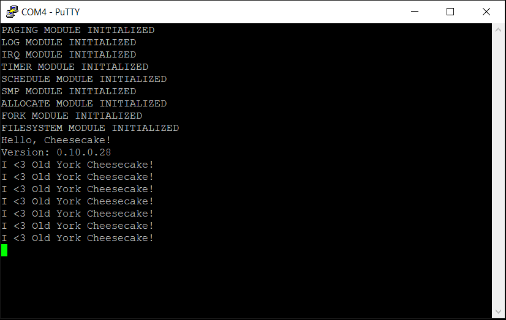

*Chapter Top* [Chapters[10]: The TTY Driver with File Abstraction](chapter10.md) | *Next Chapter* [Chapters[11]: Signals](../chapter11/chapter11.md)  
*Previous Page* [Chapters[10]: The TTY Driver with File Abstraction](chapter10.md) | *Next Page* [Reading](read.md)

## Writing ([chapter10/code0](code0))

#### The File Abstraction

A file is an abstract object representing a stream of bytes. The `struct file` structure is defined in [include/cake/file.h](code0/include/cake/file.h):

```C
#define MAX_OPEN_FILES      (16)

struct file {
    struct file_ops *ops;
    unsigned long flags;
    long pos;
    void *extension;
};

struct file_ops {
    int (*ioctl)(struct file *self, unsigned int request, unsigned long args);
    long (*read)(struct file *self, char *user, unsigned long n);
    long (*write)(struct file *self, char *user, unsigned long n);
    int (*open)(struct file *self);
    int (*close)(struct file *self);
};

struct folder {
    struct file *files[MAX_OPEN_FILES];
    unsigned int next;
    unsigned int openmap;
};
```

The file structure has two extensions. First, an embedded `struct file_ops` structure containing object specific implementations of generic file operations. The `struct file` is an object in the object-oriented sense. File objects are created with polymorphism in mind. This is what allows the `read`, `write`, and other system calls to be used with multiple types of file descriptors.

Second, each file has a generic extension pointer, aptly named `extension` to keep track of any extra information that may be needed to implement the file operations.

A `struct folder` is simply a table associating a small integer (what a user applications would know as a file descriptor) with a file object. A `next` pointer helpfully keeps track of the next file descriptor to be assigned, while the `openmap` is a small bitmap to track file descriptors that are already open. A process may have no more than sixteen file descriptors open as defined by the `MAX_OPEN_FILES` macro.

Each process now has an embedded `struct folder`, from [include/cake/process.h](code0/include/cake/process.h):

```C
struct process {
    unsigned int state;
    unsigned int pid;
    unsigned int priority;
    int tick_countdown;
    unsigned long runtime_counter;
    unsigned long *stack;
    long preempt_count;
    struct memmap *memmap;
    struct memmap *active_memmap;
    struct folder folder;
    struct list processlist;
    struct spinlock lock;
    struct cpu_context context;
    unsigned long cpumask[CPUMASK_SIZE];
};
```

#### Pretend File System

Using file objects without a file system seems a little silly. What, then, does each file object represent? In order to give each `struct file` something to represent, we are going to invent a pretend file system. It will be board-specific, and the parameters defined in [arch/arm64/board/raspberry-pi-4/include/board/filesystem.h](code0/arch/arm64/board/raspberry-pi-4/include/board/filesystem.h):

```C
#define RPI4_MINIUART_BASEFILE  (0)
#define DEVICE_RESERVATIONS     (1)
#define REGULAR_FILE_START      (1)
#define NUM_REGULAR_FILES       (4)
#define FILESYSTEM_SIZE         (5)
```

These numbers, called reservations, will be used to reference files where needed inside the kernel. Strings representing paths are not possible. The filesystem is statically allocated in [arch/arm64/board/raspberry-pi-4/filesystem.c](code0/arch/arm64/board/raspberry-pi-4/filesystem.c):

```C
static struct file device_files[DEVICE_RESERVATIONS];
static struct file regular_files[NUM_REGULAR_FILES];
static struct file *filesystem[FILESYSTEM_SIZE];

struct file **assign_filesystem()
{
    struct file *file;
    unsigned int inx = 0;
    for(unsigned int i = 0; i < DEVICE_RESERVATIONS; i++) {
        filesystem[inx++] = &(device_files[i]);
    }
    for(unsigned int i = 0; i < NUM_REGULAR_FILES; i++) {
        file = &(regular_files[i]);
        file->extension = alloc_pages(0);
        filesystem[inx++] = file;
    }
    return filesystem;
}
```

Five files are statically initalized in the `filesystem` array. The zeroth entry is a device file (which, you have already cleverly determined is likely for the mini uart device), which the remaining four are general purpose files. The `assign_filesystem` board-specific initalizer is called from `filesystem_init` in the [src/filesystem.c](code0/src/filesystem.c) module:

```C
static struct file **filesystem;

struct file *filesystem_file(unsigned int i)
{
    return filesystem[i];
}

void filesystem_init()
{
    filesystem = assign_filesystem();
    drivers_init();
}
```

The `filesystem_file` function can then be used to access a reservation by the integer number. The `filesystem_init` function is called from `init` in `cheesecake_main` in [src/cheesecake.c](code0/src/cheesecake.c). From `filesystem_init`, `drivers_init` also runs to complete driver setup. We will burrow into the drivers in a bit.

Now that some concept of a file system exists, even a pretend concept, it is possible to define an `open` operation so a process can manipulate a file. To wit, the `do_open` function in [src/file.c](code0/src/file.c) associates a file descriptor with a file:

```C
extern struct file *filesystem_file(unsigned int i);

int do_open(int file_reservation) {
    int fd;
    struct process *current;
    struct folder *folder;
    struct file *file;
    current = CURRENT;
    folder = &(current->folder);
    if(folder->openmap == OPEN_FULL_MASK) {
        return -1;
    }
```

If all file descriptors are in use, no file can be opened, and `-1` is returned to indicate failure.

```C
    file = filesystem_file(file_reservation);
    fd = folder->next;
    if(file->ops->open(file)) {
        folder->files[fd] = 0;
        fd = -1;
    }
```

A pointer to the `struct file` associated with the funtion's input argument is pulled from the filesystem module. The structure's open method runs. A truthy return value indicates failure, and the pointer is not added to the process's folder.

```C
    else {
        folder->files[fd] = file;
        FD_TOGGLE(folder->openmap, fd);
        for(int i = 0; i < MAX_OPEN_FILES; i++) {
            if(!FD_CHECK(folder->openmap, i)) {
                folder->next = i;
                break;
            }
        }
    }
    return fd;
}
```

If the `struct file`'s open call was successful, the folder map is updated with the reference. The file descriptor bit in the `openmap` is toggled on, and the value of the `next` file descriptor is setup for the next call to `do_open`.

The `do_open` function can be wrapped in a system call to allow for user space processes to access the general purpose file descriptors we have allocated. In this volume, the `open` system call is left unimplemented. The `do_open` functionality is put to use in the `startup_user` function is [arch/arm64/board/raspberry-pi-4/user.c](code0/arch/arm64/board/raspberry-pi-4/user.c):

```C
extern long do_exec(int (*user_function)(void), int init);
extern long do_open(int reserved_file);

int startup_user(void *user_function)
{
    do_exec(user_function, 1);
    do_open(RPI4_MINIUART_BASEFILE);
    do_open(RPI4_MINIUART_BASEFILE);
    return 0;
}
```

Now, in addition to the `do_exec` call to setup the user space process memory map, `do_open` is called twice with the `RPI4_MINIUART_BASEFILE` reservation. This will associate the mini uart device file with file descriptors `0` and `1`, or `STDIN` and `STDOUT`. If and when the user space process is forked, the child processes will get a copy of the process's `folder` field. The children will also have access to `STDIN` and `STDOUT`.

Also living in the [src/file.c](code0/src/file.c) module are the `sys_read` and `sys_write` functions, used within the kernel to service the `read` and `write` system calls. They are presented here with no further comment:

```C
long sys_read(unsigned int fd, char *user, unsigned long count)
{
    struct process *current = CURRENT;
    struct folder *folder = &(current->folder);
    struct file *file = folder->files[fd];
    if(FD_CHECK(folder->openmap, fd)) {
        return file->ops->read(file, user, count);
    }
    else {
       return -1;
    }
}

long sys_write(unsigned int fd, char *user, unsigned long count)
{
    struct process *current = CURRENT;
    struct folder *folder = &(current->folder);
    struct file *file = folder->files[fd];
    if(FD_CHECK(folder->openmap, fd)) {
        return file->ops->write(file, user, count);
    }
    else {
        return -1;
    }
}
```


#### TTY Structures

The file abstraction allows for clients to view blocks or streams of bytes generically. But all those file operations need concrete implementations. These implentations generally come from device drviers. Linux defines three types of hardware device:
1. Devices read and written with out buffering, called charcter devices
2. Devices read and written to in multiples of some block size and that implement buffering, called block devices
3. Newtork devices, which are special

So far, we have been interacting with the mini uart as if it is a character device. We will continue to do so, but we will insert a TTY abstraction layer between the user and the device. The TTY driver is this abstraction layer. The TTY driver is actually a collection of modules that attempt to properly partition software and hardware responsibility. The structures representing a TTY device are defined in [include/cake/tty.c](code0/include/cake/tty.c):

```C
struct tty {
    struct tty_ops *ops;
    struct tty_ldisc *ldisc;
    void *driver_data;
    void *disc_data;
    char termios[TERMIOS_MAX];
    unsigned int index;
    unsigned int open_count;
    struct waitqueue waitqueue;
};

struct tty_ops {
    int (*close)(struct tty *tty, struct file *file);
    int (*open)(struct tty *tty, struct file *file);
    int (*write)(struct tty *tty, unsigned char *buffer, unsigned int count);
};
```

The `struct tty` structure fields are:
- A pointer to `struct tty_ops` in the `ops` field, for lowest level implementation details
- A pointer to a line discipline structure, `ldisc`
- A generic pointer to `driver_data`
- A generic pointer to data for the line discipline, `disc_data`
- A map of special characters, in a `termios` array, terminal i/o settings
- The `index` of the tty in the device file block
- The number of open references to the TTY in `open_count`
- A `waitqueue` where processes can wait for the TTY to signal delivery of requests

A line discipline is used to handle higher level formatting for low level drivers. Notice the `tty_ops` operations include a `write` method, but not a `read` method. The idea is the lowest level of the driver knows how to take formatted characters and write them into a device. The line discipline is then capable of processing the raw characters from the device and formatting them for application use.

The line discipline is represented by a `struct tty_ldisc`:

```C
struct tty_ldisc {
    struct tty_ldisc_ops *ops;
    struct tty *tty;
};

struct tty_ldisc_ops {
    int (*close)(struct tty *tty);
    int (*ioctl)(struct tty *tty, unsigned int command, unsigned long arg);
    int (*open)(struct tty *tty);
    long (*read)(struct tty *tty, char *buffer, unsigned long count);
    int (*receive_buf)(struct tty *tty, char *buffer, unsigned int count);
    long (*write)(struct tty *tty, char *buffer, unsigned long count);
};
```

The final tie-in is a struct filled in by the concrete driver itself, in the board or device-specific code. A `struct tty_driver`:

```C
struct tty_driver {
    struct tty_ops *ops;
    unsigned int basefile;
    unsigned int num_devices;
};
```

When a TTY device is initalized it registers its `struct tty_driver` with the tty module, passing along the `tty_ops` to a `struct tty`.

#### The Lowest Level TTY Driver

The bottom layer of the TTY Driver is implemented in the mini uart source file, [arch/arm64/board/raspberry-pi-4/mini-uart.c](code0/arch/arm64/board/raspberry-pi-4/mini-uart.c). The mini uart hardware device will be responsible for reading and writing. The focus on this chapter is writing. Writing is a simpler operation. As we have seen throughout this volume, no user interaction is needed. Concern in this section will therefore be focused on the `struct tty_ops` operations:

```C
#include "cake/tty.h"

static int rpi4_miniuart_close(struct tty *tty, struct file *file);
static int rpi4_miniuart_open(struct tty *tty, struct file *file);
static int rpi4_miniuart_write(struct tty *tty, unsigned char *buffer, unsigned int count);


struct rpi4_miniuart {
    struct tty *tty;
} rpi4_miniuart;
static struct tty_ops rpi4_miniuart_ops = {
    .close = rpi4_miniuart_close,
    .open = rpi4_miniuart_open,
    .write = rpi4_miniuart_write
};
static struct tty_driver rpi4_miniuart_tty_driver = {
    .ops = &rpi4_miniuart_ops,
    .num_devices = 1
};
```

When a device file backed by the mini uart driver runs the open operation, `rpi4_miniuart_open` will execute:

```C
static int rpi4_miniuart_open(struct tty *tty, struct file *file)
{
    rpi4_miniuart.tty = tty;
    tty->driver_data = &rpi4_miniuart;
    return 0;
}
```

A back-pointer to the calling `struct tty` object is saved in `rpi4_miniuart.tty`, and a pointer to that object is offered as the driver data in response. The close operation nullifies the refernces:

```C
static int rpi4_miniuart_close(struct tty *tty, struct file *file)
{
    tty->driver_data = 0;
    rpi4_miniuart.tty = 0;
    return 0;
}
```

The `write` operation also proves simple:

```C
static int rpi4_miniuart_write(struct tty *tty, unsigned char *buffer, unsigned int count)
{
    char c;
    unsigned int i;
    for(i = 0; i < count; i++) {
        c = buffer[i];
        switch(c) {
            case '\n':
                uart_putchar('\r');
                uart_putchar('\n');
                break;
            default:
                uart_putchar(c);
                break;
        }
    }
    return i;
}
```

This `rpi4_miniuart_write` function seems to break the rule about formatting, by knowing too much about formatting. In the case of a newline character from an application, the driver inserts an extra carraige return. I'm unconvinced. Without the carraige return, the mini uart will not direct the terminal to advance to the next line. Seems a reasonable thing for the hardware to be defined at that hardware level.

In mini uart must be properly initalized into the kernel at boot time. Earlier, we saw that `drivers_init` was called from `filesystem_init`. The `drivers_init` function is board-specific, and lives in [arch/arm64/board/raspberry-pi-4/filesystem.c](code0/arch/arm64/board/raspberry-pi-4/filesystem.c):

```C
void drivers_init()
{
    rpi4_miniuart_init(RPI4_MINIUART_BASEFILE);
}
```

Here, `drivers_init` calls the mini uart init function, passing in the `RPI4_MINIUART_BASEFILE` reservation.

```C
int rpi4_miniuart_init(int reserved_file)
{
    rpi4_miniuart_tty_driver.basefile = reserved_file;
    register_tty_driver(&rpi4_miniuart_tty_driver);
    return 0;
}
```

The `rpi4_miniuart_tty_driver` object stores `RPI4_MINIUART_BASEFILE` as the basefile, and is passed along to the `register_tty_driver` function, defined in [src/tty.c](code0/src/tty.c):

```C
void register_tty_driver(struct tty_driver *driver)
{
    struct tty *tty;
    struct file *file;
    for(unsigned int i = driver->basefile; i < driver->num_devices; i++) {
        tty = cake_alloc(sizeof(*tty));
        tty->ops = driver->ops;
        tty->index = i - driver->basefile;
        tty->waitqueue.waitlist.prev = &(tty->waitqueue.waitlist);
        tty->waitqueue.waitlist.next = &(tty->waitqueue.waitlist);
        file = filesystem_file(i);
        file->ops = &tty_file_ops;
        file->extension = tty;
    }
}
```

For each device covered by the driver, the function:
1. Allocates a new `struct tty` object
2. Borrows the registered driver's `tty_ops` to use as its own
3. Initializes the `index` and `waitqueue` of the `struct tty`
4. Grabs the file reference and sets the operations equal to the module's `tty_file_ops` (covered lower)
5. Sets the file's extension reference to point to the newly allocated tty object

In this way, the lowest level functionality of the TTY driver is glued into the generic TTY module.

#### TTY Line Discipline

The TTY line discipline supplied by the CheesecakeOS kernel is generic, and follows the Linux `N_TTY` concept. It is possible for an implementation to use a different line discipline than the default, but for our purposes the default is convenient and will serve us alright.

The basic data flow from user to hardware device will walk along the path:

```
SYSTEM CALL => FILE OPERATION => TTY OPERATION => TTY LINE DISCIPLINE => TTY DRIVER
```

Picking up where we left off in the `register_device_driver` function:

```C
        file->ops = &tty_file_ops;
```

The relevent device files have generic operations concretely implemented by the `tty_file_ops`. This structure, along with the rest of the kernel' generic TTY code is defined in [src/tty.c](code0/src/tty.c):

```C
static struct file_ops tty_file_ops = {
    .close = tty_close,
    .open  = tty_open,
    .write = tty_write
};
```

Begining again, with the open functionality, `tty_open`:

```C
static struct tty_ldisc_ops n_tty_ldisc_ops = {
    .close = n_tty_close,
    .open = n_tty_open,
    .write = n_tty_write
};

static int tty_open(struct file *file)
{
    int ret;
    struct tty *tty = file->extension;
    ret = tty->ops->open(tty, file);
    if(!tty->ldisc) {
        struct tty_ldisc *ldisc = cake_alloc(sizeof(struct tty_ldisc));
        ldisc->ops = &n_tty_ldisc_ops;
        ldisc->tty = tty;
        tty->ldisc = ldisc;
        ldisc->ops->open(tty);
    }
    tty->open_count++;
    return ret;
}
```

When `do_open` runs with a file reservation corresponding to a TTY device file, `tty_open` is called. From registering the device drivers at startup, the file should have a `struct tty` saved in its extension pointer. If no line discipline has yet been allocated to the `struct tty`, a new one is created dynamically, and initalized with the `n_tty_ldisc_ops` from this TTY module. A call to `n_tty_open` is a no-op for now, this function is expanded in the next section.

```C
static int tty_close(struct file *file)
{
    struct tty *tty = file->extension;
    --tty->open_count;
    if(!tty->open_count) {
        tty->ldisc->ops->close(tty);
        cake_free(tty->ldisc);
    }
    return tty->ops->close(tty, file);
}

static int n_tty_close(struct tty *tty)
{
    struct n_tty_data *ldata;
    ldata = tty->disc_data;
    cake_free(ldata);
    return 0;
}
```

The `tty_close` function (not used in this volume), cleans up the allocations made during `tty_open`.

```C
#define N_TTY_BUF_SIZE      (4096)

static long tty_write(struct file *file, char *user, unsigned long n)
{
    unsigned int count;
    unsigned long written = 0;
    struct tty *tty = file->extension;
    struct tty_ldisc *ld = tty->ldisc;
    char *cake_buffer = cake_alloc(N_TTY_BUF_SIZE);
    if(!cake_buffer) {
        return - 1;
    }
    while(written < n) {
        count = n - written;
        if(count > N_TTY_BUF_SIZE) {
            count = N_TTY_BUF_SIZE;
        }
        copy_from_user(cake_buffer, user, count);
        count = ld->ops->write(tty, cake_buffer, count);
        user += count;
        written += count;
    }
    cake_free(cake_buffer);
    return written;
}
```

The `tty_write` and `n_tty_write` functions are part of a chain that best illustrates the layering from system call to device driver described earlier. The `write` system call will access the `write` file operation from the mini uart device file, implemented by `tty_write`. 

The TTY module `tty_write` function:
- Accepts a user space character buffer as input
- Establishes a references to a `struct tty` from the `struct file`
- Establishes a reference to the line discipline object, `struct tty_ldisc` from the `struct tty`
- Allocates a buffer of size `N_TTY_BUF_SIZE`
- Iterates in chuncks of `N_TTY_BUF_SIZE` to
  - Copy the user space buffer into the kernel space buffer (see more below)
  - Pass the kernel buffer along to the line discipline in `n_tty_write` (see more below)

As part of the `tty_write` operation, the user space buffer is copied into a dynamically allocated kernel buffer, rather than passing the user buffer directly to the line discpline write function. It is standard practice to copy buffers from user space to kernel space in a controlled way. Blindly chasing unchecked userspace pointers is profane. The function to copy to and from user space are included from [include/cake/user.h](code0/include/cake/user/h):

```C
static inline int outside_bounds(unsigned long cake, unsigned long user, unsigned long count)
{
   return ((user + count)) >= STACK_TOP || (cake < STACK_TOP);
}

static inline unsigned long copy_from_user(void *cake, void *user, unsigned long count) {
    if(outside_bounds((unsigned long) cake, (unsigned long) user, count)) {
        return count;
    }
    return COPY_FROM_USER(cake, user, count);
}

static inline unsigned long copy_to_user(void *user, void *cake, unsigned long count) {
    if(outside_bounds((unsigned long) cake, (unsigned long) user, count)) {
        return count;
    }
    return COPY_TO_USER(user, cake, count);
}
```

Both `copy_to_user` and `copy_from_user` do simple bounds checking of the pointer addresses, and return non-zero on failure. In the `arm64` implementation, both `COPY_FROM_USER` and `COPY_TO_USER` are macros resolving to `memcpy` ([arch/arm64/include/arch/user.h](code0/arch/arm64/include/arch/user.h)).

Back in the TTY module, in the `n_tty_write` function, the kernel buffer is simply passed along to the low level driver for writing:

```C
static long n_tty_write(struct tty *tty, char *buffer, unsigned long count)
{
    char *b = buffer;
    unsigned long written;
    while(count) {
        written = tty->ops->write(tty, (unsigned char *) b, count);
        count -= written;
        b += written;
    }
    return b - buffer;
}
```

Before wrapping up in user space, one consequence of our additional features. Since now a user space buffer is accepted into, and referenced from kernel space, the `TTBR0_EL1` PGD will be used for lookups. The user space buffer may not be totally mapped in the PGD. Just as in user space, the translation tables for this buffer need to be allocated on demand. We need to update our exception handling from `__sync_el1h` in [arch/arm64/entry.S](code0/arch/arm64/entry.S) to handle page faults from `EL1`:

```C
__sync_el1h:
    __ENTRY_SAVE    1
    mrs             x1, esr_el1
    lsr             x24, x1, #ESR_ELx_EC_SHIFT
    cmp             x24, #ESR_ELx_EC_DABT_CUR
    b.eq            __el1_da
    cmp             x24, #ESR_ELx_EC_IABT_CUR
    b.eq            __el1_ia
    mrs              x0, esr_el1
    mrs              x1, far_el1
    bl              handle_sync
    b               __invalid_entry

__el1_ia:
__el1_da:
    mrs                 x0, far_el1
    mov                 x2, sp
    bl                  __irq_enable
    bl                  mem_abort
    bl                  __irq_disable
    __ENTRY_RESTORE     1
```

The handler scheme is the same as for exceptions from `EL0`.

#### Write System Call

The `sayhello` program in [arch/arm64/user/sayhello.c](code0/arch/arm64/user/sayhello.c) has been updated to use a new system call, `write`:

```C
#define STDIN   (0)
#define STDOUT  (1)

extern long usloopsleep();
extern long write(int fd, char *buffer, unsigned long count);

int say_hello()
{
    while(1) {
        write(STDOUT, "I <3 Old York Cheesecake!\n", 27);
        usloopsleep();
    }
    return 0;
}
```

Following the step outline in [Chapter Nine](../chapter09/syscall.h) about adding new system calls, `read` and `write` calls have been added to [arch/arm64/user/libc.c](code0/arch/arm64/user/libc.c) (TTY-side read to be implemented in the next section):

```C
extern long __read(int fd, char *buffer, unsigned long count);
extern long __write(int fd, char *buffer, unsigned long count);

long read(int fd, char *buffer, unsigned long count)
{
    return __read(fd, buffer, count);
}

long write(int fd, char *buffer, unsigned long count)
{
    return __write(fd, buffer, count);
}
```

The system call routines are defined in [arch/arm64/user/libc.S](code0/arch/arm64/user/libc.S):

```asm
#include "user/syscall.h"

.globl __read
__read:
    mov     w8, SYSCALL_READ
    svc     0x0
    ret

.globl __write
__write:
    mov     w8, SYSCALL_WRITE
    svc     0x0
    ret
```

The system call numbers added in [arch/arm64/user/include/user/syscall.h](code0/arch/arm64/user/include/user/syscall.h):

```C
#define SYSCALL_ZERO_RESERVED   (0)
#define SYSCALL_READ            (1)
#define SYSCALL_WRITE           (2)
#define SYSCALL_USLOOPSLEEP     (3)
#define NUM_SYSCALLS            (4)
```

And finally, the the system call indexes add to the `sys_call_table` in [arch/arm64/syscall.c](code0/arch/arm64/syscall.c):

```C
extern long sys_read(int fd, char *buffer, unsigned long count);
extern long sys_usloopsleep();
extern long sys_write(unsigned int fd, char *user, unsigned long count);

void * sys_call_table [NUM_SYSCALLS] __attribute__((__aligned__(PAGE_SIZE))) = {
    [0 ... NUM_SYSCALLS - 1] = 0,
    [SYSCALL_READ] = sys_read,
    [SYSCALL_WRITE] = sys_write,
    [SYSCALL_USLOOPSLEEP] = sys_usloopsleep
};
```

Now, given the `write` system call in the `say_hello` function:

```C
write(STDOUT, "I <3 Old York Cheesecake!\n", 27);
```

You know that `STDOUT` represents a pointer to a `struct file` in the `CURRENT` process's folder. The `sys_write` function will invoke:

```C
    file->ops->write(file, "I <3 Old York Cheesecake\n", 27);
```

Which will, in reality, be a call to `tty_write`. From there `tty_write` will invoke `n_tty_write` from its line discipline operations, and `n_tty_write` will call `rpi4_miniuart_write` from the `struct tty`'s `struct tty_ops`. Finally, `rpir_miniuart_write` will call the `uart_puts` function to write each character to the peripheral.

You will then be none surprised when you build the CheesecakeOS image, load it onto the Raspberry Pi 4, boot the computer, and see this in your terminal:



*Chapter Top* [Chapters[10]: The TTY Driver with File Abstraction](chapter10.md) | *Next Chapter* [Chapters[11]: Signals](../chapter11/chapter11.md)  
*Previous Page* [Chapters[10]: The TTY Driver with File Abstraction](chapter10.md) | *Next Page* [Reading](read.md)
