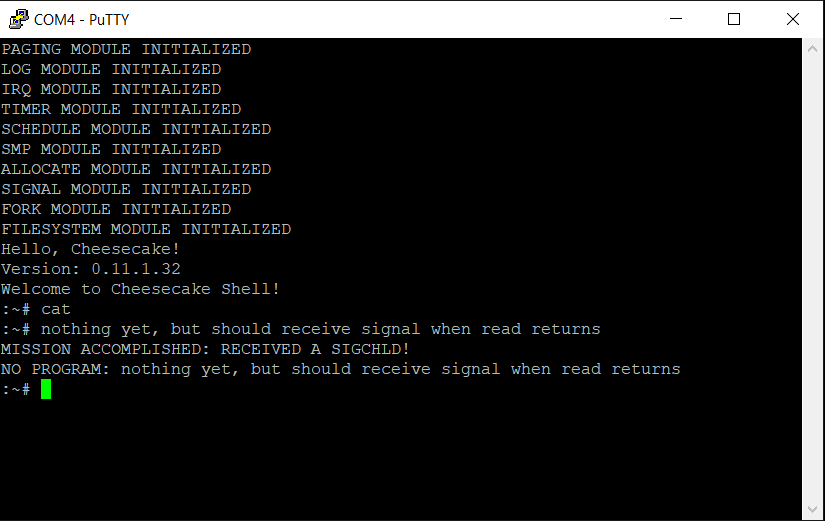

*Chapter Top* [Chapters[11]: Signals](chapter11.md) | *Next Chapter* [Chapters[12]: The Shell](../chapter12/chapter12.md)  
*Previous Page* [Sending](sending.md) | *Next Page* [Chapters[12]: The Shell](../chapter12/chapter12.md)

## Receiving ([chapter11/code1](code1))

#### Shell Signal Handler

In this slice, we tackle signals from the receiving side. The most interesting and complex aspects of signals concerns custom user signal handlers. Signal handlers are user space functions, but they run asynchronously, and are _called_ from kernel space. This means the kernel must again save and (often) restore the context of a process receiving the signal, but now within the user stack area. After being called from the kernel, the signal handler runs in user space. Eventually, the signal handler returns, and must return to the application with the restored context to continue running consistently.

We will work backwards, starting from the shell, implementing the system calls necessary to register a custom signal handler with the kernel. In [arch/arm64/user/shell.c](code1/arch/arm64/user/shell.c), three new functions, two of them system calls are declared:

```C
int libc_sigaddset(unsigned long *set, int signo);

int signal(int signo, void (*fn)(int));
int sigprocmask(unsigned long how, unsigned long *newset, unsigned long *oldset);
```

The `libc_sigaddset` function is a user space convenience function for adding a signal to a set of signals - a 32-bit bitmap. Defined in [arch/arm64/user/libc.c](code1/arch/arm64/user/libc.c):

```C
int libc_sigaddset(unsigned long *set, int signo)
{
    *set |= (1 << signo);
    return 0;
}
```

The `sigprocmask` system call allows a user space application to manipulate the kernel `struct signal` `blocked` bitmap. The options for the `how` argument are defined in [arch/arm64/user/include/user/signal.h](code1/arch/arm64/user/include/user/signal.h):

```C
#define SIG_BLOCK       (0)
#define SIG_UNBLOCK     (1)
#define SIG_SETMASK     (2)
```

The `how` argument determines the way in which `newset` is interpreted:
- `SIG_BLOCK` requests the current `blocked` bitmap be `orr`ed with `newset`
- `SIG_UNBLOCK` requests the current `blocked` bitmap be `and-not`ed with `newset`
- `SIG_SETMASK` requests `blocked` be set to `newset`

The current `blocked` bitmap is then stored in `oldset` so the user application can, if desired, restore the state of the `blocked` signals with another call to `sigprocmask`. The implementation of the system call lives in [src/signal.c](code1/src/signal.c):

```C
int sys_sigprocmask(unsigned long how, unsigned long *newset, unsigned long *oldset)
{
    int err = 0;
    unsigned long n, *o;
    struct process *current = CURRENT;
    struct spinlock *lock = &(current->signal->lock);
    if(newset) {
        copy_from_user(&n, newset, sizeof(*newset));
    }
    o = (current->signal->blocked);
    if(oldset) {
        copy_to_user(oldset, o, sizeof(*oldset));
    }
    SPIN_LOCK(lock);
    switch(how) {
        case SIG_BLOCK:
            *o |= n;
            break;
        case SIG_UNBLOCK:
            *o &= (~n);
            break;
        case SIG_SETMASK:
            *o = n;
            break;
        default:
            err = -1;
            break;
    }
    SPIN_UNLOCK(lock);
    return err;
}
```

The notable feature of the implementation is the calls to `copy_from_user` and `copy_to_user` - just as with the buffers in the TTY module, whenever information is passed between user space and kernel space barriers, these functions are used for basic bounds checking.

The `signal` system call associates a user-defined signal handler with a signal. The implementation of the system call, in [arch/arm64/user/libc.c](code1/arch/arm64/user/libc.c), does more than fall through to the assembly `svc` call:

```C
int signal(int signo, void (*fn)(int))
{
    struct sigaction sigaction;
    sigaction.restore = __sigreturn;
    sigaction.fn = fn;
    return __sigaction(signo, &sigaction, 0);
}
```

The `signal` function allocates a `struct sigaction` on the stack, and directs the `fn` member to reference the signal handler. As both a convenience, and a constraint, the user applications does not set the `restore` member or the `flags`, but the _C_-library function handles this for us. The `restore` field points to the `__sigreturn` routine, a system call. Thus, when the user space signal handler is ready to return, it will jump to a location that forces re-entry into the kernel. The kernel can then manage the restoration of the user space application execution context.

The `__sigaction` routine is another system call, also implemented in [src/signal.c](code1/src/signal.c):

```C
int sys_sigaction(int signo, struct sigaction *sigaction, struct sigaction *unused)
{
    struct sigaction *target;
    struct process *current = CURRENT;
    struct signal *signal = current->signal;
    SPIN_LOCK(&(current->signal->lock));
    target = &(signal->sighandler.sigaction[signo - 1]);
    copy_from_user(target, sigaction, sizeof(*sigaction));
    SPIN_UNLOCK(&(current->signal->lock));
    return 0;
}
```  

A reference to the `sigaction` is stored in the index or the `struct signal`'s `struct sighandler`'s `sigaction` table, corresponding to the given `signo`.

We pull these features together in our shell application. We declare and define a signal handler for the `SIGCHLD` signal:

```C
static void sigchld_handler(int signo);

void sigchld_handler(int signo)
{
    write(STDOUT, "MISSION ACCOMPLISHED: RECEIVED A SIGCHLD!\n", 43);
}
```

We register this signal handler with the kernel:

```C
    signal(SIGCHLD, sigchld_handler);
```

We create a signal mask containing the `SIGCHLD` signal. Another signal variable is allocated space on the stack, `prev_mask`:

```C
    unsigned long mask, prev_mask;
    mask = 0;
    libc_sigaddset(&mask, SIGCHLD);
```

After the shell receives a command, having returned from `read`, the shell does not want to be interrupted by `SIGCHLD` signals. During this processing phase, managed state of the structures tracking child processes may be updated, and allowing `SIGCHLD` signals may introduce concurrency bugs. After the input command is processed, the shell then _unblocks_ `SIGCHLD` signals by restoring the previous `blocked` mask:

```C
            len = read(STDIN, buf, BUF_LEN - 1);
            if(!len) {
                write(STDOUT, "\n", 2);
                break;
            }
            else {
                sigprocmask(SIG_BLOCK, &mask, &prev_mask);
                buf[len - 1] = '\0';
                if(!libc_strcmp(buf, "")) {
                    continue;
                }
                else if(!libc_strcmp(buf, "exit")) {
                    break;
                }
                else if(!libc_strcmp(buf, "cat")) {
                    if((pid = clone(0)) == 0) {
                        exec(cat);
                    }
                    else if(pid < 0) {
                        write(STDOUT, "ERROR DURING FORK!\n", 20);
                    }
                }
                else {
                    buf[len - 1] = '\n';
                    write(STDOUT, "NO PROGRAM: ", 13);
                    write(STDOUT, buf, len);
                }
            }
            sigprocmask(SIG_SETMASK, &prev_mask, 0);
        }
```

#### Processing Pending Signals

Now that we have coded our shell to handle `SIGCHLD` signals, we want our application to receive these signals so our signal handler can be exercised. In the previous section, we setup the `check_and_process_signals` function on each return to user space. This function will handle saving and restoring the process state, as well as determining how to select a signal handler to run when signals are pending.

Before diving into the user stack manipulation required to handle signals, let us continue to work backwards with the implementation of the `get_signal` function, which will inform `check_and_process_signals` of which signal handler to run. While `check_and_process_signals` is an `arm64` architecture-specific function, `get_signal` is generic, defined in [src/signal.c](code1/src/signal.c). As the function is a bit breathy, we will step through in smaller pieces:

```C
int get_signal(struct cakesignal *csig)
{
    int signo;
    struct sighandler *sighandler;
    struct sigaction *sigaction;
    struct process *current = CURRENT;
    struct signal *signal = current->signal;
start:
    SPIN_LOCK(&(signal->lock));
```

In the signature of the function is a new structure we have not yet encountered. The `struct cakesignal` is newly defined in [include/cake/signal.h](code1/include/cake/signal.h):

```C
struct cakesignal {
    struct sigaction sigaction;
    struct siginfo info;
    int signo;
};
```

The structure will be passed in from the `check_and_process_signals` function, and is used to pull data into the caller, such as which signal hander to run in the `sigaction` field.

Otherwise, the `get_signal` function begins with a `start` label, and acquires the current process's `struct signal` lock, to protect against concurrent access from `do_kill` and others.

```C
    if(signal->flags & SIGNAL_FLAGS_CONTINUED) {
        signal->flags &= ~SIGNAL_FLAGS_CONTINUED;
        SPIN_UNLOCK(&(signal->lock));
        signal_parent_stop(current, SIGNAL_FLAGS_CONTINUED);
        goto start;
    }
```

In the case the `flags` field of the `struct signal` indicates the process has received a `SIGCONT`, the parent of the process receives a notification, and execution returns to `start`. In this way, `send_signal` and `get_signal` are consistent in that `SIGCONT` signals are handled implicitly, the corresponding `pending` and `blocked` bits are never processed explicitly. We will investigate this `signal_parent_stop` ingredient and the parent relationship a little later.

```C
    while(1) {
        signo = dequeue_signal(current, signal->blocked, &(csig->info));
        if(!signo) {
            break;
        }
```

The function enters an infinite loop for processing pending signals. Each signal is dequeued from the set of pending signals, one at a time. The `dequeue_signal` function returns the signal to be processed, and fills in the `info` field of the `struct cakesignal`. If there are no pending signals to be processed, taking into account the set of blocked signals, the function returns zero, and the loop and function end:

```C
static int dequeue_signal(struct process *p, unsigned long *blocked, struct siginfo *info)
{
    int signo;
    unsigned long x;
    struct sigqueue *q;
    unsigned long *pending = p->signal->pending;
    struct list *l = &(p->signal->signallist);
    x = *pending &~ (*blocked);
    if(!x) {
        return 0;
    }
```

In `dequeue_signal`, the bitmap of `pending` signals is compared against the bitmap of `blocked` signals. If a signal is eligible to be processed, it will be set in the `pending` bitmap and _not_ set in the `blocked` bitmap. If the `and` of the `pending` bitmap with the `not` `blocked` bitmap gives a value of zero, no signal will be processed, the function returns zero.

```C
signo = __builtin_ctzl(x);
```

If there is a signal to be processed, the `__buildin_ctzl` function, the GCC built-in for count-trailing-zeros will find the lowest set-bit, which we take as the highest priority signal. 

```C
    LIST_FOR_EACH_ENTRY(q, l, list) {
        if(q->info.signo == signo) {
                break;
        }
    }
    memcpy(info, &(q->info), sizeof(*info));
    signal_clear(p->signal, SIGMASK(signo));
    return signo;
}
```

Signals of the same type do not queue, so only one signal in the `signallist` will have a signal number equal to the `signo` of the dequeued. A limited number of signals means it is ok to search linearly. When the matching queue object is found, the `info` field is copied into the `info` argument. The dequeued signal is cleared before returning to `get_signal`.

```C
        sighandler = &(signal->sighandler);
        sigaction = &(sighandler->sigaction[signo - 1]);
        if(sigaction->fn == SIG_IGN) {
            continue;
        }
        if(sigaction->fn != SIG_DFL) {
            csig->sigaction = *sigaction;
            break;
        }
```

Back in `get_signal`, the `sigaction` function in the `sighandler` `sigaction` table is probed for a match of one of two possibilities - should the signal be ignored, or should a default action be taken? The `SIG_IGN` and `SIG_DFL` macros are defined in [include/cake/signal.h](code1/include/cake/signal.h):

```C
#define SIG_IGN         ((void *) (0))
#define SIG_DFL         ((void *) (1))
```

If the function of the `struct sigaction` for the dequeue signal is equal to `SIG_IGN`, the signal is ignored, and `get_signal` properly continues to the top of the loop. In the case the function is _not_ the default action, it means a user-defined signal handler needs to run. In this case, kernel processing has completed, the action reference is copied into the `struct cakesignal`'s sigaction field, and the loop ends. When both of these if-clauses are false, `get_signal` can proceed with the default kernel actions for this signal:

```C
        if(SIGMASK(signo) & (STOP_SIGNALS_MASK)) {
            signal->flags = SIGNAL_FLAGS_STOPPED;
            current->state = PROCESS_STATE_STOPPED;
            SPIN_UNLOCK(&(signal->lock));
            signal_parent_stop(current, SIGNAL_FLAGS_STOPPED);
            schedule_self();
            goto start;
        }
        SPIN_UNLOCK(&(signal->lock));
        do_exit(signo);
```

The signal can either be a stop signal, or a fatal signal. In the the former case, the `SIGNAL_FLAGS_STOPPED` flags are set, the parent is notified of the stop, and the process halts further execution by yielding in `schedule_self`. If the process receives a continue signal, it will return from `schedule_self`, and jump to the `start` label.

If the dequeued signal is not a stop signal, it is a fatal signal, and the process must exit. The lock is released, and the signal number passed along to `do_exit` as the `exitcode`.

```C
    SPIN_UNLOCK(&(signal->lock));
    csig->signo = signo;
    return signo > 0;
}
```

After the `get_signal` loop terminates, the lock is released, and the dequeued signal is communicated through the `struct cakesignal`. If a valid signal was dequeued, the function returns true, false otherwise.

Two thus-far unanswered questions. Which signals are ignored, and how is the `sigaction` table initialized with `SIG_IGN` or `SIG_DFL`? In [src/fork.c](code1/src/fork.c), the `copy_signal` function now initialize the table based on the kernel rules:

```C
    for(int i = 0; i < NUM_SIGNALS; i++) {
        signal->sighandler.sigaction[i].fn = SIG_DFL;
    }
    signal->sighandler.sigaction[SIGCHLD - 1].fn = SIG_IGN;
```

The rule implied by the initialization is all signals will execute in the `SIG_DFL` path, with the exception of `SIGCHLD`, which is ignored by default. We have also seen that `SIGCONT` is handled implicitly. In our example, we have defined a `SIGCHLD` handler, which overwrites the `SIG_IGN`.

#### Signal Stack

It is clear how the kernel selects, communicates, possibly executes the signal to handle and the corresponding signal handler. If the signal handler is a user defined handler, `check_and_process_signals` is responsible for setup and execution of the custom handler. Let's take a look at the implementation of the `check_and_process_signals` function:

```C
void check_and_process_signals(struct stack_save_registers *ssr)
{
    unsigned long x0;
    struct cakesignal csig;
    if(ssr->syscalln) {
        ssr->syscalln = 0;
        x0 = ssr->regs[0];
        if(x0 == -ERESTARTSYS) {
            ssr->regs[0] = ssr->orig_x0;
            ssr->pc -= INSTRUCTION_SIZE;
        }
    }
    while(get_signal(&csig)) {
        run_user_sighandler(ssr, &csig);
    }
}
```

Let us try to wrap our heads around the logic. The function takes as an argument a pointer to the kernel stack area where important process state is saved. We ask if the `check_and_process_signals` function is in the return path of a system call. A few crucial updates to the existing paradigm facilitate such a query.

First, the `struct stack_save_registers` structure has two new fields appended in [arch/arm64/include/arch/process.h](code1/arch/arm64/include/arch/process.h):

```C
struct stack_save_registers {
    u64  regs[31];
    u64  sp;
    u64  pc;
    u64  pstate;
    u64  orig_x0;
    u64  syscalln;
};
```
The `syscalln` field stores the system call number when returning from a system call. The `orig_x0` field contains the value of `x0` before a system call executes. A system call can be rerun with the correct state if necessary. When a system call returns normally, the `x0` register space in the `struct stack_save_registers` is setup for return in `__ret_from_syscall` routine. All other registers are left untouched.

Consider the case where the `cat` program executes and wants to issue a `read`. Imagine also that `cat` is not the `pid_leader`, so the TTY job control will send a signal to the `cat` process. But in order for the signal to be received, the system call must return. Further, we don't want `cat` to actually sleep on the TTY resource. So the system call must return without success, but it _also_ must be possible to rerun the system call again if and when `cat` does get to be the `pid_leader` of the TTY. This is what is going on with the check for the `-ERESTARTSYS` return value, and the restoration of pre-system call state.

By default, in `__ENTRY_SAVE` from [arch/arm64/entry.S](code1/arch/arm64/entry.S), the `syscalln` field is set to zero:

```C
        .if \el == 0
        mrs     x21, sp_el0
        str     xzr, [sp, #SSR_SYSCALLN]
```

The field is initialized in the `__el0_svc` handler:

```C
__el0_svc:
    adrp    x27, sys_call_table
    uxtw    x26, w8
    mov     x25, #NUM_SYSCALLS
    stp     x0, x26, [sp, #SSR_ORIG_X0]
```

The `stp` saves both the original `x0` in the case a rerun is needed, and the system call number from `x26`.

After determining if a system call needs to be rerun, execution proceeds with the looping call to `get_signal`, which returns true if a user defined signal handler should run. If so, the user space stack must be manipulated to allow for the asynchronous signal handler execution. The magic is defined in `run_user_sighandler`:

```C
static void run_user_sighandler(struct stack_save_registers *ssr, struct cakesignal *csig)
{
    unsigned long sp;
    struct aarch64_ctx *aactx;
    struct user_layout user;
    struct user_frame *frame;
    struct process *current = CURRENT;
    unsigned long *blocked = current->signal->blocked;
    int signo = csig->signo;
```

The `run_user_sighandler` function takes two arguments, the pointer to beginning of the saved program state on the kernel stack, and the `struct cakesignal` reference with data about how to handle a specific signal. We encounter new structures, defined only for the purpose of signal handling. Starting with the `struct user_layout`:

```C
struct user_record {
    u64 fp;
    u64 lr;
};

struct user_layout {
    struct user_frame *frame;
    struct user_record *record;
    unsigned long size;
    unsigned long limit;
    unsigned long end_offset;
};
```

The `struct user_layout` structure is a helper structure to organize the signal stack setup:
- The `frame` member contains a pointer to a `struct user_frame`, the representation of a stack frame laid out on the stack, and the address points to the bottom of the frame
- The `record` member points to a sixteen-byte space above the frame where the frame pointer and link register are stored for managing the stack discipline
- The `size`, `limit`, and `end_offset` members ensure that any space allocated beyond pre-defined structures does not overflow
  - An example of extra space would be for the floating point registers
  - We do not utilize the extra space in this volume

The `struct user_frame` is a large composed structure, though it is never explicitly allocated, only implicitly laid out on the user stack:

```C
struct user_sigcontext {
    u64 fault_address;
    u64 regs[31];
    u64 sp;
    u64 pc;
    u64 pstate;
    u8 reserved[4096] __attribute__((__aligned__(16)));
};

struct user_context {
    unsigned long uc_flags;
    struct user_context  *uc_link;
    unsigned long uc_stack;
    unsigned long uc_sigmask;
    u8 unused[(1024 / 8) - sizeof(unsigned long)];
    struct user_sigcontext uc_mcontext;
};

struct user_frame {
    struct siginfo info;
    struct user_context context;
};
```

> Note: The structures explained here are taken from the Linux Kernel. There are many fields which we will not use, but are included for educational and reference purposes. You can view the Linux definitions in the kernel source file [arch/arm64/kernel/signal.c](https://github.com/torvalds/linux/blob/v4.20/arch/arm64/kernel/signal.c) and buried within the various include files. See, especially, the note in the `struct ucontext` about the unused bytes due to the size of the GCC `sigset_t`.

Now the signal stack structures have been properly introduced, we continue with the `run_user_sighandler` implementation. As we do, we also keep track of an example user stack. The top of a user space application's stack is at 0x0000FFFFFFE00000, one `SECTION_SIZE` below the top of the user address space. One page below this is the address 0x0000FFFFFFDFF000. We will imagine our stack points here, i.e., this is the value of `ssr->sp`:

```
┌────────────────┬────────────────────────┬───────────────────────────────────────────────────┐
│ 0xFFFFFFE00000 │ Top of User Stack      │ ************************************************* │
├────────────────┼────────────────────────┼───────────────────────────────────────────────────┤
│  ****          │ ********************** │ ************************************************* │
├────────────────┼────────────────────────┼───────────────────────────────────────────────────┤
│ 0xFFFFFFDFFC00 │ More Stack Saved State │ ************************************************* │
├────────────────┼────────────────────────┼───────────────────────────────────────────────────┤
│  ****          │ ********************** │ ************************************************* │
├────────────────┼────────────────────────┼───────────────────────────────────────────────────┤
│ 0xFFFFFFDFF040 │ Frame Pointer Value    │ 0xFFFFFFDFFF80 ("main"'s Frame Pointer)           │
├────────────────┼────────────────────────┼───────────────────────────────────────────────────┤
│  ****          │ ********************** │ ************************************************* │
├────────────────┼────────────────────────┼───────────────────────────────────────────────────┤
│ 0xFFFFFFDFF008 │ *********************  │ 0x0000003C5808 (Calling Function's Link Register) │
├────────────────┼────────────────────────┼───────────────────────────────────────────────────┤
│ 0xFFFFFFDFF000 │ Current Stack Pointer  │ 0xFFFFFFDFF040 (Calling Function's Stack Pointer) │
└────────────────┴────────────────────────┴───────────────────────────────────────────────────┘
```

Stack frames are linked together by frame pointers, stored, as per the ARM calling convention, in `x29`. If you examine a compiled function, you will see it generally begins with:

```asm
stp     x29, x30, [sp,#-IMMEDIATE]!
mov     x29, sp
```

And ends with:

```asm
ldp     x29, x30, [sp],#IMMEDIATE
```

In between, instead of referencing offsets from the stack pointer, functions reference offsets from `x29`. Then, `x29` is saved and restored on function entry and exit.

```C
    sp = signal_frame(&user, ssr);
    user.frame = (struct user_frame *) sp;
```

The `frame` field of the `struct user_layout`, the signal stack area, is allocated in the space starting at the local `sp`. The `sp` is setup in `signal_frame`:

```C
struct aarch64_ctx {
    u32 magic;
    u32 size;
};

static unsigned long signal_frame(struct user_layout *user,
    struct stack_save_registers *ssr)
{
    unsigned long sp, reserved_size, padded_size;
    memset(user, 0, sizeof(*user));
```

The `user` input, allocated on the stack in `run_user_sighandler`, is initialized with zeroes.

```C
    reserved_size = sizeof(user->frame->context.uc_mcontext.reserved);
    padded_size = ROUND_UP(sizeof(struct aarch64_ctx), 16);
```

There are 4096 bytes of reserved stack space saved for extra functionality. We will also have sixteen bytes at the end of the stack area where we write a special `struct aarch64_ctx` object to mark the end of the area. The stack pointer must always be aligned to sixteen bytes. So, even though the `struct aarch64_ctx` object is eight bytes in size, sixteen bytes are allocated for it. The `ROUND_UP` macro is defined in [include/cake/cake.h](code1/include/cake/cake.h):

```C
#define ROUND_MASK(x, y)    ((__typeof__(x))((y)-1))
#define ROUND_UP(x, y)      ((((x) - 1) | ROUND_MASK(x, y)) + 1)
```

Back in `signal_frame`:

```C
user->size = OFFSETOF(struct user_frame, context.uc_mcontext.reserved);
```

The initial size of the stack frame is set to include space for all variables up to the 4096 byte `reserved` section. This includes
- The `frame.siginfo` field
- The `frame.context.uc_flags`, `frame.context.uc_link`, `frame.context.ucstack`, `frame.context.uc_sigmask`, and `frame.context.unused` fields
- The fields defined in `struct user_sigcontext` before the `reserved` space at the end.

```C
    user->limit = user->size + reserved_size;
    user->end_offset = user->size;
    user->size += padded_size;
    user->limit = user->size;
```

This dance, setting the `limit`, `end_offset`, and `size` may seem strange. The `size` is the amount of space the stack takes up. The `limit` is the amount of space the stack _could_ take if it used all the reserved space. The `end_offset` is how deep into the stack the `struct aarch64` will go. Since we store no additional state, such as floating point registers, only sixteen bytes of the 4096 of reserved space will be used. If we need to save more state on the stack in the future, we will adjust the logic to track the position of each section, and ensure no more than the 4096 bytes of reserved space is used.

```C
    sp = ssr->sp;
    sp = ROUND_DOWN(sp - sizeof(struct user_record), 16);
    user->record = (struct user_record *) sp;
    sp -= ROUND_UP(sizeof(struct user_frame), 16);
```

The address to hold the user record and the user frame is calculated, and assigned. The `struct user_frame` is 5456 bytes. Since this is an even multiple of 16, our user stack will look like:

```
┌────────────────┬───────────────────────────┬───────────────────────────────────────────────────┐
│ 0xFFFFFFE00000 │ Top of User Stack         │ ************************************************* │
├────────────────┼───────────────────────────┼───────────────────────────────────────────────────┤
│  ****          │ **********************    │ ************************************************* │
├────────────────┼───────────────────────────┼───────────────────────────────────────────────────┤
│ 0xFFFFFFDFFC00 │ More Stack Saved State    │ ************************************************* │
├────────────────┼───────────────────────────┼───────────────────────────────────────────────────┤
│  ****          │ **********************    │ ************************************************* │
├────────────────┼───────────────────────────┼───────────────────────────────────────────────────┤
│ 0xFFFFFFDFF040 │ Frame Pointer Value       │ 0xFFFFFFDFFF80 ("main"'s Frame Pointer)           │
├────────────────┼───────────────────────────┼───────────────────────────────────────────────────┤
│  ****          │ **********************    │ ************************************************* │
├────────────────┼───────────────────────────┼───────────────────────────────────────────────────┤
│ 0xFFFFFFDFF008 │ *********************     │ 0x0000003C5808 (Calling Function's Link Register) │
├────────────────┼───────────────────────────┼───────────────────────────────────────────────────┤
│ 0xFFFFFFDFF000 │ Current Stack Pointer     │ 0xFFFFFFDFF040 (Calling Function's Stack Pointer) │
├────────────────┼───────────────────────────┼───────────────────────────────────────────────────┤
│ 0xFFFFFFDFEFF8 │ User Record Link Register │ ************************************************* │
├────────────────┼───────────────────────────┼───────────────────────────────────────────────────┤
│ 0xFFFFFFDFEFF0 │ User Record Frame Pointer │ ************************************************* │
├────────────────┼───────────────────────────┼───────────────────────────────────────────────────┤
│ 0xFFFFFFDFEFE8 │ Reserved Space            │ ************************************************* │
├────────────────┼───────────────────────────┼───────────────────────────────────────────────────┤
│ ************** │ Reserved Space            │ ************************************************* │
├────────────────┼───────────────────────────┼───────────────────────────────────────────────────┤
│ 0xFFFFFFDFDFF0 │ Reserved Space            │ (One Page, 4096 Bytes, Below User Record          │
├────────────────┼───────────────────────────┼───────────────────────────────────────────────────┤
│ 0xFFFFFFDFDFE8 │ Sigcontext PSTATE         │ ************************************************* │
├────────────────┼───────────────────────────┼───────────────────────────────────────────────────┤
│ 0xFFFFFFDFDFE0 │ Sigcontext Prog. Counter  │ ************************************************* │
├────────────────┼───────────────────────────┼───────────────────────────────────────────────────┤
│ 0xFFFFFFDFDFD8 │ Sigcontext Stack Pointer  │ ************************************************* │
├────────────────┼───────────────────────────┼───────────────────────────────────────────────────┤
│ 0xFFFFFFDFDFD0 │ Sigcontext X30            │ ************************************************* │
├────────────────┼───────────────────────────┼───────────────────────────────────────────────────┤
│ ************** │ More Registers            │ ************************************************* │
├────────────────┼───────────────────────────┼───────────────────────────────────────────────────┤
│ 0xFFFFFFDFDEE0 │ Sigcontext X0             │ ************************************************* │
├────────────────┼───────────────────────────┼───────────────────────────────────────────────────┤
│ 0xFFFFFFDFDED8 │ Sigcontext Fault Address  │ ************************************************* │
├────────────────┼───────────────────────────┼───────────────────────────────────────────────────┤
│ 0xFFFFFFDFDAE0 │ Context Unused Adjustment │ (1024 - 8 bytes below the Fault Address)          │
├────────────────┼───────────────────────────┼───────────────────────────────────────────────────┤
│ 0xFFFFFFDFDAD8 │ Context Sigmask           │ ************************************************* │
├────────────────┼───────────────────────────┼───────────────────────────────────────────────────┤
│ 0xFFFFFFDFDAD0 │ Context Stack             │ ************************************************* │ 
├────────────────┼───────────────────────────┼───────────────────────────────────────────────────┤
│ 0xFFFFFFDFDAC8 │ Context Link              │ ************************************************* │ 
├────────────────┼───────────────────────────┼───────────────────────────────────────────────────┤
│ 0xFFFFFFDFDAC0 │ Context Flags             │ ************************************************* │ 
├────────────────┼───────────────────────────┼───────────────────────────────────────────────────┤
│ 0xFFFFFFDFDAA0 │ Frame Siginfo             │ ************************************************* │ 
└────────────────┴───────────────────────────┴───────────────────────────────────────────────────┘
```

The bottom of the signal stack is 0xFFFFFFDFF000 - 0xFFFFFFDFDAA0 or 5472 bytes below the bottom of the user stack before the signal is received.

```C
    frame = user.frame;
    frame->context.uc_flags = 0;
    frame->context.uc_link = 0;
    user.record->fp = ssr->regs[29];
    user.record->lr = ssr->regs[30];
```

The `uc_flags` and `uc_link` are unused, while the references to the link pointer and the frame pointer are saved in the `user.record`. These references will not be used by CheesecakeOS, but if one wanted to unwind a stack, for example, in a debugger, these references would be critical.

```C
    for(int i = 0; i < 31; i++) {
        frame->context.uc_mcontext.regs[i] = ssr->regs[i];
    }
    frame->context.uc_mcontext.sp = ssr->sp;
    frame->context.uc_mcontext.pc = ssr->pc;
    frame->context.uc_mcontext.pstate = ssr->pstate;
    copy_to_user(&frame->context.uc_sigmask, blocked, sizeof(*blocked));
    aactx = (struct aarch64_ctx *) (((unsigned long) frame) + user.end_offset);
    aactx->magic = 0;
    aactx->size = 0;
```

Here, the registers and program state are saved on the stack, and we can refresh our view. The `blocked` bitmap is also saved:

```
┌────────────────┬───────────────────────────┬───────────────────────────────────────────────────┐
│ 0xFFFFFFE00000 │ Top of User Stack         │ ************************************************* │
├────────────────┼───────────────────────────┼───────────────────────────────────────────────────┤
│  ****          │ **********************    │ ************************************************* │
├────────────────┼───────────────────────────┼───────────────────────────────────────────────────┤
│ 0xFFFFFFDFFC00 │ More Stack Saved State    │ ************************************************* │
├────────────────┼───────────────────────────┼───────────────────────────────────────────────────┤
│  ****          │ **********************    │ ************************************************* │
├────────────────┼───────────────────────────┼───────────────────────────────────────────────────┤
│ 0xFFFFFFDFF040 │ Frame Pointer Value       │ 0xFFFFFFDFFF80 ("main"'s Frame Pointer)           │
├────────────────┼───────────────────────────┼───────────────────────────────────────────────────┤
│  ****          │ **********************    │ ************************************************* │
├────────────────┼───────────────────────────┼───────────────────────────────────────────────────┤
│ 0xFFFFFFDFF008 │ *********************     │ 0x0000003C5808 (Calling Function's Link Register) │
├────────────────┼───────────────────────────┼───────────────────────────────────────────────────┤
│ 0xFFFFFFDFF000 │ Current Stack Pointer     │ 0xFFFFFFDFF040 (Calling Function's Stack Pointer) │
├────────────────┼───────────────────────────┼───────────────────────────────────────────────────┤
│ 0xFFFFFFDFEFF8 │ User Record Link Register │ ssr->regs[30]                                     │
├────────────────┼───────────────────────────┼───────────────────────────────────────────────────┤
│ 0xFFFFFFDFEFF0 │ User Record Frame Pointer │ ssr->regs[29]                                     │
├────────────────┼───────────────────────────┼───────────────────────────────────────────────────┤
│ 0xFFFFFFDFEFE8 │ Reserved Space            │ ************************************************* │
├────────────────┼───────────────────────────┼───────────────────────────────────────────────────┤
│ ************** │ Reserved Space            │ ************************************************* │
├────────────────┼───────────────────────────┼───────────────────────────────────────────────────┤
│ 0xFFFFFFDFDFF0 │ Reserved Space            │ struct aarch64_tx (Value = 0)                     │
├────────────────┼───────────────────────────┼───────────────────────────────────────────────────┤
│ 0xFFFFFFDFDFE8 │ Sigcontext PSTATE         │ ssr->pstate                                       │
├────────────────┼───────────────────────────┼───────────────────────────────────────────────────┤
│ 0xFFFFFFDFDFE0 │ Sigcontext Prog. Counter  │ ssr->pc                                           │
├────────────────┼───────────────────────────┼───────────────────────────────────────────────────┤
│ 0xFFFFFFDFDFD8 │ Sigcontext Stack Pointer  │ ssr->sp                                           │
├────────────────┼───────────────────────────┼───────────────────────────────────────────────────┤
│ 0xFFFFFFDFDFD0 │ Sigcontext X30            │ ssr->regs[30]                                     │
├────────────────┼───────────────────────────┼───────────────────────────────────────────────────┤
│ ************** │ More Registers            │ ************************************************* │
├────────────────┼───────────────────────────┼───────────────────────────────────────────────────┤
│ 0xFFFFFFDFDEE0 │ Sigcontext X0             │ ssr->regs[0]                                      │
├────────────────┼───────────────────────────┼───────────────────────────────────────────────────┤
│ 0xFFFFFFDFDED8 │ Sigcontext Fault Address  │ ************************************************* │
├────────────────┼───────────────────────────┼───────────────────────────────────────────────────┤
│ 0xFFFFFFDFDAE0 │ Context Unused Adjustment │ (1024 - 8 bytes below the Fault Address)          │
├────────────────┼───────────────────────────┼───────────────────────────────────────────────────┤
│ 0xFFFFFFDFDAD8 │ Context Sigmask           │ *current->signal->blocked                         │
├────────────────┼───────────────────────────┼───────────────────────────────────────────────────┤
│ 0xFFFFFFDFDAD0 │ Context Stack             │ ************************************************* │ 
├────────────────┼───────────────────────────┼───────────────────────────────────────────────────┤
│ 0xFFFFFFDFDAC8 │ Context Link              │ 0                                                 │ 
├────────────────┼───────────────────────────┼───────────────────────────────────────────────────┤
│ 0xFFFFFFDFDAC0 │ Context Flags             │ 0                                                 │ 
├────────────────┼───────────────────────────┼───────────────────────────────────────────────────┤
│ 0xFFFFFFDFDAA0 │ Frame Siginfo             │ ************************************************* │ 
└────────────────┴───────────────────────────┴───────────────────────────────────────────────────┘
```

The function ends by manipulating the `struct stack_save_registers` to hold the correct values on reentry into user space:

```C
    ssr->regs[0] = signo;
    ssr->sp = (unsigned long) frame;
    ssr->regs[29] = (unsigned long) &(user.record->fp);
    ssr->pc = (unsigned long) csig->sigaction.fn;
    ssr->regs[30] = (unsigned long) csig->sigaction.restore;
    signal_done(csig);
```

The program counter contains the address of the user signal handler, while `x0` contains the signal integer, and `x30` contains the address of the function to restore the process state (which we know is the `__sigreturn` routine). Just before the function returns, there is a call to `signal_done`, defined in the architecture-agnostic [src/signal.c](code1/src/signal.c):

```C
void signal_done(struct cakesignal *csig)
{
    unsigned long blocked;
    struct process *current = CURRENT;
    blocked = *(current->signal->blocked);
    blocked |= SIGMASK(csig->signo);
    set_blocked_signals(current, blocked);
}
```

The role of `signal_done` is to block the signal for which the current user signal handler will execute. This is standard behavior, and prevents race conditions and infinite recursion. The current set of blocked signals is saved on the signal stack, to be restored when the signal handler has finished executing.

When the signal handler finishes executing, the `ret` instruction will cause control to jump to `__sigreturn`, which simply executes a svc call in order to get us to the `sys_sigreturn` implementation in [arch/arm64/signal.c](code1/arch/arm64/signal.c):

```C
int sys_sigreturn()
{
    unsigned long blocked;
    struct process *current = CURRENT;
    struct stack_save_registers *ssr = PROCESS_STACK_SAVE_REGISTERS(current);
    struct user_frame *frame = (struct user_frame *) ssr->sp;
    blocked = frame->context.uc_sigmask;
    set_blocked_signals(current, blocked);
    for(int i = 0; i < 31; i++) {
        ssr->regs[i] = frame->context.uc_mcontext.regs[i];
    }
    ssr->sp = frame->context.uc_mcontext.sp;
    ssr->pc = frame->context.uc_mcontext.pc;
    ssr->pstate = frame->context.uc_mcontext.pstate;
    ssr->syscalln = 0;
    return ssr->regs[0];
}
```

The `sys_sigreturn` function restores the state of the process by moving the saved state from the stack to the `struct stack_save_registers` area on the kernel stack. The `set_blocked_signals` function restores the `blocked` bitmask as it was before the signal handler in [src/signal.c](code1/src/signal.c):

```C
void set_blocked_signals(struct process *p, unsigned long signal_mask)
{
    struct spinlock *lock = &(p->signal->lock);
    SPIN_LOCK(lock);
    *(p->signal->blocked) = signal_mask;
    SPIN_UNLOCK(lock);
}
```

#### Closing the Loop With SIGCHLD

What we want, to close out the chapter, is for our shell process to receive a `SIGCHLD` signal from the `cat` program. When `cat` runs, the TTY module will send one of the signals in `STOP_SIGNALS_MASK` to that `cat` process. The process will return early from the system call, and enter `check_and_process_signals`. When it gets to `get_signal`, the kernel will treat it with the default processing, which will execute `signal_parent_stop`. This will be our opportunity to send a signal to the parent, informing of a child's status.

In order to know where to direct the `SIGCHLD`, the `CURRENT` process needs to know its parent. This is enabled through maintenance of a parent pointer in the `struct process`:

```C
struct process {
    unsigned int state;
    unsigned int pid;
    unsigned int priority;
    int tick_countdown;
    unsigned long runtime_counter;
    unsigned long *stack;
    long preempt_count;
    struct memmap *memmap;
    struct memmap *active_memmap;
    struct signal *signal;
    struct folder folder;
    struct list processlist;
    struct process *parent;
    struct spinlock lock;
    struct cpu_context context;
    unsigned long cpumask[CPUMASK_SIZE];
};
```

The parent pointer is set at fork-time as the child process is created in the `duplicate_current` function:

```C
static struct process *duplicate_current()
{
    struct page *stack;
    struct process *p, *current;
    current = CURRENT;
    p = alloc_obj(process_cache);
    if(!p) {
        goto nomem;
    }
    stack = alloc_pages(STACK_SHIFT);
    if(!stack) {
        goto freeprocess;
    }
    *p = *current;
    p->parent = current;
    p->stack = PAGE_TO_PTR(stack);
    memset(p->stack, 0, STACK_SIZE);
    return p;
freeprocess:
    cake_free(p);
nomem:
    return 0;
}
``` 

To send a signal to the parent in `signal_parent_stop` from [src/signal.c](code1/src/signal.c):

```C
static void signal_parent_stop(struct process *p, unsigned long flags)
{
    struct process *parent;
    struct sighandler *sighandler;
    struct siginfo info;
    parent = p->parent;
    memset(&info, 0, sizeof(info));
    info.signo = SIGCHLD;
    info.error = 0;
    info.fields.child.child_pid = p->pid;
    info.code = flags;
    switch(flags) {
        case SIGNAL_FLAGS_STOPPED:
            info.fields.child.status = SIGSTOP;
            break;
        case SIGNAL_FLAGS_CONTINUED:
            info.fields.child.status = SIGCONT;
            break;
        default:
            break;
    }
    SPIN_LOCK(&(parent->signal->lock));
    sighandler = &(parent->signal->sighandler);
    if(sighandler->sigaction[SIGCHLD - 1].fn != SIG_IGN) {
        send_signal(SIGCHLD, &info, parent);
    }
    SPIN_UNLOCK(&(parent->signal->lock));
    wake_waiter(&(parent->signal->waitqueue));
}
```

If `SIGCHLD` signals are not to be ignored - and they should not be for our shell - a `SIGCHLD` signal is sent to the parent. Our shell should then receive this signal and process it whenever it returns to user space. The check for an unignored user signal handler must be protected against a concurrent change to the handler from a `sys_sigaction` call. As a result, the lock has moved outside the `send_signal` function. The `do_kill` function now also acquires the lock. At the end of the function, `wake_waiter` wakes a process sleeping on the parent's `struct signal`'s waitqueue. But we have done no setup for this waitqueue. That's ok, consider it a teaser into the [next chapter](../chapter12/chapter12.md).

As we believe our shell now capable of receiving signals, it is time to build and run our CheesecakeOS to check it out. Remember that
- Multiple CPUs are running, and that user applications are started on CPUs 1, 2, or 3, while the shell runs on CPU 0
- Signals are delivered on return to user space, thus,
- If the shell is sleeping on a `read` system call at the time the `SIGCHLD` is delivered, the shell will not receive the signal until read returns (after you push enter)



*Previous Page* [Sending](sending.md) | *Next Page* [Chapters[12]: The Shell](../chapter12/chapter12.md)  
*Chapter Top* [Chapters[11]: Signals](chapter11.md) | *Next Chapter* [Chapters[12]: The Shell](../chapter12/chapter12.md)
