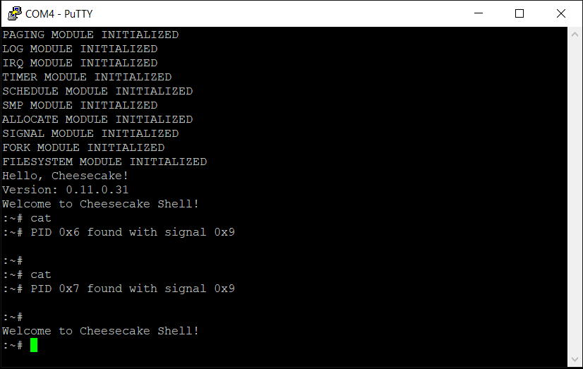

*Chapter Top* [Chapters[11]: Signals](chapter11.md) | *Next Chapter* [Chapters[12]: The Shell](../chapter12/chapter12.md)  
*Previous Page* [Chapters[11]: Signals](chapter11.md) | *Next Page* [Receiving](receiving.md)

## Sending ([chapter11/code0](code0))

#### TTY Job Control

Our current woes concern a lack of job control, and so job control is where we will start. The TTY driver maintains a record of which process should control the TTY I/O. The TTY resource is managed by a session leader - generally the shell - that communicates to the TTY which process has ownership. The `struct tty` has been updated in [include/cake/tty.h](code0/include/cake/tty.h) allowing for a `pid_leader` to be set by the session leader and stored for use in the TTY module:

```C
struct tty {
    struct tty_ops *ops;
    struct tty_ldisc *ldisc;
    void *driver_data;
    void *disc_data;
    char termios[TERMIOS_MAX];
    unsigned int index;
    unsigned int open_count;
    int pid_leader;
    struct waitqueue waitqueue;
};
```

At the top of both `n_tty_read` and `n_tty_write` functions in [src/tty.c](code0/src/tty.c), `n_tty_check_job_ctl` is checked to ensure the executing `pid` is the `pid_leader`:

```C
static int n_tty_check_jobctl(struct tty *tty, int signal) {
    int pid;
    struct process *current;
    current = CURRENT;
    pid = current->pid;
    if(pid != READ_ONCE(tty->pid_leader)) {
        do_kill(pid, signal);
        return -ERESTARTSYS;
    }
    return 0;
}
```

In the case the current `pid` is _not_ the `pid_leader`, the TTY driver sends a signal to the `pid` by calling `do_kill` with the `signal` argument.

When the session leader wants to communicate a new `pid_leader` to the TTY module, it uses the `ioctl` system call. The `sys_ioctl` implementation follows a similar format to `sys_read` and `sys_write` in [src/file.c](code0/src/file.c):

```C
long sys_ioctl(unsigned int fd, unsigned int request, unsigned long arg)
{
    struct process *current = CURRENT;
    struct folder *folder = &(current->folder);
    struct file *file = folder->files[fd];
    if(FD_CHECK(folder->openmap, fd)) {
        return file->ops->ioctl(file, request, arg);
    }
    else {
        return -1;
    }
}
```

The `tty_ioctl` operation is defined in [src/tty.c](code0/src/tty.c):

```C
static int tty_ioctl(struct file *file, unsigned int command, unsigned long arg)
{
    unsigned long pid = arg;
    struct process *p = pid_process(pid);
    struct tty *tty = file->extension;
    if(p) {
        XCHG_RELAXED(&(tty->pid_leader), arg);
        return 0;
    }
    else {
        return -1;
    }
}
```

The `tty_ioctl` only supports one command - the command to switch the `pid_leader`, and as a result, the `command` argument is not used. After grabbing a reference to the process identified by the `pid`, to ensure it exists, the operation simply sets the given `pid` as the `pid_leader` of the `struct file`'s underlying `struct tty`.

The stage has been set. The outline of how job control works is clear. On to making signals flow through the system.

#### Signal Structures

A signal is presented as a small positive integer with some interpretation. The CheesecakeOS signals are defined in the user space header [arch/arm64/user/include/user/signal.h](code0/arch/arm64/user/include/user/signal.h), allowing user space applications access to the macro definitions:

```C
#define SIGINT          1
#define SIGKILL         2
#define SIGSEGV         3
#define SIGCHLD         4
#define SIGCONT         5
#define SIGSTOP         6
#define SIGTSTP         7
#define SIGTTIN         8
#define SIGTTOU         9
```

At a Linux/bash terminal, entering the command `man signal` gives information on what the various signals mean. Many signals have the same default behaviors. Most signals have default behaviors that can be overwritten with a user space function called a _signal handler_. A signal handler defined in an application may catch a signal of a certain type, and then send itself another signal with the same default behavior.

The majority of the signal structures we will be working with are defined in [include/cake/signal.h](code0/include/cake/signal.h). The mother signal structure is the `struct signal`:

```C
struct signal {
    unsigned long refcount;
    unsigned long pending[1];
    unsigned long blocked[1];
    unsigned int flags;
    unsigned int exitcode;
    struct sighandler sighandler;
    struct list signallist;
    struct spinlock lock;
    struct waitqueue waitqueue;
};
```

A reference to a struct signal is now embedded in each `struct process`, as defined in [include/cake/process.h](code0/include/cake/process.h):

```
struct process {
    unsigned int state;
    unsigned int pid;
    unsigned int priority;
    int tick_countdown;
    unsigned long runtime_counter;
    unsigned long *stack;
    long preempt_count;
    struct memmap *memmap;
    struct memmap *active_memmap;
    struct signal *signal;
    struct folder folder;
    struct list processlist;
    struct spinlock lock;
    struct cpu_context context;
    unsigned long cpumask[CPUMASK_SIZE];
};
```

For the process, the `struct signal` keeps track of:
- The currently pending signals in the `pending` bitmap
- Any blocked signals in the `blocked` bitmap
- Signal `flags`, indicating states, such as whether the process has been stopped or continued
- In the case of a terminating signal, the number of the terminating signal in the `exitcode`
- A `struct sighandler` to store pointers to signal handler functions
- A `signallist` for storing information about pending signals
- A `lock` for serializing concurrent access
- A `waitqueue` to allow a process to sleep while waiting for a signal

The `struct sighandler` is a table of `struct sigaction` pointers:

```C
struct sighandler {
    struct sigaction sigaction[NUM_SIGNALS];
    struct spinlock lock;
};
```

The `struct sigaction` is defined back in [arch/arm64/user/include/user/signal.h](code0/arch/arm64/user/include/user/signal.h). The `struct sigaction` defines a signal handler, and its accessibility to user space allows user applications to register their custom signal handlers:

```C
struct sigaction {
    unsigned long flags;
    void (*fn)(int);
    void (*restore)(void);
};
```

The `fn` member takes a pointer to a function that is the signal handler proper, and the `restore` member is a pointer to a function that will restore the process to the correct pre-signal state (as signals are asynchronous, and will interrupt execution of a process).

Finally, the `signallist` in `struct signal` links together `struct sigqueue` objects:

```C
struct sigqueue {
    struct list list;
    struct siginfo info;
};
```

The `struct siginfo` structure contains information about the signal passed from sender to receiver:

```C
struct siginfo {
    unsigned int signo;
    unsigned long error;
    unsigned int code;
    union {
        struct {
            unsigned int sender_pid;
        } kill;
        struct {
            unsigned int child_pid;
            unsigned int status;
        } child;
    } fields;
};
```

#### Sending Signals

When the TTY module wants to send a signal to a process because it has tried to access the TTY functions without being the `pid_leader`, it calls `do_kill` with the given `pid` and `signal`. The `do_kill` function is defined in [src/signal.c](code0/src/signal.c):

```C
int do_kill(int pid, int signal)
{
    struct siginfo *info = (struct siginfo *) SIGNAL_SEND_PRIVATE;
    struct process *p;
    p = pid_process(pid);
    if(p) {
        return send_signal(signal, info, p);
    }
    else {
        return -1;
    }
}
```

If the target `pid` is a valid PID, `send_signal` is called. The `send_signal` function is quite involved, so we step through piece by piece:

```C
#define SIGMASK(signal)     ((1UL) << signal)
#define STOP_SIGNALS_MASK   (SIGMASK(SIGSTOP) | \
                             SIGMASK(SIGTSTP) | \
                             SIGMASK(SIGTTIN) | \
                             SIGMASK(SIGTTOU))

static int send_signal(int signo, struct siginfo *info, struct process *p)
{
    struct signal *signal = p->signal;
    struct sigqueue *q;
    SPIN_LOCK(&(signal->lock));
    if(SIGMASK(signo) & (STOP_SIGNALS_MASK)) {
        signal_clear(signal, SIGMASK(SIGCONT));
    }
```

The `signal`'s lock is acquired. If the `signo` being sent is in the set of signals that represent stops in the kernel, continue signals are cleared. The `signal_clear` function clears the pending bit for any signals in the `signal_mask`, and also removes those `struct siqueue` objects that have signals included in that mask:

```C
static void signal_clear(struct signal *signal, unsigned long signal_mask)
{
    struct sigqueue *q, *r;
    *(signal->pending) &= ~(signal_mask);
    LIST_FOR_EACH_ENTRY_SAFE(q, r, &(signal->signallist), list) {
        if(SIGMASK(q->info.signo) & signal_mask) {
            list_delete(&(q->list));
            cake_free(q);
        }
    }
}
```

Back in `send_signal`:

```C
    else if(SIGMASK(signo) & SIGMASK(SIGCONT)) {
        signal_clear(signal, (STOP_SIGNALS_MASK));
        if(signal->flags & SIGNAL_FLAGS_STOPPED) {
            signal->flags = SIGNAL_FLAGS_CONTINUED;
        }
        WRITE_ONCE(p->state, PROCESS_STATE_RUNNING);
        goto unlock;
    }
```

If a `SIGCONT` is to be sent, `send_signal` bypasses the signal-sending long-path by clearing any stop signals, updating the signal flags if necessary, waking the process up, and jumping to the end of the function where the lock is released.


```C
    if(*(signal->pending) & SIGMASK(signo)) {
        goto unlock;
    }
```

Signals of the same type do not queue. If the pending bit for the input `signo` is already set, no more processing is necessary, and the function returns.

```C
    q = alloc_obj(sigqueue_cache);
    list_enqueue(&(signal->signallist), &(q->list));
```

For the long-path, a new `struct sigqueue` object is allocated from the `sigqueue_cache`, which is initialized during startup:

```C
static struct cache *sigqueue_cache;

void signal_init()
{
    sigqueue_cache = alloc_cache("sigqueue", sizeof(struct sigqueue));
}
```

After creating the new queue object, the `info` field is setup:

```C
    switch((unsigned long) info) {
        case SIGNAL_SEND_PRIVATE:
            memset(&q->info, 0, sizeof(q->info));
            q->info.signo = signo;
            q->info.error = 0;
            q->info.fields.kill.sender_pid = 0;
            break;
        default:
            memcpy(&(q->info), info, sizeof(*info));
            break;
    }
```

In the case of `do_kill`, we saw the `info` object passed into `send_signal` was equal to `SIGNAL_SEND_PRIVATE`. In this case, there is a predetermined method to filling out the `info` field. Otherwise, the `info` argument is copied into the sigqueue object's `info`.

```C
    *(signal->pending) |= SIGMASK(signo);
    if(READ_ONCE(p->state) & PROCESS_STATE_INTERRUPTIBLE) {
        WRITE_ONCE(p->state, PROCESS_STATE_RUNNING);
    }
unlock:
    SPIN_UNLOCK(&(signal->lock));
    return 0;
}
```

The function ends by
- Setting the bit corresponding to the sent signal in the `struct signal`'s pending bitmap
- Waking the target process up, in the case the process's state is interruptible
- Releasing the lock

The target process should now have a pending signal.

#### Test Driving Sending Signals

In the next slice on [receiving signals](receiving.md), we will demonstrate a user space process receiving a signal, and, in response, executing a custom signal handler. But before we arrive, we can grease the pan a bit. To begin, the forking process has to be amended to account for the new signal object, as in [src/fork.c](code0/src/fork.c). The `copy_process` function now allocates a new `struct signal` structure:

```C
static struct cache *signal_cache;

static struct process *copy_process(unsigned long flags,
    unsigned long thread_input,
    unsigned long arg)
{
    struct process *p;
    p = duplicate_current();
    if(!p) {
        goto err;
    }
    if(copy_memmap(p)) {
        goto freeprocess;
    }
    if(copy_signal(p)) {
        goto freememmap;
    }
    if(copy_arch_context(flags, thread_input, arg, p)) {
        goto freesignal;
    }
    p->pid = allocate_pid(p);
    return p;
freesignal:
    if(atomic_dec_and_test(&p->signal->refcount)) {
        cake_free(p->signal);
    }
freememmap:
    if(p->memmap) {
        put_memmap(p->memmap);
    }
freeprocess:
    cake_free(p);
err:
    return 0;
}

static long copy_signal(struct process *p)
{
    struct signal *signal = alloc_obj(signal_cache);
    if(!signal) {
        return -ENOMEM;
    }
    memset(signal, 0, sizeof(*signal));
    signal->signallist.prev = &(signal->signallist);
    signal->signallist.next = &(signal->signallist);
    signal->refcount = 1;
    p->signal = signal;
    return 0;
}
```

We also want to extend the setup of the shell program in [arch/arm64/user/shell.c](code0/arch/arm64/user/shell.c):

```C
int shell()
{
    int pid;
    unsigned int shell_prompt_len;
    char buf[BUF_LEN];
    char *shell_prompt;
    unsigned long len;
    shell_prompt = SHELL_PROMPT;
    shell_prompt_len = libc_strlen(shell_prompt) + 1;
    shell_pid = getpid();
    ioctl(STDIN, 0, shell_pid);
    ioctl(STDOUT, 0, shell_pid);
```

Here, the system call `getpid` returns the `pid` of the current process. The intuitive implementation lives in [src/pid.c](code0/src/pid.c):

```C
int sys_getpid()
{
    return CURRENT->pid;
}
```

With the `pid` available, the shell, implicit TTY session leader, sets itself as the TTY's `pid_leader` with an `ioctl` system call to both STDIN, and STDOUT. They point, of course, to the same file object, but the duplication does not hurt.

Finally, we will want to update [arch/arm64/entry.S](code0/arch/arm64/entry.S) to have the kernel check for a process's pending signals on each return to user space. Currently, this means after each IRQ from `EL0`, and after each `EL0` synchronous abort. The `check_and_process_signals` function will handle the logic, and is called in the `__ret_to_user` routine:

```C
__ret_to_user:
    bl                  check_and_process_signals
    bl                  __irq_disable
    __ENTRY_RESTORE     0
```

For demonstration purposes, for the time being, the `check_and_process_signals` function has a debug implementation in [arch/arm64/signal.c](code0/arch/arm64/signal.c):

```C
void check_and_process_signals(struct stack_save_registers *ssr)
{
    struct process *current = CURRENT;
    struct signal *signal = (current->signal);
    if(*(signal->pending)) {
        log("PID %x found with signal %x\r\n", current->pid, LOG2_SAFE(*(signal->pending)));
        while(1) {
            current->state = PROCESS_STATE_STOPPED;
            schedule_self();
        }
    }
}
```

The `check_and_process_signals` function will get proper attention in the next slice as the launching point for a task _receiving_ a signal. With what we have now, our `shell` program and the `cat` program it runs will not both have access to the TTY. Only the shell will, as the registered `pid_leader`. Of course, the `cat` program will not visibly run, and we have ugly debug statements for a process that receives a signal. But these are problems for the future.

For now, fearlessly build and run CheesecakeOS, and see what happens:



*Previous Page* [Chapters[11]: Signals](chapter11.md) | *Next Page* [Receiving](receiving.md)  
*Chapter Top* [Chapters[11]: Signals](chapter11.md) | *Next Chapter* [Chapters[12]: The Shell](../chapter12/chapter12.md)
