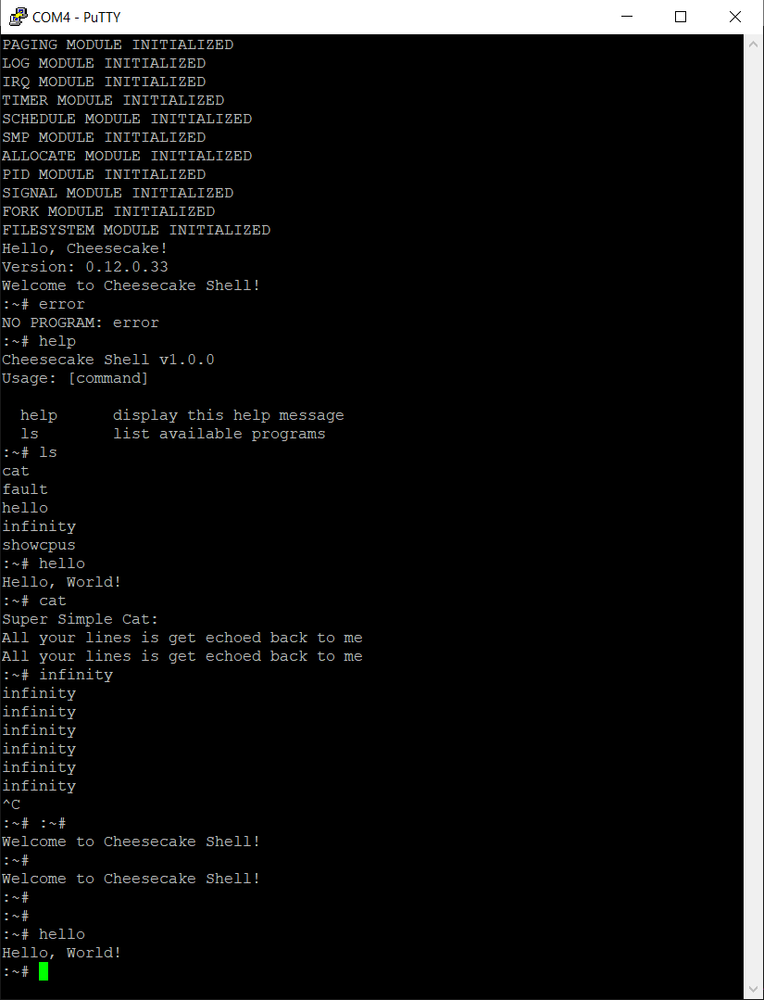

*Chapter Top* [Chapters[12]: Signals](chapter11.md) | *Next Chapter* [Chapters[13]: Bonus](../chapter13/chapter13.md)  
*Previous Page* [Receiving](receiving.md) | *Next Page* [Chapters[13]: Bonus](../chapter13/chapter13.md)

## The Shell ([chapter12/code0](code0))

#### Waitpid System Call

Until now we have had a lot of fun baking our CheesecakeOS. We haven't yet been able to properly run applications from our shell program. Now we are going to have even more fun tying up the loose ends. By the end of the chapter we will have a working shell application that can accept user commands and run other compiled programs - well, compiled functions, but it will still look and feel great!

Currently, when we run the `cat` program, the TTY module sends a stop signal to the process, and `cat` ceases to run. What we would like, instead, is for the shell to yield the TTY resource, and sleep, as if in the background, waiting on the `cat` program to execute in the foreground. In order to achieve this effect, we are going to implement the `waitpid` system call.

The `waitpid` system call allows a parent to wait for state changes in child processes. When a child terminates, stops, or resumes, the parent is awakened, and returns with some information about the child. The call also allows for the parent to select whether it is interested in waiting on all children or a specific child. In CheesecakeOS, we will only support waiting on all children.

Let us take a look at the implementation of `sys_waitpid` in [src/wait.c](src/wait.c):

```C
int sys_waitpid(int pid, int *status, int options)
{
    int retval, s;
    struct process *current, *p;
    struct wait wait;
    if(pid != -1) {
        return -1;
    }
```

The function takes three arguments. The `pid` argument is used to determine which child to wait on. By convention, a pid of -1 indicates that the calling parent will wait on any child. As mentioned, this is the only value supported in CheesecakeOS.

```C
    current = CURRENT;
    wait.waitlist.prev = &(wait.waitlist);
    wait.waitlist.next = &(wait.waitlist);
    wait.sleeping = current;
    enqueue_wait(&(current->signal->waitqueue), &wait, PROCESS_STATE_INTERRUPTIBLE);
    retval = 0;
    s = 0;
```

The stack variables are initalized, and the current (parent) process is added to the process's `struct signal`s waitqueue. The stack variable `s` is initalized to zero. The status of the child will be indictated in `s`, which will be copied into the `status` pointer.

```C
    while(1) {
        LIST_FOR_EACH_ENTRY(p, &(current->childlist), siblinglist) {
```

We iterate through each child in the current process's `childlist`. What is the `childlist`? Well, `struct process` has been augmented with two new `struct list` members in [include/cake/process.h](code0/include/cake/process.h):

```C
    struct list childlist;
    struct list siblinglist;
```

In the `struct process`, the `childlist` acts as the head of a list of children of that process. The children are linked with each other through the `siblinglist` field. Like most other process fields, these are initalized at fork-time in `duplicate_current` from [src/fork.c](code0/src/fork.c):

```C
    *p = *current;
    p->parent = current;
    p->childlist.prev = &(p->childlist);
    p->childlist.next = &(p->childlist);
    p->siblinglist.prev = &(p->siblinglist);
    p->siblinglist.next = &(p->siblinglist);
    SPIN_LOCK(&(current->lock));
    list_enqueue(&(current->childlist), &(p->siblinglist));
    SPIN_UNLOCK(&(current->lock));
```

Returning to the iteration in `waitpid`:

```C
            SPIN_LOCK(&(p->signal->lock));
```

For each process in the `childlist`, we acquire the signal lock to protect against concurrent access of the signal flags field.

```C
            if(p->signal->flags & SIGNAL_FLAGS_STOPPED) {
                retval = p->pid;
                s |= WSTOPPED;
                p->signal->flags &= ~SIGNAL_FLAGS_STOPPED;
                goto unlock;
            }
```

If the signal flags indicate this child is stopped, the return value is set to the pid of the child, the status is updated to indicate a child was stopped, the indicator flag is cleared, and the loop terminates.

```C
            if(p->signal->flags & SIGNAL_FLAGS_CONTINUED) {
                retval = p->pid;
                s |= WCONTINUED;
                p->signal->flags &= ~SIGNAL_FLAGS_CONTINUED;
                goto unlock;
            }
```

Similarly, if there is a child that continued, that child and status is returned.

```C
            if(p->state == PROCESS_STATE_EXIT) {
                retval = p->pid;
                s |= WEXITED;
                s |= WEXITCODE(p->exitcode);
                SPIN_LOCK(&(current->lock));
                list_delete(&(p->siblinglist));
                SPIN_UNLOCK(&(current->lock));
                pid_put(retval);
                goto unlock;
            }
            SPIN_UNLOCK(&(p->signal->lock));
```

The last check is to determine if the child has exited. If so, not only does the status contain this information, but is also encoded with the process exitcode for error checking. The process removes its link from the sibling list. Finally, there is this call to `pid_put`, a function we have not seen before. Now that the process status has been saved into the parent context, the process can be cleaned up, its memory returned to the allocator. The `pid_put` function, as we will examine later in this chapter, does some reference accounting for us.

```C
        if(!retval && !(options & WNOHANG)) {
            schedule_self();
            continue;
        }
        goto out;
    }
```

After looping through all the processes in the `childlist` if none is found to have a status update, the calling process sleeps by calling schedule. When awakened, execution will continue to the top of the loop. This step can be circumvented by setting the `WNOHANG` option in the `options` argument, which tells `waitpid` to return immediately even if there is no status update.

```C
unlock:
    SPIN_UNLOCK(&(p->signal->lock));
out:
    copy_to_user(status, &s, sizeof(*status));
    dequeue_wait(&(current->signal->waitqueue), &wait);
    return retval;
```

If a process was selected for status update, the signal lock is released. The status `s` is copied into the user `status` pointer. The pid is returned.

The `waitpid` call can now be used as part of the shell algorithm to exeucte a program and give that program access to the TTY resource. When running a valid program, the fork will look something like:

```C
static int shell_clone_exec(char *buffer)
{
    int pid = 0;
    unsigned long flags = (CLONE_STANDARD | CLONE_PRIORITY_USER);
    if(!libc_strcmp(buffer, "cat")) {
        if((pid = clone(flags)) == 0) {
            int pid = getpid();
            ioctl(STDIN, 0, pid);
            ioctl(STDOUT, 0, pid);
            exec(fn);
        }
    }
}
```

The forked process within the shell assigns its own pid as the TTY `pid_leader` before executing an exec. Back in the shell processing loop, the pid of the child will have been returned as the foreground process, which can be used in the `waitpid` logic:

```C
            while((pid = waitpid(-1, &status, flags)) != 0) {
                if(pid == fg) {
                    if(WIFEXITED(status)) {
                        flags |= WNOHANG;
                        ioctl(STDIN, 0, shell_pid);
                        ioctl(STDOUT, 0, shell_pid);
                        switch(WEXITDECODE(status)) {
                            case 0:
                                break;
                            default:
                                write(STDOUT, "Undefined Error\n", 17);
                                break;
                        }
                    }
                }
            }
```

After the foreground process exits, the shell reasserts itself as the `pid_leader`, and continues to run `waitpid`, but will then return as soon as all updates have been processed as the `WNOHANG` option is specified.

#### Exiting Cleanly (More Reference Counters)

If we had a `C`-compiler for our CheesecakeOS, and a file system, we could write programs that begin with a main function and automatically run the `exit` system call when finished. We have neither of those things. For proper functioning, our programs should call exit themselves. Take, for example, the final `cat` program, from [arch/arm64/user/cat.c](code0/arch/arm64/user.cat.c):

```C
#define STDIN       (0)
#define STDOUT      (1)
#define BUF_LEN     (0x100)

void exit(int code);
long read(int fd, char *buffer, unsigned long count);
long write(int fd, char *buffer, unsigned long count);

int cat()
{
    char buf[BUF_LEN];
    unsigned long len;
    write(STDOUT, "Super Simple Cat:\n", 19); 
    while((len = read(STDIN, buf, BUF_LEN)) > 0) {
        write(STDOUT, buf, len);
    }
    exit(0);
    return 0;
}
```

Now, when a user gives an `EOF` with `C-d` on an empty line, the loop will terminate, and `exit` will run. This should be the start of a chain of execution that will result in the shell being notified of the child exit. The `sys_exit` implementation in [src/exit.c](code0/src/exit.c) is a pass through to `do_exit` from the same source:

```C
void sys_exit(int code)
{
    do_exit(code);
}
```

The `do_exit` function is short, but dense:

```C
void do_exit(int code)
{
    struct process *current = CURRENT;
    struct memmap *mm = current->memmap;
    ATOMIC_LONG_INC(&(mm->refcount));
    SPIN_LOCK(&(current->signal->lock));
    current->memmap = 0;
    current->exitcode = code;
    current->state = PROCESS_STATE_EXIT;
    SPIN_UNLOCK(&(current->signal->lock));
    put_memmap(mm);
    signal_parent_exit(current);
    schedule_self();
}
```

Let's break it down. First the current process's `memmap`s `refcount` is _increased_. An odd thing, to increase a reference counter when exiting a process, but necessary in this case. The later call to `put_memmap` could end up calling `drop_memmap` if there are no other users of the user space mapping. This would otherwise free the `memmap`, while it is still needed in the schedule module. The increment of the reference counter is then offset in the schedule module, after the final call to schedule. Here, the current process's `memmap` is nullified, and in schedule module:

```C
    if(!(prev->memmap)) {
        prev->active_memmap = 0;
        rq->saved_memmap = old;
    }
```

This leads to `drop_memmap` being called from `finish_switch`, so the math works out. The `do_exit` function also updates the state of the current process to `PROCESS_STATE_EXIT`, and calls `signal_parent_exit` before the final call to `schedule_self`. The `signal_parent_exit` function is defined in [src/signal.c](code0/src/signal.c):

```C
void signal_parent_exit(struct process *p)
{
    struct process *parent;
    struct sighandler *sighandler;
    struct siginfo info;
    parent = p->parent;
    memset(&info, 0, sizeof(info));
    info.signo = SIGCHLD;
    info.error = 0;
    info.fields.child.child_pid = p->pid;
    info.fields.child.status = p->exitcode;
    SPIN_LOCK(&(parent->signal->lock));
    sighandler = &(parent->signal->sighandler);
    if(sighandler->sigaction[SIGCHLD - 1].fn != SIG_IGN) {
        send_signal(SIGCHLD, &info, parent);
    }
    SPIN_UNLOCK(&(parent->signal->lock));
    free_process(p);
    wake_waiter(&(parent->signal->waitqueue));
}
```

The functon is similar to `signal_parent_stop`, reviewed in the [last chapter](../chapter11/receiving.md). The parent is sent a `SIGCHLD` with the signal information, if a handler is defined, before being awakened with `wake_waiter`. In this case, there is also an additional call to `free_process`. The `free_process` function is defined in [src/fork.c](code0/src/fork.c), the birth, and now final resting place for `struct process`es:

```C
void free_process(struct process *p)
{
    struct signal *signal;
    struct page *stack;
    if(!atomic_dec_and_test(&(p->refcount))) {
        return;
    }
    signal = p->signal;
    stack = &(PTR_TO_PAGE(p->stack));
    if(atomic_dec_and_test(&(signal->refcount))) {
        cake_free(signal);
    }
    free_pages(stack);
    cake_free(p);
}
```

When a process is first created, the `refcount` is set equal to two, one for the process itself, and one for the parent, in `duplicate_current`:

```C
    unsigned long forked_refcount;
    forked_refcount = 2;
    p->refcount = forked_refcount;
```

When the parent is notified of a child's exit in `signal_parent_stop`, the parent's reference is dropped. The schedule module has also been updated to handle the `struct process`'s own reference. Now, in `finish_switch`:

```C
    if(prev != &(this_rq->idle_task) && !(prev->state == PROCESS_STATE_EXIT)) {
    }

    if(prev->state == PROCESS_STATE_EXIT) {
        priority = 1 << prev->priority;
        this_rq->weight -= priority;
        list_delete(&(prev->processlist));
        free_process(prev);
    }
```

There is no need to rebalance an exiting process to a new CPU. If the process state has been set to exit, the current runqueue's priority is decremented, the process removed from the runqueue, and `free_process` executes to drop the reference.

So our kernel stacks and our process structs can be freed for future allocations. But there remains an issue. What if one process sends a signal to a second process while the second process is exiting? And what happened to the process pid, which never was deallocated? The `do_kill` function gets a reference to a process, and updates the `struct signal` if this races with deallocating a process, the proces may already be freed by the time `send_signal` is doing its state updates. This race could completely crash the system.

This brings us back to the `pid_put` function we saw in `waitpid`. In turns out, the process and the process's parent are not the only actors with references to a process. The pid module, with its pidmap _also_ has a reference to a process. In order to avoid catastrophic races, the pid module needs to be revamped to account for a process's reference count.

In [src/pid.c](code0/src/pid.c), we now associate each integer pid with a `struct pid` object, which itself has a reference counter, as well as a process reference. When a pid is allocated, the reference count of the associated process is incremented to account for this extra reference:

```C
struct pid {
    unsigned long refcount;
    struct process *process;
};

static struct cache *pid_cache;
static struct spinlock pidlock = {
    .owner = 0,
    .ticket = 0
};
static struct pid *refmap[NUM_PIDS];

unsigned long allocate_pid(struct process *p)
{
    unsigned long pid;
    struct pid *pidref;
    ATOMIC_LONG_INC(&(p->refcount));
    do {
        do {
            pid = READ_ONCE(nextpid);
        } while(pid != CMPXCHG_RELAXED(&nextpid, pid, pid + 1));
        pid &= PID_MASK;
    } while(test_and_set_bit(pidmap, pid));
    pidref = alloc_obj(pid_cache);
    memset(pidref, 0, sizeof(*pidref));
    pidref->refcount = 1;
    pidref->process = p;
    SPIN_LOCK(&(pidlock));
    refmap[pid] = pidref;
    SPIN_UNLOCK(&(pidlock));
    return pid;
}
```

Locking is now needed to protect the `refmap` from concurrent access, and to generate atomic operations against its access. When getting a process from the `refmap`, the reference count of the backing `struct pid` is increased under protection of the `pidlock`

```C
struct process *pid_process(unsigned int pid)
{
    struct process *p;
    struct pid *reference;
    p = 0;
    SPIN_LOCK(&(pidlock));
    reference = refmap[pid];
    if(reference) {
        reference->refcount++;
        p = reference->process;
    }
    SPIN_UNLOCK(&(pidlock));
    return p;
}
```

When finished with the reference, the user must call `pid_put` to release the reference:

```C
void pid_put(unsigned int pid)
{
    int deallocate;
    struct process *p;
    struct pid *reference;
    deallocate = 0;
    SPIN_LOCK(&(pidlock));
    reference = refmap[pid];
    if(reference) {
        reference->refcount--;
        if(!(reference->refcount)) {
            p = reference->process;
            cake_free(reference);
            deallocate = 1;
        }
    }
    SPIN_UNLOCK(&(pidlock));
    if(deallocate) {
        deallocate_pid(pid, p);
    }
}
```

Then, `deallocate_pid` will take care of dropping the `struct process` reference:

```C
static void deallocate_pid(unsigned int pid, struct process *p)
{
    free_process(p);
    SMP_MB();
    clear_bit(pidmap, pid);
}
```

Now, when the kernel calls `do_kill` in [src/signal.c](code0/src/signal.c), it first gets and the puts a reference to the pid:

```C
int do_kill(int pid, int signal)
{

    int err = 0;
    struct siginfo *info = (struct siginfo *) SIGNAL_SEND_PRIVATE;
    struct process *p;
    struct spinlock *lock;
    p = pid_process(pid);
    if(p) {
        lock = &(p->signal->lock);
        SPIN_LOCK(lock);
        err = send_signal(signal, info, p);
        SPIN_UNLOCK(lock);
        pid_put(pid);
        return err;
    }
    else {
        return -1;
    }
}
```

This updated implementation creates and chicken-and-egg problem elsewhere. In `schedule_init`, pids are allocated for the idle processes with calls to `allocate_pid`. But not `allocate_pid` calls `alloc_obj` from the allocate module. The allocate module is initalized _after_ the schedule module, and must be because the schedule module initialized the `CURRENT` macro, enabling the per-CPU caches to be setup from CPU 0. So something has got to give. Many solutions exist, including deferred pid allocation. The one CheesecakeOS adopts currently is to simply assign the CPU number as the pid for the idle processes, and those pids are marked as in use during `pid_init`:

```C
void pid_init()
{
    pid_cache = alloc_cache("pid", sizeof(struct pid));
    for(unsigned long i = 0; i < NUM_PIDS; i++) {
        refmap[i] = 0;
    }
    for(unsigned long i = 0; i < NUM_CPUS; i++) {
        set_bit(pidmap, i);
    }
}
```

The idle processes don't receive signals or exit, so this should work out alright.

#### Builtins

It's time to take a break, and have some fun. Especially if your idea of fun is writing builtin shell commands. Our builtin examples are quite primitive. Seeing as we have built this system from scratch, they are still quite pleasing. In the main processing loop of the shell in [arch/arm64/user/shell.c](code0/arch/arm64/shell.c) we have added an if-clause:

```C
                else if(shell_builtin(buf)) {
                    continue;
                }
```

The `shell_builtin` function decides if the input buffer contains a builtin command, and, if so, executes it:

```C
static int shell_builtin(char *buffer)
{
    int found = 0;
    if(!libc_strcmp(buffer, "ls")) {
        shell_ls();
        found = 1;
    }
    else if(!libc_strcmp(buffer, "help")) {
        shell_help();
        found = 1;
    }
    return found;
}

static int shell_help()
{
    write(STDOUT, "Cheesecake Shell v1.0.0\n", 25);
    write(STDOUT, "Usage: [command]\n\n", 19);
    write(STDOUT, "  help      display this help message\n", 39);
    write(STDOUT, "  ls        list available programs\n", 37);
    return 0;
}

static int shell_ls()
{
    write(STDOUT, "cat\n", 5);
    write(STDOUT, "fault\n", 7);
    write(STDOUT, "hello\n", 7);
    write(STDOUT, "infinity\n", 10);
    write(STDOUT, "showcpus\n", 10);
    return 0;
}
```

You may have noticed one major inconvenience. We have coded an if-clause for each shell builtin. This makes adding additional builtins painful, as each must have a correspoding if. We would like to do something more along the lines of:

```C
#define NUM_BUILTINS    (2)

struct builtin_command {
    char *command;
    void (*fn)(void);
    char *description;
};

struct builtin_command builtin_commands[NUM_BUILTINS] = {
    {
        .command = "help",
        .fn = shell_help,
        .description = "show help\n"
    },
    {
        .command = "ls",
        .fn = "shell_ls"
        .description = "list programs\n"
    }
}

static int shell_builtin(char *buffer)
{
    int found = 0;
    struct builtin_command bc;
    for(int i = 0; i < NUM_BUILTINS; i++) {
        bc = builtin_commands[i];
        if(!strcmp(bc.command, buffer)) {
            bc.fn();
        }
    }
    return found;
}
```

In this way, we could simply maintain the array of builtin commands. Unfortunately, this is not possible. As the array is statically compiled into the kernel image as part of the data section, the function references have addresses in the kernel range. So `bc.fn()` causes a fatal page fault. When run as part of a series of if statements, the addresses are computed at pc-relative offsets, so they are acceptable. There are, of course, hacks to get around the issue, but they are ugly or fraught, so we accept this slight injustice.

Now, when running, entering "help\n" or "ls\n" will display output, without running a new process. Making the processes is the fun part though.

#### Applications

The Cheesecake Shell is now complete in [arch/arm64/user/shell.c](arch/arm64/user/shell.c). A few demo programs are available as well, with support features added in the kernel. For example, the `fault` program in [arch/arm64/user/fault.c](arch/arm64/user/fault.c):

```C
int fault()
{
    unsigned long kernel_addr = 0xFFFF000000002468;
    unsigned long *ka_ref = (unsigned long *) kernel_addr;
    *ka_ref = 42;
    exit(0);
    return 0;
}
```

As this program accesses an invalid kernel address, it should result in a `SIGSEGV`. An update to the page fault handler, to `do_bad` function is [arch/arm64/fault.c](code1/arch/arm64/fault.c) now sends this signal instead of running `do_exit` right away:

```C
int do_bad(unsigned long addr, unsigned long esr, struct stack_save_registers *ssr)
{
    int pid = CURRENT->pid;
    return do_kill(pid, SIGSEGV);
}
```

The `SIGSEGV` is set as the error code in the call to `do_exit`, and this should come back to the shell. When checking the exit code, the shell can notify us of a segmentation fault:

```C
                        switch(WEXITDECODE(status)) {
                            case 0:
                                break;
                            case SIGSEGV:
                                write(STDOUT, "Segmentation Fault\n", 20);
                                break;
                            default:
                                write(STDOUT, "Undefined Error\n", 17);
                                break;
                        }
```

Another program, [arch/arm64/user/inifity.c](code0/arch/arm64/user/inifity.c), echoes infiinity to the screen in an infinite loop:

```C
void exit(int code);
unsigned long write(int fd, char *buffer, unsigned long count);

int infinity()
{
    int delay = 10000000;
    char wait;
    while(1) {
        write(STDOUT, "infinity\n", 10);
        for(int i = 0; i < delay; i++) {
            *(&wait) = '\0';
        }
    }
    exit(0);
    return 0;
}
```

The usual way to stop such a program would be by sending a `SIGINT` signal with `C-c`. An update to the TTY driver in `n_tty_receive_marked_char`, from [src/tty.c](code0/src/tty.c) implements this functionality:

```C
    else if(c == TTY_INTR_CHAR(tty)) {
        add_echo_byte(ldata, ECHO_OP_START);
        add_echo_byte(ldata, c);
        add_echo_byte(ldata, '\n');
        flush_echoes(tty);
        ldata->read_tail = ldata->read_head;
        set_bit(ldata->read_flags, MASK(ldata->read_head));
        add_read_byte(ldata, '\n');
        STORE_RELEASE(&(ldata->canon_head), ldata->read_head);
        do_kill(tty->pid_leader, SIGINT);
        wake_waiter(&(tty->waitqueue));
    }
```

We have to be careful not to kill the shell with `SIGINT`s though, so the shell blocks this signal:

```C
    unsigned long prev_mask;
    prev_mask = 0;
    libc_sigaddset(&prev_mask, SIGINT);
    while(1) {
        write(STDOUT, "Welcome to Cheesecake Shell!\n", 30);
        while(1) {
            sigprocmask(SIG_SETMASK, &prev_mask, 0);
        }
    }
```

Now it is your turn! Build and run CheesecakeOS. Type some stuff on the terminal. Break it. Fix it. Add new features. Stay hungry, my friend.



*Chapter Top* [Chapters[12]: Signals](chapter11.md) | *Next Chapter* [Chapters[13]: Bonus](../chapter13/chapter13.md)  
*Previous Page* [Receiving](receiving.md) | *Next Page* [Chapters[13]: Bonus](../chapter13/chapter13.md)
