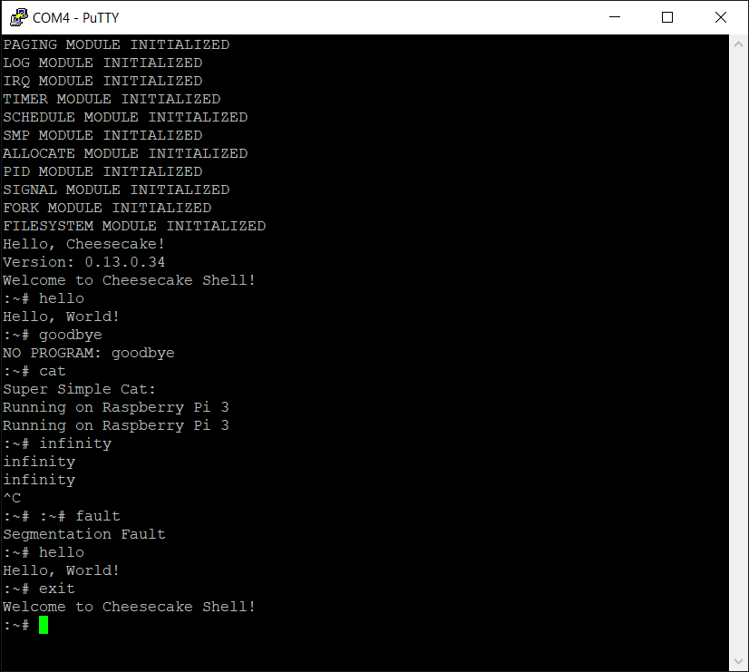

*Chapter Top* [Chapters[13]: Bonus](chapter13.md)  
*Previous Page* [Chapters[13]: Bonus](chapter13.md) 

## Raspberry Pi 3 Support ([chapter13/code0](code0))

#### What is Different for Raspberry Pi 3

The design and partitioning of CheesecakeOS allows for other (not just the Raspberry Pi 4) single board computers to be plugged in with limited implementation requirements. It also allows for other architectures to be plugged in, but the implementation burden there is heavier. Here, we will focus on the Raspberry Pi 3, to give a demonstration of how other boards can be supported.

The Raspberry Pi 3 implements the ARM64 architecture on its Cortex-A53 chip. As it has the same architecture and is manufactured by the same entity that makes our Raspberry Pi 4, it is an ideal candidate for support. There are material differences between the Raspberry Pi 3 and the Raspberry Pi 4 we will need to take into account:
- Raspberry Pi 4s have various RAM memory configurations - 2GB, 4GB, and 8GB - while Raspberry Pi 3 has one 1GB RAM option
- The Raspberry Pi 4 has a 35-bit physical memory map, while the Raspberry Pi 3 has a significantly different 32-bit memory map
- The Raspberry Pi 4 has an ARM GIC, while the Raspberry Pi 3 has a built-in interrupt controller not based on the GIC specification
- Some peripheral registers have been updated on the Raspberry Pi 4 as opposed to their significance on a Raspberry Pi 3 
  - The [BCM2837 Peripherals Manual](https://github.com/raspberrypi/documentation/files/1888662/BCM2837-ARM-Peripherals.-.Revised.-.V2-1.pdf) will guide us through the needed adjustments
  - We will also utilize the addendum documentation describing the [local peripherals](https://www.raspberrypi.org/documentation/hardware/raspberrypi/bcm2836/QA7_rev3.4.pdf)

As it turns out, adding support for the Raspberry Pi 3 board requires no changes to the architecture-specific or architecture-agnostic code. It is enough to copy the [arch/arm64/board/raspberry-pi-4](code0/arch/arm64/raspberry-pi-4) to a new [arch/arm64/raspberry-pi-3](code0/arch/arm64/raspberry-pi-3) folder, make some tweaks and be on our way.

The [arch/arm64/board/raspberry-pi-3/config.txt](code0/arch/arm64/board/raspberry-pi-3/config.txt) file will be used as the bootloader's configuration:

```bash

arm_64bit=1
disable_commandline_tags=1
enable_uart=1
gpu_mem=48
kernel_old=1
```

There is no GIC or high peripheral mode on the Raspberry Pi 3, so those configurations are removed relative to the Raspberry Pi 4 configuration. The amount of memory left for the GPU is defined explicitly.

#### Memory Map

The Raspberry Pi 3 memory map is shown on `pg. 5` of the `BCM2837 ARM Peripherals` manual. SDRAM begins at address zero. Given a 1GB system, system SDRAM ends at the 0x40000000 address. Reading further, however, the peripherals begin at physical address 0x7E000000, so, in reality, the last 32MB of SDRAM are used to map peripherals. 48MB will be left for the GPU. From the local peripherals documentation, local peripherals are mapped between 0x40000000 and 0x40040000. The system memory map in codified in [arch/arm64/board/raspberry-pi-3/memmap.c](code0/arch/arm64/board/raspberry-pi-3/memmap.c):

```C
#define MEMORY_SIZE_1GB                 0x040000000

#define VC_SDRAM_SIZE                   0x3000000
#define START_OF_VC_SDRAM               MAIN_PERIPH_BASE - VC_SDRAM_SIZE
#define END_OF_USABLE_SDRAM             START_OF_VC_SDRAM

#define SET_BY_ARCH_AT_INIT             (0)

#define ADDRESS_REGION_CAKE_TEXT        (0)
#define ADDRESS_REGION_CAKE_DATA        (1)
#define ADDRESS_REGION_OVERWRITE        (2)
#define ADDRESS_REGION_BABY_BOOT        (3)
#define ADDRESS_REGION_DRAM_INIT        (4)

static struct address_region memory_map[] = {
    {
        .start = 0x0,
        .size = SET_BY_ARCH_AT_INIT,
        .flags = MEM_FLAGS_CAKE_TEXT,
        .type = MEM_TYPE_SDRAM
    },
    {
        .start = SET_BY_ARCH_AT_INIT,
        .size = SET_BY_ARCH_AT_INIT,
        .flags = MEM_FLAGS_CAKE,
        .type = MEM_TYPE_SDRAM
    },
    {
        .start = SET_BY_ARCH_AT_INIT,
        .size = SET_BY_ARCH_AT_INIT,
        .flags = MEM_FLAGS_OVERWRITE,
        .type = MEM_TYPE_SDRAM
    },
    {
        .start = SET_BY_ARCH_AT_INIT,
        .size = SET_BY_ARCH_AT_INIT,
        .flags = MEM_FLAGS_BABY_BOOT,
        .type = MEM_TYPE_SDRAM
    },
    {
        .start = SET_BY_ARCH_AT_INIT,
        .size = START_OF_VC_SDRAM - SET_BY_ARCH_AT_INIT,
        .flags = MEM_FLAGS_ENDMAP,
        .type = MEM_TYPE_SDRAM
    },
    {
        .start = START_OF_VC_SDRAM,
        .size =  VC_SDRAM_SIZE,
        .flags = MEM_FLAGS_NONE,
        .type = MEM_TYPE_RESERVED
    },
    {
        .start = MAIN_PERIPH_BASE,
        .size =  MEMORY_SIZE_1GB - MAIN_PERIPH_BASE,
        .flags = MEM_FLAGS_NONE,
        .type = MEM_TYPE_PERIPHERAL
    },
    {
        .start = MEMORY_SIZE_1GB,
        .size = 0x40000,
        .flags = MEM_FLAGS_NONE,
        .type = MEM_TYPE_PERIPHERAL
    },
    {
        .start = MEMORY_SIZE_1GB + 0x40000,
        .size = 0x100000000 - MEMORY_SIZE_1GB - 0x40000,
        .flags = MEM_FLAGS_NONE,
        .type = MEM_TYPE_RESERVED
    }
};
```

The memory map shows substantial similarity to [arch/arm64/board/raspberry-pi-4/memmap.c](code0/arch/arm64/board/raspberry-pi-4/memmap.c). The zeroth index contains the bounds of the kerneltext section, and the first index the bounds of the rest of the kernel image. Index two is for temporary boot storage, containing the `idmap` page table space and `cpu_spin_pen`. Index three is for the baby boot allocator. The beginning of index four is where the global memory map array will be stored.

As a result of the specifics of the Raspberry Pi 3 memory map, we update a few base address macro definitions. The [arch/arm64/board/raspberry-pi-4/include/board/gic.h](code0/arch/arm64/board/raspberry-pi-4/include/board/gic.h) header copied from the Raspberry Pi 4 source can be deleted. In the Raspberry Pi 4, the peripheral base addresses were:

```C
#define MAIN_PERIPH_BASE             (0x47C000000)
#define LOCAL_PERIPH_BASE            (0x4C0000000)
#define GIC_BASE                     ((LOCAL_PERIPH_BASE) + 0x00040000)
```

But for the Raspberry Pi 3 in [arch/arm64/board/raspberry-pi-3/include/board/peripheral.h](code0/arch/arm64/board/raspberry-pi-3/include/board/peripheral.h):

```C
#define MAIN_PERIPH_BASE             (0x3F000000)
#define LOCAL_PERIPH_BASE            (0x40000000)
```

Also impacted are the timer base address, which in Raspberry Pi 4 looked like:

```C
#define TIMER_BASE_REG  (MAIN_PERIPH_BASE + 0x2003000)
```

But in [arch/arm64/board/raspberry-pi-3/timer.S](code0/arch/arm64/board/raspberry-pi-3/timer.S):

```C
#define TIMER_BASE_REG  (MAIN_PERIPH_BASE + 0x3000)
```

And the mini UART base address, which in Raspberry Pi 4 looked like:

```C
#define UART_BASE_REG           (MAIN_PERIPH_BASE + 0x2215000)
```

Though in [arch/arm64/board/raspberry-pi-3/mini-uart.S](code0/arch/arm64/board/raspberry-pi-3/mini-uart.S):

```C
#define UART_BASE_REG           (MAIN_PERIPH_BASE + 0x215000)
```

Again, the GIC does not exist on the Raspberry Pi 3 board, so the interrupt controller implementation will need to be replaced.

#### Mini UART Driver

The Raspberry Pi 3 mini UART is almost the same as the Raspberry Pi 4 variant. There is a slight difference in that the Pi 3 variant is connected to a specific interrupt controller, while the Pi 4 variant is connected to an ARM GIC. This seems to impact the way the interrupt line is cleared. In the Raspberry Pi 4, a write to the `GICD_EIOR` register within the interrupt controller was enough to clear the line. With the Raspberry Pi 3, the interrupt line needs to be cleared from the interrupt handling routine. Otherwise the interrupt will be interminably asserted leading to an infinite loop of interrupt handling. The `__uart_clear` routine writes ones to bit zero and bit one of the `AUX_MU_IIR_REG` register to clear the interrupt. The implementation in [arch/arm64/board/raspberry-pi-3/mini-uart.S](code0/arch/arm64/board/raspberry-pi-3/mini-uart.S):

```asm
.globl __uart_clear
__uart_clear:
    __MOV_Q         x1, PHYS_TO_VIRT(AUX_MU_IIR_REG)
    mov             w0, #0b0011
    __dev_write_8   w0, x1
    ret
```

The `rpi3_miniuart_interrupt()` function in [arch/arm64/board/raspberry-pi-3/mini-uart.c](code0/arch/arm64/board/raspberry-pi-3/mini-uart.c) mirrors the `rpi4_miniuart_interrupt()` implementation, but has a call to `__uart_clear` inserted after all characters in the receive FIFO have been processed:

```C
void rpi3_miniuart_interrupt()
{
    char c;
    unsigned long space;
    unsigned long head;
    struct spinlock *lock = &(rpi3_miniuart.buffer.lock);
    SPIN_LOCK(lock);
    head = rpi3_miniuart.buffer.head;
    space = READBUF_SIZE - (head - rpi3_miniuart.buffer.tail);
    if(space) {
        while(__uart_irqstatus() == IRQ_READ_PENDING) {
            c = __uart_getchar();
            rpi3_miniuart.buffer.readbuf[MASK(head++)] = c;
        }
    }
    __uart_clear();
    rpi3_miniuart.buffer.head = head;
    SPIN_UNLOCK(lock);
    enqueue_work(&(rpi3_miniuart.buffer.work));
}
```

One other minor adjustment, based on the documentation on `pg. 12` of the `BCM2837 ARM Peripherals` manual. There, it specifies bits two and three of the `AUX_MU_IER_REG` register must be set to enable interrupts. We did not set these two bits in the Raspberry Pi 4 version, but they are included for the Pi 3 in the `__uart_irqenable` routine called during initialization:

```C
.globl __uart_irqenable
__uart_irqenable:
    __MOV_Q         x1, PHYS_TO_VIRT(AUX_MU_IER_REG)
    mov             w0, #0b1101
    __dev_write_8   w0, x1
    ret
```

#### Interrupt Controller

The Raspberry Pi 3 interrupt controller necessitates an overhauled IRQ implementation. We will support the same two interrupts as in the Pi 4, the `System Timer #3` interrupt, which will be broadcast to other cores, and the auxiliary interrupt for when a user inputs a character. Just as in the Raspberry Pi 4, these interrupts are generated by the GPU. In this case there exists a different set of memory mapped registers to configure. The documentation for the interrupt controller begins on `pg. 109`. Of the peripherals manual. The relevant registers from this section for our implementation are defined in [arch/arm64/board/raspberry-pi-3/irq.S](code0/arch/arm64/board/raspberry-pi-3/irq.S):

```asm
#define INTERRUPT_CONTROLLER_BASE   (MAIN_PERIPH_BASE + 0xB000)
#define IRQ_PENDING_1               (INTERRUPT_CONTROLLER_BASE + 0x204)
#define ENABLE_IRQS_1               (INTERRUPT_CONTROLLER_BASE + 0x210)
```

Combine this with the interrupt ids we are interested in from `pg 113`, and defined in [arch/arm64/board/raspberry-pi-3/irq.c](code0/arch/arm64/board/raspberry-pi-3/irq.c):

```C
#define IRQ_TIMER3              (0x3)
#define IRQ_AUX                 (0x1D)
#define IRQ_MASK(irq)           (1 << (irq))
```

In order to receive interrupts from `System Timer #3` or the auxiliary input, the interrupts need to be enabled by writing bit three and bit 29 to the `ENABLE_IRQS_1` register. The `IRQ_PENDING_1` register will have these bits set when an interrupt is received.

The interrupt controller documentation is not complete without the [local controller](https://www.raspberrypi.org/documentation/hardware/raspberrypi/bcm2836/QA7_rev3.4.pdf) addendum. This document describes the available local interrupts. According to `pg. 5-6`, all GPU interrupts are directed to one core, defaulting to CPU 0. We leave the default as is. Just like in the Raspberry Pi 4 implementation, where a timer interrupt was received on CPU 0, then broadcast to other cores using a software generated interrupt, in the Raspberry Pi 3 implementation CPU 0 will receive the GPU `System Timer #3` interrupt and broadcast to the other cores. The ARM mailboxes described for the local controller will be the method. 

Each CPU core has four available mailboxes, each with 32 bits. We only need to use one bit of one mailbox to broadcast an interrupt, and we will choose bit three of the third mailbox. Each mailbox is comprised of three registers. A control register enables the mailbox so messages can be received. A set register allows bits to be set, triggering interrupts. Finally a clear register is used to clear an incoming interrupt after it is processed. The clear register may also be read to determine if an interrupt is set. The mailbox base registers are defined in [arch/arm64/board/raspberry-pi-3/irq.S](code0/arch/arm64/board/raspberry-pi-3/irq.S):

```asm
#define IRQ_MAILBOX_CONTROL_BASE    ((LOCAL_PERIPH_BASE) + 0x50)
#define LOCAL_IRQ_SOURCE_BASE       ((LOCAL_PERIPH_BASE) + 0x60)
#define IRQ_MAILBOX_SET_BASE        ((LOCAL_PERIPH_BASE) + 0x80)
#define IRQ_MAILBOX_CLEAR_BASE      ((LOCAL_PERIPH_BASE) + 0xC0)
```

The mailbox control register for a given CPU is located at an offset of the CPU number multiplied by four from the base register. For the set and clear registers, the offset is CPU number multiplied by sixteen, then increased by twelve to get to mailbox three. There is another register, `LOCAL_IRQ_SOURCE_BASE` defined among the mailbox registers. This register is used by the CPU receiving the interrupt to quickly determine the source of an interrupt. If bit eight is set, it indicates the GPU as the source of the interrupt, so checking the `IRQ_PENDING_1` register to determine the type of interrupt is the next action. If bit seven is set it indicates a mailbox three interrupt. Reading the mailbox three clear register can identify the interrupt type.

The parameters of the interrupt controller understood, we can proceed with implementation. The interrupt controller is initialized in `irq_init`:

```C
void irq_init()
{
    __irq_enable_id(IRQ_TIMER3);
    __irq_enable_id(IRQ_AUX);
    __irq_enable_mailbox3();
}
```

The `__irq_enable_id` assembly routine sets the input bit in register `ENABLE_IRQS_1`:

```asm
.globl __irq_enable_id
__irq_enable_id:
    __MOV_Q         x1, PHYS_TO_VIRT(ENABLE_IRQS_1)
    mov             w2, #1
    lsl             w2, w2, w0
    __DEV_READ_32   w0, x1
    orr             w0, w0, w2
    __DEV_WRITE_32  w0, x1
    isb
    ret
```

The `__irq_enable_mailbox3` routine sets bit three of the mailboxes interrupt control register for CPUs 1-3. CPU 0 is left out, as the primary recipient of the GPU timer interrupt, with no need to receive a broadcast interrupt. Bit three enables IRQs for mailbox three, as described on `pg. 14` of the local interrupt addendum:

```asm
#define IRQ_MAILBOX3_SHIFT          (3)
#define IRQ_MAILBOX3_ENABLE         (1 << (IRQ_MAILBOX3_SHIFT))

.globl __irq_enable_mailbox3
__irq_enable_mailbox3:
    mov             x0, #(NUM_CPUS - 1)
    __MOV_Q         x3, PHYS_TO_VIRT(IRQ_MAILBOX_CONTROL_BASE)
    mov             w4, #IRQ_MAILBOX3_ENABLE
1:
    mov             x1, x0
    lsl             x1, x1, #2
    add             x5, x3, x1
    __DEV_WRITE_32  w4, x5
    subs            x0, x0, #1
    b.gt            1b
    ret
```

As calculated previously, the offset for each CPU is given by the CPU number, multiplied by four, or, shifted left by two.

With initialization completed, it is on to the `handle_irq` function in [arch/arm64/board/raspberry-pi-3/irq.c](code0/arch/arm64/board/raspberry-pi-3/irq.c) for our new interrupt controller. Let us step through the function, branching to the low-level assembly routines in [arch/arm64/board/raspberry-pi-3/irq.S](code0/arch/arm64/board/raspberry-pi-3/irq.S) as we go:

```C
#define IRQ_MAILBOX3_SOURCE     (7)
#define IRQ_GPU_SOURCE          (8)
#define IRQ_SOURCE(source)      (1 << (source))

void handle_irq()
{
    unsigned int irq, source;
    do {
        source = __irq_source();
```

As in the Raspberry Pi 4 implementation, the handler runs in a loop to process all outstanding interrupts. First, a read of the source register for the interrupted CPU to determine where the interrupt is coming from:

```asm
.globl __irq_source
__irq_source:
    __MOV_Q         x0, PHYS_TO_VIRT(LOCAL_IRQ_SOURCE_BASE)
    mrs             x1, mpidr_el1
    and             x1, x1, #MPIDR_HWID_MASK_LITE
    lsl             x1, x1, #2
    add             x0, x0, x1
    __DEV_READ_32   w0, x0
    ret
```

CPU 0 will receive interrupts from the GPU, while the other CPUs will receive interrupts from mailbox three. The handler checks first for a GPU interrupt:

```C
            if(source & IRQ_SOURCE(IRQ_GPU_SOURCE)) {
                irq = __irq_read();
                if(irq & IRQ_MASK(IRQ_TIMER3)) {
                    __irq_broadcast(IRQ_TIMER3);
                    timer_interrupt();
                    timer_tick();
                }
```

In the case of a GPU interrupt, read the `IRQS_PENDING_1` register:

```asm
.globl __irq_read
__irq_read:
    __MOV_Q         x0, PHYS_TO_VIRT(IRQ_PENDING_1)
    __DEV_READ_32   w0, x0
    ret
```

If the `IRQ_TIMER3` bit is set, CPU 0 first broadcasts the interrupt to the other CPUs by writing to their mailbox three:

```C
#define IRQ_MAILBOX_CPU_SHIFT       (4)
#define IRQ_MAILBOX3_OFFSET         (0xC)

.globl __irq_broadcast
__irq_broadcast:
    mov             w4, #1
    lsl             w4, w4, w0
    mov             x0, #(NUM_CPUS - 1)
    __MOV_Q         x3, PHYS_TO_VIRT(IRQ_MAILBOX_SET_BASE)
1:
    mov             x1, x0
    lsl             x1, x1, #IRQ_MAILBOX_CPU_SHIFT
    add             x1, x1, #IRQ_MAILBOX3_OFFSET
    add             x5, x3, x1
    __DEV_WRITE_32  w4, x5
    subs            x0, x0, #1
    b.gt            1b
    ret
```

All four mailboxes are four bytes, and each CPU's mailboxes are mapped sequentially. CPU 1's mailboxes are sixteen bytes beyond CPU 0's, and so on. Mailbox three is twelve bytes beyond mailbox zero. Thus, shifting the CPU number by four bits and adding twelve yields the offset from the base. CPUs 1-3 have bit three set in their mailbox three. CPU 0, as previously discussed, is skipped.

After broadcasting the interrupt, CPU 0 resets the timer and calls `timer_tick` in the schedule module, which will context switch if appropriate.

```C
                else if(irq & IRQ_MASK(IRQ_AUX)) {
                    rpi3_miniuart_interrupt();
                }
                else {
                    log("Encountered Undefined Interrupt: %x\r\n", irq);
                }
            }
```

If a GPU interrupt is not a `System Timer #3` interrupt, the other valid case is an auxiliary interrupt from the user's keyboard. Then, the interrupt will be handled by the mini UART driver in the `rpi3_miniuart_interrupt` function.

If not a GPU interrupt, a CPU can receive a mailbox three interrupt:

```C
            else if(source & IRQ_SOURCE(IRQ_MAILBOX3_SOURCE)) {
                irq = __irq_mailbox();
                if(irq & IRQ_MASK(IRQ_TIMER3)) {
                    __irq_mailbox_clear(IRQ_TIMER3);
                    timer_tick();
                }
                else {
                    log("Encountered Undefined Interrupt: %x\r\n", irq);
                }
            }
```

The mailbox is read and cleared from the same mailbox clear register. The only mailbox interrupt we expect is the `System Timer #3` broadcast from CPU 0. The assembly routines:

```asm
__irq_mailbox:
    __MOV_Q         x0, PHYS_TO_VIRT(IRQ_MAILBOX_CLEAR_BASE)
    mrs             x1, mpidr_el1
    and             x1, x1, #MPIDR_HWID_MASK_LITE
    lsl             x1, x1, #IRQ_MAILBOX_CPU_SHIFT
    add             x0, x0, x1
    add             x0, x0, #IRQ_MAILBOX3_OFFSET
    __DEV_READ_32   w0, x0
    ret

.globl __irq_mailbox_clear
__irq_mailbox_clear:
    mov             w4, #1
    lsl             w4, w4, w0
    __MOV_Q         x0, PHYS_TO_VIRT(IRQ_MAILBOX_CLEAR_BASE)
    mrs             x1, mpidr_el1
    and             x1, x1, #MPIDR_HWID_MASK_LITE
    lsl             x1, x1, #IRQ_MAILBOX_CPU_SHIFT
    add             x0, x0, x1
    add             x0, x0, #IRQ_MAILBOX3_OFFSET
    __DEV_WRITE_32  w4, x0
    ret
```

After checking through all the options we have configured or coded, the `handle_irq` function exits:

```C
            else {
                log("Encountered Undefined Source: %x\r\n", source);
            }
        }
        else {
            break;
        }
    } while(1);
}
```

Thus concluding our port of CheesecakeOS to the Raspberry Pi 3. In [build.sh](code0/build.sh), the target board has been changed from `raspberry-pi-4` to `raspberry-pi-3`:

```bash
    docker run --rm -v $(pwd):/ccos4rbpi -w /ccos4rbpi -u $(id -u ) ccos4rbpi make ARCH=arm64 BOARD=raspberry-pi-3
```

Build the `kernel8.img`, placing it, along with the new config.txt in the boot partition of your microSD card. Loading the card into your Raspberry Pi 3, hooking up the serial TTY to USB adapter, running your terminal emulator and powering on the Pi will hopefully lend you a display looking something like:



*Previous Page* [Chapters[13]: Bonus](chapter13.md)  
*Chapter Top* [Chapters[13]: Bonus](chapter13.md)
