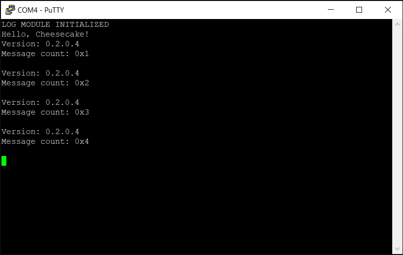

*Chapter Top* [Chapters[2]: Processor Initialization and Exceptions](chapter2.md)  |  *Next Chapter* [Chapters[3]: Processor Initialization and Exceptions](../chapter2/chapter2.md)   
*Previous Page* [Chapters[2]: Processor Initialization and Exceptions](chapter2.md)  |  *Next Page* [Exceptions and the ARM Exception Vector Table](exception-vector-table.md)

## Setting the Exception Level in the ARM Stub ([chapter2/code0](code0))

#### What We're Baking With

```bash
ccos4rbpi:~$ tree
.
├── Makefile
├── arch
│   └── arm64
│       ├── board
│       │   └── raspberry-pi-4
│       │       ├── config.txt
│       │       ├── mini-uart.S
│       │       ├── mini-uart.c
│       │       └── secure_boot.S
│       ├── include
│       │   └── arch
│       │       ├── bare-metal.h
│       │       └── timing.h
│       ├── linker.ld
│       ├── main.S
│       └── timing.S
├── build.sh
├── include
│   └── cake
│       ├── log.h
│       └── types.h
└── src
    ├── cheesecake.c
    └── log.c
```

The [arch/arm64/include/arch/bare-metal.h](code0/arch/arm64/include/arch/bare-metal.h) begins with one convenience macro establish a bit is set in the system registers we will be setting up in this section:

```C
#ifndef _ARCH_BARE_METAL_H
#define _ARCH_BARE_METAL_H

#define BIT_SET(pos)                (1 << (pos))

#endif
```

#### ARM Processor Exception Levels

Before diving in to the dirty details of the ARM Stub, we take a gentle detour into ARM Processor Exception Levels. An ARMv8 processor has `4` exception levels. The highest exception level - the most priveldeged -  is Exception Level EL3. EL3 is the Exception Level the processor resets with. EL3 has access to all system registers. 

Exception Level EL2 is used to implement a hypervisor, or virtualization. If the lowest level software, the operating system, is implemented for EL2, the system can support mutliple operating systems (imagine Linux and Windows), often referred to as "guest" operating systems in the literature. 

Most operating systems operate at EL1, including Linux and ultimately CheesecakeOS. EL0, the least privledged Exception Level, is for userspace. As we progress, we will see how EL1 is able to securely deliver to EL0 the services needed to make user space software operate in the way we have come to depend on. 

>A quick note about system registers: they are generally referred to as ${REGISTER_NAME}_${EXCEPTION_LEVEL}, where ${EXCEPTION_LEVEL} is the minimum level from which the register may be accessed.

The quick summary of Processor Exception Levels looks like:

| Exception Level | Purpose |
|:---------------:|:-------:|
| EL3 | Most priviledged; sercure mode; the reset state |
| EL2 | Hypervisor;  Used to implement virutalization |
| EL1 | Guest OS; Where CheesecakeOS Kernel lives |
| EL0 | Userspace |

In order to properly initalize our processors, we will have to setup some system registers with sane values at boot time. To start, the board-specific [arch/arm64/board/raspberry-pi-4/secure-boot.S](code0/arch/arm64/board/raspberry-pi-4/secure-boot.S) source is respnsible for setting up the board and processors such that the remainder of the boot process can be handled by [arch/arm64/main.S](code0/arch/arm64/main.S):

```asm
#define SCR_EL3_RW          BIT_SET(10)
#define SCR_EL3_SMD         BIT_SET(7)
#define SCR_EL3_RES1_5      BIT_SET(5)
#define SCR_EL3_RES1_4      BIT_SET(4)
#define SCR_EL3_NS          BIT_SET(0)
#define SCR_EL3_VALUE       (SCR_EL3_RW | \
                             SCR_EL3_SMD | \
                             SCR_EL3_RES1_5 | \
                             SCR_EL3_RES1_4 | \
                             SCR_EL3_NS)
```

`SCR_EL3`, the Secure Configuration Register, is described on `pg. 2648` of the `ARM ARM`:
- `SCR_EL3_RW` determines that `EL1`, our target Exception Level, will execute in the `AArch64` execution state
- `SCR_EL3_SMD` disables secure monitor calls - once we leave `EL3`, there will be no returning
- `SCR_EL3_RES1_5` and `SCR_EL3_RES1_4` are required to be set
- `SCR_EL3_NS` is the non-secure bit, indicating that we will be running in the non-secure state (no access to "secure" world)

```asm
#define SPSR_EL3_D          BIT_SET(9)
#define SPSR_EL3_A          BIT_SET(8)
#define SPSR_EL3_I          BIT_SET(7)
#define SPSR_EL3_F          BIT_SET(6)
#define SPSR_EL3_EL1h       0b0101
#define SPSR_EL3_VALUE      (SPSR_EL3_D | \
                             SPSR_EL3_A | \
                             SPSR_EL3_I | \
                             SPSR_EL3_F | \
                             SPSR_EL3_EL1h)
```

`SPSR_EL3`, the `EL3` Saved Program Status Register must be initalized with the Exception Level we would like to be in when we leave `EL3`:
- `SPSR_EL3_D`, `SPSR_EL3_A`, `SPSR_EL3_I`, and `SPSR_EL3_F` mask all exceptions
- `SPSR_EL3_EL1h` lets the system know to use `EL1` with its own designated stack pointer when leaving `EL3`

```asm
#define HCR_EL2_RW          BIT_SET(31)
#define HCR_EL2_VALUE       HCR_EL2_RW
```

`HCR_EL2`, the Hypervisor Configuration Register, is described on `pg. 2487` of the `ARM ARM`. 
- `HCR_EL2_RW` determines that `EL1`, our target Exception Level, will execute in the `AArch64` execution state

```asm
#define SCTLR_EL1_RES1_29   BIT_SET(29)
#define SCTLR_EL1_RES1_28   BIT_SET(28)
#define SCTLR_EL1_RES1_23   BIT_SET(23)
#define SCTLR_EL1_RES1_22   BIT_SET(22)
#define SCTLR_EL1_RES1_20   BIT_SET(20)
#define SCTLR_EL1_RES1_11   BIT_SET(11)
#define SCTLR_EL1_VALUE     (SCTLR_EL1_RES1_29 | \
                             SCTLR_EL1_RES1_28 | \
                             SCTLR_EL1_RES1_23 | \
                             SCTLR_EL1_RES1_22 | \
                             SCTLR_EL1_RES1_20 | \
                             SCTLR_EL1_RES1_11)
```

`SCTLR_EL1`, the System Control Register, is described on `pg. 2654` of the `ARM ARM`. For now only the required RES1 bits are set. Notably, caches and the Memory Management Unit are left disabled for now.

#### The ARM Stub

Given the configuration - the CheesecakeOS config.txt disables command-line tags, is loaded at address `0x0`, and always uses the High Peripheral memory map - we must provide our own ARM stub. The board-specific aspects of our secure boot are mostly borrowed from the [RaspberryPi ARM Stub](https://github.com/raspberrypi/tools/blob/master/armstubs/armstub8.S):

```asm
#include "arch/bare-metal.h"

#define LOCAL_CONTROL       0x4c0000000
#define LOCAL_PRESCALER     0x4c0000008

#define OSC_FREQ            54000000

#define L2CTLR_EL1          s3_1_c11_c0_2
#define L2CTLR_EL1_VALUE    0b00100010

#define CPUECTLR_EL1        s3_1_c15_c2_1
#define CPUECTLR_EL1_SMPEN  BIT_SET(6)

.globl __secure_board_specific_setup
__secure_board_specific_setup:
    mov     x28, x30
    bl      __setup_local_control
    bl      __setup_cortex_a72_regs
    bl      __setup_arm_arch_regs
    mov     x30, x28
    ret

__setup_local_control:
    ldr     x0, =LOCAL_CONTROL
    str     wzr, [x0]
    mov     w1, 0x80000000
    str     w1, [x0, #(LOCAL_PRESCALER - LOCAL_CONTROL)]
    dsb     sy
    isb
    ret

__setup_cortex_a72_regs:
    mrs     x0, L2CTLR_EL1
    mov     x1, L2CTLR_EL1_VALUE
    orr     x0, x0, x1
    msr     L2CTLR_EL1, x0
    mov     x0, #CPUECTLR_EL1_SMPEN
    msr     CPUECTLR_EL1, x0
    ldr     x0, =OSC_FREQ
    msr     cntfrq_el0, x0
    msr     cntvoff_el2, xzr
    mov     x0, 0x33ff
    msr     cptr_el3, x0
    mov     x0, #ACTLR_EL3_VALUE
    msr     actlr_el3, x0
    dsb     sy
    isb
    ret

__setup_arm_arch_regs:
    ldr     x0, =SCR_EL3_VALUE
    msr     scr_el3, x0
    ldr     x0, =HCR_EL2_VALUE
    msr     hcr_el2, x0
    ldr     x0, =SCTLR_EL1_VALUE
    msr     sctlr_el1, x0
    ldr     x0, =SPSR_EL3_VALUE
    msr     spsr_el3, x0
    dsb     sy
    isb
    ret
```

When the `__secure_board_specific_setup` routine returns to [arch/arm64/main.S](code0/arch/arm64/main.S), the system registers are properly setup to execute the `eret` instruction and place the processor in `EL1`:

```asm
.globl __entry
__entry:
    bl      __secure_board_specific_setup
    adr     x0, __el1entry
    msr     elr_el3, x0
    eret
```

Building and running CheesecakeOS will not look materially different. But perhaps you can _feel_ better now that the processor has been initalized:



*Chapter Top* [Chapters[2]: Processor Initialization and Exceptions](chapter2.md)  |  *Next Chapter* [Chapters[3]: Processor Initialization and Exceptions](../chapter2/chapter2.md)   
*Previous Page* [Chapters[2]: Processor Initialization and Exceptions](chapter2.md)  |  *Next Page* [Exceptions and the ARM Exception Vector Table](exception-vector-table.md)

