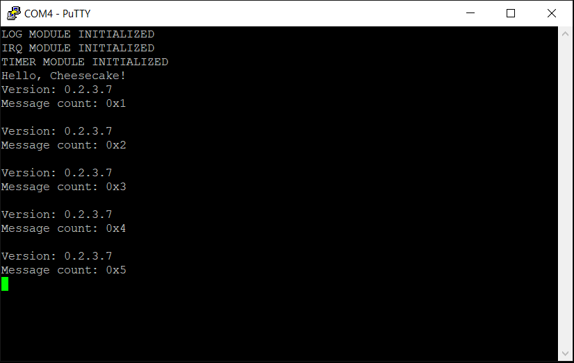

*Chapter Top* [Chapters[2]: Processor Initialization and Exceptions](chapter2.md)  |  *Next Chapter* [Chapters[3]: Processor Initialization and Exceptions](../chapter3/chapter3.md)   
*Previous Page* [The Interrupt Controller](interrupt-controller.md)  |  *Next Page* [Chapters[3]: Processor Initialization and Exceptions](../chapter3/chapter3.md)

## Timer Interrupts ([chapter2/code3](code3))

#### What We're Baking With
```bash
ccos4rbpi:~$ tree
.
├── Makefile
├── arch
│   └── arm64
│       ├── board
│       │   └── raspberry-pi-4
│       │       ├── config.txt
│       │       ├── include
│       │       │   └── board
│       │       │       ├── bare-metal.h
│       │       │       ├── devio.h
│       │       │       ├── gic.h
│       │       │       └── peripheral.h
│       │       ├── irq.S
│       │       ├── irq.c
│       │       ├── mini-uart.S
│       │       ├── mini-uart.c
│       │       ├── secure-boot.S
│       │       ├── timer.S
│       │       └── timer.c
│       ├── entry.S
│       ├── error.c
│       ├── exec
│       │   └── asm-offsets.c
│       ├── include
│       │   └── arch
│       │       ├── bare-metal.h
│       │       ├── irq.h
│       │       ├── linux-extension.h
│       │       └── process.h
│       ├── irq.S
│       ├── linker.ld
│       └── main.S
├── build.sh
├── include
│   └── cake
│       ├── log.h
│       └── types.h
├── kernel8.img
└── src
    ├── cheesecake.c
    └── log.c

```

Having previously put in place the backbone for IRQ handling, in this section we add management of a system timer.

#### The System Timer

Timer interrupts are the soul of any preemptive operating system. Without them, processes would have to play kind and yield the processor to other tasks. A processes could completely dominate a system if it so chose. Fair scheduling would be a different game. In this section we are going to manage one of the system timers of the Raspberry Pi 4. We choose to use `System Timer #3`, as that is the one used in the [RaspberryPiOS Linux Source](https://github.com/raspberrypi/linux/blob/rpi-5.10.y/drivers/clocksource/bcm2835_timer.c#L27). The device is initalized and managed in [arch/arm64/board/raspberry-pi-4/timer.c](code3/arch/arm64/board/raspberry-pi-4/timer.c):

```C
#define INTERRUPT_INTERVAL  (1000000)

extern unsigned int __timer_clock_low();
extern void __timer_control_reset();
extern void __timer_set_compare(unsigned int compare);

static unsigned int current;

void timer_init()
{
    current = __timer_clock_low();
    current += INTERRUPT_INTERVAL;
    __timer_set_compare(current);
}

void timer_interrupt()
{
    timer_init();
    __timer_control_reset();
}
```

The `INTERRUPT INTERVAL` is defined to be `1000000`, which will make the interrupt trigger after one second - the system timer is a `1MHz` clock. The source makes use of the low level devicec managment assembly in [arch/arm64/board/raspberry-pi-4/timer.S](code3/arch/arm64/board/raspberry-pi-4/timer.S):

```asm
#define TIMER_BASE_REG  (MAIN_PERIPH_BASE + 0x2003000)
#define TIMER_CS        ((TIMER_BASE_REG) + 0x0)
#define TIMER_CLO       ((TIMER_BASE_REG) + 0x4)
#define TIMER_C3        ((TIMER_BASE_REG) + 0x18)

#define TIMER_CHANNEL   (3)
#define TIMER_CS_M3     (1 << (TIMER_CHANNEL))

.globl __timer_clock_low
__timer_clock_low:
    __MOV_Q         x0, TIMER_CLO
    __DEV_READ_32   w0, x0
    ret

.globl __timer_control_reset
__timer_control_reset:
    mov             w0, TIMER_CS_M3
    __MOV_Q         x1, TIMER_CS
    __DEV_WRITE_32  w0, x1
    ret

.globl __timer_set_compare
__timer_set_compare:
    __MOV_Q         x1, TIMER_C3
    __DEV_WRITE_32  w0, x1
    ret
```

The registers in use here are found in _Chapter 10. System Timer_ of the [BCM2711 ARM Peripherals Manual](https://www.raspberrypi.org/documentation/hardware/raspberrypi/bcm2711/rpi_DATA_2711_1p0.pdf). The `__timer_control_reset` call is necessary, in order to clear the interrupt line - otherwise interrupts will be raised constantly, instead of after one second.

#### Handling the System Timer Interrupt

Our code in beautiful, our will, strong, and our hearts pure. But without more initalization, timer interrupts still will not reach our processor. This is because all interrupts are managed by the GIC, and `System Timer #3` has not yet been enabled there. This is taken care of in [arch/arm64/board/raspberry-pi-4/irq.c](code3/arch/arm64/board/raspberry-pi-4/irq.c):

```C
#define SPID_TIMER3     (0x63)

extern void __irq_enable_spid(unsigned long spid);
extern void __irq_target_cpumask(unsigned long spid, unsigned long mask);

static void enable_irq_target_cpu()
{
    __irq_target_cpumask(SPID_TIMER3, CPU0_MASK);
}

static void init_irq_registers()
{
    __irq_enable_spid(SPID_TIMER3);
}

void irq_init()
{
    init_irq_registers();
    enable_irq_target_cpu();
}
```

The value `0x63` or `99` for `SPID_TIMER3` comes from *Chapter 6. Interrupts of the [BCM2711 ARM Peripherals Manual](https://www.raspberrypi.org/documentation/hardware/raspberrypi/bcm2711/rpi_DATA_2711_1p0.pdf). The initalization function makes use of an extended low-level interface from [arch/arm64/board/raspberry-pi-4/irq.S](code3/arch/arm64/board/raspberry-pi-4/irq.S):

```asm
.globl __irq_enable_spid
__irq_enable_spid:
    mov             x13, #5
    lsr             x1, x0, x13
    mov             x13, #2
    lsl             x1, x1, x13
    __MOV_Q         x3, GICD_ISENABLER_OFFSET
    add             x3, x3, x1
    and             w2, w0, #0x1f
    mov             x0, #1
    lsl             w2, w0, w2
    __DEV_WRITE_32  w2, x3
    isb
    ret

.globl __irq_target_cpumask
__irq_target_cpumask:
    mov             w3, #3
    and             w3, w0, w3
    lsl             w3, w3, #3
    lsl             w1, w1, w3
    mov             w3, #~(3)
    and             w2, w0, w3
    __MOV_Q         x3, GICD_ITARGETSR_OFFSET
    add             x3, x3, x2
    __DEV_READ_32   w4, x3
    orr             w4, w4, w1
    __DEV_WRITE_32  w4, x3
    isb
    ret
```

The `__irq_enable_spid` routine ensures the correct bit representing the desired interrupt is set in the correct *GICD_ISENABLERn* register. For SPID `99`, the value is first shifted right by `5` bits (divide by `32`), leaving a value of `3`. Next, the value is shifted left by `2` bits (multiply by `4`), giving a value of `12`. This value is added to the base *GICD_ISENABLER_OFFSET*, which is equivelent to *GICD_ISENABLER3*. Subsequently, the original value `99` has the least significant `5` bits masked (modulo `32`), giving a value of `3`. This is used as the shift value for a bit written to the calculated register.

The `__irq_target_cpumask` routine has similar logic to ensure the correct bits are set in the correct *GICD_ITARGETSRn* register.

Back, to [arch/arm64/board/raspberry-pi-4/irq.c](code3/arch/arm64/board/raspberry-pi-4/irq.c), we spin in a loop handling all valid pending interrupt requests for this CPU:

```C
void handle_irq()
{
    do {
        unsigned int irq = __irq_acknowledge();
        unsigned int irqid = IRQ_IRQID_VALUE(irq);
        if(irqid < 1020) {
            __irq_end(irq);
            switch(irqid) {
                case SPID_TIMER3:
                    timer_interrupt();
                    break;
                default:
                    log("Encountered Undefined Interrupt: %x\r\n");
                    break;
            }
        }
        else {
            break;
        }
    } while(1);
}
```

If we receive a `System Timer 3` interrupt, we will call the `timer_interrupt` function from the timer module and reset the interrupt line before returning. This code masks off the information from the interrupt acknowledgment that is not the id of the IRQ for the switch statement logic. As is suggested by the GIC Documentation, the entire value, however, is written to the *GICD_EOIR*.

#### Last Step: Enabling IRQs

Our system has started with all exceptions masked, so we will receive no interrupts until they are unmasked. To help us, there is some architecture-specific low-level interface in [arch/arm64/irq.S](code3/arch/arm64/irq.S):

```asm
.global __irq_disable
__irq_disable:
    msr     daifset, #2
    ret

.globl __irq_enable
__irq_enable:
    msr     daifclr, #2
    ret

.global __wait_for_interrupt
__wait_for_interrupt:
    wfi
    dsb     sy
    isb
    ret
```

This interface is exported to the kernel through the macros in [arch/arm64/include/arch/irq.h](code3/arch/arm64/include/arch/irq.h):

```C
#ifndef _ARCH_IRQ_H
#define _ARCH_IRQ_H

#define IRQ_DISABLE         __irq_disable
#define IRQ_ENABLE          __irq_enable
#define WAIT_FOR_INTERRUPT  __wait_for_interrupt

extern void __irq_disable();
extern void __irq_enable();
extern void __wait_for_interrupt();

#endif
```

It is now possible to remove our ugly `DELAY` functionality in [src/cheescake.c](code3/src/cheesecake.c], and use `WAIT_FOR_INTERRUPT` instead:

```C
void cheesecake_main(void)
{
    unsigned long count = 1;
    char *version = "0.2.3.7";
    init();
    log("Hello, Cheesecake!\r\n");
    IRQ_ENABLE();
    while (1) {
        log("Version: %s\r\n", version);
        log("Message count: %x\r\n", count++);
        log("\r\n");
        WAIT_FOR_INTERRUPT();
    }
}
```

We now have IRQs enabled after initalization, and our `cheesecake_main` while loop waiting for interrupts on each iteration. Building and running should finally lead to a noticable difference in output. The delay between each iteration through the loop should more reliably match approximately `1` second! And, if everything has gone right, it may well look something like:



*Chapter Top* [Chapters[2]: Processor Initialization and Exceptions](chapter2.md)  |  *Next Chapter* [Chapters[3]: Processor Initialization and Exceptions](../chapter3/chapter3.md)   
*Previous Page* [The Interrupt Controller](interrupt-controller.md)  |  *Next Page* [Chapters[3]: Processor Initialization and Exceptions](../chapter3/chapter3.md)
