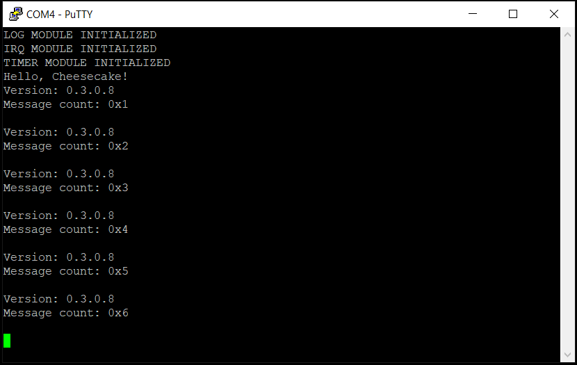

*Chapter Top* [Chapters[3]: Memory Management Unit](chapter3.md)  |  *Next Chapter* [Chapters[4]: Caches](../chapter4/chapter4.md)  
*Previous Page*  [ARM Page Tables](arm-page-tables.md) |  *Next Page* [Linear Mapping the Entire Physical Address Space](linear-mapping.md)

## Establishing Boot Tables([chapter3/code0](code0))

#### What We're Baking With
```bash
ccos4rbpi:~$ tree
.
├── Makefile
├── arch
│   └── arm64
│       ├── board
│       │   └── raspberry-pi-4
│       │       ├── config.txt
│       │       ├── include
│       │       │   └── board
│       │       │       ├── bare-metal.h
│       │       │       ├── devio.h
│       │       │       ├── gic.h
│       │       │       └── peripheral.h
│       │       ├── irq.S
│       │       ├── irq.c
│       │       ├── mini-uart.S
│       │       ├── mini-uart.c
│       │       ├── secure-boot.S
│       │       ├── timer.S
│       │       └── timer.c
│       ├── entry.S
│       ├── error.c
│       ├── exec
│       │   └── asm-offsets.c
│       ├── include
│       │   └── arch
│       │       ├── bare-metal.h
│       │       ├── irq.h
│       │       ├── linux-extension.h
│       │       ├── page.h
│       │       └── process.h
│       ├── irq.S
│       ├── linker.template
│       └── main.S
├── build.sh
├── cheesecake.conf
├── config
│   └── config.py
├── include
│   └── cake
│       ├── log.h
│       └── types.h
└── src
    ├── cheesecake.c
    └── log.c
```

Our infantile operating system is starting to get some meat on its bones! In this section, we have added a configurable aspect to the build, increased the capabilities of the linker script, and created boot-time page tables that will ultimately allow us to enable the Mermory Mangement Unit.

#### CheesecakeOS Configured Build System

The CheesecakeOS build system is significantly simpler than KBuild, the Linux build system. For our needs we have created a configuration file of `key`=`value` pairs in [cheesecake.conf](code0/cheesecake.conf):

```bash
ccos4rbpi:~$ cat cheesecake.conf
PAGE_SHIFT=12
TEXT_OFFSET=0
VA_BITS=48
```

These configurations are exported to the build of the kernel through a host program that creates a config header file. The source for the header file is located in [config/config.py](code0/config/config.py):

```python
#!/usr/bin/env python

import sys

print('#ifndef _CONFIG_CONFIG_H')
print('#define _CONFIG_CONFIG_H')
for line in sys.stdin:
    config = line.strip().split('=')
    print('#define {0}              {1}'.format(config[0], config[1]))
print('#endif')
```

This setup allows us to easily set or adjust compile-time constants as needed. The `PAGE_SHIFT` variable is immediately put to good use in the [arch/arm64/include/arch/page.h](code0/arch/arm64/include/arch/page.h) header:

```C
#ifndef _ARCH_PAGE_H
#define _ARCH_PAGE_H

#include "config/config.h"

#define PAGE_TABLE_LEVELS           (4)
#define TABLE_SHIFT                 (9)
#define PMD_SHIFT                   (PAGE_SHIFT + (1 * TABLE_SHIFT))
#define PUD_SHIFT                   (PAGE_SHIFT + (2 * TABLE_SHIFT))
#define PGD_SHIFT                   (PAGE_SHIFT + (3 * TABLE_SHIFT))

#define NUM_ENTRIES_PER_TABLE       ((UL(1)) << (TABLE_SHIFT))
#define TABLE_INDEX_MASK            ((NUM_ENTRIES_PER_TABLE) - 1)
#define PAGE_SIZE                   ((UL(1)) << PAGE_SHIFT)
#define PAGE_MASK                   (~((PAGE_SIZE) - 1))
#define SECTION_SIZE                ((UL(1)) << (PMD_SHIFT))
#define SECTION_MASK                (~((SECTION_SIZE) - 1))

#endif
```

#### Flexing with the Linker Script

The linker script, now a template in [arch/arm64/linker.template](code0/arch/arm64/linker.template) has taken on new responsibilities:

```C
#include "config/config.h"
#include "arch/bare-metal.h"
#include "arch/page.h"

#define IDMAP_DIR_SIZE              (PAGE_SIZE * (PAGE_TABLE_LEVELS - 1))
#define PAGE_GLOBAL_DIR_SIZE        (PAGE_SIZE * (PAGE_TABLE_LEVELS - 1))
```

The `arch/page.h` is included in order to used the `PAGE_TABLE_LEVELS` macro - set equal to the number of bytes for three pages - 12KB.

```C
OUTPUT_ARCH(aarch64)
ENTRY(_start)
SECTIONS
{
    . = TEXT_OFFSET;
    .text.boot : {
        _start = .;
        *(.text.boot)
    }
    .text : {
        . = ALIGN(PAGE_SIZE);
        _idmap_text_start = .;
        *(.idmap.text)
        _idmap_text_end = .;
        *(.text)
    }
```

A special `.idmap.text` section has been created. This section will have code that is _idmapped_ - in other words the code in this section will be setup in a page table such that the virual address is equal to the physical address. 

```C
    . = ALIGN(SECTION_SIZE);
    _kernel_text_end = .;
```

A _section_ is the block size that is one level above a page, in our case 2MB. It is the size of our blocks when we leave out one level of translation, using three levels instead of two. Our mappings for kernel page tables will use these section-based mappings.

```C
    .rodata : {
        *(.rodata)
    }
    .data : {
        *(.data)
    }
    . = ALIGN(PAGE_SIZE);
    page_global_dir = .;
    . += PAGE_GLOBAL_DIR_SIZE;
    end_page_global_dir = .;
```

At the end of the `.data` section, and before the `.bss` section, we statically allocate 12KB of space alligned to the size of a page. This represents 3 pages, 1 PGD, 1 PUD, and 1 PMD. Each entry in the PMD, recall, can map 2MB blocks - our math seems to be working so far! The head of this space will ultimately be assigned as the base register for `TTBR1_EL1`.

```C
    . = ALIGN(0x8);
    bss_begin = .;
    .bss : {
        *(.bss*)
    }
    bss_end = .;
    . = ALIGN(PAGE_SIZE);
    init_stack = .;
    . += INIT_STACK_SIZE;
    . = ALIGN(SECTION_SIZE);
    _end_permenant_image = .;
    init_overwrite_storage = .;
    page_idmap_dir = .;
    . += IDMAP_DIR_SIZE;
    end_page_idmap_dir = .;
    . = ALIGN(SECTION_SIZE);
    _end = .;
}
```

After the `.bss` section, we allocate space for the initial stack for `CPU 0`. We also create a overwritable area where we create space for the identity mapping page tables, also with three pages. After the initaliztion is finished, this space can be returned to our memory allocated to be repurposed otherwise.

This template is made possible by a trick where we use the `C Preprocessor` to process - but not compile - our template and place the resolution in the `.build` directory for further use by make. The magic can be found in the [Makefile](code0/Makefile):

```make
$(BUILD_DIR)/linker.ld: $(ARCH_SRC_DIR)/linker.template
    mkdir -p $(@D)
    gcc -E -x c \
        -I$(ARCH_INCLUDE_DIR)             \
        -I$(CONFIG_GEN_DIR)               \
        -D__LINKER__                      \
        $(ARCH_SRC_DIR)/linker.template | \
        grep -v "^#" > $(BUILD_DIR)/linker.ld
```

If you were to build the source at this moment and view the memory map in `.build/kernel8.map`, you should see the following included:

```
0000000000000000 T __entry
0000000000001000 T _idmap_text_end
0000000000001000 T _idmap_text_start
0000000000200000 R _kernel_text_end
0000000000201000 B page_global_dir
0000000000204000 B end_page_global_dir
0000000000400000 B _end_permenant_image
0000000000400000 B init_overwrite_storage
0000000000400000 B page_idmap_dir
0000000000403000 B end_page_idmap_dir
0000000000600000 B _end
```

Thus, our alignment and sizes is looking correct so far.

#### Loading the Boot Tables

In order to facilitate boot tables, additional useful macros are provied in [arch/arm64/include/arch/page.h](code0/arch/arm64/include/arch/page.h):

```C
#define PAGE_TABLE_AF               BIT_SET(10)
#define PAGE_TABLE_BLOCK            BIT_SET(0)
#define PAGE_TABLE_TABLE            (0b11)
#define PAGE_TABLE_SH               (0b11 << 8)
#define PAGE_TABLE_ATTR(n)          (n << 2)


#define NORMAL_INIT_MMU_FLAGS       PAGE_TABLE_AF | \
                                    PAGE_TABLE_SH | \
                                    PAGE_TABLE_ATTR((MT_NORMAL_NC)) | \
                                    PAGE_TABLE_BLOCK

#define MAIR(attr, mt)              ((attr) << ((mt) * 8))
#define MT_DEVICE_nGnRnE            (0)
#define MT_DEVICE_nGnRE             (1)
#define MT_DEVICE_GRE               (2)
#define MT_NORMAL_NC                (3)
#define MT_NORMAL                   (4)
#define MT_NORMAL_WT                (5)
#define MAIR_REGISTER_VALUE         MAIR(0b00000000, MT_DEVICE_nGnRnE) | \
                                    MAIR(0b00000100, MT_DEVICE_nGnRE) | \
                                    MAIR(0b00001100, MT_DEVICE_GRE) | \
                                    MAIR(0b01000100, MT_NORMAL_NC) | \
                                    MAIR(0b11111111, MT_NORMAL) | \
                                    MAIR(0b10111011, MT_NORMAL_WT)

#define TCR_T0SZ_SHIFT              (0)
#define TCR_T1SZ_SHIFT              (16)

#define TCR_T0SZ                    (((UL(64)) - (VA_BITS)) << (TCR_T0SZ_SHIFT))
#define TCR_IRGN0                   BIT_NOT_SET(9) | BIT_NOT_SET(8)
#define TCR_ORGN0                   BIT_NOT_SET(11) | BIT_NOT_SET(10)
#define TCR_SH0                     BIT_NOT_SET(13) | BIT_NOT_SET(12)
#define TCR_TG0                     BIT_NOT_SET(15) | BIT_NOT_SET(14)
#define TCR_T1SZ                    (((UL(64)) - (VA_BITS)) << (TCR_T1SZ_SHIFT))
#define TCR_A1                      BIT_SET(22)
#define TCR_IRGN1                   BIT_NOT_SET(25) | BIT_NOT_SET(24)
#define TCR_ORGN1                   BIT_NOT_SET(27) | BIT_NOT_SET(26)
#define TCR_SH1                     BIT_NOT_SET(29) | BIT_NOT_SET(28)
#define TCR_TG1                     BIT_SET(31) | BIT_NOT_SET(30)
#define TCR_IPS_48BIT               BIT_SET(34) | BIT_NOT_SET(33) | BIT_SET(32)
#define TCR_AS                      BIT_SET(36)

#define TCR_INIT_CONFIG             TCR_T0SZ | \
                                    TCR_IRGN0 | \
                                    TCR_ORGN0 | \
                                    TCR_SH0 | \
                                    TCR_TG0 | \
                                    TCR_T1SZ | \
                                    TCR_A1 | \
                                    TCR_IRGN1 | \
                                    TCR_ORGN1 | \
                                    TCR_SH1 | \
                                    TCR_TG1 | \
                                    TCR_IPS_48BIT | \
                                    TCR_AS
```

Enough has been put in place to allow us to start creating our first page tables for use by the kernel. The work happens in [arch/arm64/main.S](code0/arch/arm64/main.S) through a series of new macros and routines:

```asm
#include "config/config.h"
#include "arch/page.h"

    .macro __ZERO_PAGE_TABLE, start, end
        adrp            x0, \start
        adrp            x1, \end
        sub             x1, x1, x0
    9999:
        stp             xzr, xzr, [x0], #16
        stp             xzr, xzr, [x0], #16
        stp             xzr, xzr, [x0], #16
        stp             xzr, xzr, [x0], #16
        subs            x1, x1, #64
        b.ne            9999b
    .endm


__create_page_tables:
    __ZERO_PAGE_TABLE   page_idmap_dir, end_page_idmap_dir
    __ZERO_PAGE_TABLE   page_global_dir, end_page_global_dir
```

The `__create_page_tables` routine begins by iterating through the entire 12KB of our `page_global_dir`, and `page_idmap_dir` page tables and zeroing them, one cacheline at a time. This is a safe operation, as we know, a priori, the boundries and alignment of the page tables.

```
    .macro __CREATE_TABLE_ENTRY, tbl, virt, shift, num, tmp1, tmp2
        lsr     \tmp1, \virt, #\shift
        and     \tmp1, \tmp1, #\num - 1
        add     \tmp2, \tbl, #PAGE_SIZE
        orr     \tmp2, \tmp2, #PAGE_TABLE_TABLE
        str     \tmp2, [\tbl, \tmp1, lsl #3]
        add     \tbl, \tbl, #PAGE_SIZE
    .endm

    .macro __CREATE_PGD, tbl, virt, tmp1, tmp2
        __CREATE_TABLE_ENTRY    \tbl, \virt, PGD_SHIFT, NUM_ENTRIES_PER_TABLE, \tmp1, \tmp2
        __CREATE_TABLE_ENTRY    \tbl, \virt, PUD_SHIFT, NUM_ENTRIES_PER_TABLE, \tmp1, \tmp2
    .endm

    mov                 x7, NORMAL_INIT_MMU_FLAGS
    adrp                x0, page_idmap_dir
    adrp                x3, _idmap_text_start
    __CREATE_PGD        x0, x3, x5, x6
```

Next, the `__create_page_tables` routine places the value of `NORMAL_INIT_MMU_FLAGS` into `x7` for later use, and creates the PGD for the identity mapping table. For now, the init flags indicate that memory is non-cacheable. The caches are currently disabled, as we left them off when entering `EL11. We will update when we enable the caches. For the `__CREATE_PGD` macro here, these values are used:

- `tbl`, or `x0`, is `page_idmap_dir`, we saw above from the kernel memory map that this is address `0x400000`
- `virt`, or `x3`, is `__idmap_text_start`, we saw above from the kernel memory map that this is address `0x1000`
- `x5` and `x6` are used as temporary scratch registers that can be clobbered, and are passed along to the `__CREATE_TABLE_ENTRY` macro

The `__CREATE_PGD` macro delegates all interesting work to the `__CREATE_TABLE_ENTRY` macro, which is uses twice, once with the `PGD_SHIFT`, once with `PUD_SHIFT`. In both cases, 512 is the number of entries per table, as previously discussed (4KB / 8-byte pointers).

The `__CREATE_TABLE_ENTRY` macro begins by calculating the index for the PGD or PUD level, by logically shifting to the right by the correct shift amound, and the masking off bits above the nine least significant bits. This value is saved in one of the temporary registers. The other temporary register stores value to be placed in the index - the PUD address in the case of working with the PGD, or the PMD is case of working with the PUD. Both of these values are `orr`ed with 0x3, the value of `PAGE_TABLE_TABLE`, to indicate they are valid entries and that they point to tables instead of blocks. The last line of the macro increments the value of the table address stored in `x1` so the next level can be setup. We know, for example, after setting up the PGD that:

- The PGD index was ((`0x1000` >> 39) & 0x1FF), or 0
- `tmp2` was ((`0x400000` + 0x1000) | 0x3) or 0x401003
- The value stored in (`0x400000` + (0 << 3)) is 0x401003
- `tbl` or `x0` is now equal to `0x400000` + 0x1000, `0x401000`

After setting up the PUD:

- The PUD index was ((`0x1000` >> 30) & 0x1FF), or 0
- `tmp2` was ((`0x401000` + 0x1000) | 0x3) or 0x402003
- The value stored in (`0x401000` + (0 << 3)) is 0x402003
- `tbl` or `x0` is now equal to `0x401000` + 0x1000, `0x402000`

Continuing with our analysis of the `__create_page_tables` routine:

```asm
    .macro __BLOCK_MAP, tbl, flags, phys, start, end
        lsr     \start, \start, #PMD_SHIFT
        and     \start, \start, (NUM_ENTRIES_PER_TABLE - 1)
        lsr     \end, \end, #PMD_SHIFT
        and     \end, \end, (NUM_ENTRIES_PER_TABLE - 1)
        lsr     \phys, \phys, #PMD_SHIFT
        orr     \phys, \flags, \phys, lsl #PMD_SHIFT
     9998:
        str     \phys, [\tbl, \start, lsl #3]
        add     \start, \start, #1
        add     \phys, \phys, #SECTION_SIZE
        cmp     \start, \end
        b.ls    9998b
    .endm

    mov                 x5, x3
    __ADR_L             x6, _idmap_text_end
    __BLOCK_MAP         x0, x7, x3, x5, x6
    adrp                x0, page_global_dir
    __MOV_Q             x5, TEXT_OFFSET
    __CREATE_PGD        x0, x5, x3, x6
    adrp                x6, _end_permenant_image
    adrp                x3, _start
    sub                 x6, x6, x3
    add                 x6, x6, x5
    __BLOCK_MAP         x0, x7, x3, x5, x6
    dmb                 sy
    tlbi                vmalle1
    dsb                 sy
    isb
    ret
```

Having setup the PGD and PUD for the identity mapping table, the `__BLOCK_MAP` macro is used to setup the PMD with our `2MB` blocks. The values used as inputs into the macro in this case are:

- `tbl`, or `x0` is `0x402000`, the value set after running the `__CREATE_TABLE_ENTRY` macros
- `flags` or `x7` is `NORMAL_INIT_MMU_FLAGS`, which will be `orr`ed to indicate entries are blocks, inner sharable, accessable, valid, etc.
- `phys` or `x3` is `0x1000`
- `start` or `x5` is the virtual address we are mapping, `0x1000`, and it should be the same as the physical address as this is the identity mapping table
- `end` or `x6` is also `0x1000`, the value of `_idmap_text_end`, as there is nothing yet in the `.idmap.text` section

Like its predecessors, the `__BLOCK_MAP` macro begins by calculating indexes into the PMD, in this case start and end indexes. Since each PMD entry points to a 2MB block, and there are 512 pointers, it is possible to map up to 1GB. Our assumption is the required mapping will safely fit within this 1GB, thus requiring to initial setup or beyond what is demonstrated here. After establishing the bounds of the indexes to use, `phys`, or `x3` is properly aligned by double shifting, first right and then left. The left shift is done as part of an `orr` instruction that sets the correct block descriptor attributes. This descriptor is stored in the correct index of the PMD, and loops. Adding `SECTION_SIZE` to the descriptor on each iteration maintains the correct descriptor attributes. For the identity mapping table we know:

- The start index is equal to ((`0x1000` >> 21) & 0x1FF), or 0
- The end index is equal to ((`0x1000` >> 21) & 0x1FF), or 0
- The descriptor to be stored is equal to (((`0x1000` >> 21) << 21) | 0x70F), or 0x70F
- The value stored in (`0x4020001 + (0 << 3)) is 0x713
- The loop termintes after one iteration, and the table setup is complete

An identical procedure is used to setup the `page_global_dir`. There are some additional sublties involved with initalizing the `page_global_dir`, which are not yet transparent. We will revist this at the end of the chapter when we have enabled the MMU. After establishing these boot tables, at the end of the `__create_page_tables` routine, we invalidate the entire Translation Lookaside Buffer, or TLB, to ensure there were no stale entries on reset.

In this section we also take care to initalize `MAIR_EL1` and `TCR_EL1`. Again, most settings are for non-cacheable memory, which will need adjustment when caches are enabled:

```asm
__setup_mem_attrs:
    __MOV_Q     x5, MAIR_REGISTER_VALUE
    msr         mair_el1, x5
    dsb         sy
    isb
    ret

__setup_trans_ctrl:
    __MOV_Q     x5, TCR_INIT_CONFIG
    msr         tcr_el1, x5
    dsb         sy
    isb
    ret
```

We are not yet ready to turn on the Memory Management Unit. However, in this section we were sneaky and replaced the hardcoded initial stack with a dynamic stack area reserved by our linker template. So let us ensure at this juncture our operating system still builds and boots. If everything has gone right, you will see something resembling:



*Chapter Top* [Chapters[3]: Memory Management Unit](chapter3.md)  |  *Next Chapter* [Chapters[4]: Caches](../chapter4/chapter4.md)  
*Previous Page*  [ARM Page Tables](arm-page-tables.md) |  *Next Page* [Linear Mapping the Entire Physical Address Space](linear-mapping.md)
