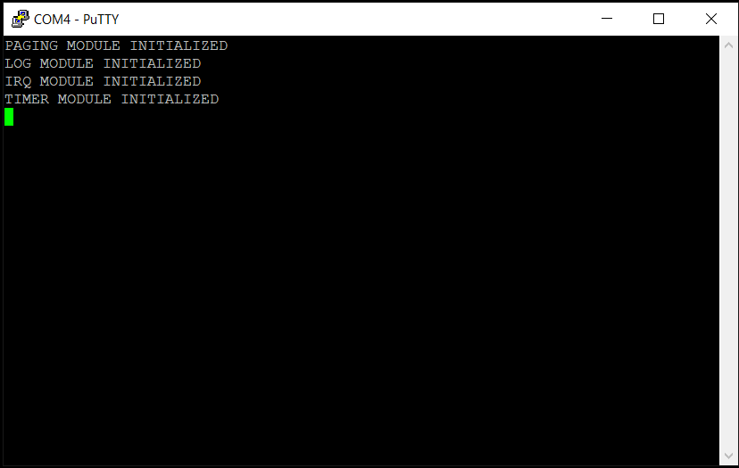

*Chapter Top* [Chapters[5]: SMP](chapter5.md) | *Next Chapter* [Chapters[6]: Memory Allocation](../chapter6/chapter6.md)  
*Previous Page* [Chapters[5]: SMP](chapter5.md) | *Next Page* [The Cantankerous Cache Bug](cache-bug.md)

## Synchronization

#### What We're Baking With

```bash
.                                                                                                                                                                                   [11/5447]
├── Makefile
├── arch
│   └── arm64
│       ├── allocate.c
│       ├── barrier.S
│       ├── board
│       │   └── raspberry-pi-4
│       │       ├── config.txt
│       │       ├── include
│       │       │   └── board
│       │       │       ├── bare-metal.h
│       │       │       ├── devio.h
│       │       │       ├── gic.h
│       │       │       └── peripheral.h
│       │       ├── irq.S
│       │       ├── irq.c
│       │       ├── memmap.c
│       │       ├── mini-uart.S
│       │       ├── mini-uart.c
│       │       ├── secure-boot.S
│       │       ├── timer.S
│       │       └── timer.c
│       ├── cache.S
│       ├── entry.S
│       ├── error.c
│       ├── event.S
│       ├── exec
│       │   └── asm-offsets.c
│       ├── include
│       │   └── arch
│       │       ├── allocate.h
│       │       ├── bare-metal.h
│       │       ├── cache.h
│       │       ├── irq.h
│       │       ├── linux-extension.h
│       │       ├── memory.h
│       │       ├── page.h
│       │       ├── process.h
│       │       ├── prot.h
│       │       └── smp.h
│       ├── irq.S
│       ├── linker.template
│       ├── main.S
│       ├── memset.S
│       ├── smp.S
│       ├── smp.c
│       └── sync.c
├── build.sh
├── cheesecake.conf
├── config
│   └── config.py
├── include
│   └── cake
│       ├── log.h
│       └── types.h
└── src
    ├── cheesecake.c
    └── log.c
```
The addition of the smp modules and the plumbing needed to run all four of the Raspberry Pi 4's CPUs simulateneous is our focus in this section.

#### The CPU Spin Pen

Up until now, all CPUs other than the primary CPU have entered an infinite sleep loop with no way out:

```asm
__sleep:
    wfe
    b       __sleep
```

This will have to change if we want to make use of our additional processors. We still want our secondary CPUs to begin in a sleeping state. We don't want multiple CPUs trampling each other while our boot process creates page tables and enters the `cheesecake_main` functon. Only the primary CPU should perform these duties. What is needed instead is a way for the primary CPU to signal to the other CPUs they may leave their sleeping state and continue with their own initialization. These CPUs must be _released_.

The dance must be correctly _synchronized_. The `page_idmap_dir` and associated table mappings exist as part of the kernel image, but in a temporary storage region we would like to be able to use after the boot process for other purposes. The primary CPU will ultimately release this memory to the allocator. This must not happen before the secondary CPUs are finished using the non-permeant storage region of the image.

To begin, the number of CPUs for the system is added as part of the configuration. Compile time knowledge of the number of CPUs will allow us to maintain per-process data structures. These strucutures will not need complex synching mechanisms between CPUs, as each CPU will only be able to access its own data:

```bash
cat cheesecake.conf
MEMORY_SIZE=MEMORY_SIZE_4GB
NUM_CPUS=4
PAGE_SHIFT=12
TEXT_OFFSET=0
VA_BITS=48
```

In [arch/arm64/linker.template](code0/arch/arm64/linker.template), we expand the temporary storage region with a `cpu_spin_pen` array: 

```C
    _end_permenant_image = .;
    init_overwrite_storage = .;
    page_idmap_dir = .;
    . += IDMAP_DIR_SIZE;
    end_page_idmap_dir = .;
    . = ALIGN(PAGE_SIZE);
    cpu_spin_pen = .;
    . += (0x8 * NUM_CPUS);
    end_cpu_spin_pen = .;
    . = ALIGN(SECTION_SIZE);
    _end = .;
```

Each CPU gets one 64-bit entry of the array. This entry is used to determine the boot-time state of the CPU. The possible states are codified in [arch/arm64/include/arch/bare-metal.h](code0/arch/arm64/include/arch/arm64/bare-metal.h):

```C
#define CPU_IN_PEN              (0b00)
#define CPU_RELEASED            (0b01)
#define CPU_INITIALIZED         (0b10)
```

It is the task of the `secure-boot` stage to initalize the `cpu_spin_pen`, as seen in [arch/arm64/board/raspberry-pi-4/secure-boot.S](code0/arch/arm64/board/raspberry-pi-4/secure-boot.S):

```asm
__setup_cpu_spin_pen:
    mrs     x0, mpidr_el1
    tst     x0, #3
    b.ne    1f
    adrp    x0, cpu_spin_pen
    stp     xzr, xzr, [x0], #16
    stp     xzr, xzr, [x0], #16
    adrp    x0, cpu_spin_pen
    mov     x1, #1
    str     x1, [x0]
    dsb     sy
    isb
1:
    ret
```

The primary CPU initalizes the four array entries to zero. Then, writes the value 1, the value corresponding to the `CPU_RELEASED` state, to is own entry. The three secondary CPUs are left in the `CPU_IN_PEN` state.

Now, in [arch/arm64/main.S](code0/arch/arm64/main.S), instead of remaining in an interminable loop, secondary CPUs check their own state to determine if they should remain in their cage:

```asm
__secondary_spin:
    wfe
    adrp    x1, cpu_spin_pen
    ldr     x2, [x1, x0, lsl #3]
    cbz     x2, __secondary_spin
    b       __secondary_init
```

The `x0` general purpose register holds the value of this processor's CPU affinity. If the `cpu_spin_pen` entry is equal to zero, the CPU continues spinning in the pen. If however, the value of the entry is not zero, the CPU will exit the spin pen and continue on with its own initalization. Of course, it is the primary CPU's task to write a non-zero value to this entry in order to release the secondary CPUs - at a point the primary CPU deems appropriate.

#### Releasing the Secondary CPUs

The `smp_init` function - which must be run at the correct time within the boot process - takes care of allocating a stack for each of the secondary CPUs, and releasing them from the spin pen. The initalization is architecture specific, and is provided in [arch/arm64/smp.c](code0/arch/arm64/smp.c):

```C
#include "config/config.h"
#include "arch/allocate.h"
#include "arch/bare-metal.h"

extern volatile unsigned long cpu_spin_pen[];

extern void __dsb_sy();
extern void __sev();

unsigned long idle_stacks[NUM_CPUS];

void smp_init()
{
    unsigned long num_alive;
    *cpu_spin_pen = CPU_INITIALIZED;
    for(unsigned long i = 1; i < NUM_CPUS; i++) {
        cpu_spin_pen[i] = CPU_RELEASED;
        idle_stacks[i] = PHYS_TO_VIRT(alloc_baby_boot_pages(8) + INIT_STACK_SIZE);
    }
```

The primary CPU, `CPU 0`, first sets the its own `cpu_spin_pen` value to `CPU_INITILIZED`. The secondary CPUs are each set to `CPU_RELEASED`, and have stack space allocated for them from the baby-boot allocator.

```
    __dsb_sy();
    __sev();
```

After all instructions and data accesses have completed, the primary CPU sends an event signal to the system in order to wake the other CPUs, which have been waiting for it with the `wfe` instruction.

```
    while(1) {
        for(num_alive = 0; num_alive < NUM_CPUS; num_alive++) {
            if(!(cpu_spin_pen[num_alive] == CPU_INITIALIZED)) {
                break;
            }
        }
        if(num_alive == NUM_CPUS) {
            break;
        }
    }
}
```

The primary CPU now spins in a loop, waiting for the other CPUs to inform they are finished with their initialization, which they do by setting their entries in the spin pin equal to the `CPU_INITIALIZED` value. After all CPUs have confirmed this state, it will be safe for the primary CPU to continue on. It will be valid to assume the temporary storage space is no longer in use.

In comparison to the primary CPU, the secondary CPUs carry out most of the same initalization steps. They simply skip over the page table creation, as that is already done by the primary CPU. In the `__secondary_init` and `__secondary_run` routines of [arch/arm64/main.S](code0/arch/arm64/main.S):

```asm
__secondary_init:
    bl      __setup_mem_attrs
    bl      __setup_trans_ctrl
    bl      __turnon_mmu
    ldr     x8, =__secondary_run
    br      x8

__secondary_run:
    __ADR_L     x0,vectors
    msr         vbar_el1, x0
    mrs         x0, mpidr_el1
    and         x0, x0, ALL_CPUS_MASK
    __ADR_L     x1, cpu_spin_pen
    mov         x2, CPU_INITIALIZED
    str         x2, [x1, x0, lsl #3]
    __ADR_L     x1, idle_stacks
    ldr         x2, [x1, x0, lsl #3]
    mov         sp, x2
    mov         x29, xzr
    mov         x30, xzr
    b           secondary_main
```

In `__secondary_run`, before branching to the `secondary_main` function, each secondary CPU writes the `CPU_INITIALIZED` value to inform the primary CPU initialization is complete for this CPU. The address of the top of the stack is pulled from the global `idle_stacks` array, and the stack pointer is initialized.

The simple `secondary_main` function is defined in [src/cheesecake.c](code0/src/cheesecake.c):

```C
void secondary_main()
{
    unsigned long cpuid = SMP_ID();
    IRQ_ENABLE();
    while(1) {
        log("CPU %x says hello!\r\n", cpuid);
        WAIT_FOR_INTERRUPT();
    }
}
```

The `SMP_ID` macro seen here, similar to the irq macros, is exported from the architecture in [arch/arm64/include/arch/smp.h](code0/arch/arm64/include/arch/smp.h):

```C
#ifndef _ARCH_SMP_H
#define _ARCH_SMP_H

#define SMP_ID  __smp_id

unsigned long __smp_id();

#endif
```

The architecture assmebly implementation of the `__smp_id` routine from [arch/arm64/smp.S](code0/arch/arm64/smp.S) is dull:

```asm
#include "arch/bare-metal.h"

.globl __smp_id
__smp_id:
    mrs     x0, mpidr_el1
    and     x0, x0, MPIDR_HWID_MASK_LITE
    ret
```

#### Secondary IRQs

We will want each CPU to react to timer interrupts. Recalling our earlier setup, we have initialized _System Timer 3_ to be used by CPU 0. The Raspberry Pi 4 has four system timers, numbered 0-3. It is intuitive to believe that each of our four cores will use the system timer that shares its index. I believe this is not possible however. I don't have any documentation to support this claim, but trial, error, and a bit of speculative googling has lead me to believe that not all system timers are available for CPU use. Two of them, _System Timer 0_ and _System Timer 2_ seem reserved for use by the Raspberry Pi 4's GPU. 

It is also unwise to attempt to use one system timer to signal all CPUs. If the system timer signals an interrupt while a processor has interrupts disabled, that iterrupt may be handled and the interrupt line deasserted before the processor has interrupts enabled again. The timer interrupt will be missed in this case.

Instead, to meet our interrupt needs, we will make use of the Software Generated Interrupt feature of the ARM Generic Interrupt Controller. CPU 0 will receive the timer interrupt from the system timer, and will then broadcast an _SGI_ to the other cores. Their are 16 interrupt ids reserved for software generated interrupts. The timer interupt SGI will have its own unique id and handing. Since SGIs are always enabled, there is no setup necessary in [arch/arm64/board/raspberry-pi-4/irq.c](code0/arch/arm64/board/raspberry-pi-4/irq.c):

```C
#define SPID_SGI_TIMER      (0x03)
#define SPID_TIMER3         (0x63)

void handle_irq()
{
    do {
        unsigned int irq = __irq_acknowledge();
        unsigned int irqid = IRQ_IRQID_VALUE(irq);
        if(irqid < 1020) {
            __irq_end(irq);
            switch(irqid) {
                case SPID_SGI_TIMER:
                    break;
                case SPID_TIMER3:
                    __irq_broadcast_sgi(SPID_SGI_TIMER);
                    timer_interrupt();
                    break;
                default:
                    log("Encountered Undefined Interrupt: %x\r\n");
                    break;
            }
        }
        else {
            break;
        }
    } while(1);
}
```

When CPU 0 receives a timer interrupt, it broadcasts an `SPID_SGI_TIMER` interrupt to the other CPUs and moves on to reset the clock for the next interrupt. The secondary CPUs will handle the interrupt as configured when received. For the present, we do nothing with the broadcasted interrupt beyond the required protocol of reading from `GICC_IAR`, and writing to `GICC_EOIR`. 

The low level mechanism for generating an SGI is in [arch/arm64/board/raspberry-pi-4/irq.S](code0/arch/arm64/board/raspberry-pi-4/irq.S):

```asm
#define SGI_TARGET_LIST_FILTER_SHIFT   (24)

.globl __irq_broadcast_sgi
__irq_broadcast_sgi:
    mov             x1, #1
    lsl             x1, x1, #SGI_TARGET_LIST_FILTER_SHIFT
    orr             x0, x0, x1
    __MOV_Q         x1, PHYS_TO_VIRT(GICD_SGIR)
    __dev_write_32  w0, x1
    ret
```

The value of the SGI, a number between 0 and 15, is `orr`ed with a target list filter value of _0b01_, and written to the _Software Generated Interrupt Register_, `GICD_SGIR`. This register's target list filter value of `0b01` indicates the interrupt should be forwarded to all CPUs with the exception of the processor that is making the request - exactly what we want.

The code in this section has not been particularly difficult or unweildy, though it has required careful contemplation, and a bit of hacking through the weeds of how the Raspberry Pi 4 hardware works. If everything has gone right, building and running should yield a result similar to:



But wait! This is not want we wanted! It seems that our CheesecakeOS has gotten stuck in the SMP initialization :scream:. What could have gone wrong!? Where was the fault in our meticulous calculation? Should be abandon this endevour and find more fruitful ways to spend our free time than hacking on a bare-metal OS?

*Previous Chapter* [Chapters[3]: Memory Management Unit](../chapter3/chapter3.md) | *Next Chapter* [Chapters[5]: SMP](../chapter5/chapter5.md)  
*Previous Page* [Turning On the MMU](../chapter3/mmu.md)  |  *Next Page* [Enabling the Caches](caches.md)
