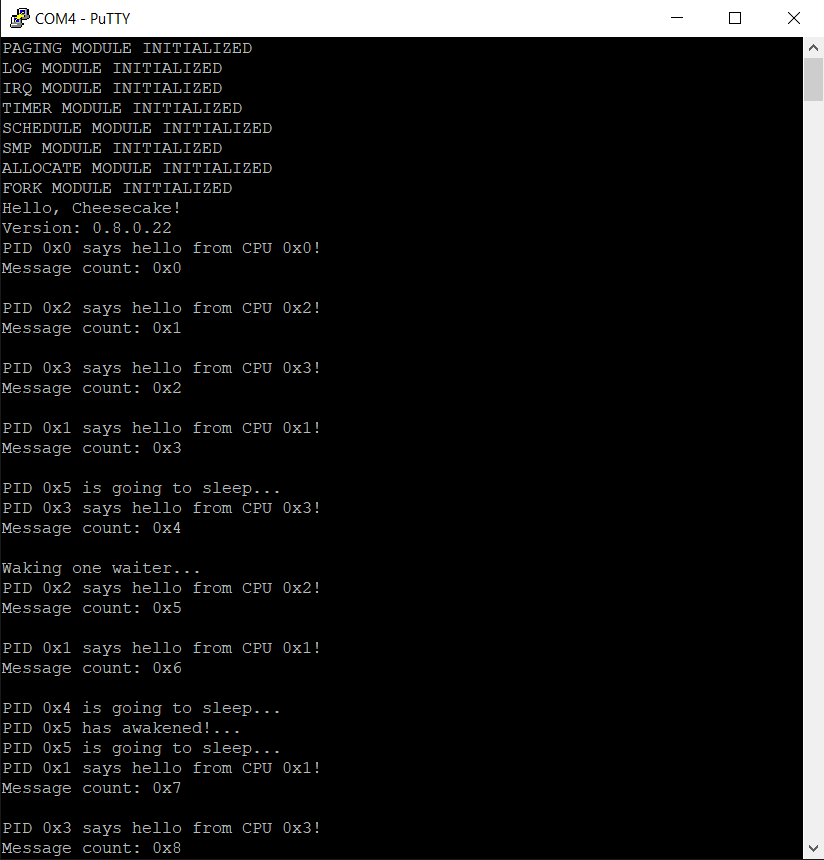

*Chapter Top* [Chapters[8]: Working and Waiting](chapter8.md) | *Next Chapter* [Chapters[9]: Virtual Memory and Fake Partition](../chapter9/chapter9.md)  
*Previous Page* [Chapters[8]: Working and Waiting](chapter8.md) | *Next Page* [The Kernel Workqueue](workqueue.md)

## Waitqueues ([chapter8/code0](code0))

#### The Sleeping Idiom

Let us return to consult an old friend, [memory-barriers.txt](https://www.kernel.org/doc/Documentation/memory-barriers.txt) from the Linux Kernel. This chapter is not about memory barriers, but the Linux Documentation contains a section titled _SLEEP AND WAKE-UP FUNCTIONS_, which we may and should consult. This section contains pertient information on how barriers must be used in an SMP system in order to avoid ordering errors in our waitqueue implementation.

The documentation also has a nice introduction to what we will refer to as the sleeping idiom. It looks like (adpated):

```C
    while(1) {
        SET_CURRENT_STATE(PROCESS_STATE_INTERRUPTABLE);
        if (event_indicated)
            break;
        schedule_self();
    }
```

A potential sleeper is primed with a process state update (!`PROCESS_STATE_RUNNING`), before checking for an event on which it depends. It then decides whether to yield the processor. If the processor is yielded, another process must set the process state to `PROCESS_STATE_RUNNING` again when the target event has completed.

The `schedule_self` function is the scheduler-entry path a process should use when voluntarily yielding the processor. Added to [src/schedule.c](code0/src/schedule.c):

```C
void schedule_self()
{
    PREEMPT_DISABLE();
    schedule();
    PREEMPT_ENABLE();
}
```

There is a latent bug in this sleeping idiom psudocode. It is possible on an iteration through the sleeper's while loop that concurrently, the event on which the sleeper depends has completed, and, on checking the state of the event the sleeper will break out of the while loop. Given current implementation, however, it is possible for a timer interrupt to occur at the worst possible momenet - between setting the state to not be running, and the check of the state of the event:

```C
    while(1) {
        SET_CURRENT_STATE(PROCESS_STATE_INTERRUPTABLE);
        ----- TIMER INTERRUPT HERE -----
        if (event_indicated)
            break;
        schedule_self();
    }
```

If the process enters the `timer_tick` function at this moment, and is scheduled away, it will not be able to be rescheduled until the state of the process is updated to be `PROCESS_STATE_RUNNING`. Further, if the target event has _already_ occured, there is no way to guarantee the event will occur again, or ever. There may be nothing to wake the process from it's slumber, even though it should not be sleeping in the first place. It was merely interrupted at the wrong time.

To eliminate this sequence of events, we update the inline `process_preemptable` check, such that only processes with a state of `PROCESS_STATE_RUNNING` are preemptable:

```C
static inline int process_preemptable(struct process *current)
{
    int preemptable = current->preempt_count == 0;
    int countdown_complete = current->tick_countdown == 0;
    int running = current->state == PROCESS_STATE_RUNNING;
    return preemptable && countdown_complete && running;
}
```
Processes that are primed for sleeping must then either voluntarily yield by calling `schedule_self`, or set their own state back to `PROCESS_STATE_RUNNING` before they can be preempted.

```C
    while(1) {
        SET_CURRENT_STATE(PROCESS_STATE_INTERRUPTABLE);
        if (event_indicated)
            break;
        schedule_self();
    }
    SET_CURRENT_STATE(PROCESS_STATE_RUNNING);
```

#### Waitqueue Implementation

Now that we are familiar with what the shape of sleeping looks like, and have made some minor adjustments to the schedule module to support it, we are ready to dive into the implementation details. A waitqueue is comprised simply of a list and a lock to protect that list. The structures are defined in [include/cake/wait.h](code0/include/cake/wait.h):

```C
#include "cake/list.h"
#include "cake/lock.h"
#include "cake/process.h"

struct waitqueue {
    struct list waitlist;
    struct spinlock lock;
};

struct wait {
    struct process *sleeping;
    struct list waitlist;
};

void dequeue_wait(struct waitqueue *waitqueue, struct wait *wait);
void enqueue_wait(struct waitqueue *waitqueue, struct wait *wait, unsigned int state);
void wake_waiter(struct waitqueue *waitqueue);
```

Each element in the waitqueue's waitlist is a `struct wait`'s waitlist. The `struct wait` object holds a reference to a sleeping process on the waitqueue. More than one process can wait on an event - though much of the time the waitqueue will either be empty or have one entry. We can now make an adjustment to the sleeping idiom psudo code that we will use to guide us in our implementation:

```C
    struct wait wait;
    wait.sleeping = CURRENT;
	while(1) {
		enqueue_wait(waitqueue, &wait, PROCESS_STATE_INTERRUPTABLE);
		if (event_indicated)
			break;
		schedule_self();
	}
	dequeue_wait(waitqueue, wait);
```

The waitqueue implementation can be found in the new wait module [src/wait.c](code0/src/wait.c). Let's begin with the `enqueue_wait` function:

```C
void enqueue_wait(struct waitqueue *waitqueue, struct wait *wait, unsigned int state)
{
    SPIN_LOCK(&(waitqueue->lock));
    if(list_empty(&(wait->waitlist))) {
        list_enqueue(&(waitqueue->waitlist), &(wait->waitlist));
    }
    SET_CURRENT_STATE(state);
    SMP_MB();
    SPIN_UNLOCK(&(waitqueue->lock));
}
```
The waitqueue lock protects not only the waitqueue from concurrent access, but also the wait objects as the sensitive aspects of their lists are manipulated after the lock is acquired. First, the waitlist member of the wait object must be empty to ensure the wait object is not added to the waitqueue multiple times. This may be more conservative than neccessary, but remember the `enqueue_wait` is called in an infinite loop, and it is not guarnateed the `struct wait` will be popped from the queue before the enqueue runs again. If the wait object's waitlist is empty, it is added to the waitqueue. The state of the current process is set to the requested state, and a memory barrier is issued before unlocking and returning to the caller.

For completeness, the `SET_CURRENT_STATE` macro, defined in [include/cake/schedule.h](code0/include/cake/schedule.h) looks like:

```C
#define SET_CURRENT_STATE(v)    WRITE_ONCE(CURRENT->state, v)
```

Whenever a sleeper exits its sleeping loop, it must reset to the state before it was primed, which it can accomplish with a call to the `dequeue_wait` function:

```C
void dequeue_wait(struct waitqueue *waitqueue, struct wait *wait)
{
    SPIN_LOCK(&(waitqueue->lock));
    if(!list_empty(&(waitqueue->waitlist))) {
        list_delete(&(wait->waitlist));
    }
    SET_CURRENT_STATE(PROCESS_STATE_RUNNING);
    SPIN_UNLOCK(&(waitqueue->lock));
}
```

If the waitqueue is empty, there is no action to take for the wait object. Otherwise, it is removed from the waitqueue. The state of the process is then restored to be `PROCESS_STATE_RUNNING`.

Finally, to complete the API, the `wake_waiter` function is provided so that other processes can signal an event has completed and a sleeping process should awaken:

```C
void wake_waiter(struct waitqueue *waitqueue)
{
    struct wait *wait;
    SPIN_LOCK(&(waitqueue->lock));
    if(!list_empty(&(waitqueue->waitlist))) {
        wait = LIST_FIRST_ENTRY(&(waitqueue->waitlist), struct wait, waitlist);
        list_delete(&(wait->waitlist));
        SMP_MB();
        WRITE_ONCE(wait->sleeping->state, PROCESS_STATE_RUNNING);
    }
    SPIN_UNLOCK(&(waitqueue->lock));
}
```

There can be multiple processes waiting on a waitqueue, and only one process is awakened by a call to `wake_waiter`. Because the implemetation is a queue, the first process added to the queue through a `struct wait` will be the first process to wake up. There is no way to determine which order these objects will be added to the queue, however, so by API the process chosen to wake up is arbitrary.

After protecting the waitqueue by acquiring the lock, and ensuring their is an object to dequeue, a memory barrier is issued, and finally the waiting process has its state set back to `PROCESS_STATE_RUNNING`. 

#### Why the Barriers

In our CheesecakeOS waitqueue implementation, we utilize memory barriers in two of the three api functions. After changing the current process state in `enqueue_wait` and before changing another process's state in `wake_waiter`. To understand why, let's imagine the following variation of the sleeper idiom, split between multiple CPUs (see memory-barriers.txt again!):

```
CPU 1 (SLEEPER)          CPU 2 (WAKER)
─────────────────────    ─────────────────────
STORE CURRENT->state     STORE event_indicated
LOAD event_indicated     STORE sleeper->state
```

Keep in mind the `STORE event_indicated` represents a notification the target event has completed, and may therefore be read as setting this flag to true. In this example, without memory barriers, it is _possible_ for the sleeping CPU to view the `STORE sleeper->state` _before_ the `STORE event_indicated`. This can lead to the following sequence from the sleeper's perspective:

```
CPU 1 (SLEEPER)          CPU 2 (WAKER)
─────────────────────    ─────────────────────
                         STORE sleeper->state
STORE CURRENT->state     ***
LOAD event_indicated?    ***
    FALSE                STORE event_indicated
schedule_self()
```

If the sleeping CPU observes memory updates in this order, the `STORE sleeper->state` update to set the sleeping process's state to be `PROCESS_STATE_RUNNING` would be _dropped_. The sleeping process could remain asleep indefinitely, even though the waking CPU intended to wake it.

Remember, there are twenty four different combinations in which the memory system can view two CPUs accessing two memory locations. This is why we follow the advice of memory-barriers.txt, and place general barriers at crucial intersections of the idiom:

```
CPU 1 (SLEEPER)           CPU 2 (WAKER)
──────────────────────    ─────────────────────
enqueue_wait()            STORE event_indicated
  STORE CURRENT->state    wake_waiter()
  SMP_MB()                  SMP_MB()
LOAD event_indicated        STORE sleeper->state
```

The memory barrier on the waking CPU prevents observers from seeing the `STORE sleeper->state`, unless they also see the `STORE event_indicated`, assuming the correct pairing barrier. That pairing barrier goes on the sleeping CPU, inbetween the `STORE CURRENT->state`, and `LOAD event_indicated`. If the memory system has observed the `LOAD event_indicated`, it has also observed the `STORE CURRENT->state. The number of possible combinations of accesses should be reduced by half with each barrier, so now there are only six (STR = STORE; CUR = CURRENT; sle = sleeper):

| ID | Event 0 | Event 1 | Event 2 | Event 3 | Possible? | Comment |
| :---: | :---: | :---: | :---: | :---: | :---: | :---: |
| 0 | STR CUR->state | LOAD event_indicated | STR event_indicated | STR sle->state | :heavy_check_mark: | SAFE |
| 1 | STR CUR->state | STR event_indicated | LOAD event_indicated | STR sle->state | :heavy_check_mark: | SAFE |
| 2 | STR CUR->state | STR event_indicated | STR sle->state | LOAD event_indicated | :heavy_check_mark: | SAFE |
| 3 | STR event_indicated | STR sle->state | STR CUR->state | LOAD event_indicated | :heavy_check_mark: | SAFE |
| 4 | STR event_indicated | STR CUR->state | STR sle->state | LOAD event_indicated | :heavy_check_mark: | SAFE |
| 5 | STR event_indicated | STR CUR->state | LOAD event_indicated | STR sle->state | :heavy_check_mark: | SAFE |
| 6 | STR sle->state | STR CUR->state | LOAD event_indicated | STR event_indicated | :x: | DEADLY |
| 7 | STR CUR->state | STR sle->state | STR event_indicated | LOAD event_indicated | :x: | SAFE |

In the table above, the sequence with `ID 0` is safe, but results in an extra iteration through the sleeping idiom's while loop. The next five sequences with `ID 1`-`ID 5` all result in break outs from the sleeping idiom's while loop. Sequence with `ID 6` is the deadly sequence we saw above, where the `STORE sleeping->state` is effectively dropped. This sequence has been eliminated as a possibility, as the general memory barrier in `wake_waiter` before the `STORE sleeping->state` dictates that the update to the sleeper's state will only be viewed by the memory system if the `STORE event_indicated` has been viewed. Similarly, while sequence with `ID 7` is safe - no important update is dropped - it is not a possible sequence, for the same ordering reason.

Note that no barrier is included in the `deque_wait` function. This is because it is unneccesary. Not only has execution already advanced beyond the sleeping idiom's while loop, but the update to `CURRENT->state` occurs on the current CPU, which requires no ordering with itself.

To produce some visualization of how the waitqueue works, our testing cake thread, `schedule_test_task` is updated with a waitqueue, and the idle thread for CPU 2 is hacked to issue a `wake_waiter` every now and then:

```C
static struct waitqueue test_waitqueue = {
    .waitlist.prev = &(test_waitqueue.waitlist),
    .waitlist.next = &(test_waitqueue.waitlist),
    .lock.owner = 0,
    .lock.ticket = 0
};

void do_idle()
{
    unsigned long cpuid = SMP_ID();
    unsigned long pid = CURRENT->pid;
    while (1) {
        SPIN_LOCK(&idle_lock);
        if(cpuid == 2 && !(count % 5)) {
            log("Waking one waiter...\r\n");
            wake_waiter(&test_waitqueue);
        }
        log("PID %x says hello from CPU %x!\r\n", pid, cpuid);
        log("Message count: %x\r\n", count++);
        log("\r\n");
        SPIN_UNLOCK(&idle_lock);
        WAIT_FOR_INTERRUPT();
    }
}

int schedule_test_task(void *arg)
{
    unsigned long priority = (unsigned long) arg;
    struct process *current = CURRENT;
    current->priority = priority;
    while(1) {
        struct wait wait;
        wait.sleeping = current;
        wait.waitlist.prev = &(wait.waitlist);
        wait.waitlist.next = &(wait.waitlist);
        SPIN_LOCK(&idle_lock);
        log("PID %x is going to sleep...\r\n", current->pid);
        SPIN_UNLOCK(&idle_lock);
        enqueue_wait(&test_waitqueue, &wait, PROCESS_STATE_INTERRUPTIBLE);
        schedule_self();
        SPIN_LOCK(&idle_lock);
        log("PID %x has awakened!...\r\n", current->pid);
        SPIN_UNLOCK(&idle_lock);
        dequeue_wait(&test_waitqueue, &wait);
        WAIT_FOR_INTERRUPT();
    }
}
```

Building and running will hopefully give a display looking something like:



*Chapter Top* [Chapters[7]: Scheduling and Processes](chapter7.md) | *Next Chapter* [Chapters[8]: Working and Waiting](../chapter8/chapter8.md)  
*Previous Page* [Scheduling and Runqueues](scheduler.md) | *Next Page* [chapters[8]: Working and Waiting](../chapter8/chapter8.md)
